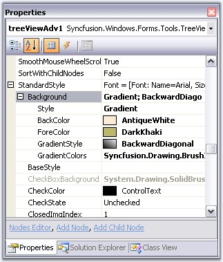
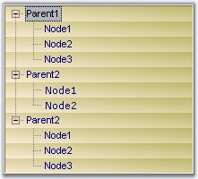

::: {style="DISPLAY: none"}
{#d2h_url_template}{#d2h_package_url style="WIDTH: 0px; DISPLAY: none; HEIGHT: 0px"}
:::

::: {.d2h_secondary_topic style="PADDING-BOTTOM: 10pt; MARGIN: 0pt; PADDING-LEFT: 0pt; PADDING-RIGHT: 0pt; PADDING-TOP: 0pt"}
##### Standard Style {#standard-style style="MARGIN-LEFT: 18pt; tab-stops: 18.0pt"}

[]{style="COLOR: #15428b"} 

Setting a Common Style for All the Nodes in the TreeViewAdv

**[]{style="COLOR: #15428b"}** 

We can modify the background for all the children of a parent node by editing the **StandardStyle** property.

[]{style="COLOR: #15428b"} 

{border="0"}

[]{style="COLOR: #15428b"} 

Figure 1155: StandardStyle settings using the Property Grid

**[]{style="COLOR: #15428b"}** 

The below image displays a gradient style for all the nodes of the TreeView control.

[]{style="COLOR: #15428b"} 

{border="0"}

[]{style="COLOR: #15428b"} 

Figure 1156: Gradient = \"BackwardDiagonal; DarkKhaki; AntiqueWhite Colors\"

 

 

 

 

[]{#related-topics}
:::
