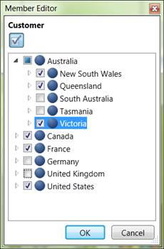

::: {style="DISPLAY: none"}
{#d2h_url_template} {#d2h_package_url style="WIDTH: 0px; DISPLAY: none; HEIGHT: 0px"}
:::

::: {.d2h_secondary_topic style="PADDING-BOTTOM: 10pt; MARGIN: 0pt; PADDING-LEFT: 0pt; PADDING-RIGHT: 0pt; PADDING-TOP: 0pt"}
#### State of the Node in this tree-view {#state-of-the-node-in-this-tree-view style="tab-stops: 0pt"}

Nodes are represented in two states namely:

[·      ]{style="FONT-FAMILY: Symbol"}Checked

[·      ]{style="FONT-FAMILY: Symbol"}Unchecked

[·      ]{style="FONT-FAMILY: Symbol"}Some Children are checked

[]{style="FONT-FAMILY: 'Trebuchet MS','sans-serif'; COLOR: #15428b; FONT-SIZE: 9pt"} 

{border="0"}

Figure 36: Member Editor[]{style="FONT-FAMILY: 'Calibri','sans-serif'; COLOR: #4f81bd"}

[]{#related-topics}
:::
