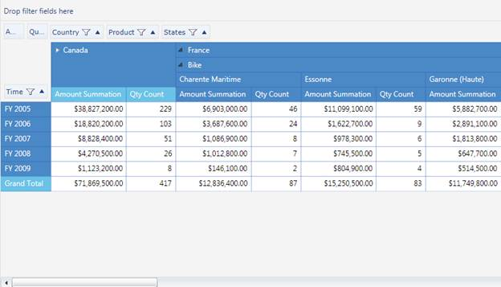

::: {style="DISPLAY: none"}
{#d2h_url_template}{#d2h_package_url style="WIDTH: 0px; DISPLAY: none; HEIGHT: 0px"}
:::

::::: {#nsbanner .d2h_main_nsbanner style="BORDER-BOTTOM: #999999 1px solid; POSITION: relative; PADDING-BOTTOM: 0px; BACKGROUND-COLOR: transparent; PADDING-LEFT: 0px; PADDING-RIGHT: 0px; DISPLAY: none; BORDER-TOP: #999999 1px solid; PADDING-TOP: 0px; LEFT: 0px"}
:::: {#TitleRow .d2h_main_titlerow style="PADDING-BOTTOM: 4px; BACKGROUND-COLOR: transparent; PADDING-LEFT: 22px; WIDTH: 100%; PADDING-RIGHT: 10px; DISPLAY: none; PADDING-TOP: 4px"}
::: {#ienav .d2h_main_ienav style="DISPLAY: none"}
{#D2HPrevious .D2HPreviousEnabled}  {#D2HNext .D2HNextEnabled}
:::
::::
:::::

::::: {#nstext .d2h_main_nstext style="PADDING-BOTTOM: 10px; BACKGROUND-COLOR: transparent; PADDING-LEFT: 22px; PADDING-RIGHT: 10px; HEIGHT: 100%; OVERFLOW: auto; PADDING-TOP: 5px" hasuserbackground="true" valign="bottom"}
::: {#d2h_breadcrumbs .d2h_breadcrumbs}
[Essential Studio User Guide Documentation](ms-xhelp:///?Id=12457748-09e3-4d74-a240-8e049cedf030){.d2h_breadcrumbsNormal}[ \> ]{.d2h_breadcrumbsLinkSeparator}[Business Intelligence Edition](ms-xhelp:///?Id=fdf33dd8-62b2-47b9-ad7b-fc50e590bca5){.d2h_breadcrumbsNormal}[ \> ]{.d2h_breadcrumbsLinkSeparator}[Essential BI Silverlight](ms-xhelp:///?Id=c006b39c-6aa2-4637-b7de-3e7b6cb3f9f9){.d2h_breadcrumbsNormal}[ \> ]{.d2h_breadcrumbsLinkSeparator}[Essential Pivot Grid]{.d2h_breadcrumbsContentsOnly}[ \> ]{.d2h_breadcrumbsLinkSeparator}[Features](ms-xhelp:///?Id=9d7968f1-d52c-4e79-a6ae-fb01305e9f98){.d2h_breadcrumbsNormal}
:::

## State Persistence {#state-persistence style="tab-stops: 0pt"}

This feature enables the user to maintain the collapsed or expanded state in the PivotGrid when pivot schema is changed.

Use Case Scenarios

The user can maintain collapsed or expanded states and save /load these settings dynamically in the PivotGrid control.

The following image shows state persistence in the PivotGrid control:

{border="0"}

Figure 24 PivotGrid with collapsed/expanded states

 

Property

Table 4: Property Table

::: {align="center"}
  ------------------------- ------------------------------------------------------------------------------------------------------------ ------------ ----------- -----------------
  Property                  Description                                                                                                  Type         Data Type   Reference links
  StatePersistenceEnabled   Gets or sets a value indicating whether to maintain/show collapsed cells when pivot schema getting changed   Dependency   Boolean     \-
  ------------------------- ------------------------------------------------------------------------------------------------------------ ------------ ----------- -----------------
:::

[]{style="FONT-FAMILY: 'Calibri','sans-serif'; COLOR: black"} 

Sample Link

The user can find a sample in the following location:

**SystemDrive:\\Users\\\<user_name\>\\AppData\\Local\\Syncfusion\\EssentialStudio\\\<version_number\>\\BI\\Silverlight\\PivotGrid.SL\\Appearance\\StatePersistenceDemo**

 

Adding State Persistence to an Application

The user can enable or disable the state persistence by using the following code snippets in an application:

+---------------------------------------------------------------------------------------------------------------------------------------------------------------+
| [      **\[C#\]**]{style="FONT-FAMILY: 'Courier New'"}                                                                                                        |
|                                                                                                                                                               |
| [      [pivotGrid1.StatePersistenceEnabled = ]{style="COLOR: black"}[true]{style="COLOR: blue"}[;]{style="COLOR: black"}]{style="FONT-FAMILY: 'Courier New'"} |
+---------------------------------------------------------------------------------------------------------------------------------------------------------------+

 

 

+--------------------------------------------------------------------------------------------------------------------------------------+
| [      **\[VB\]**]{style="FONT-FAMILY: 'Courier New'"}                                                                               |
|                                                                                                                                      |
| [      [pivotGrid1.StatePersistenceEnabled = ]{style="COLOR: black"}[true]{style="COLOR: blue"}]{style="FONT-FAMILY: 'Courier New'"} |
|                                                                                                                                      |
|                                                                                                                                      |
+--------------------------------------------------------------------------------------------------------------------------------------+

 

[]{#related-topics}
:::::
