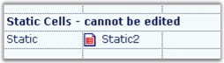

::: {style="DISPLAY: none"}
{#d2h_url_template}{#d2h_package_url style="WIDTH: 0px; DISPLAY: none; HEIGHT: 0px"}
:::

::: {.d2h_secondary_topic style="PADDING-BOTTOM: 10pt; MARGIN: 0pt; PADDING-LEFT: 0pt; PADDING-RIGHT: 0pt; PADDING-TOP: 0pt"}
##### Static {#static style="tab-stops: 0pt"}

[]{style="FONT-FAMILY: 'Trebuchet MS','sans-serif'; COLOR: #15428b; FONT-SIZE: 9pt"} 

A **Static** cell type will display text that cannot be edited. You can select it to make it the current cell, but the cell cannot be activated for editing. Static cells can be deleted by the user, if the static cells are part of the selection when the DELETE key is pressed (To prevent this deletion behavior, set static cells to ReadOnly). Static cells may also include an image in addition to the text.

 

The following code example illustrates how to set the cell type to Static.

[]{style="FONT-FAMILY: 'Trebuchet MS','sans-serif'; COLOR: #15428b; FONT-SIZE: 9pt"} 

+--------------------------------------------------------------------------------------------------------------------------------------------------------------------------------------+
| **[\[C#\]]{style="FONT-FAMILY: 'Courier New'; COLOR: black"}**                                                                                                                       |
|                                                                                                                                                                                      |
| []{style="FONT-FAMILY: 'Courier New'; COLOR: black"}                                                                                                                                 |
|                                                                                                                                                                                      |
| [// Use a static cell.]{style="FONT-FAMILY: 'Courier New'; COLOR: green"}                                                                                                            |
|                                                                                                                                                                                      |
| [gridControl1\[rowIndex,colIndex\].CellType = [\"Static\"]{style="COLOR: #a31515"};]{style="FONT-FAMILY: 'Courier New'"}                                                             |
|                                                                                                                                                                                      |
| [gridControl1\[rowIndex,colIndex\].Text = [\"Static\"]{style="COLOR: #a31515"};]{style="FONT-FAMILY: 'Courier New'"}                                                                 |
|                                                                                                                                                                                      |
| []{style="FONT-FAMILY: 'Courier New'"}                                                                                                                                               |
|                                                                                                                                                                                      |
| [// Use a static cell with an image.]{style="FONT-FAMILY: 'Courier New'; COLOR: green"}                                                                                              |
|                                                                                                                                                                                      |
| [// Create an image list and add some images during the initialization.]{style="FONT-FAMILY: 'Courier New'; COLOR: green"}                                                           |
|                                                                                                                                                                                      |
| [ImageList]{style="FONT-FAMILY: 'Courier New'; COLOR: #2b91af"}[ imageList1 = [new]{style="COLOR: blue"} [ImageList]{style="COLOR: #2b91af"}();]{style="FONT-FAMILY: 'Courier New'"} |
|                                                                                                                                                                                      |
| [imageList1.Images.Add([SystemIcons]{style="COLOR: #2b91af"}.Warning.ToBitmap());]{style="FONT-FAMILY: 'Courier New'"}                                                               |
|                                                                                                                                                                                      |
| [imageList1.Images.Add([SystemIcons]{style="COLOR: #2b91af"}.Application.ToBitmap());]{style="FONT-FAMILY: 'Courier New'"}                                                           |
|                                                                                                                                                                                      |
| [imageList1.Images.Add([SystemIcons]{style="COLOR: #2b91af"}.Asterisk.ToBitmap());]{style="FONT-FAMILY: 'Courier New'"}                                                              |
|                                                                                                                                                                                      |
| [imageList1.Images.Add([SystemIcons]{style="COLOR: #2b91af"}.Error.ToBitmap());]{style="FONT-FAMILY: 'Courier New'"}                                                                 |
|                                                                                                                                                                                      |
| []{style="FONT-FAMILY: 'Courier New'"}                                                                                                                                               |
|                                                                                                                                                                                      |
| [// Set the imagelist into the TableStyle.]{style="FONT-FAMILY: 'Courier New'; COLOR: green"}                                                                                        |
|                                                                                                                                                                                      |
| [gridControl1.TableStyle.ImageList = imageList1;]{style="FONT-FAMILY: 'Courier New'"}                                                                                                |
|                                                                                                                                                                                      |
| []{style="FONT-FAMILY: 'Courier New'"}                                                                                                                                               |
|                                                                                                                                                                                      |
| [// To use an image, set the ImageIndex in the cell GridInfoStyle.]{style="FONT-FAMILY: 'Courier New'; COLOR: green"}                                                                |
|                                                                                                                                                                                      |
| [gridControl1\[rowIndex,colIndex + 1\].CellType = [\"Static\"]{style="COLOR: #a31515"};]{style="FONT-FAMILY: 'Courier New'"}                                                         |
|                                                                                                                                                                                      |
| [gridControl1\[rowIndex,colIndex + 1\].Text = [\"Static2\"]{style="COLOR: #a31515"};]{style="FONT-FAMILY: 'Courier New'"}                                                            |
|                                                                                                                                                                                      |
| []{style="FONT-FAMILY: 'Courier New'"}                                                                                                                                               |
|                                                                                                                                                                                      |
| [// Show the third icon in the imagelist which is inherited from the TableStyle.]{style="FONT-FAMILY: 'Courier New'; COLOR: green"}                                                  |
|                                                                                                                                                                                      |
| [gridControl1\[rowIndex,colIndex + 1\].ImageIndex = 2; ]{style="FONT-FAMILY: 'Courier New'"}                                                                                         |
+--------------------------------------------------------------------------------------------------------------------------------------------------------------------------------------+

[]{style="FONT-FAMILY: 'Trebuchet MS','sans-serif'; COLOR: #15428b; FONT-SIZE: 9pt"} 

+--------------------------------------------------------------------------------------------------------------------------------------------------------------------------+
| **[\[VB.NET\]]{style="FONT-FAMILY: 'Courier New'; COLOR: black"}**                                                                                                       |
|                                                                                                                                                                          |
| []{style="FONT-FAMILY: 'Courier New'; COLOR: black"}                                                                                                                     |
|                                                                                                                                                                          |
| [\' Use a static cell.]{style="FONT-FAMILY: 'Courier New'; COLOR: green"}                                                                                                |
|                                                                                                                                                                          |
| [gridControl1(rowIndex, colIndex).CellType = [\"Static\"]{style="COLOR: #a31515"}]{style="FONT-FAMILY: 'Courier New'"}                                                   |
|                                                                                                                                                                          |
| [gridControl1(rowIndex, colIndex).Text = [\"Static\"]{style="COLOR: #a31515"}]{style="FONT-FAMILY: 'Courier New'"}                                                       |
|                                                                                                                                                                          |
| []{style="FONT-FAMILY: 'Courier New'; COLOR: #a31515"}                                                                                                                   |
|                                                                                                                                                                          |
| [\' Use a static cell with an image.]{style="FONT-FAMILY: 'Courier New'; COLOR: green"}                                                                                  |
|                                                                                                                                                                          |
| [\' Create an image list and add some images during the initialization.]{style="FONT-FAMILY: 'Courier New'; COLOR: green"}                                               |
|                                                                                                                                                                          |
| [Dim]{style="FONT-FAMILY: 'Courier New'; COLOR: blue"}[ imageList1 [As]{style="COLOR: blue"} [New]{style="COLOR: blue"} ImageList()]{style="FONT-FAMILY: 'Courier New'"} |
|                                                                                                                                                                          |
| [imageList1.Images.Add(SystemIcons.Warning.ToBitmap())]{style="FONT-FAMILY: 'Courier New'"}                                                                              |
|                                                                                                                                                                          |
| [imageList1.Images.Add(SystemIcons.Application.ToBitmap())]{style="FONT-FAMILY: 'Courier New'"}                                                                          |
|                                                                                                                                                                          |
| [imageList1.Images.Add(SystemIcons.Asterisk.ToBitmap())]{style="FONT-FAMILY: 'Courier New'"}                                                                             |
|                                                                                                                                                                          |
| [imageList1.Images.Add(SystemIcons.Error.ToBitmap())]{style="FONT-FAMILY: 'Courier New'"}                                                                                |
|                                                                                                                                                                          |
| []{style="FONT-FAMILY: 'Courier New'"}                                                                                                                                   |
|                                                                                                                                                                          |
| [\' Set the imagelist into the TableStyle.]{style="FONT-FAMILY: 'Courier New'; COLOR: green"}                                                                            |
|                                                                                                                                                                          |
| [gridControl1.TableStyle.ImageList = imageList1]{style="FONT-FAMILY: 'Courier New'"}                                                                                     |
|                                                                                                                                                                          |
| []{style="FONT-FAMILY: 'Courier New'"}                                                                                                                                   |
|                                                                                                                                                                          |
| [\' To use an image, set the ImageIndex in the cell GridInfoStyle.]{style="FONT-FAMILY: 'Courier New'; COLOR: green"}                                                    |
|                                                                                                                                                                          |
| [gridControl1(rowIndex, colIndex + 1).CellType = [\"Static\"]{style="COLOR: #a31515"}]{style="FONT-FAMILY: 'Courier New'"}                                               |
|                                                                                                                                                                          |
| [gridControl1(rowIndex, colIndex + 1).Text = [\"Static2\"]{style="COLOR: #a31515"}]{style="FONT-FAMILY: 'Courier New'"}                                                  |
|                                                                                                                                                                          |
| []{style="FONT-FAMILY: 'Courier New'; COLOR: #a31515"}                                                                                                                   |
|                                                                                                                                                                          |
| [\' Show the third icon in the imagelist which, is inherited from TableStyle.]{style="FONT-FAMILY: 'Courier New'; COLOR: green"}                                         |
|                                                                                                                                                                          |
| [gridControl1(rowIndex, colIndex + 1).ImageIndex = 2]{style="FONT-FAMILY: 'Courier New'"}                                                                                |
+--------------------------------------------------------------------------------------------------------------------------------------------------------------------------+

[]{style="FONT-FAMILY: 'Trebuchet MS','sans-serif'; COLOR: #15428b; FONT-SIZE: 9pt"} 

{border="0"}

[]{style="FONT-FAMILY: 'Trebuchet MS','sans-serif'; COLOR: #15428b; FONT-SIZE: 9pt"} 

*[Figure ]{style="FONT-SIZE: 9pt"}[90]{style="FONT-SIZE: 9pt"}[: Static Cells]{style="FONT-SIZE: 9pt"}*

 

[]{#p66} 

 

[]{#related-topics}
:::
