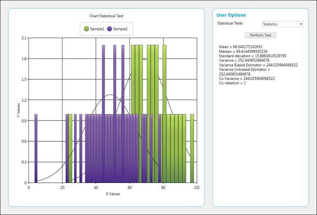
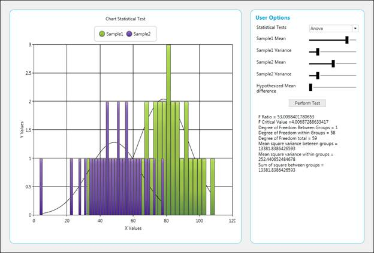
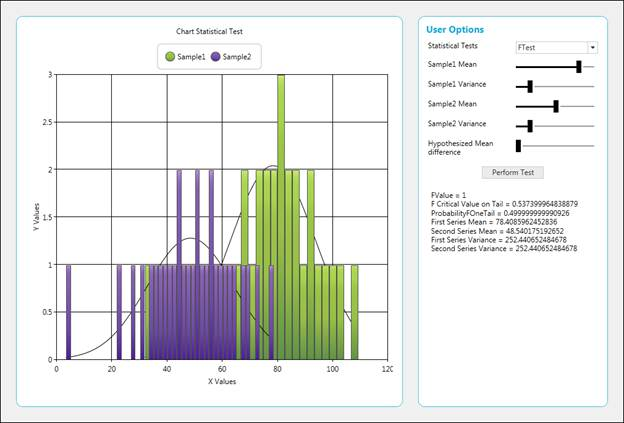
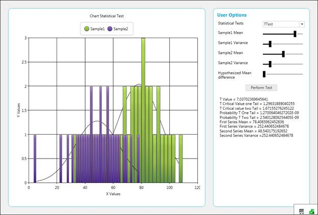
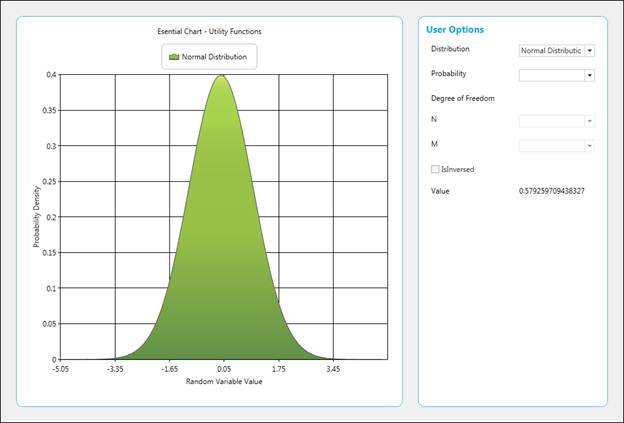
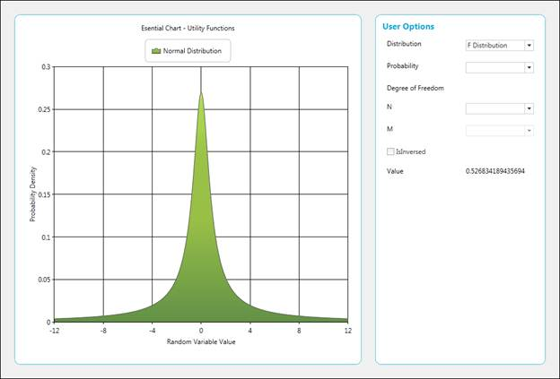
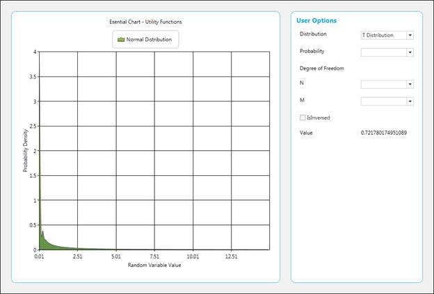

::: {style="DISPLAY: none"}
{#d2h_url_template}{#d2h_package_url style="WIDTH: 0px; DISPLAY: none; HEIGHT: 0px"}
:::

::: {.d2h_secondary_topic style="PADDING-BOTTOM: 10pt; MARGIN: 0pt; PADDING-LEFT: 0pt; PADDING-RIGHT: 0pt; PADDING-TOP: 0pt"}
#### Statistical Formula and Utility Functions {#statistical-formula-and-utility-functions style="tab-stops: 0pt"}

This feature allows the user to calculate basic statistical functions that include mean, median, standard deviation, variance, variance based estimator, variance unbased estimator, correlation coefficient and covariance, ANOVA, T-test, Z-test, and F-test performed based on sample series, and utility functions like normal distribution, T-cumulative distribution and F-cumulative distribution.

 

Use Case Scenarios

1.  This feature supports built-in statistical formulas.

2.  The curve in the graph can be drawn based on normal distribution, T-cumulative distribution, and F-cumulative distribution.

3.  Basic functions like mean, median, and standard deviation can be obtained from the series drawn.

 

Methods

Table 179: Statistical and Utility Functions Methods Table

+-------------------------------------------------------------+--------------------------------------------------------------------------------------------------------------------------------------------------------------------------------------------------------------------------------------------------------------------+----------------------------------------------------------------------------------------------------------------------------------------------------------------------------------------+------------------------------------------------------------------+
| **[Method ]{style="COLOR: black"}**[]{style="COLOR: black"} | **[Description ]{style="COLOR: black"}**[]{style="COLOR: black"}                                                                                                                                                                                                   | **[Parameters ]{style="COLOR: black"}**[]{style="COLOR: black"}                                                                                                                        | **[Return Type ]{style="COLOR: black"}**[]{style="COLOR: black"} |
+=============================================================+====================================================================================================================================================================================================================================================================+========================================================================================================================================================================================+==================================================================+
| Mean[]{style="COLOR: #c00000"}                              | Returns the mean value of the x values of the series.[]{style="COLOR: #c00000"}                                                                                                                                                                                    | Series[]{style="COLOR: #c00000"}                                                                                                                                                       | Double[]{style="COLOR: #c00000"}                                 |
+-------------------------------------------------------------+--------------------------------------------------------------------------------------------------------------------------------------------------------------------------------------------------------------------------------------------------------------------+----------------------------------------------------------------------------------------------------------------------------------------------------------------------------------------+------------------------------------------------------------------+
| Mean[]{style="COLOR: #c00000"}                              | Returns the mean of y values.[]{style="COLOR: #c00000"}                                                                                                                                                                                                            | Series, Yindex(int)[]{style="COLOR: #c00000"}                                                                                                                                          | Double[]{style="COLOR: #c00000"}                                 |
+-------------------------------------------------------------+--------------------------------------------------------------------------------------------------------------------------------------------------------------------------------------------------------------------------------------------------------------------+----------------------------------------------------------------------------------------------------------------------------------------------------------------------------------------+------------------------------------------------------------------+
| VarianceUnbiasedEstimator                                   | Estimates the variance for the x values of the series.[]{style="COLOR: #c00000"}                                                                                                                                                                                   | Series[]{style="COLOR: #c00000"}                                                                                                                                                       | Double[]{style="COLOR: #c00000"}                                 |
|                                                             |                                                                                                                                                                                                                                                                    |                                                                                                                                                                                        |                                                                  |
| []{style="COLOR: #c00000"}                                  |                                                                                                                                                                                                                                                                    |                                                                                                                                                                                        |                                                                  |
+-------------------------------------------------------------+--------------------------------------------------------------------------------------------------------------------------------------------------------------------------------------------------------------------------------------------------------------------+----------------------------------------------------------------------------------------------------------------------------------------------------------------------------------------+------------------------------------------------------------------+
| VarianceUnbiasedEstimator                                   | Estimates the variance for the y values of the series.[]{style="COLOR: #c00000"}                                                                                                                                                                                   | Series,                                                                                                                                                                                | Double[]{style="COLOR: #c00000"}                                 |
|                                                             |                                                                                                                                                                                                                                                                    |                                                                                                                                                                                        |                                                                  |
| []{style="COLOR: #c00000"}                                  |                                                                                                                                                                                                                                                                    | Yindex(int)[]{style="COLOR: #c00000"}                                                                                                                                                  |                                                                  |
+-------------------------------------------------------------+--------------------------------------------------------------------------------------------------------------------------------------------------------------------------------------------------------------------------------------------------------------------+----------------------------------------------------------------------------------------------------------------------------------------------------------------------------------------+------------------------------------------------------------------+
| VarianceBiasedEstimator                                     | Estimates the variance of the sample.[]{style="COLOR: #c00000"}                                                                                                                                                                                                    | Series[]{style="COLOR: #c00000"}                                                                                                                                                       | Double[]{style="COLOR: #c00000"}                                 |
|                                                             |                                                                                                                                                                                                                                                                    |                                                                                                                                                                                        |                                                                  |
| []{style="COLOR: #c00000"}                                  |                                                                                                                                                                                                                                                                    |                                                                                                                                                                                        |                                                                  |
+-------------------------------------------------------------+--------------------------------------------------------------------------------------------------------------------------------------------------------------------------------------------------------------------------------------------------------------------+----------------------------------------------------------------------------------------------------------------------------------------------------------------------------------------+------------------------------------------------------------------+
| VarianceBiasedEstimator                                     | Estimates the variance for the y value of the series.[]{style="COLOR: #c00000"}                                                                                                                                                                                    | Series,                                                                                                                                                                                | Double[]{style="COLOR: #c00000"}                                 |
|                                                             |                                                                                                                                                                                                                                                                    |                                                                                                                                                                                        |                                                                  |
| []{style="COLOR: #c00000"}                                  |                                                                                                                                                                                                                                                                    | Yindex(int)[]{style="COLOR: #c00000"}                                                                                                                                                  |                                                                  |
+-------------------------------------------------------------+--------------------------------------------------------------------------------------------------------------------------------------------------------------------------------------------------------------------------------------------------------------------+----------------------------------------------------------------------------------------------------------------------------------------------------------------------------------------+------------------------------------------------------------------+
| Variance                                                    | The following code samples demonstrate how to get the variance of the data points in a series.                                                                                                                                                                     | Series,                                                                                                                                                                                | Double[]{style="COLOR: #c00000"}                                 |
|                                                             |                                                                                                                                                                                                                                                                    |                                                                                                                                                                                        |                                                                  |
| []{style="COLOR: #c00000"}                                  | []{style="COLOR: #c00000"}                                                                                                                                                                                                                                         | sampleVariance(bool)[]{style="COLOR: #c00000"}                                                                                                                                         |                                                                  |
+-------------------------------------------------------------+--------------------------------------------------------------------------------------------------------------------------------------------------------------------------------------------------------------------------------------------------------------------+----------------------------------------------------------------------------------------------------------------------------------------------------------------------------------------+------------------------------------------------------------------+
| Variance                                                    | The following code samples demonstrate how to get the variance of the y-value data points in a series.                                                                                                                                                             | Series,                                                                                                                                                                                | Double[]{style="COLOR: #c00000"}                                 |
|                                                             |                                                                                                                                                                                                                                                                    |                                                                                                                                                                                        |                                                                  |
| []{style="COLOR: #c00000"}                                  | []{style="COLOR: #c00000"}                                                                                                                                                                                                                                         | Yindex(int),                                                                                                                                                                           |                                                                  |
|                                                             |                                                                                                                                                                                                                                                                    |                                                                                                                                                                                        |                                                                  |
|                                                             |                                                                                                                                                                                                                                                                    | sampleVariance(bool)[]{style="COLOR: #c00000"}                                                                                                                                         |                                                                  |
+-------------------------------------------------------------+--------------------------------------------------------------------------------------------------------------------------------------------------------------------------------------------------------------------------------------------------------------------+----------------------------------------------------------------------------------------------------------------------------------------------------------------------------------------+------------------------------------------------------------------+
| StandardDeviation                                           | This method determines the standard Deviation for x values of the series.[]{style="COLOR: #c00000"}                                                                                                                                                                | Series,                                                                                                                                                                                | Double[]{style="COLOR: #c00000"}                                 |
|                                                             |                                                                                                                                                                                                                                                                    |                                                                                                                                                                                        |                                                                  |
| []{style="COLOR: #c00000"}                                  |                                                                                                                                                                                                                                                                    | sampleVariance(bool)                                                                                                                                                                   |                                                                  |
|                                                             |                                                                                                                                                                                                                                                                    |                                                                                                                                                                                        |                                                                  |
|                                                             |                                                                                                                                                                                                                                                                    | []{style="COLOR: #c00000"}                                                                                                                                                             |                                                                  |
+-------------------------------------------------------------+--------------------------------------------------------------------------------------------------------------------------------------------------------------------------------------------------------------------------------------------------------------------+----------------------------------------------------------------------------------------------------------------------------------------------------------------------------------------+------------------------------------------------------------------+
| StandardDeviation[]{style="COLOR: #c00000"}                 | This method determines the standard deviation for y values of the series.[]{style="COLOR: #c00000"}                                                                                                                                                                | Series                                                                                                                                                                                 | Double[]{style="COLOR: #c00000"}                                 |
|                                                             |                                                                                                                                                                                                                                                                    |                                                                                                                                                                                        |                                                                  |
|                                                             |                                                                                                                                                                                                                                                                    | Yindex(double)                                                                                                                                                                         |                                                                  |
|                                                             |                                                                                                                                                                                                                                                                    |                                                                                                                                                                                        |                                                                  |
|                                                             |                                                                                                                                                                                                                                                                    | sampleVariance(bool)[]{style="COLOR: #c00000"}                                                                                                                                         |                                                                  |
+-------------------------------------------------------------+--------------------------------------------------------------------------------------------------------------------------------------------------------------------------------------------------------------------------------------------------------------------+----------------------------------------------------------------------------------------------------------------------------------------------------------------------------------------+------------------------------------------------------------------+
| Covariance                                                  | Returns the average of the product of deviations of the data points from their respective means.                                                                                                                                                                   | Series1,                                                                                                                                                                               | Double[]{style="COLOR: #c00000"}                                 |
|                                                             |                                                                                                                                                                                                                                                                    |                                                                                                                                                                                        |                                                                  |
| []{style="COLOR: #c00000"}                                  | []{style="COLOR: #c00000"}                                                                                                                                                                                                                                         | Series 2[]{style="COLOR: #c00000"}                                                                                                                                                     |                                                                  |
+-------------------------------------------------------------+--------------------------------------------------------------------------------------------------------------------------------------------------------------------------------------------------------------------------------------------------------------------+----------------------------------------------------------------------------------------------------------------------------------------------------------------------------------------+------------------------------------------------------------------+
| Covariance                                                  | Returns the average of the product of deviations of the data points from their respective means based on y values.                                                                                                                                                 | Series1,                                                                                                                                                                               | Double[]{style="COLOR: #c00000"}                                 |
|                                                             |                                                                                                                                                                                                                                                                    |                                                                                                                                                                                        |                                                                  |
| []{style="COLOR: #c00000"}                                  | []{style="COLOR: #c00000"}                                                                                                                                                                                                                                         | Series 2,                                                                                                                                                                              |                                                                  |
|                                                             |                                                                                                                                                                                                                                                                    |                                                                                                                                                                                        |                                                                  |
|                                                             |                                                                                                                                                                                                                                                                    | Yindex(int)[]{style="COLOR: #c00000"}                                                                                                                                                  |                                                                  |
+-------------------------------------------------------------+--------------------------------------------------------------------------------------------------------------------------------------------------------------------------------------------------------------------------------------------------------------------+----------------------------------------------------------------------------------------------------------------------------------------------------------------------------------------+------------------------------------------------------------------+
| Correlation                                                 | Measures the relationship between two data sets that are scaled to be independent of the unit of measurement. This correlation method returns the covariance of two data sets divided by the product of their standard deviations, and always ranges from -1 to 1. | Series1,                                                                                                                                                                               | Double[]{style="COLOR: #c00000"}                                 |
|                                                             |                                                                                                                                                                                                                                                                    |                                                                                                                                                                                        |                                                                  |
| []{style="COLOR: #c00000"}                                  | []{style="COLOR: #c00000"}                                                                                                                                                                                                                                         | Series2[]{style="COLOR: #c00000"}                                                                                                                                                      |                                                                  |
+-------------------------------------------------------------+--------------------------------------------------------------------------------------------------------------------------------------------------------------------------------------------------------------------------------------------------------------------+----------------------------------------------------------------------------------------------------------------------------------------------------------------------------------------+------------------------------------------------------------------+
| Correlation                                                 | Measures the relationship between two data sets that are scaled to be independent of the unit of measurement. This correlation method returns the covariance of two data sets divided by the product of their standard deviations, and always ranges from -1 to 1. | Series1,                                                                                                                                                                               | Double[]{style="COLOR: #c00000"}                                 |
|                                                             |                                                                                                                                                                                                                                                                    |                                                                                                                                                                                        |                                                                  |
| []{style="COLOR: #c00000"}                                  | []{style="COLOR: #c00000"}                                                                                                                                                                                                                                         | Series2,                                                                                                                                                                               |                                                                  |
|                                                             |                                                                                                                                                                                                                                                                    |                                                                                                                                                                                        |                                                                  |
|                                                             |                                                                                                                                                                                                                                                                    | yIndex(double)[]{style="COLOR: #c00000"}                                                                                                                                               |                                                                  |
+-------------------------------------------------------------+--------------------------------------------------------------------------------------------------------------------------------------------------------------------------------------------------------------------------------------------------------------------+----------------------------------------------------------------------------------------------------------------------------------------------------------------------------------------+------------------------------------------------------------------+
| Median                                                      | Calculates the median of the points stored in a series.                                                                                                                                                                                                            | Series[]{style="COLOR: #c00000"}                                                                                                                                                       | Double[]{style="COLOR: #c00000"}                                 |
|                                                             |                                                                                                                                                                                                                                                                    |                                                                                                                                                                                        |                                                                  |
| []{style="COLOR: #c00000"}                                  | []{style="COLOR: #c00000"}                                                                                                                                                                                                                                         |                                                                                                                                                                                        |                                                                  |
+-------------------------------------------------------------+--------------------------------------------------------------------------------------------------------------------------------------------------------------------------------------------------------------------------------------------------------------------+----------------------------------------------------------------------------------------------------------------------------------------------------------------------------------------+------------------------------------------------------------------+
| Median                                                      | Calculates the median of the points stored in a series.                                                                                                                                                                                                            | Series,                                                                                                                                                                                | Double[]{style="COLOR: #c00000"}                                 |
|                                                             |                                                                                                                                                                                                                                                                    |                                                                                                                                                                                        |                                                                  |
| []{style="COLOR: #c00000"}                                  | []{style="COLOR: #c00000"}                                                                                                                                                                                                                                         | yIndex(int)[]{style="COLOR: #c00000"}                                                                                                                                                  |                                                                  |
+-------------------------------------------------------------+--------------------------------------------------------------------------------------------------------------------------------------------------------------------------------------------------------------------------------------------------------------------+----------------------------------------------------------------------------------------------------------------------------------------------------------------------------------------+------------------------------------------------------------------+
| ZTest                                                       | This method performs a Z-test for two groups of data and returns the results using a ZTestResult object.                                                                                                                                                           | (double) hypothesizedMeanDifference, (double) varianceFirstGroup, (double) varianceSecondGroup, (double) probability, (ChartSeries) firstInputSeries, (ChartSeries) secondInputSeries  | ZTestResult                                                      |
|                                                             |                                                                                                                                                                                                                                                                    |                                                                                                                                                                                        |                                                                  |
| []{style="COLOR: #c00000"}                                  |                                                                                                                                                                                                                                                                    | []{style="COLOR: #c00000"}                                                                                                                                                             | []{style="COLOR: #c00000"}                                       |
|                                                             |                                                                                                                                                                                                                                                                    |                                                                                                                                                                                        |                                                                  |
|                                                             | []{style="COLOR: #c00000"}                                                                                                                                                                                                                                         |                                                                                                                                                                                        |                                                                  |
+-------------------------------------------------------------+--------------------------------------------------------------------------------------------------------------------------------------------------------------------------------------------------------------------------------------------------------------------+----------------------------------------------------------------------------------------------------------------------------------------------------------------------------------------+------------------------------------------------------------------+
| ZTest                                                       | This method performs a Z-test for two groups of data and returns the results using a ZTestResult object, for Y values.                                                                                                                                             | (double )hypothesizedMeanDifference, (double) varianceFirstGroup, (double) varianceSecondGroup, (double) probability, (ChartSeries )firstInputSeries, (ChartSeries )secondInputSeries, | ZTestResult                                                      |
|                                                             |                                                                                                                                                                                                                                                                    |                                                                                                                                                                                        |                                                                  |
| []{style="COLOR: #c00000"}                                  | []{style="COLOR: #c00000"}                                                                                                                                                                                                                                         | (Int) yIndex                                                                                                                                                                           | []{style="COLOR: #c00000"}                                       |
|                                                             |                                                                                                                                                                                                                                                                    |                                                                                                                                                                                        |                                                                  |
|                                                             |                                                                                                                                                                                                                                                                    | []{style="COLOR: #c00000"}                                                                                                                                                             |                                                                  |
+-------------------------------------------------------------+--------------------------------------------------------------------------------------------------------------------------------------------------------------------------------------------------------------------------------------------------------------------+----------------------------------------------------------------------------------------------------------------------------------------------------------------------------------------+------------------------------------------------------------------+
| TTestEqualVariances                                         | This method performs a T-test for two groups of data and assumes equal variances between the two groups (i.e. series) for the x values.                                                                                                                            | (Double) hypothesizedMeanDifference,                                                                                                                                                   | TTestResult                                                      |
|                                                             |                                                                                                                                                                                                                                                                    |                                                                                                                                                                                        |                                                                  |
| []{style="COLOR: #c00000"}                                  | []{style="COLOR: #c00000"}                                                                                                                                                                                                                                         | (double) probability, (ChartSeries)                                                                                                                                                    | []{style="COLOR: #c00000"}                                       |
|                                                             |                                                                                                                                                                                                                                                                    |                                                                                                                                                                                        |                                                                  |
|                                                             |                                                                                                                                                                                                                                                                    | firstInputSeries, (ChartSeries) secondInputSeries                                                                                                                                      |                                                                  |
|                                                             |                                                                                                                                                                                                                                                                    |                                                                                                                                                                                        |                                                                  |
|                                                             |                                                                                                                                                                                                                                                                    | []{style="COLOR: #c00000"}                                                                                                                                                             |                                                                  |
+-------------------------------------------------------------+--------------------------------------------------------------------------------------------------------------------------------------------------------------------------------------------------------------------------------------------------------------------+----------------------------------------------------------------------------------------------------------------------------------------------------------------------------------------+------------------------------------------------------------------+
| TTestEqualVariances                                         | This method performs a T-test for two groups of data and assumes equal variances between the two groups (i.e. series) for the y values.                                                                                                                            | (Double) hypothesizedMeanDifference,                                                                                                                                                   | TTestResult                                                      |
|                                                             |                                                                                                                                                                                                                                                                    |                                                                                                                                                                                        |                                                                  |
| []{style="COLOR: #c00000"}                                  | []{style="COLOR: #c00000"}                                                                                                                                                                                                                                         | (double) probability, (ChartSeries)                                                                                                                                                    | []{style="COLOR: #c00000"}                                       |
|                                                             |                                                                                                                                                                                                                                                                    |                                                                                                                                                                                        |                                                                  |
|                                                             |                                                                                                                                                                                                                                                                    | firstInputSeries, (ChartSeries) secondInputSeries,                                                                                                                                     |                                                                  |
|                                                             |                                                                                                                                                                                                                                                                    |                                                                                                                                                                                        |                                                                  |
|                                                             |                                                                                                                                                                                                                                                                    | (int)                                                                                                                                                                                  |                                                                  |
|                                                             |                                                                                                                                                                                                                                                                    |                                                                                                                                                                                        |                                                                  |
|                                                             |                                                                                                                                                                                                                                                                    | yIndex                                                                                                                                                                                 |                                                                  |
|                                                             |                                                                                                                                                                                                                                                                    |                                                                                                                                                                                        |                                                                  |
|                                                             |                                                                                                                                                                                                                                                                    | []{style="COLOR: #c00000"}                                                                                                                                                             |                                                                  |
+-------------------------------------------------------------+--------------------------------------------------------------------------------------------------------------------------------------------------------------------------------------------------------------------------------------------------------------------+----------------------------------------------------------------------------------------------------------------------------------------------------------------------------------------+------------------------------------------------------------------+
| TTestUnEqualVariances                                       | This method performs a T-test for two groups of data and assumes unequal variances between the two groups (i.e. series).                                                                                                                                           | (Double) hypothesizedMeanDifference,                                                                                                                                                   | TTestResult                                                      |
|                                                             |                                                                                                                                                                                                                                                                    |                                                                                                                                                                                        |                                                                  |
| []{style="COLOR: #c00000"}                                  | []{style="COLOR: #c00000"}                                                                                                                                                                                                                                         | (double) probability, (ChartSeries) firstInputSeries, (ChartSeries) secondInputSeries                                                                                                  | []{style="COLOR: #c00000"}                                       |
|                                                             |                                                                                                                                                                                                                                                                    |                                                                                                                                                                                        |                                                                  |
|                                                             |                                                                                                                                                                                                                                                                    | []{style="COLOR: #c00000"}                                                                                                                                                             |                                                                  |
+-------------------------------------------------------------+--------------------------------------------------------------------------------------------------------------------------------------------------------------------------------------------------------------------------------------------------------------------+----------------------------------------------------------------------------------------------------------------------------------------------------------------------------------------+------------------------------------------------------------------+
| FTest                                                       | This method returns the results of the F-test using an FTestResult object.                                                                                                                                                                                         | (Double) probability, (ChartSeries) firstInputSeries, (ChartSeries) secondInputSeries                                                                                                  | FTestResult                                                      |
|                                                             |                                                                                                                                                                                                                                                                    |                                                                                                                                                                                        |                                                                  |
| []{style="COLOR: #c00000"}                                  | []{style="COLOR: #c00000"}                                                                                                                                                                                                                                         | []{style="COLOR: #c00000"}                                                                                                                                                             | []{style="COLOR: #c00000"}                                       |
+-------------------------------------------------------------+--------------------------------------------------------------------------------------------------------------------------------------------------------------------------------------------------------------------------------------------------------------------+----------------------------------------------------------------------------------------------------------------------------------------------------------------------------------------+------------------------------------------------------------------+
| FTest                                                       | This method returns the results of the F-test for the y values using an FTestResult object.                                                                                                                                                                        | (Double) probability, (ChartSeries) firstInputSeries, (ChartSeries) secondInputSeries,                                                                                                 | FTestResult                                                      |
|                                                             |                                                                                                                                                                                                                                                                    |                                                                                                                                                                                        |                                                                  |
| []{style="COLOR: #c00000"}                                  | []{style="COLOR: #c00000"}                                                                                                                                                                                                                                         | (Int) yIndex                                                                                                                                                                           | []{style="COLOR: #c00000"}                                       |
|                                                             |                                                                                                                                                                                                                                                                    |                                                                                                                                                                                        |                                                                  |
|                                                             |                                                                                                                                                                                                                                                                    | []{style="COLOR: #c00000"}                                                                                                                                                             |                                                                  |
+-------------------------------------------------------------+--------------------------------------------------------------------------------------------------------------------------------------------------------------------------------------------------------------------------------------------------------------------+----------------------------------------------------------------------------------------------------------------------------------------------------------------------------------------+------------------------------------------------------------------+
| Anova                                                       | An ANOVA test is used to test the difference between the means of two or more groups of data.                                                                                                                                                                      | double probability, ChartSeries\[\] inputSeries                                                                                                                                        | AnovaResult                                                      |
|                                                             |                                                                                                                                                                                                                                                                    |                                                                                                                                                                                        |                                                                  |
| []{style="COLOR: #c00000"}                                  | []{style="COLOR: #c00000"}                                                                                                                                                                                                                                         | []{style="COLOR: #c00000"}                                                                                                                                                             | []{style="COLOR: #c00000"}                                       |
+-------------------------------------------------------------+--------------------------------------------------------------------------------------------------------------------------------------------------------------------------------------------------------------------------------------------------------------------+----------------------------------------------------------------------------------------------------------------------------------------------------------------------------------------+------------------------------------------------------------------+
| Anova                                                       | An ANOVA test is used to test the difference between the means of two or more groups of data for y values.                                                                                                                                                         | double probability, ChartSeries\[\] inputSeries,                                                                                                                                       | AnovaResult                                                      |
|                                                             |                                                                                                                                                                                                                                                                    |                                                                                                                                                                                        |                                                                  |
| []{style="COLOR: #c00000"}                                  | []{style="COLOR: #c00000"}                                                                                                                                                                                                                                         | int Yindex                                                                                                                                                                             | []{style="COLOR: #c00000"}                                       |
|                                                             |                                                                                                                                                                                                                                                                    |                                                                                                                                                                                        |                                                                  |
|                                                             |                                                                                                                                                                                                                                                                    | []{style="COLOR: #c00000"}                                                                                                                                                             |                                                                  |
+-------------------------------------------------------------+--------------------------------------------------------------------------------------------------------------------------------------------------------------------------------------------------------------------------------------------------------------------+----------------------------------------------------------------------------------------------------------------------------------------------------------------------------------------+------------------------------------------------------------------+
| GammaLn                                                     | Natural logarithm of gamma function (for y\>0).                                                                                                                                                                                                                    | Double[]{style="COLOR: #c00000"}                                                                                                                                                       | Double[]{style="COLOR: #c00000"}                                 |
|                                                             |                                                                                                                                                                                                                                                                    |                                                                                                                                                                                        |                                                                  |
| []{style="COLOR: #c00000"}                                  | []{style="COLOR: #c00000"}                                                                                                                                                                                                                                         |                                                                                                                                                                                        |                                                                  |
+-------------------------------------------------------------+--------------------------------------------------------------------------------------------------------------------------------------------------------------------------------------------------------------------------------------------------------------------+----------------------------------------------------------------------------------------------------------------------------------------------------------------------------------------+------------------------------------------------------------------+
| Factorial                                                   | Factorial n! (for n \>= 0).                                                                                                                                                                                                                                        | Double[]{style="COLOR: #c00000"}                                                                                                                                                       | Double[]{style="COLOR: #c00000"}                                 |
|                                                             |                                                                                                                                                                                                                                                                    |                                                                                                                                                                                        |                                                                  |
| []{style="COLOR: #c00000"}                                  | []{style="COLOR: #c00000"}                                                                                                                                                                                                                                         |                                                                                                                                                                                        |                                                                  |
+-------------------------------------------------------------+--------------------------------------------------------------------------------------------------------------------------------------------------------------------------------------------------------------------------------------------------------------------+----------------------------------------------------------------------------------------------------------------------------------------------------------------------------------------+------------------------------------------------------------------+
| FactorialLn                                                 | Logarithm of factorial n! (for n \>= 0).                                                                                                                                                                                                                           | Int[]{style="COLOR: #c00000"}                                                                                                                                                          | Double[]{style="COLOR: #c00000"}                                 |
|                                                             |                                                                                                                                                                                                                                                                    |                                                                                                                                                                                        |                                                                  |
| []{style="COLOR: #c00000"}                                  | []{style="COLOR: #c00000"}                                                                                                                                                                                                                                         |                                                                                                                                                                                        |                                                                  |
+-------------------------------------------------------------+--------------------------------------------------------------------------------------------------------------------------------------------------------------------------------------------------------------------------------------------------------------------+----------------------------------------------------------------------------------------------------------------------------------------------------------------------------------------+------------------------------------------------------------------+
| BetaLn                                                      | Logarithm of beta function.                                                                                                                                                                                                                                        | Double a, double b[]{style="COLOR: #c00000"}                                                                                                                                           | Double[]{style="COLOR: #c00000"}                                 |
|                                                             |                                                                                                                                                                                                                                                                    |                                                                                                                                                                                        |                                                                  |
| []{style="COLOR: #c00000"}                                  | []{style="COLOR: #c00000"}                                                                                                                                                                                                                                         |                                                                                                                                                                                        |                                                                  |
+-------------------------------------------------------------+--------------------------------------------------------------------------------------------------------------------------------------------------------------------------------------------------------------------------------------------------------------------+----------------------------------------------------------------------------------------------------------------------------------------------------------------------------------------+------------------------------------------------------------------+
| Beta                                                        | Beta function.[]{style="COLOR: #c00000"}                                                                                                                                                                                                                           | double a, double b                                                                                                                                                                     | Double[]{style="COLOR: #c00000"}                                 |
|                                                             |                                                                                                                                                                                                                                                                    |                                                                                                                                                                                        |                                                                  |
| []{style="COLOR: #c00000"}                                  |                                                                                                                                                                                                                                                                    | []{style="COLOR: #c00000"}                                                                                                                                                             |                                                                  |
+-------------------------------------------------------------+--------------------------------------------------------------------------------------------------------------------------------------------------------------------------------------------------------------------------------------------------------------------+----------------------------------------------------------------------------------------------------------------------------------------------------------------------------------------+------------------------------------------------------------------+

 

Sample Link

1\. Open the Sample Browser samples

2\. Select the Chart control

3.  Statistical Analysis \> Statistical Formula

    Statistical Analysis \> Utility Functions

 

Adding Statistical Formula and Utility Functions to an Application

Statistical Formulas

+-------------------------------------------------------------------------------------------------------------------------------------------------------------------------------------------------------------------------------------------------------------------------------------------------------------------------------------------------------------------+
| **[\[C#\]]{style="FONT-FAMILY: 'Courier New'"}**                                                                                                                                                                                                                                                                                                                  |
|                                                                                                                                                                                                                                                                                                                                                                   |
| [string]{style="FONT-FAMILY: Consolas; COLOR: blue; FONT-SIZE: 9.5pt"}[ val = [\"\"]{style="COLOR: #a31515"};]{style="FONT-FAMILY: Consolas; FONT-SIZE: 9.5pt"}                                                                                                                                                                                                   |
|                                                                                                                                                                                                                                                                                                                                                                   |
| [                  ]{style="FONT-FAMILY: Consolas; FONT-SIZE: 9.5pt"}                                                                                                                                                                                                                                                                                             |
|                                                                                                                                                                                                                                                                                                                                                                   |
| [            val += [\"Mean = \"]{style="COLOR: #a31515"} + [BasicStatisticalFormulas]{style="COLOR: #2b91af"}.Mean(series).ToString() + [\"\\r\\n\"]{style="COLOR: #a31515"};]{style="FONT-FAMILY: Consolas; FONT-SIZE: 9.5pt"}                                                                                                                                  |
|                                                                                                                                                                                                                                                                                                                                                                   |
| [            val += [\"Median = \"]{style="COLOR: #a31515"} + [BasicStatisticalFormulas]{style="COLOR: #2b91af"}.Median(series).ToString() + [\"\\r\\n\"]{style="COLOR: #a31515"};]{style="FONT-FAMILY: Consolas; FONT-SIZE: 9.5pt"}                                                                                                                              |
|                                                                                                                                                                                                                                                                                                                                                                   |
| [            val += [\"Standard Deviation = \"]{style="COLOR: #a31515"} + [BasicStatisticalFormulas]{style="COLOR: #2b91af"}.StandardDeviation(series, [true]{style="COLOR: blue"}).ToString() + [\"\\r\\n\"]{style="COLOR: #a31515"};]{style="FONT-FAMILY: Consolas; FONT-SIZE: 9.5pt"}                                                                          |
|                                                                                                                                                                                                                                                                                                                                                                   |
| [            val += [\"Variance = \"]{style="COLOR: #a31515"} + [BasicStatisticalFormulas]{style="COLOR: #2b91af"}.Variance(series, [true]{style="COLOR: blue"}).ToString() + [\"\\r\\n\"]{style="COLOR: #a31515"};]{style="FONT-FAMILY: Consolas; FONT-SIZE: 9.5pt"}                                                                                             |
|                                                                                                                                                                                                                                                                                                                                                                   |
| [            val += [\"Variance Based Estimator = \"]{style="COLOR: #a31515"} + [BasicStatisticalFormulas]{style="COLOR: #2b91af"}.VarianceBiasedEstimator(series).ToString() + [\"\\r\\n\"]{style="COLOR: #a31515"};]{style="FONT-FAMILY: Consolas; FONT-SIZE: 9.5pt"}                                                                                           |
|                                                                                                                                                                                                                                                                                                                                                                   |
| [            val += [\"Variance UnBased Estimator = \"]{style="COLOR: #a31515"} + [BasicStatisticalFormulas]{style="COLOR: #2b91af"}.VarianceUnbiasedEstimator(series).ToString() + [\"\\r\\n\"]{style="COLOR: #a31515"};]{style="FONT-FAMILY: Consolas; FONT-SIZE: 9.5pt"}                                                                                       |
|                                                                                                                                                                                                                                                                                                                                                                   |
| [            val += [\"Correlation Co-efficient = \"]{style="COLOR: #a31515"} + [BasicStatisticalFormulas]{style="COLOR: #2b91af"}.Correlation([this]{style="COLOR: blue"}.chartControl1.Series\[0\], [this]{style="COLOR: blue"}.chartControl1.Series\[1\]).ToString() + [\"\\r\\n\"]{style="COLOR: #a31515"};]{style="FONT-FAMILY: Consolas; FONT-SIZE: 9.5pt"} |
|                                                                                                                                                                                                                                                                                                                                                                   |
| [            val += [\"Covariance = \"]{style="COLOR: #a31515"} + [BasicStatisticalFormulas]{style="COLOR: #2b91af"}.Covariance([this]{style="COLOR: blue"}.chartControl1.Series\[0\], [this]{style="COLOR: blue"}.chartControl1.Series\[1\]).ToString() + [\"\\r\\n\"]{style="COLOR: #a31515"};]{style="FONT-FAMILY: Consolas; FONT-SIZE: 9.5pt"}                |
|                                                                                                                                                                                                                                                                                                                                                                   |
| []{style="FONT-FAMILY: Consolas; FONT-SIZE: 9.5pt"}                                                                                                                                                                                                                                                                                                               |
|                                                                                                                                                                                                                                                                                                                                                                   |
| [            [this]{style="COLOR: blue"}.richTextBox1.Text = val;]{style="FONT-FAMILY: Consolas; FONT-SIZE: 9.5pt"}                                                                                                                                                                                                                                               |
+-------------------------------------------------------------------------------------------------------------------------------------------------------------------------------------------------------------------------------------------------------------------------------------------------------------------------------------------------------------------+

{border="0"}

Figure 270: Statistical Formula

 

Perform ANOVA Test

+------------------------------------------------------------------------------------------------------------------------------------------------------------------------------------------------------------------------------------------------------------------------------------------------------+
| **[\[C#\]]{style="FONT-FAMILY: 'Courier New'"}**                                                                                                                                                                                                                                                     |
|                                                                                                                                                                                                                                                                                                      |
| **[]{style="FONT-FAMILY: 'Courier New'"}**                                                                                                                                                                                                                                                           |
|                                                                                                                                                                                                                                                                                                      |
| [AnovaResult]{style="FONT-FAMILY: Consolas; COLOR: #2b91af; FONT-SIZE: 9.5pt"}[ anova = [BasicStatisticalFormulas]{style="COLOR: #2b91af"}.Anova(0.05, [new]{style="COLOR: blue"} [ChartSeries]{style="COLOR: #2b91af"}\[\] { series1, series2 });]{style="FONT-FAMILY: Consolas; FONT-SIZE: 9.5pt"} |
|                                                                                                                                                                                                                                                                                                      |
| [            result.Text = [\"F Ratio = \"]{style="COLOR: #a31515"} + anova.FRatio + [\"\\n\"]{style="COLOR: #a31515"} +]{style="FONT-FAMILY: Consolas; FONT-SIZE: 9.5pt"}                                                                                                                           |
|                                                                                                                                                                                                                                                                                                      |
| [                           [\"F Critical Value =\"]{style="COLOR: #a31515"} + anova.FCriticalValue + [\"\\n\"]{style="COLOR: #a31515"} +]{style="FONT-FAMILY: Consolas; FONT-SIZE: 9.5pt"}                                                                                                          |
|                                                                                                                                                                                                                                                                                                      |
| [                           [\"Degree of Freedom Between Groups = \"]{style="COLOR: #a31515"} + anova.DegreeOfFreedomBetweenGroups + [\"\\n\"]{style="COLOR: #a31515"} +]{style="FONT-FAMILY: Consolas; FONT-SIZE: 9.5pt"}                                                                           |
|                                                                                                                                                                                                                                                                                                      |
| [                           [\"Degree of Freedom within Groups = \"]{style="COLOR: #a31515"} + anova.DegreeOfFreedomWithinGroups + [\"\\n\"]{style="COLOR: #a31515"} +]{style="FONT-FAMILY: Consolas; FONT-SIZE: 9.5pt"}                                                                             |
|                                                                                                                                                                                                                                                                                                      |
| [                           [\"Degree of Freedom total = \"]{style="COLOR: #a31515"} + anova.DegreeOfFreedomTotal + [\"\\n\"]{style="COLOR: #a31515"} +]{style="FONT-FAMILY: Consolas; FONT-SIZE: 9.5pt"}                                                                                            |
|                                                                                                                                                                                                                                                                                                      |
| [                           [\"Mean square variance beteeen groups = \"]{style="COLOR: #a31515"} + anova.MeanSquareVarianceBetweenGroups + [\"\\n\"]{style="COLOR: #a31515"} +]{style="FONT-FAMILY: Consolas; FONT-SIZE: 9.5pt"}                                                                     |
|                                                                                                                                                                                                                                                                                                      |
| [                           [\"Mean square variance within groups = \"]{style="COLOR: #a31515"} + anova.MeanSquareVarianceWithinGroups + [\"\\n\"]{style="COLOR: #a31515"} +]{style="FONT-FAMILY: Consolas; FONT-SIZE: 9.5pt"}                                                                       |
|                                                                                                                                                                                                                                                                                                      |
| [                           [\"Sum of square between groups = \"]{style="COLOR: #a31515"} + anova.SumOfSquaresBetweenGroups + [\"\\n\"]{style="COLOR: #a31515"};]{style="FONT-FAMILY: Consolas; FONT-SIZE: 9.5pt"}                                                                                   |
+------------------------------------------------------------------------------------------------------------------------------------------------------------------------------------------------------------------------------------------------------------------------------------------------------+

 

{border="0"}

Figure 271: ANOVA Test

 

Perfrom F-Test

+-----------------------------------------------------------------------------------------------------------------------------------------------------------------------------------------------------------------------------+
| **[\[C#\]]{style="FONT-FAMILY: 'Courier New'"}**                                                                                                                                                                            |
|                                                                                                                                                                                                                             |
| **[]{style="FONT-FAMILY: 'Courier New'"}**                                                                                                                                                                                  |
|                                                                                                                                                                                                                             |
| [FTestResult]{style="FONT-FAMILY: Consolas; COLOR: #2b91af; FONT-SIZE: 9.5pt"}[ ftest = [BasicStatisticalFormulas]{style="COLOR: #2b91af"}.FTest(0.05, series1, series2);]{style="FONT-FAMILY: Consolas; FONT-SIZE: 9.5pt"} |
|                                                                                                                                                                                                                             |
| [            result.Text = [\"FValue = \"]{style="COLOR: #a31515"} + ftest.FValue.ToString() + [\"\\n\"]{style="COLOR: #a31515"} +]{style="FONT-FAMILY: Consolas; FONT-SIZE: 9.5pt"}                                        |
|                                                                                                                                                                                                                             |
| [                            [\"F Critical Value on Tail = \"]{style="COLOR: #a31515"} + ftest.FCriticalValueOneTail.ToString() + [\"\\n\"]{style="COLOR: #a31515"} +]{style="FONT-FAMILY: Consolas; FONT-SIZE: 9.5pt"}     |
|                                                                                                                                                                                                                             |
| [                            [\"ProbabilityFOneTail = \"]{style="COLOR: #a31515"} + ftest.ProbabilityFOneTail.ToString() + [\"\\n\"]{style="COLOR: #a31515"} +]{style="FONT-FAMILY: Consolas; FONT-SIZE: 9.5pt"}            |
|                                                                                                                                                                                                                             |
| [                            [\"First Series Mean = \"]{style="COLOR: #a31515"} + ftest.FirstSeriesMean.ToString() + [\"\\n\"]{style="COLOR: #a31515"} +]{style="FONT-FAMILY: Consolas; FONT-SIZE: 9.5pt"}                  |
|                                                                                                                                                                                                                             |
| [                            [\"Second Series Mean = \"]{style="COLOR: #a31515"} + ftest.SecondSeriesMean.ToString() + [\"\\n\"]{style="COLOR: #a31515"} +]{style="FONT-FAMILY: Consolas; FONT-SIZE: 9.5pt"}                |
|                                                                                                                                                                                                                             |
| [                            [\"First Series Variance = \"]{style="COLOR: #a31515"} + ftest.FirstSeriesVariance.ToString() + [\"\\n\"]{style="COLOR: #a31515"} +]{style="FONT-FAMILY: Consolas; FONT-SIZE: 9.5pt"}          |
|                                                                                                                                                                                                                             |
| [                            [\"Second Series Variance = \"]{style="COLOR: #a31515"} + ftest.SecondSeriesVariance.ToString() + [\"\\n\"]{style="COLOR: #a31515"};]{style="FONT-FAMILY: Consolas; FONT-SIZE: 9.5pt"}         |
+-----------------------------------------------------------------------------------------------------------------------------------------------------------------------------------------------------------------------------+

 

 

{border="0"}

Figure 272: F-Test Result

 

Perform T-Test

+----------------------------------------------------------------------------------------------------------------------------------------------------------------------------------------------------------------------------------------------------------+
| **[\[C#\]]{style="FONT-FAMILY: 'Courier New'"}**                                                                                                                                                                                                         |
|                                                                                                                                                                                                                                                          |
| **[]{style="FONT-FAMILY: 'Courier New'"}**                                                                                                                                                                                                               |
|                                                                                                                                                                                                                                                          |
| [TTestResult]{style="FONT-FAMILY: Consolas; COLOR: #2b91af; FONT-SIZE: 9.5pt"}[ ttest = [BasicStatisticalFormulas]{style="COLOR: #2b91af"}.TTestEqualVariances(meandiff.Value, 0.1, series1, series2);]{style="FONT-FAMILY: Consolas; FONT-SIZE: 9.5pt"} |
|                                                                                                                                                                                                                                                          |
| [            result.Text = [\"T Value = \"]{style="COLOR: #a31515"} + ttest.TValue.ToString() + [\"\\n\"]{style="COLOR: #a31515"} +]{style="FONT-FAMILY: Consolas; FONT-SIZE: 9.5pt"}                                                                    |
|                                                                                                                                                                                                                                                          |
| [                            [\"T Critical Value one Tail = \"]{style="COLOR: #a31515"} + ttest.TCriticalValueOneTail.ToString() + [\"\\n\"]{style="COLOR: #a31515"} +]{style="FONT-FAMILY: Consolas; FONT-SIZE: 9.5pt"}                                 |
|                                                                                                                                                                                                                                                          |
| [                            [\"T Critical value two Tail = \"]{style="COLOR: #a31515"} + ttest.TCriticalValueTwoTail.ToString() + [\"\\n\"]{style="COLOR: #a31515"} +]{style="FONT-FAMILY: Consolas; FONT-SIZE: 9.5pt"}                                 |
|                                                                                                                                                                                                                                                          |
| [                            [\"Probability T One Tail = \"]{style="COLOR: #a31515"} + ttest.ProbabilityTOneTail.ToString() + [\"\\n\"]{style="COLOR: #a31515"} +]{style="FONT-FAMILY: Consolas; FONT-SIZE: 9.5pt"}                                      |
|                                                                                                                                                                                                                                                          |
| [                            [\"Probability T Two Tail = \"]{style="COLOR: #a31515"} + ttest.ProbabilityTTwoTail.ToString() + [\"\\n\"]{style="COLOR: #a31515"} +]{style="FONT-FAMILY: Consolas; FONT-SIZE: 9.5pt"}                                      |
|                                                                                                                                                                                                                                                          |
| [                            [\"First Series Mean = \"]{style="COLOR: #a31515"} + ttest.FirstSeriesMean.ToString() + [\"\\n\"]{style="COLOR: #a31515"} +]{style="FONT-FAMILY: Consolas; FONT-SIZE: 9.5pt"}                                               |
|                                                                                                                                                                                                                                                          |
| [                            [\"First Series Variance = \"]{style="COLOR: #a31515"} + ttest.FirstSeriesVariance.ToString() + [\"\\n\"]{style="COLOR: #a31515"} +]{style="FONT-FAMILY: Consolas; FONT-SIZE: 9.5pt"}                                       |
|                                                                                                                                                                                                                                                          |
| [                            [\"Second Series Mean = \"]{style="COLOR: #a31515"} + ttest.SecondSeriesMean.ToString() + [\"\\n\"]{style="COLOR: #a31515"} +]{style="FONT-FAMILY: Consolas; FONT-SIZE: 9.5pt"}                                             |
|                                                                                                                                                                                                                                                          |
| [                            [\"Second Series Variance =\"]{style="COLOR: #a31515"} + ttest.SecondSeriesVariance.ToString() + [\"\\n\"]{style="COLOR: #a31515"};]{style="FONT-FAMILY: Consolas; FONT-SIZE: 9.5pt"}                                       |
+----------------------------------------------------------------------------------------------------------------------------------------------------------------------------------------------------------------------------------------------------------+

{border="0"}

Figure 273: T-Test Result

Perform Z-Test

+---------------------------------------------------------------------------------------------------------------------------------------------------------------------------------------------------------------------------------------------------+
| **[\[C#\]]{style="FONT-FAMILY: 'Courier New'"}**                                                                                                                                                                                                  |
|                                                                                                                                                                                                                                                   |
| **[]{style="FONT-FAMILY: 'Courier New'"}**                                                                                                                                                                                                        |
|                                                                                                                                                                                                                                                   |
| [ZTestResult]{style="FONT-FAMILY: Consolas; COLOR: #2b91af; FONT-SIZE: 9.5pt"}[ ztest = [BasicStatisticalFormulas]{style="COLOR: #2b91af"}.ZTest(meandiff.Value, 10, 5, 0.5, series1, series2);]{style="FONT-FAMILY: Consolas; FONT-SIZE: 9.5pt"} |
|                                                                                                                                                                                                                                                   |
| [            result.Text = [\"Z Value = \"]{style="COLOR: #a31515"} + ztest.ZValue.ToString() + [\"\\n\"]{style="COLOR: #a31515"} +]{style="FONT-FAMILY: Consolas; FONT-SIZE: 9.5pt"}                                                             |
|                                                                                                                                                                                                                                                   |
| [                            [\"Z Critical Value One Tail = \"]{style="COLOR: #a31515"} + ztest.ZCriticalValueOneTail.ToString() + [\"\\n\"]{style="COLOR: #a31515"} +]{style="FONT-FAMILY: Consolas; FONT-SIZE: 9.5pt"}                          |
|                                                                                                                                                                                                                                                   |
| [                            [\"Z Critical Value Two Tail = \"]{style="COLOR: #a31515"} + ztest.ZCriticalValueTwoTail.ToString() + [\"\\n\"]{style="COLOR: #a31515"} +]{style="FONT-FAMILY: Consolas; FONT-SIZE: 9.5pt"}                          |
|                                                                                                                                                                                                                                                   |
| [                            [\"Probability Z One Tail = \"]{style="COLOR: #a31515"} + ztest.ProbabilityZOneTail.ToString() + [\"\\n\"]{style="COLOR: #a31515"} +]{style="FONT-FAMILY: Consolas; FONT-SIZE: 9.5pt"}                               |
|                                                                                                                                                                                                                                                   |
| [                            [\"Probability Z Two Tail = \"]{style="COLOR: #a31515"} + ztest.ProbabilityZTwoTail.ToString() + [\"\\n\"]{style="COLOR: #a31515"} +]{style="FONT-FAMILY: Consolas; FONT-SIZE: 9.5pt"}                               |
|                                                                                                                                                                                                                                                   |
| [                            [\"First Series Mean = \"]{style="COLOR: #a31515"} + ztest.FirstSeriesMean.ToString() + [\"\\n\"]{style="COLOR: #a31515"} +]{style="FONT-FAMILY: Consolas; FONT-SIZE: 9.5pt"}                                        |
|                                                                                                                                                                                                                                                   |
| [                            [\"Second Series Mean = \"]{style="COLOR: #a31515"} + ztest.SecondSeriesMean.ToString() + [\"\\n\"]{style="COLOR: #a31515"} +]{style="FONT-FAMILY: Consolas; FONT-SIZE: 9.5pt"}                                      |
|                                                                                                                                                                                                                                                   |
| [                            [\"First Series Variance = \"]{style="COLOR: #a31515"} + ztest.FirstSeriesVariance.ToString() + [\"\\n\"]{style="COLOR: #a31515"} +]{style="FONT-FAMILY: Consolas; FONT-SIZE: 9.5pt"}                                |
|                                                                                                                                                                                                                                                   |
| [                            [\"Second Series Variance = \"]{style="COLOR: #a31515"} + ztest.SecondSeriesMean.ToString() + [\"\\n\"]{style="COLOR: #a31515"};]{style="FONT-FAMILY: Consolas; FONT-SIZE: 9.5pt"}                                   |
+---------------------------------------------------------------------------------------------------------------------------------------------------------------------------------------------------------------------------------------------------+

{border="0"}

Figure 274: Z-Test Result

Normal Distribution

+----------------------------------------------------------------------------------------------------------------------------------------------------------------------------------------------------+
| **[\[C#\]]{style="FONT-FAMILY: 'Courier New'"}**                                                                                                                                                   |
|                                                                                                                                                                                                    |
| [value.Text = [UtilityFunctions]{style="COLOR: #2b91af"}.NormalDistribution(([double]{style="COLOR: blue"})probability.SelectedItem).ToString();]{style="FONT-FAMILY: Consolas; FONT-SIZE: 9.5pt"} |
+----------------------------------------------------------------------------------------------------------------------------------------------------------------------------------------------------+

{border="0"}

Figure 275: Normal Distribution

F-Cumulative Distribution

+-------------------------------------------------------------------------------------------------------------------------------------------------------------------------------------------------------------------------------------------------------------------------------------------------------+
| **[\[C#\]]{style="FONT-FAMILY: 'Courier New'"}**                                                                                                                                                                                                                                                      |
|                                                                                                                                                                                                                                                                                                       |
| [value.Text = [UtilityFunctions]{style="COLOR: #2b91af"}.FCumulativeDistribution(([double]{style="COLOR: blue"})probability.SelectedItem, ([double]{style="COLOR: blue"})n.SelectedItem, ([double]{style="COLOR: blue"})m.SelectedItem).ToString();]{style="FONT-FAMILY: Consolas; FONT-SIZE: 9.5pt"} |
+-------------------------------------------------------------------------------------------------------------------------------------------------------------------------------------------------------------------------------------------------------------------------------------------------------+

{border="0"}

Figure 276: F-Distribution[]{style="FONT-FAMILY: 'Calibri','sans-serif'; FONT-SIZE: 11pt"}

T-Cumulative Distribution

+-------------------------------------------------------------------------------------------------------------------------------------------------------------------------------------------------------------------------------------------------------------------------------------+
| **[\[C#\]]{style="FONT-FAMILY: 'Courier New'"}**                                                                                                                                                                                                                                    |
|                                                                                                                                                                                                                                                                                     |
| [value.Text = [UtilityFunctions]{style="COLOR: #2b91af"}.TCumulativeDistribution(([double]{style="COLOR: blue"})probability.SelectedItem, ([double]{style="COLOR: blue"})n.SelectedItem, [true]{style="COLOR: blue"}).ToString();]{style="FONT-FAMILY: Consolas; FONT-SIZE: 9.5pt"} |
+-------------------------------------------------------------------------------------------------------------------------------------------------------------------------------------------------------------------------------------------------------------------------------------+

{border="0"}

Figure 277: T-Distribution

[]{#related-topics}
:::
