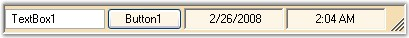

::: {style="DISPLAY: none"}
{#d2h_url_template}{#d2h_package_url style="WIDTH: 0px; DISPLAY: none; HEIGHT: 0px"}
:::

::::: {#nsbanner .d2h_main_nsbanner style="BORDER-BOTTOM: #999999 1px solid; POSITION: relative; PADDING-BOTTOM: 0px; BACKGROUND-COLOR: transparent; PADDING-LEFT: 0px; PADDING-RIGHT: 0px; DISPLAY: none; BORDER-TOP: #999999 1px solid; PADDING-TOP: 0px; LEFT: 0px"}
:::: {#TitleRow .d2h_main_titlerow style="PADDING-BOTTOM: 4px; BACKGROUND-COLOR: transparent; PADDING-LEFT: 22px; WIDTH: 100%; PADDING-RIGHT: 10px; DISPLAY: none; PADDING-TOP: 4px"}
::: {#ienav .d2h_main_ienav style="DISPLAY: none"}
{#D2HPrevious .D2HPreviousEnabled}  {#D2HNext .D2HNextEnabled}
:::
::::
:::::

:::: {#nstext .d2h_main_nstext style="PADDING-BOTTOM: 10px; BACKGROUND-COLOR: transparent; PADDING-LEFT: 22px; PADDING-RIGHT: 10px; HEIGHT: 100%; OVERFLOW: auto; PADDING-TOP: 5px" hasuserbackground="true" valign="bottom"}
::: {#d2h_breadcrumbs .d2h_breadcrumbs}
[Essential Studio User Guide Documentation](ms-xhelp:///?Id=12457748-09e3-4d74-a240-8e049cedf030){.d2h_breadcrumbsNormal}[ \> ]{.d2h_breadcrumbsLinkSeparator}[User Interface Edition](ms-xhelp:///?Id=c29296b7-531c-413b-a0ec-488ca1f7f669){.d2h_breadcrumbsNormal}[ \> ]{.d2h_breadcrumbsLinkSeparator}[Essential Windows](ms-xhelp:///?Id=e60759d8-47a4-4570-9d7a-16a68d63f2ea){.d2h_breadcrumbsNormal}[ \> ]{.d2h_breadcrumbsLinkSeparator}[Essential Tools]{.d2h_breadcrumbsContentsOnly}[ \> ]{.d2h_breadcrumbsLinkSeparator}[Tools Controls](ms-xhelp:///?Id=13c3c4f4-9d16-4b69-93f2-7e98eec67452){.d2h_breadcrumbsNormal}[ \> ]{.d2h_breadcrumbsLinkSeparator}[Notification Package](ms-xhelp:///?Id=2a7ddb82-ecdf-4d47-be30-1996e2c8244c){.d2h_breadcrumbsNormal}
:::

### StatusBarAdv {#statusbaradv style="tab-stops: 0pt"}

[]{style="COLOR: #15428b"} 

The **StatusBarAdv** is an advanced StatusBar control that can display StatusBarPanels with enhanced backgrounds and appearances. The StatusBarAdv control can be dragged and dropped from the toolbox onto a form during design time. Users can then drag and drop controls onto the StatusBarAdv control.

 

Below image shows a StatusBarAdv with controls added to it.

[]{style="COLOR: #15428b"} 

{border="0"}

[]{style="FONT-SIZE: 8pt"} 

Figure 1004: StatusBarAdv displayed with Child Controls and Panels

[]{style="FONT-SIZE: 8pt"} 

 

 

 

 

More:

[ ]{#related-topics}

[{border="0" align="absMiddle"}Features](ms-xhelp:///?Id=cdd25cf0-9951-4703-b6aa-6f114cf521f0){style="TEXT-DECORATION: none"}

[{border="0" align="absMiddle"}Creating StatusBarAdv](ms-xhelp:///?Id=72e5e9c4-6f64-4e63-995b-28b019747d72){style="TEXT-DECORATION: none"}

[{border="0" align="absMiddle"}Concepts and Features](ms-xhelp:///?Id=838fe94e-734a-49cb-baa7-4b78a4431d5a){style="TEXT-DECORATION: none"}

[{border="0" align="absMiddle"}StatusBarAdv Events](ms-xhelp:///?Id=19eb2e0d-e360-4f3b-b355-f71440371873){style="TEXT-DECORATION: none"}
::::
