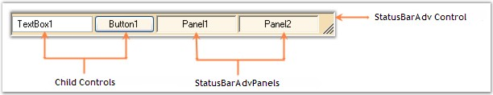

::: {style="DISPLAY: none"}
{#d2h_url_template}{#d2h_package_url style="WIDTH: 0px; DISPLAY: none; HEIGHT: 0px"}
:::

::: {.d2h_secondary_topic style="PADDING-BOTTOM: 10pt; MARGIN: 0pt; PADDING-LEFT: 0pt; PADDING-RIGHT: 0pt; PADDING-TOP: 0pt"}
##### StatusBarAdv Overview {#statusbaradv-overview style="MARGIN-LEFT: 18pt; tab-stops: 18.0pt"}

[]{style="COLOR: #15428b"} 

The various sections of StatusBarAdv and their descriptions are given below.

[]{style="COLOR: #15428b"} 

{border="0"}

[]{style="COLOR: #15428b"} 

Figure 1008: Sections of StatusBarAdv

 

StatusBarAdv Control

[]{style="FONT-FAMILY: 'Verdana','sans-serif'; COLOR: #4a5c8c; FONT-SIZE: 8pt"} 

This represents the advanced StatusBar with different border and background styles.

 

StatusBarAdvPanels

[]{style="FONT-FAMILY: 'Verdana','sans-serif'; COLOR: #4a5c8c; FONT-SIZE: 8pt"} 

This includes the StatusBarAdvPanel controls that are added onto the StatusBarAdv Control.

 

The StatusBarAdvPanel is a panel derived class that can display status bar information such as the time or key state with several appearance enhancements. It can be displayed either within a StatusBarAdv control or on a form.

 

Child Controls

[]{style="FONT-FAMILY: 'Verdana','sans-serif'; COLOR: #4a5c8c; FONT-SIZE: 8pt"} 

This includes other user interface controls that are added onto the StatusBarAdv Control.

[]{style="COLOR: #15428b"} 

See Also

[]{style="COLOR: black"} 

[[Appearance Settings]{.UGHyperlink}](../../../../../../../../Documents%20and%20Settings/sylviap/Desktop/Tools%20-%20Part%202.docx#_Appearance_Settings_2)[, ]{style="COLOR: #15428b"}[[Border Settings]{.UGHyperlink}](../../../../../../../../Documents%20and%20Settings/sylviap/Desktop/Tools%20-%20Part%202.docx#_Border_Settings_2)[, ]{style="COLOR: #15428b"}[[StatusBarAdvPanel]{.UGHyperlink}](../../../../../../../../Documents%20and%20Settings/sylviap/Desktop/Tools%20-%20Part%202.docx#_StatusBarAdvPanel)[]{style="COLOR: black"}

 

 

 

 

[]{#related-topics}
:::
