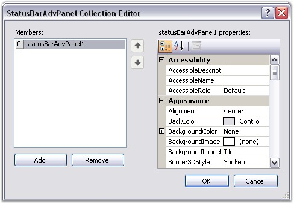
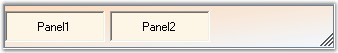
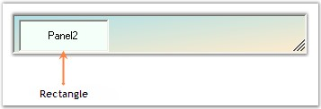

::: {style="DISPLAY: none"}
{#d2h_url_template}{#d2h_package_url style="WIDTH: 0px; DISPLAY: none; HEIGHT: 0px"}
:::

:::::: {.d2h_secondary_topic style="PADDING-BOTTOM: 10pt; MARGIN: 0pt; PADDING-LEFT: 0pt; PADDING-RIGHT: 0pt; PADDING-TOP: 0pt"}
##### StatusBarAdvPanel {#statusbaradvpanel style="MARGIN-LEFT: 18pt; tab-stops: 18.0pt"}

 

StatusBarAdvPanels can also be added to the StatusBarAdv control using the **Panels** property. On clicking the Panels property, the **StatusBarAdvPanel Collection Editor** pops up. Using this window, the user can add any number of panels to the control and customize them according to their requirements.

[]{style="COLOR: #15428b"} 

::: {align="center"}
  ----------------------- -------------------------------------------------------------------------
  StatusBarAdv Property   Description
  Panels                  Indicates the StatusBarAdvPanel controls contained in the StatusBarAdv.
  ----------------------- -------------------------------------------------------------------------
:::

[]{style="COLOR: #15428b"} 

[{border="0"}]{style="COLOR: #15428b"}[]{style="COLOR: #15428b"}

[]{style="COLOR: #15428b"} 

Figure 1012: StatusBarAdvPanel Collection Editor

[]{style="COLOR: #15428b"} 

Spacing

[]{style="FONT-FAMILY: 'Verdana','sans-serif'; COLOR: #4a5c8c; FONT-SIZE: 8pt"} 

The space between the panels can be set using the property given below.

[]{style="COLOR: #4a5c8c; FONT-SIZE: 8pt"} 

::: {align="center"}
  ----------------------- ---------------------------------------------
  StatusBarAdv Property   Description
  Spacing                 Gets / sets the spacing between the panels.
  ----------------------- ---------------------------------------------
:::

[]{style="COLOR: #15428b"} 

+----------------------------------------------------------------------------------------------------------------------------------------------------------------------------------------------------+
| **[\[C#\]]{style="FONT-FAMILY: 'Courier New'; COLOR: black"}**                                                                                                                                     |
|                                                                                                                                                                                                    |
| []{style="FONT-FAMILY: 'Courier New'; COLOR: black"}                                                                                                                                               |
|                                                                                                                                                                                                    |
| [this]{style="FONT-FAMILY: 'Courier New'; COLOR: blue"}[.statusBarAdv1.Spacing = [new]{style="COLOR: blue"} System.Drawing.[Size]{style="COLOR: teal"}(5, 5);]{style="FONT-FAMILY: 'Courier New'"} |
+----------------------------------------------------------------------------------------------------------------------------------------------------------------------------------------------------+

[]{style="COLOR: #15428b"} 

+--------------------------------------------------------------------------------------------------------------------------------------------------------------------------+
| **[\[VB.NET\]]{style="FONT-FAMILY: 'Courier New'; COLOR: black"}**                                                                                                       |
|                                                                                                                                                                          |
| []{style="FONT-FAMILY: 'Courier New'; COLOR: black"}                                                                                                                     |
|                                                                                                                                                                          |
| [Me]{style="FONT-FAMILY: 'Courier New'; COLOR: blue"}[.statusBarAdv1.Spacing = [New]{style="COLOR: blue"} System.Drawing.Size(5, 5)]{style="FONT-FAMILY: 'Courier New'"} |
+--------------------------------------------------------------------------------------------------------------------------------------------------------------------------+

[]{style="COLOR: #15428b"} 

[{border="0"}]{style="COLOR: #15428b"}[]{style="COLOR: #15428b"}

[]{style="COLOR: #15428b"} 

Figure 1013: Spacing property Set

[]{style="COLOR: #15428b"} 

Panel Size

 

 The rectangle that is used to display the panels can be customized using the property given below.

[]{style="COLOR: #15428b"} 

::: {align="center"}
  ----------------------- ------------------------------------------------------------------------------
  StatusBarAdv Property   Description
  CustomLayoutBounds      Indicates a custom rectangle that the layout will use to display the panels.
  ----------------------- ------------------------------------------------------------------------------
:::

[]{style="COLOR: #15428b"} 

It can be set programmatically through the below code snippet.

[]{style="COLOR: #15428b"} 

+-----------------------------------------------------------------------------------------------------------------------------------------------------------------------------------------------------------------------------+
| **[\[C#\]]{style="FONT-FAMILY: 'Courier New'; COLOR: black"}**                                                                                                                                                              |
|                                                                                                                                                                                                                             |
| []{style="FONT-FAMILY: 'Courier New'; COLOR: black"}                                                                                                                                                                        |
|                                                                                                                                                                                                                             |
| [this]{style="FONT-FAMILY: 'Courier New'; COLOR: blue"}[.statusBarAdv1.CustomLayoutBounds = [new]{style="COLOR: blue"} System.Drawing.[Rectangle]{style="COLOR: teal"}(5, 2, 100, 20);]{style="FONT-FAMILY: 'Courier New'"} |
+-----------------------------------------------------------------------------------------------------------------------------------------------------------------------------------------------------------------------------+

[]{style="COLOR: #15428b"} 

+--------------------------------------------------------------------------------------------------------------------------------------------------------------------------------------------------------------------------+
| **[\[VB.NET\]]{style="FONT-FAMILY: 'Courier New'; COLOR: black"}**                                                                                                                                                       |
|                                                                                                                                                                                                                          |
| []{style="FONT-FAMILY: 'Courier New'; COLOR: black"}                                                                                                                                                                     |
|                                                                                                                                                                                                                          |
| [Me]{style="FONT-FAMILY: 'Courier New'; COLOR: blue"}[.statusBarAdv1.CustomLayoutBounds = [New]{style="COLOR: blue"} System.Drawing.[Rectangle]{style="COLOR: teal"}(5, 2, 100, 20)]{style="FONT-FAMILY: 'Courier New'"} |
+--------------------------------------------------------------------------------------------------------------------------------------------------------------------------------------------------------------------------+

[]{style="COLOR: #15428b"} 

{border="0"}

[]{style="COLOR: #15428b"} 

Figure 1014: StatusBarAdv with CustomLayoutBounds property Set

 

 

 

 

[]{#related-topics}
::::::
