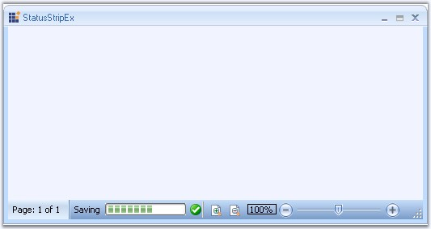

::: {style="DISPLAY: none"}
{#d2h_url_template}{#d2h_package_url style="WIDTH: 0px; DISPLAY: none; HEIGHT: 0px"}
:::

::: {.d2h_secondary_topic style="PADDING-BOTTOM: 10pt; MARGIN: 0pt; PADDING-LEFT: 0pt; PADDING-RIGHT: 0pt; PADDING-TOP: 0pt"}
#### StatusStripEx {#statusstripex style="tab-stops: 0pt"}

[]{style="COLOR: #15428b"} 

Essential Tools has come up with StatusStripEx control which can be added to the bottom of the Ribbon. It can hold controls like TrackBarEx, ProgressBar, StatusStripButtons, and so on.

[]{style="COLOR: #15428b"} 

{border="0"}

[]{style="COLOR: #15428b"} 

Figure 1402: StatusStripEx control Displayed at the Bottom of the RibbonForm

[]{style="COLOR: #15428b"} 

See Also

[]{style="COLOR: #15428b"} 

[[Creating a StatusStripEx]{.UGHyperlink}](../../../../../../../../Documents%20and%20Settings/sylviap/Desktop/Tools%20-%20Part%202.docx#_Creating_a_StatusStripEx)[, ]{.UGHyperlink}[[Smart Tag Options]{.UGHyperlink}](../../../../../../../../Documents%20and%20Settings/sylviap/Desktop/Tools%20-%20Part%202.docx#_Smart_Tag_Options)[, ]{.UGHyperlink}[[ColorSchemes for StatusStripEx]{.UGHyperlink}](../../../../../../../../Documents%20and%20Settings/sylviap/Desktop/Tools%20-%20Part%202.docx#_ColorSchemes_for_StatusStripEx)[, ]{.UGHyperlink}[[SizingGrip Settings]{.UGHyperlink}](../../../../../../../../Documents%20and%20Settings/sylviap/Desktop/Tools%20-%20Part%202.docx#_SizingGrip_Settings)[]{.UGHyperlink}

 

 

 

More:

[ ]{#related-topics}

[{border="0" align="absMiddle"}Creating a StatusStripEx](ms-xhelp:///?Id=cdff398d-083d-4b99-b362-2b79690547c8){style="TEXT-DECORATION: none"}

[{border="0" align="absMiddle"}Smart Tag Options](ms-xhelp:///?Id=745a64ee-fe2e-43f2-b663-299b140ba41a){style="TEXT-DECORATION: none"}

[{border="0" align="absMiddle"}SizingGrip Settings](ms-xhelp:///?Id=34bf475f-eabd-4f31-a914-faf706be2fd0){style="TEXT-DECORATION: none"}

[{border="0" align="absMiddle"}ColorSchemes for StatusStripEx](ms-xhelp:///?Id=4dbe52d3-f7ee-406e-9629-b63e1d064dfc){style="TEXT-DECORATION: none"}

[{border="0" align="absMiddle"}Custom Context Menu](ms-xhelp:///?Id=1e1dc2da-30ea-4bdb-a236-12a917f21004){style="TEXT-DECORATION: none"}
:::
