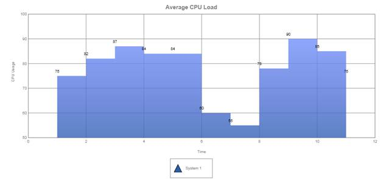

::: {style="DISPLAY: none"}
{#d2h_url_template}{#d2h_package_url style="WIDTH: 0px; DISPLAY: none; HEIGHT: 0px"}
:::

:::: {.d2h_secondary_topic style="PADDING-BOTTOM: 10pt; MARGIN: 0pt; PADDING-LEFT: 0pt; PADDING-RIGHT: 0pt; PADDING-TOP: 0pt"}
#### Step Area Chart {#step-area-chart style="tab-stops: 0pt"}

Step area charts use horizontal and vertical lines to connect data points resulting in a step-like progression. The area under the step line contains the data shown by this type of chart.

Chart Details

::: {align="center"}
  ---------------------------------- -------------
  **Number of Y Values per Point**   1
  **Number of Series         **      One or more
  **Cannot be Combined with   **     Pie chart
  ---------------------------------- -------------
:::

[]{style="FONT-FAMILY: 'Calibri','sans-serif'"} 

Step area series can be added to the chart using the following code.

 

+-----------------------------------------------------------------------------------------------------------------------------------------------------------------------------------------------------------+
| **[\[C#\]]{style="FONT-FAMILY: 'Courier New'"}[      ]{style="FONT-FAMILY: Consolas; FONT-SIZE: 9.5pt"}[]{style="FONT-FAMILY: 'Courier New'"}**                                                           |
|                                                                                                                                                                                                           |
| [        [Series]{style="COLOR: #2b91af"} series = [new]{style="COLOR: blue"} [Series]{style="COLOR: #2b91af"}([\"System 1\"]{style="COLOR: #a31515"});]{style="FONT-FAMILY: Consolas; FONT-SIZE: 9.5pt"} |
|                                                                                                                                                                                                           |
| [        [  ]{style="COLOR: blue"}]{style="FONT-FAMILY: Consolas; FONT-SIZE: 9.5pt"}                                                                                                                      |
|                                                                                                                                                                                                           |
| [        series.Points.Add(1, 75);]{style="FONT-FAMILY: Consolas; FONT-SIZE: 9.5pt"}                                                                                                                      |
|                                                                                                                                                                                                           |
| [        series.Points.Add(2, 82);]{style="FONT-FAMILY: Consolas; FONT-SIZE: 9.5pt"}                                                                                                                      |
|                                                                                                                                                                                                           |
| [        series.Points.Add(3, 87);]{style="FONT-FAMILY: Consolas; FONT-SIZE: 9.5pt"}                                                                                                                      |
|                                                                                                                                                                                                           |
| [         ]{style="FONT-FAMILY: Consolas; FONT-SIZE: 9.5pt"}                                                                                                                                              |
|                                                                                                                                                                                                           |
| [         . . .]{style="FONT-FAMILY: Consolas; FONT-SIZE: 9.5pt"}                                                                                                                                         |
|                                                                                                                                                                                                           |
| [        series.Style.Border.Width = 3;]{style="FONT-FAMILY: Consolas; FONT-SIZE: 9.5pt"}                                                                                                                 |
|                                                                                                                                                                                                           |
| [        series.Style.Opacity = 0.8f;]{style="FONT-FAMILY: Consolas; FONT-SIZE: 9.5pt"}                                                                                                                   |
|                                                                                                                                                                                                           |
| [        series.Type = [SeriesType]{style="COLOR: #2b91af"}.StepArea;]{style="FONT-FAMILY: Consolas; FONT-SIZE: 9.5pt"}                                                                                   |
|                                                                                                                                                                                                           |
| [        [this]{style="COLOR: blue"}.ChartAdv1.Series.Add(series);]{style="FONT-FAMILY: Consolas; FONT-SIZE: 9.5pt"}                                                                                      |
|                                                                                                                                                                                                           |
| []{style="FONT-FAMILY: Consolas; FONT-SIZE: 9.5pt"}                                                                                                                                                       |
+-----------------------------------------------------------------------------------------------------------------------------------------------------------------------------------------------------------+

 

+---------------------------------------------------------------------------------------------------------------------------------------------------------------------------------------------------------------------------------------------------------------+
| **[\[VB\]]{style="FONT-FAMILY: 'Courier New'"}[  ]{style="FONT-FAMILY: Consolas; COLOR: blue; FONT-SIZE: 9.5pt"}[]{style="FONT-FAMILY: 'Courier New'"}**                                                                                                      |
|                                                                                                                                                                                                                                                               |
| [        [Dim]{style="COLOR: blue"} series [As]{style="COLOR: blue"} [Series]{style="COLOR: #2b91af"} = [New]{style="COLOR: blue"} [Series]{style="COLOR: #2b91af"}([\"System 1\"]{style="COLOR: #a31515"})]{style="FONT-FAMILY: Consolas; FONT-SIZE: 9.5pt"} |
|                                                                                                                                                                                                                                                               |
| []{style="FONT-FAMILY: Consolas; FONT-SIZE: 9.5pt"}                                                                                                                                                                                                           |
|                                                                                                                                                                                                                                                               |
| [        series.Points.Add(1, 75)]{style="FONT-FAMILY: Consolas; FONT-SIZE: 9.5pt"}                                                                                                                                                                           |
|                                                                                                                                                                                                                                                               |
| [        series.Points.Add(2, 82)]{style="FONT-FAMILY: Consolas; FONT-SIZE: 9.5pt"}                                                                                                                                                                           |
|                                                                                                                                                                                                                                                               |
| [        series.Points.Add(3, 87)]{style="FONT-FAMILY: Consolas; FONT-SIZE: 9.5pt"}                                                                                                                                                                           |
|                                                                                                                                                                                                                                                               |
| [        . . .]{style="FONT-FAMILY: Consolas; FONT-SIZE: 9.5pt"}                                                                                                                                                                                              |
|                                                                                                                                                                                                                                                               |
| []{style="FONT-FAMILY: Consolas; FONT-SIZE: 9.5pt"}                                                                                                                                                                                                           |
|                                                                                                                                                                                                                                                               |
| [        series.Style.Border.Width = 3]{style="FONT-FAMILY: Consolas; FONT-SIZE: 9.5pt"}                                                                                                                                                                      |
|                                                                                                                                                                                                                                                               |
| [        series.Style.Opacity = 0.8F]{style="FONT-FAMILY: Consolas; FONT-SIZE: 9.5pt"}                                                                                                                                                                        |
|                                                                                                                                                                                                                                                               |
| [        series.Type = [SeriesType]{style="COLOR: #2b91af"}.StepArea]{style="FONT-FAMILY: Consolas; FONT-SIZE: 9.5pt"}                                                                                                                                        |
|                                                                                                                                                                                                                                                               |
| [        [Me]{style="COLOR: blue"}.ChartAdv1.Series.Add(series)]{style="FONT-FAMILY: Consolas; FONT-SIZE: 9.5pt"}                                                                                                                                             |
|                                                                                                                                                                                                                                                               |
| []{style="FONT-FAMILY: Consolas; FONT-SIZE: 9.5pt"}                                                                                                                                                                                                           |
|                                                                                                                                                                                                                                                               |
| []{style="FONT-FAMILY: Consolas; FONT-SIZE: 9.5pt"}                                                                                                                                                                                                           |
+---------------------------------------------------------------------------------------------------------------------------------------------------------------------------------------------------------------------------------------------------------------+

 

 

{border="0"}

Figure 14: Step Area Chart

 

[]{#related-topics}
::::
