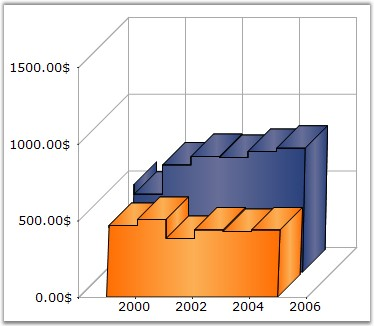

::: {style="DISPLAY: none"}
{#d2h_url_template}{#d2h_package_url style="WIDTH: 0px; DISPLAY: none; HEIGHT: 0px"}
:::

:::: {.d2h_secondary_topic style="PADDING-BOTTOM: 10pt; MARGIN: 0pt; PADDING-LEFT: 0pt; PADDING-RIGHT: 0pt; PADDING-TOP: 0pt"}
#### StepItem.Inverted {#stepitem.inverted style="tab-stops: 0pt"}

 

Specifies if the particular stepline is inverted or not in the StepAreaChart.

 

::: {align="center"}
+-------------------------------------+------------------------------------------------------------------------------------------------+
| **Details**                                                                                                                          |
+-------------------------------------+------------------------------------------------------------------------------------------------+
| **Possible Values**                 | [·      ]{style="FONT-FAMILY: Symbol"}**True** - Indicates that the stepline is inverted.      |
|                                     |                                                                                                |
|                                     | [·      ]{style="FONT-FAMILY: Symbol"}**False** - Indicates that the stepline is not inverted. |
+-------------------------------------+------------------------------------------------------------------------------------------------+
| **Default Value    **               | True                                                                                           |
+-------------------------------------+------------------------------------------------------------------------------------------------+
| **2D / 3D Limitations**             | No                                                                                             |
+-------------------------------------+------------------------------------------------------------------------------------------------+
| **Applies to Chart Element**        | Any Series                                                                                     |
+-------------------------------------+------------------------------------------------------------------------------------------------+
| **Applies to Chart Types**          | StepAreaChart, StepLine Chart                                                                  |
+-------------------------------------+------------------------------------------------------------------------------------------------+
:::

 

Here is sample code snippet using Inverted Step.

 

+----------------------------------------------------------------------------------------------------------------------------------------------------------------------------------------------------------------------------------------------------------------------------------+
| **[\[C#\]]{style="FONT-FAMILY: 'Courier New'; COLOR: black"}**                                                                                                                                                                                                                   |
|                                                                                                                                                                                                                                                                                  |
| **[]{style="FONT-FAMILY: 'Courier New'; COLOR: black"}**                                                                                                                                                                                                                         |
|                                                                                                                                                                                                                                                                                  |
| [this]{style="FONT-FAMILY: 'Courier New'; COLOR: blue"}[.chartControl1.Series\[0\].ConfigItems.StepItem.Inverted=]{style="FONT-FAMILY: 'Courier New'; COLOR: black"}[true]{style="FONT-FAMILY: 'Courier New'; COLOR: blue"}[;]{style="FONT-FAMILY: 'Courier New'; COLOR: black"} |
+----------------------------------------------------------------------------------------------------------------------------------------------------------------------------------------------------------------------------------------------------------------------------------+

 

+---------------------------------------------------------------------------------------------------------------------------------------------------------------------------------------------------------------------------------+
| **[\[VB.NET\]]{style="FONT-FAMILY: 'Courier New'; COLOR: black"}**                                                                                                                                                              |
|                                                                                                                                                                                                                                 |
| **[]{style="FONT-FAMILY: 'Courier New'; COLOR: black"}**                                                                                                                                                                        |
|                                                                                                                                                                                                                                 |
| [Private Me]{style="FONT-FAMILY: 'Courier New'; COLOR: blue"}[.chartControl1.Series(0).ConfigItems.StepItem.Inverted=]{style="FONT-FAMILY: 'Courier New'; COLOR: black"}[True]{style="FONT-FAMILY: 'Courier New'; COLOR: blue"} |
+---------------------------------------------------------------------------------------------------------------------------------------------------------------------------------------------------------------------------------+

 

{border="0"}

 

Figure 211: Inverted = \"False\"

**[]{style="COLOR: black; FONT-SIZE: 8pt"}** 

{border="0"}

 

Figure 212: Inverted = \"True\"

 

**See Also**

 

[StepAreaChart]{.UGHyperlink}, [StepLine Chart]{.UGHyperlink}[]{style="COLOR: black"}

 

[]{#p154} 

 

[]{#related-topics}
::::
