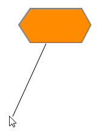
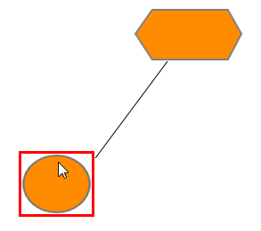
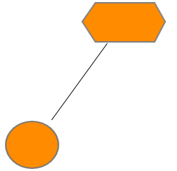

::: {style="DISPLAY: none"}
{#d2h_url_template}{#d2h_package_url style="WIDTH: 0px; DISPLAY: none; HEIGHT: 0px"}
:::

::: {.d2h_secondary_topic style="PADDING-BOTTOM: 10pt; MARGIN: 0pt; PADDING-LEFT: 0pt; PADDING-RIGHT: 0pt; PADDING-TOP: 0pt"}
#### Steps for Adding a Connector to a Diagram at Run Time  {#steps-for-adding-a-connector-to-a-diagram-at-run-time style="tab-stops: 0pt"}

1.   First, set the **EnableConnection** property to **true**. This has to be set to **true** every time the user makes a connection.

2.   The connector type of the dynamic line connector can be specified using this                                 **setDynamicConnector** method.

[]{style="FONT-FAMILY: Consolas; COLOR: black"} 

+----------------------------------------------------------------------------------------------------------------------------------------------------------------------------------------------------------------------------------------------------------------------+
| **[\[JavaScript\]]{style="FONT-FAMILY: 'Courier New'; COLOR: black; FONT-SIZE: 11pt"}**                                                                                                                                                                              |
|                                                                                                                                                                                                                                                                      |
| **[]{style="FONT-FAMILY: 'Courier New'; COLOR: black; FONT-SIZE: 11pt"}**                                                                                                                                                                                            |
|                                                                                                                                                                                                                                                                      |
| [ function]{style="FONT-FAMILY: 'Courier New'; COLOR: blue; FONT-SIZE: 11pt"}[ dynamicConnector(sender, args) {]{style="FONT-FAMILY: 'Courier New'; FONT-SIZE: 11pt"}                                                                                                |
|                                                                                                                                                                                                                                                                      |
| [        diagram = \$find([FlatDiagram]{style="COLOR: #a31515"});[]{style="COLOR: black"}]{style="FONT-FAMILY: 'Courier New'; FONT-SIZE: 11pt"}                                                                                                                      |
|                                                                                                                                                                                                                                                                      |
| [        diagram.setDynamicConnector(]{style="FONT-FAMILY: 'Courier New'; COLOR: black; FONT-SIZE: 11pt"}[\"Orthogonal\"]{style="FONT-FAMILY: 'Courier New'; COLOR: maroon; FONT-SIZE: 11pt"}[);]{style="FONT-FAMILY: 'Courier New'; COLOR: black; FONT-SIZE: 11pt"} |
|                                                                                                                                                                                                                                                                      |
| [});]{style="FONT-FAMILY: 'Courier New'; COLOR: black; FONT-SIZE: 11pt"}[]{style="FONT-FAMILY: 'Courier New'; FONT-SIZE: 11pt"}                                                                                                                                      |
+----------------------------------------------------------------------------------------------------------------------------------------------------------------------------------------------------------------------------------------------------------------------+

 

3.   While the pointer is over the node, click where the connection is to start. This acts as the head node for the connector.

4.   While holding the left button, drag the pointer to the node to which you want to create a link. 

{border="0"}

Figure 52: Connector Drag Start 

 

5.   When you run into any node during the dragging process, a red border is displayed for that node. 

{border="0"}

Figure 53: Hit Node 

6.   Release the left mouse button over the target node where you want to connect. This acts as the tail node for the connector and the link is created. 

{border="0"}

Figure 54: Connection Ended

 

[]{#related-topics}
:::
