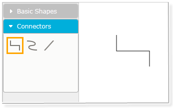
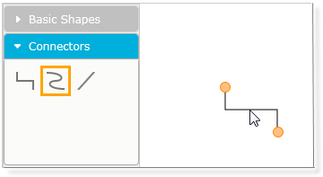
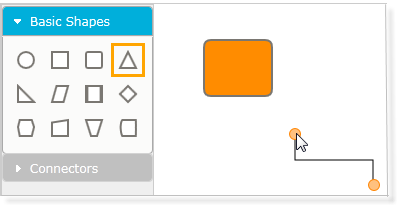
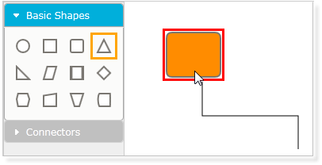
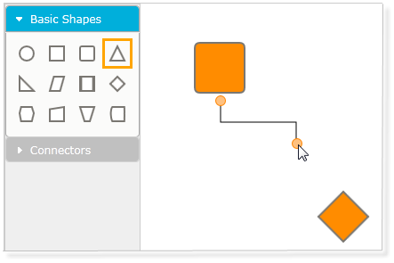
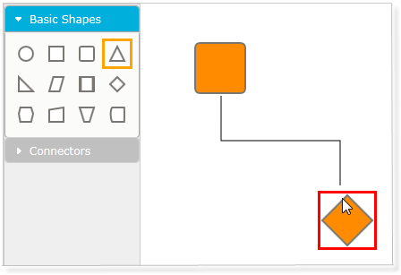

::: {style="DISPLAY: none"}
{#d2h_url_template}{#d2h_package_url style="WIDTH: 0px; DISPLAY: none; HEIGHT: 0px"}
:::

::: {.d2h_secondary_topic style="PADDING-BOTTOM: 10pt; MARGIN: 0pt; PADDING-LEFT: 0pt; PADDING-RIGHT: 0pt; PADDING-TOP: 0pt"}
#### Steps for Adding Connectors through Symbol Palette {#steps-for-adding-connectors-through-symbol-palette style="tab-stops: 0pt"}

It is also possible to drag-and-drop line connectors from the symbol palette. Three shapes of the line connectors have been added in a group named **Connectors**. The desired line can be dragged onto the page. Initially, the head node and the tail node will be null. The steps to be followed to add a line connector from the symbol pallete are as follows:

1.   Drag the desired line connector onto the page. 

{border="0"}

Figure 55: Orthogonal Line Added to the Page

 

2.   Select the connector by clicking on the line connector shape.

{border="0"}

Figure 56: Connector Selector

3.   Drag the head selector of the line connector to the desired node to make a connection. 

{border="0"}

Figure 57: Start Dragging

 

{border="0"}

Figure 58: Dragging the Head Selector

4.   Similarly, drag the tail selector of the line connector to the desired node. Now, this creates a link between the two nodes.

{border="0"}

Figure 59: Start Dragging

{border="0"}

Figure 60: Dragging the Tail Selector

 

 

[]{#related-topics}
:::
