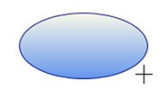
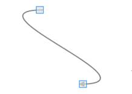
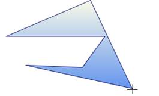
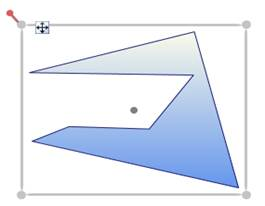

::: {style="DISPLAY: none"}
{#d2h_url_template}{#d2h_package_url style="WIDTH: 0px; DISPLAY: none; HEIGHT: 0px"}
:::

:::::: {.d2h_secondary_topic style="PADDING-BOTTOM: 10pt; MARGIN: 0pt; PADDING-LEFT: 0pt; PADDING-RIGHT: 0pt; PADDING-TOP: 0pt"}
#### Steps for Drawing []{style="FONT-SIZE: 16pt"} {#steps-for-drawing style="tab-stops: 0pt"}

 You can draw on a page by click and drag on the page.

  Follow are the below steps to draw a shape or a line:

 

1.   Set the **EnableDrawingTools** property of DiagramView to true.

2.   Select the DrawingTool as required from DrawingTools option.

3.   Click and drag. Preview of the drawing will be displayed.

4.   Release the mouse. Shape or line will be drawn.

 

::: {style="BORDER-BOTTOM: windowtext 1pt solid; BORDER-LEFT: medium none; PADDING-BOTTOM: 1pt; MARGIN-TOP: 9pt; PADDING-LEFT: 0pt; PADDING-RIGHT: 0pt; MARGIN-BOTTOM: 9pt; BORDER-TOP: windowtext 1pt solid; BORDER-RIGHT: medium none; PADDING-TOP: 1pt"}
Note:[ ]{style="FONT-FAMILY: 'Calibri','sans-serif'; FONT-SIZE: 11pt"}These steps are common for all shapes and lines drawing, except Polygon.
:::

 

Shape Drawing:

Preview Ellipse -- while Drawing

 

 

{hspace="12" align="left"}\

Figure 139:Ellipse Preview

*[]{style="FONT-SIZE: 9pt"}* 

Ellipse -- After Drawing.

*[]{style="FONT-SIZE: 9pt"}* 

{border="0"}

Figure 140:Ellipse(Node**[)]{style="FONT-STYLE: normal"}**

Line Drawing:

Bezier Line Preview -- While Drawing

{border="0"}

Figure 141:Bezier Line Preview

 

Bezier Line -- After Drawing

 

{border="0"}

Figure 142:Bezier Line(Line Connector)

**[]{style="FONT-STYLE: normal"}** 

::: {style="BORDER-BOTTOM: windowtext 1pt solid; BORDER-LEFT: medium none; PADDING-BOTTOM: 1pt; MARGIN-TOP: 9pt; PADDING-LEFT: 0pt; PADDING-RIGHT: 0pt; MARGIN-BOTTOM: 9pt; BORDER-TOP: windowtext 1pt solid; BORDER-RIGHT: medium none; PADDING-TOP: 1pt"}
       Note:
:::

::: {style="BORDER-BOTTOM: windowtext 1pt solid; BORDER-LEFT: medium none; PADDING-BOTTOM: 1pt; MARGIN: 0pt 0pt 0pt 18pt; PADDING-LEFT: 0pt; PADDING-RIGHT: 0pt; BORDER-TOP: windowtext 1pt solid; BORDER-RIGHT: medium none; PADDING-TOP: 1pt"}
***[·    ]{style="FONT-FAMILY: Symbol"}***The drawn shape will be converted into a Node.

***[·    ]{style="FONT-FAMILY: Symbol"}***The drawn line will be converted into a LineConnector.

***[·    ]{style="FONT-FAMILY: Symbol"}***You can continually draw the selected shape.

***[·    ]{style="FONT-FAMILY: Symbol"}***Lines cannot be drawn continually.
:::

**[]{style="FONT-FAMILY: 'Calibri','sans-serif'; FONT-SIZE: 11pt"}** 

Steps for drawing a Polygon Drawing:

 

1.   Set the **EnableDrawingTools** property of DiagramView to be **true**.

2.   Select the DrawingTool as required from DrawingTools option.

3.   Click, where you want the first point for polygon.

4.   Drag the mouse pointer. Preview of the drawing will be displayed.

5.   Click, where you want to place the Intermediate points of Polygon

6.   Right-click to complete the drawing.

 

Preview Polygon -- While Drawing

{border="0"}

Figure 143:Polygon Preview

        

Polygon -- After Drawing

 

{border="0"}

Figure 144:Polygon(Node)

 

 

[]{#related-topics}
::::::
