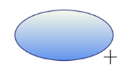
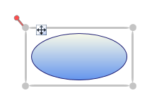
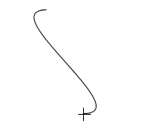
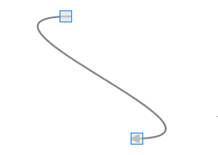
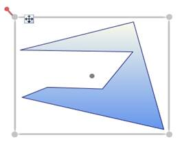

::: {style="DISPLAY: none"}
{#d2h_url_template}{#d2h_package_url style="WIDTH: 0px; DISPLAY: none; HEIGHT: 0px"}
:::

::: {.d2h_secondary_topic style="PADDING-BOTTOM: 10pt; MARGIN: 0pt; PADDING-LEFT: 0pt; PADDING-RIGHT: 0pt; PADDING-TOP: 0pt"}
#### Steps for Drawing {#steps-for-drawing style="tab-stops: 0pt"}

 You can draw on a page by click and drag on the page.

 Follow are the below steps to draw a shape or a line:

 

1.  Set the **EnableDrawingTools** property of DiagramView to **true**.

2.  Select the DrawingTool as required from DrawingTools option.

3.  Click and drag. Preview of the drawing will be displayed.

4.  Release the mouse. Shape or line will be drawn.

Note:[ ]{style="FONT-FAMILY: 'Calibri','sans-serif'; FONT-SIZE: 11pt"}These steps are common for all shapes and lines drawing, except Polygon and Polyline.

 

**Shape Drawing:**

Preview Ellipse -- while Drawing

 

 

{hspace="12" align="left"}[\
]{style="FONT-FAMILY: 'Calibri','sans-serif'; FONT-SIZE: 11pt"}

*[Figure ]{style="FONT-SIZE: 9pt"}[167]{style="FONT-SIZE: 9pt"}[:Ellipse Preview]{style="FONT-SIZE: 9pt"}*

*[]{style="FONT-SIZE: 9pt"}* 

Ellipse -- After Drawing.

*[]{style="FONT-SIZE: 9pt"}* 

*[{border="0"}]{style="FONT-SIZE: 9pt"}*

*[Figure ]{style="FONT-SIZE: 9pt"}[168]{style="FONT-SIZE: 9pt"}[:Ellipse(Node)]{style="FONT-SIZE: 9pt"}*

*[       ]{style="FONT-SIZE: 9pt"}*

**[Line Drawing:]{style="FONT-FAMILY: 'Calibri','sans-serif'; FONT-SIZE: 11pt"}**

Bezier Line Preview -- While Drawing

**[{border="0"}]{style="FONT-FAMILY: 'Calibri','sans-serif'; FONT-SIZE: 11pt"}**

*[Figure ]{style="FONT-SIZE: 9pt"}[169]{style="FONT-SIZE: 9pt"}[:Bezier Line Preview]{style="FONT-SIZE: 9pt"}*

Bezier Line -- After Drawing

{border="0"}

*[Figure ]{style="FONT-SIZE: 9pt"}[170]{style="FONT-SIZE: 9pt"}[:Bezier Line(Line Connector)]{style="FONT-SIZE: 9pt"}*

 

***Note:***

[·      ]{style="FONT-FAMILY: Symbol"}***The drawn shape will be converted into a Node.***

[·      ]{style="FONT-FAMILY: Symbol"}***The drawn line will be converted into a*** ***LineConnector.***

[·      ]{style="FONT-FAMILY: Symbol"}***You can continually draw the selected shape.***

[·      ]{style="FONT-FAMILY: Symbol"}***Lines cannot be drawn*** ***continually.***

 

 

 

**Steps for drawing a Polygon and Polyline Drawing:**

 

1.  Set the **EnableDrawingTools** property of DiagramView to be true.

2.  Select the DrawingTool as required from DrawingTools option.

3.  Click, where you want the first point for polygon (or) polyline.

4.  Drag the mouse pointer. Preview of the drawing will be displayed.

5.  Click, where you want to place the Intermediate points of Polygon (or) Polyline

6.  Right-click to complete the drawing.

 

Preview Polygon -- While Drawing

{border="0"}

*[Figure ]{style="FONT-SIZE: 9pt"}[171]{style="FONT-SIZE: 9pt"}[: Polygon Preview]{style="FONT-SIZE: 9pt"}*

[                             ]{style="FONT-FAMILY: 'Calibri','sans-serif'; FONT-SIZE: 11pt"}*[]{style="FONT-SIZE: 9pt"}*

Polygon -- After Drawing

{border="0"}

*[Figure ]{style="FONT-SIZE: 9pt"}[172]{style="FONT-SIZE: 9pt"}[: Polygon(Node)]{style="FONT-SIZE: 9pt"}*

                                      *[]{style="FONT-SIZE: 9pt"}*

[]{#_Freeze_Panes}Sample Link

To view a sample:

1\. Open the WPF sample browser from the dashboard.

2\. Navigate to WPF Diagram -\> Product Showcase -\>Features demo

[]{#related-topics}
:::
