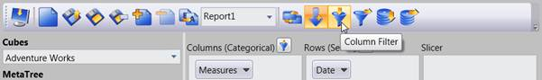
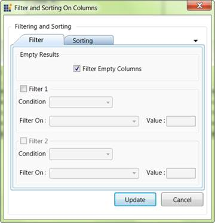
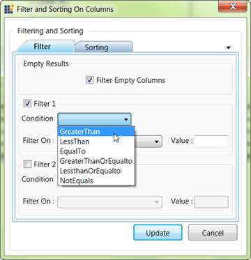
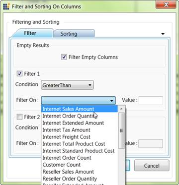
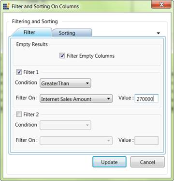

::: {style="DISPLAY: none"}
{#d2h_url_template} {#d2h_package_url style="WIDTH: 0px; DISPLAY: none; HEIGHT: 0px"}
:::

::: {.d2h_secondary_topic style="PADDING-BOTTOM: 10pt; MARGIN: 0pt; PADDING-LEFT: 0pt; PADDING-RIGHT: 0pt; PADDING-TOP: 0pt"}
#### Steps to apply filtering {#steps-to-apply-filtering style="tab-stops: 0pt"}

 

1.   We can apply filter using the filter dialog window. By clicking the column filter or row filter button in the OLAP client toolbar the appropriate filter dialog window will be displayed.

[]{style="FONT-FAMILY: 'Trebuchet MS','sans-serif'; COLOR: #15428b; FONT-SIZE: 9pt"} 

{border="0"}

Figure 51: Selection Column Filter

**[]{style="FONT-FAMILY: 'Calibri','sans-serif'; COLOR: #4f81bd; FONT-SIZE: 9pt"}**  

{border="0"}

Figure 52: Filter Dialog window

**[]{style="FONT-FAMILY: 'Calibri','sans-serif'; COLOR: #4f81bd; FONT-SIZE: 9pt"}**  

2.   Then by checking the Filter 1 check box, we can apply the first filter condition to the current report.

[]{style="FONT-FAMILY: 'Trebuchet MS','sans-serif'; COLOR: #15428b; FONT-SIZE: 9pt"} 

{border="0"}

Figure 53: List of condition in Filter Dialog

[]{style="FONT-FAMILY: 'Calibri','sans-serif'"} 

3.   From the condition combo box we can choose the condition we want to include in the filter expression.

[]{style="FONT-FAMILY: 'Trebuchet MS','sans-serif'; COLOR: #15428b; FONT-SIZE: 9pt"} 

{border="0"}

Figure 54: Measures in Filter Dialog

**[]{style="FONT-FAMILY: 'Calibri','sans-serif'; COLOR: #4f81bd; FONT-SIZE: 9pt"}**  

4.   We want to choose a measure element that we have already include in our current report from the Filter on List.

5.   The filter expression will be built on this selected measure element.

[]{style="FONT-FAMILY: 'Calibri','sans-serif'"} 

{border="0"}

Figure 55: Entering the Conditional value for Filter

**[]{style="FONT-FAMILY: 'Calibri','sans-serif'; COLOR: #4f81bd; FONT-SIZE: 9pt"}**  

6.   Finally by entering the Conditional value and clicking the update button the filter will get reflected in the result set.

7.   In the same way we can apply the Row Filter.

[]{#related-topics}
:::
