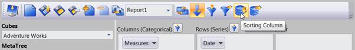
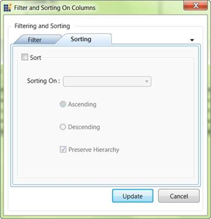
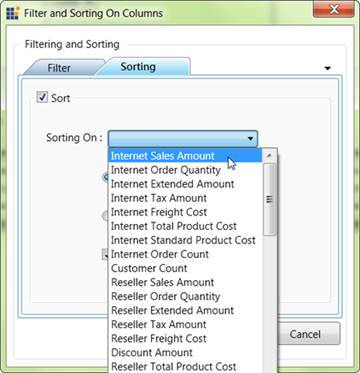

::: {style="DISPLAY: none"}
{#d2h_url_template} {#d2h_package_url style="WIDTH: 0px; DISPLAY: none; HEIGHT: 0px"}
:::

::: {.d2h_secondary_topic style="PADDING-BOTTOM: 10pt; MARGIN: 0pt; PADDING-LEFT: 0pt; PADDING-RIGHT: 0pt; PADDING-TOP: 0pt"}
#### Steps to apply sorting {#steps-to-apply-sorting style="tab-stops: 0pt"}

The sorting dialog will appear when we click the row/column sorting button in the OLAP Client tool bar. By giving the proper input, we can apply Sorting.

{border="0"}

Figure 57: Clicking Column sorting Button

[]{style="FONT-FAMILY: 'Calibri','sans-serif'"} 

{border="0"}

Figure 58: Sorting dialog

By Checking the **Sort** check box we can set the sorting for the current report.

{border="0"}

Figure 59: Selecting a Measure in Sorting Dialog

When we want to choose a measure element form the sorting on list, the selecting measure element should exist in the current report. Then only the sorting will reflect on the result set.

By selecting the measure and specifying the sorting order and clicking update, the sort order of the recode will be reflected in the output.

[]{#related-topics}
:::
