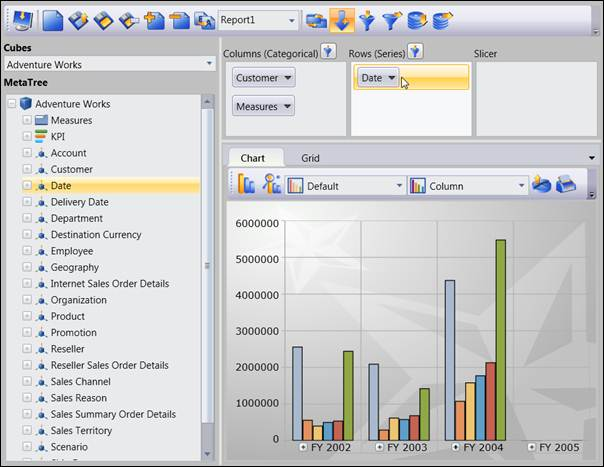
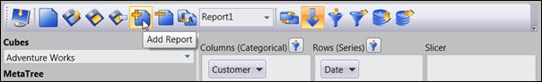
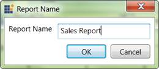
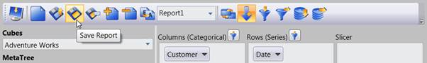
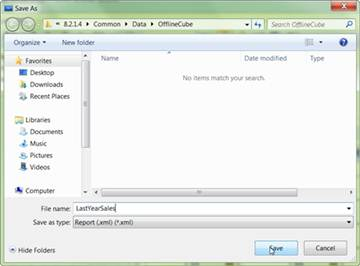
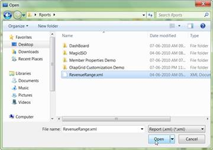

::: {style="DISPLAY: none"}
{#d2h_url_template} {#d2h_package_url style="WIDTH: 0px; DISPLAY: none; HEIGHT: 0px"}
:::

::::: {#nsbanner .d2h_main_nsbanner style="BORDER-BOTTOM: #999999 1px solid; POSITION: relative; PADDING-BOTTOM: 0px; BACKGROUND-COLOR: transparent; PADDING-LEFT: 0px; PADDING-RIGHT: 0px; DISPLAY: none; BORDER-TOP: #999999 1px solid; PADDING-TOP: 0px; LEFT: 0px"}
:::: {#TitleRow .d2h_main_titlerow style="PADDING-BOTTOM: 4px; BACKGROUND-COLOR: transparent; PADDING-LEFT: 22px; WIDTH: 100%; PADDING-RIGHT: 10px; DISPLAY: none; PADDING-TOP: 4px"}
::: {#ienav .d2h_main_ienav style="DISPLAY: none"}
{#D2HPrevious .D2HPreviousEnabled}  {#D2HNext .D2HNextEnabled}
:::
::::
:::::

:::: {#nstext .d2h_main_nstext style="PADDING-BOTTOM: 10px; BACKGROUND-COLOR: transparent; PADDING-LEFT: 22px; PADDING-RIGHT: 10px; HEIGHT: 100%; OVERFLOW: auto; PADDING-TOP: 5px" hasuserbackground="true" valign="bottom"}
::: {#d2h_breadcrumbs .d2h_breadcrumbs}
[Essential Studio User Guide Documentation](ms-xhelp:///?Id=12457748-09e3-4d74-a240-8e049cedf030){.d2h_breadcrumbsNormal} [ \> ]{.d2h_breadcrumbsLinkSeparator} [Business Intelligence Edition](ms-xhelp:///?Id=fdf33dd8-62b2-47b9-ad7b-fc50e590bca5){.d2h_breadcrumbsNormal} [ \> ]{.d2h_breadcrumbsLinkSeparator} [Essential BI WPF](ms-xhelp:///?Id=41e3d586-d922-4a01-8272-679fe4ae7343){.d2h_breadcrumbsNormal} [ \> ]{.d2h_breadcrumbsLinkSeparator} [Essential BI Client]{.d2h_breadcrumbsContentsOnly} [ \> ]{.d2h_breadcrumbsLinkSeparator} [Concepts and Features](ms-xhelp:///?Id=ac4d4da8-25e2-4317-98b8-e507a1eb5062){.d2h_breadcrumbsNormal} [ \> ]{.d2h_breadcrumbsLinkSeparator} [Creating and Storing OLAP Report](ms-xhelp:///?Id=fd95fa81-973d-4140-9949-dafeffb2a3b2){.d2h_breadcrumbsNormal}
:::

### Steps to create a report: {#steps-to-create-a-report style="tab-stops: 0pt"}

 

To create a report:

[·      ]{style="FONT-FAMILY: Symbol"}First the client should connect to a Data source, a server or an Offline cube.

[·      ]{style="FONT-FAMILY: Symbol"}Select the elements from the Cube Dimension Browser and drag and dropping them in the required axis. The report will be created.

[·      ]{style="FONT-FAMILY: Symbol"}You can drag and drop any number of elements in any axis.

[·      ]{style="FONT-FAMILY: Symbol"}Once you finish the drag and drop of elements, you can store the current report.

[o  ]{style="FONT-FAMILY: 'Courier New'"}To add a report, click **Add report** and provide a name for the new report.

[·      ]{style="FONT-FAMILY: Symbol"}You can also add another report to the current report set and add the elements to a newly created report. You can add any number of reports to the current report set.

[·      ]{style="FONT-FAMILY: Symbol"}Once you finish creating all the reports you can store the current report set as an XML file or to a Stream:

[o  ]{style="FONT-FAMILY: 'Courier New'"}To save the report set as an XML file, click Save and provide the name for the XML file.

[o  ]{style="FONT-FAMILY: 'Courier New'"}To store the report set in stream, use the GetReportStream() method and get the report as stream and then store it in anywhere.

[]{style="FONT-FAMILY: 'Trebuchet MS','sans-serif'; COLOR: #15428b; FONT-SIZE: 9pt"} 

{border="0"}

Figure 44: Drag and Dropping Elements from Cube Dimension Browser to Axis

[]{style="FONT-FAMILY: 'Calibri','sans-serif'"} 

{border="0"}

Figure 45: Adding a new Report to current Report Set

[]{style="FONT-FAMILY: 'Calibri','sans-serif'"} 

{border="0"}

Figure 46: Entering the name for New Report

[]{style="FONT-FAMILY: 'Calibri','sans-serif'"} 

{border="0"}

Figure 47: To save the created Report set as xml file

[]{style="FONT-FAMILY: 'Calibri','sans-serif'"} 

{border="0"}

Figure 48: Saving the Report set as xml file by giving the name of the file

 

You can also load the saved report set by using the load option.

 

{border="0"}

Figure 49: To load the existing report set (xml file)

 

{border="0"}

Figure 50: Loading the Reports from saved xml file

[]{#related-topics}
::::
