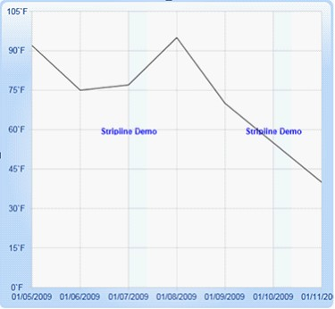

::: {style="DISPLAY: none"}
{#d2h_url_template}{#d2h_package_url style="WIDTH: 0px; DISPLAY: none; HEIGHT: 0px"}
:::

:::: {.d2h_secondary_topic style="PADDING-BOTTOM: 10pt; MARGIN: 0pt; PADDING-LEFT: 0pt; PADDING-RIGHT: 0pt; PADDING-TOP: 0pt"}
#### Striplines For Chart {#striplines-for-chart style="tab-stops: 0pt"}

You can add Striplines (horizontal and vertical) to areas within the plot.

You can also optionally repeat these Striplines at specific intervals.

Set IsSegmented property to True to create segmented strip lines.

List of Property      

The following table contains the Property details.

**[]{style="COLOR: #15428b"}** 

::: {align="center"}
  ---------------------- ------------------------------------------------------------------------------------------ --------------------------------- ------------------
  Name of the Property   Description                                                                                Type of the Property              Value It Accepts
  StripLines             Store all the Striplines object                                                            Store all the Striplines object   Brushes
  Interior               Sets the color of Strip line                                                               Dependency Property                
  RepeatEvery            Specifies the frequencies of Striplines are repeated                                       Dependency Property               Double
  RepeatUntil            Specifies where the Striplines is repeated.                                                Dependency Property               Double
  StartFromAxis          Specify Striplines starts from the beginning of the axis.                                  Dependency Property               Bool
  Offset                 You can add an Offset to that starting location, when StartFromAxis is set to true.        Dependency Property               Double
  Start                  Specifies where the Stripline starts when StartFromAxis is false.                          Dependency Property               Double
  IsSegmented             Enable/Disable segmented Stripline feature.                                               Dependency Property               Bool
  SegmentStartValue      Initializes the segment start value for Stripline                                          Dependency Property               Bool
  SegmentEndValue        Initializes the segment end value for Stripline.                                           Dependency Property               Bool
  ContentHeight          Initialize the Stripline content height.                                                   Dependency Property               Double
  ContentWidth           Initialize the Stripline content width.                                                    Dependency Property               Double
  ContentVisibility      Determine the visibility of Stripline content.                                             Dependency Property               Visibility
  Content                Specify the content is needed to display on Stripline.  It may be any Framework Element.   Dependency Property               Object
  ---------------------- ------------------------------------------------------------------------------------------ --------------------------------- ------------------
:::

**[]{style="COLOR: #15428b"}** 

**[]{style="COLOR: #15428b"}** 

Adding Striplines

The following code illustrates how to add Striplines (horizontal and vertical) to areas within the plot.

[]{style="COLOR: #15428b"} 

+--------------------------------------------------------------------------------------------------------------------------------------------------------------------------------------------------------------------------------------------------------------------------------------------------------------------------------------------------------------------------------------------------------------------------------------------------------------------------------------------------------------------------------------------------------------------------------------------------------------------------------------------------------+
| [\[Xaml\]]{style="FONT-FAMILY: 'Courier New'"}                                                                                                                                                                                                                                                                                                                                                                                                                                                                                                                                                                                                         |
|                                                                                                                                                                                                                                                                                                                                                                                                                                                                                                                                                                                                                                                        |
| **[]{style="FONT-FAMILY: 'Courier New'"}**                                                                                                                                                                                                                                                                                                                                                                                                                                                                                                                                                                                                             |
|                                                                                                                                                                                                                                                                                                                                                                                                                                                                                                                                                                                                                                                        |
| [\<]{style="FONT-FAMILY: 'Courier New'; COLOR: blue"}[syncfusion]{style="FONT-FAMILY: 'Courier New'; COLOR: #a31515"}[:]{style="FONT-FAMILY: 'Courier New'; COLOR: blue"}[ChartArea.PrimaryAxis]{style="FONT-FAMILY: 'Courier New'; COLOR: #a31515"}[\>]{style="FONT-FAMILY: 'Courier New'; COLOR: blue"}                                                                                                                                                                                                                                                                                                                                              |
|                                                                                                                                                                                                                                                                                                                                                                                                                                                                                                                                                                                                                                                        |
| [                                   ]{style="FONT-FAMILY: 'Courier New'; COLOR: #a31515"}[\<]{style="FONT-FAMILY: 'Courier New'; COLOR: blue"}[syncfusion]{style="FONT-FAMILY: 'Courier New'; COLOR: #a31515"}[:]{style="FONT-FAMILY: 'Courier New'; COLOR: blue"}[ChartAxis]{style="FONT-FAMILY: 'Courier New'; COLOR: #a31515"}[ ValueType]{style="FONT-FAMILY: 'Courier New'; COLOR: red"}[=\"DateTime\"]{style="FONT-FAMILY: 'Courier New'; COLOR: blue"}[ IsAutoSetRange]{style="FONT-FAMILY: 'Courier New'; COLOR: red"}[=\"True\"\>]{style="FONT-FAMILY: 'Courier New'; COLOR: blue"}                                                           |
|                                                                                                                                                                                                                                                                                                                                                                                                                                                                                                                                                                                                                                                        |
| [                                         ]{style="FONT-FAMILY: 'Courier New'; COLOR: #a31515"}[\<]{style="FONT-FAMILY: 'Courier New'; COLOR: blue"}[syncfusion]{style="FONT-FAMILY: 'Courier New'; COLOR: #a31515"}[:]{style="FONT-FAMILY: 'Courier New'; COLOR: blue"}[ChartAxis.StripLines]{style="FONT-FAMILY: 'Courier New'; COLOR: #a31515"}[\>]{style="FONT-FAMILY: 'Courier New'; COLOR: blue"}                                                                                                                                                                                                                                                |
|                                                                                                                                                                                                                                                                                                                                                                                                                                                                                                                                                                                                                                                        |
| [                                               ]{style="FONT-FAMILY: 'Courier New'; COLOR: #a31515"}[\<]{style="FONT-FAMILY: 'Courier New'; COLOR: blue"}[syncfusion]{style="FONT-FAMILY: 'Courier New'; COLOR: #a31515"}[:]{style="FONT-FAMILY: 'Courier New'; COLOR: blue"}[ChartStripLine]{style="FONT-FAMILY: 'Courier New'; COLOR: #a31515"}[ StartFromAxis]{style="FONT-FAMILY: 'Courier New'; COLOR: red"}[=\"True\"]{style="FONT-FAMILY: 'Courier New'; COLOR: blue"}[ Offset]{style="FONT-FAMILY: 'Courier New'; COLOR: red"}[=\"2\"]{style="FONT-FAMILY: 'Courier New'; COLOR: blue"}[    ]{style="FONT-FAMILY: 'Courier New'; COLOR: red"} |
|                                                                                                                                                                                                                                                                                                                                                                                                                                                                                                                                                                                                                                                        |
| [                             RepeatEvery]{style="FONT-FAMILY: 'Courier New'; COLOR: red"}[=\"3\"]{style="FONT-FAMILY: 'Courier New'; COLOR: blue"}[ Interior]{style="FONT-FAMILY: 'Courier New'; COLOR: red"}[=\"AliceBlue\"]{style="FONT-FAMILY: 'Courier New'; COLOR: blue"}[ Content]{style="FONT-FAMILY: 'Courier New'; COLOR: red"}[=\"Stripline Demo\"]{style="FONT-FAMILY: 'Courier New'; COLOR: blue"}[ ]{style="FONT-FAMILY: 'Courier New'; COLOR: red"}                                                                                                                                                                                     |
|                                                                                                                                                                                                                                                                                                                                                                                                                                                                                                                                                                                                                                                        |
| [ ContentWidth=]{style="FONT-FAMILY: 'Courier New'; COLOR: red"}[\"40\"]{style="FONT-FAMILY: 'Courier New'; COLOR: blue"}[ Width]{style="FONT-FAMILY: 'Courier New'; COLOR: red"}[=\"30\"/\>]{style="FONT-FAMILY: 'Courier New'; COLOR: blue"}                                                                                                                                                                                                                                                                                                                                                                                                         |
|                                                                                                                                                                                                                                                                                                                                                                                                                                                                                                                                                                                                                                                        |
| [                                         ]{style="FONT-FAMILY: 'Courier New'; COLOR: #a31515"}[\</]{style="FONT-FAMILY: 'Courier New'; COLOR: blue"}[syncfusion]{style="FONT-FAMILY: 'Courier New'; COLOR: #a31515"}[:]{style="FONT-FAMILY: 'Courier New'; COLOR: blue"}[ChartAxis.StripLines]{style="FONT-FAMILY: 'Courier New'; COLOR: #a31515"}[\>]{style="FONT-FAMILY: 'Courier New'; COLOR: blue"}[                               ]{style="FONT-FAMILY: 'Courier New'; COLOR: #a31515"}                                                                                                                                                          |
|                                                                                                                                                                                                                                                                                                                                                                                                                                                                                                                                                                                                                                                        |
| [                                   ]{style="FONT-FAMILY: 'Courier New'; COLOR: #a31515"}[\</]{style="FONT-FAMILY: 'Courier New'; COLOR: blue"}[syncfusion]{style="FONT-FAMILY: 'Courier New'; COLOR: #a31515"}[:]{style="FONT-FAMILY: 'Courier New'; COLOR: blue"}[ChartAxis]{style="FONT-FAMILY: 'Courier New'; COLOR: #a31515"}[\>]{style="FONT-FAMILY: 'Courier New'; COLOR: blue"}                                                                                                                                                                                                                                                                |
|                                                                                                                                                                                                                                                                                                                                                                                                                                                                                                                                                                                                                                                        |
| [                       ]{style="FONT-FAMILY: 'Courier New'; COLOR: #a31515"}[\</]{style="FONT-FAMILY: 'Courier New'; COLOR: blue"}[syncfusion]{style="FONT-FAMILY: 'Courier New'; COLOR: #a31515"}[:]{style="FONT-FAMILY: 'Courier New'; COLOR: blue"}[ChartArea.PrimaryAxis]{style="FONT-FAMILY: 'Courier New'; COLOR: #a31515"}[\>]{style="FONT-FAMILY: 'Courier New'; COLOR: blue"}                                                                                                                                                                                                                                                                |
+--------------------------------------------------------------------------------------------------------------------------------------------------------------------------------------------------------------------------------------------------------------------------------------------------------------------------------------------------------------------------------------------------------------------------------------------------------------------------------------------------------------------------------------------------------------------------------------------------------------------------------------------------------+

[]{style="FONT-FAMILY: 'Times New Roman','serif'; COLOR: blue"} 

+----------------------------------------------------------------------------------------------------------------------------------------------------------------------------------------------------------------+
| [\[C#\] ]{style="FONT-FAMILY: 'Courier New'"}                                                                                                                                                                  |
|                                                                                                                                                                                                                |
| []{style="FONT-FAMILY: 'Courier New'"}                                                                                                                                                                         |
|                                                                                                                                                                                                                |
| [           [ChartStripLine]{style="COLOR: #2b91af"} cs = [new]{style="COLOR: blue"} [ChartStripLine]{style="COLOR: #2b91af"}();]{style="FONT-FAMILY: 'Courier New'"}                                          |
|                                                                                                                                                                                                                |
| [                 cs.StartFromAxis = [true]{style="COLOR: blue"};]{style="FONT-FAMILY: 'Courier New'"}                                                                                                         |
|                                                                                                                                                                                                                |
| [                 cs.Offset = 2;]{style="FONT-FAMILY: 'Courier New'"}                                                                                                                                          |
|                                                                                                                                                                                                                |
| [                 cs.RepeatEvery = 3;]{style="FONT-FAMILY: 'Courier New'"}                                                                                                                                     |
|                                                                                                                                                                                                                |
| [                 cs.Interior = [new]{style="COLOR: blue"} [SolidColorBrush]{style="COLOR: #2b91af"}([Colors]{style="COLOR: #2b91af"}.[ AliceBlue]{style="COLOR: blue"});]{style="FONT-FAMILY: 'Courier New'"} |
|                                                                                                                                                                                                                |
| [                 cs.Content = [\"StriplineDemo\"]{style="COLOR: #a31515"};]{style="FONT-FAMILY: 'Courier New'"}                                                                                               |
|                                                                                                                                                                                                                |
| [                 cs.ContentWidth=40;]{style="FONT-FAMILY: 'Courier New'"}                                                                                                                                     |
|                                                                                                                                                                                                                |
| [                 cs.Width = 30;]{style="FONT-FAMILY: 'Courier New'"}                                                                                                                                          |
|                                                                                                                                                                                                                |
| [                 [this]{style="COLOR: blue"}.chart1.Areas\[0\].PrimaryAxis.StripLines.Add(cs);]{style="FONT-FAMILY: 'Courier New'"}                                                                           |
+----------------------------------------------------------------------------------------------------------------------------------------------------------------------------------------------------------------+

[]{style="COLOR: #15428b"} 

When the code runs, the following output displays.

[]{style="FONT-FAMILY: 'Times New Roman','serif'; FONT-SIZE: 12pt"} 

{border="0"}

Figure 105: Striplines

[]{#related-topics}
::::
