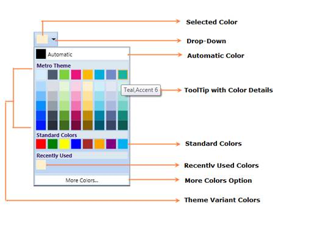

::: {style="DISPLAY: none"}
{#d2h_url_template}{#d2h_package_url style="WIDTH: 0px; DISPLAY: none; HEIGHT: 0px"}
:::

::::: {#nsbanner .d2h_main_nsbanner style="BORDER-BOTTOM: #999999 1px solid; POSITION: relative; PADDING-BOTTOM: 0px; BACKGROUND-COLOR: transparent; PADDING-LEFT: 0px; PADDING-RIGHT: 0px; DISPLAY: none; BORDER-TOP: #999999 1px solid; PADDING-TOP: 0px; LEFT: 0px"}
:::: {#TitleRow .d2h_main_titlerow style="PADDING-BOTTOM: 4px; BACKGROUND-COLOR: transparent; PADDING-LEFT: 22px; WIDTH: 100%; PADDING-RIGHT: 10px; DISPLAY: none; PADDING-TOP: 4px"}
::: {#ienav .d2h_main_ienav style="DISPLAY: none"}
{#D2HPrevious .D2HPreviousEnabled}  {#D2HNext .D2HNextEnabled}
:::
::::
:::::

:::: {#nstext .d2h_main_nstext style="PADDING-BOTTOM: 10px; BACKGROUND-COLOR: transparent; PADDING-LEFT: 22px; PADDING-RIGHT: 10px; HEIGHT: 100%; OVERFLOW: auto; PADDING-TOP: 5px" hasuserbackground="true" valign="bottom"}
::: {#d2h_breadcrumbs .d2h_breadcrumbs}
[Essential Studio User Guide Documentation](ms-xhelp:///?Id=12457748-09e3-4d74-a240-8e049cedf030){.d2h_breadcrumbsNormal}[ \> ]{.d2h_breadcrumbsLinkSeparator}[User Interface Edition](ms-xhelp:///?Id=c29296b7-531c-413b-a0ec-488ca1f7f669){.d2h_breadcrumbsNormal}[ \> ]{.d2h_breadcrumbsLinkSeparator}[Essential WPF](ms-xhelp:///?Id=7f4f82c5-151c-4262-94d0-75c4626c77bc){.d2h_breadcrumbsNormal}[ \> ]{.d2h_breadcrumbsLinkSeparator}[Essential Tools]{.d2h_breadcrumbsContentsOnly}[ \> ]{.d2h_breadcrumbsLinkSeparator}[Tools WPF Controls](ms-xhelp:///?Id=2ea58a12-9426-4a63-96b4-89eb80232c2c){.d2h_breadcrumbsNormal}[ \> ]{.d2h_breadcrumbsLinkSeparator}[ColorPickerPalette Control](ms-xhelp:///?Id=37559eb2-47d4-4a08-80de-268f49344cc3){.d2h_breadcrumbsNormal}
:::

### Structure of the ColorPickerPaletteControl {#structure-of-the-colorpickerpalettecontrol style="tab-stops: 0pt"}

The various elements of the ColorPickerPalette are illustrated in the following screen shot.

 

{border="0"}

Figure 187: ColorPickerPalette Sample

 

[·      ]{style="FONT-FAMILY: Symbol"}The **Selected Color** represents the color that you select.

[·      ]{style="FONT-FAMILY: Symbol"}The **Drop-Down** represents a button, ColorPickerPalette window will open when you click on it.

[·      ]{style="FONT-FAMILY: Symbol"}The **Automatic Color** represents the Color, which can be set by you.

[·      ]{style="FONT-FAMILY: Symbol"}The **ToolTip with Color Details** represents the ToolTip, when the mouse hovers on the Color.

[·      ]{style="FONT-FAMILY: Symbol"}The **Standard Colors** stores the standard colors like Red, Green, Blue and so on.

[·      ]{style="FONT-FAMILY: Symbol"}The **Recently User Colors** stores the Colors, that are recently selected.

[·      ]{style="FONT-FAMILY: Symbol"}The **More Colors Option** provides wide range of color in addition to colors in the palette.

[·      ]{style="FONT-FAMILY: Symbol"}The **Theme Variant Colors** represents the Theme colors with variant.

[]{style="FONT-FAMILY: 'Trebuchet MS','sans-serif'; COLOR: #4f6228; FONT-SIZE: 9pt"} 

[]{#related-topics}
::::
