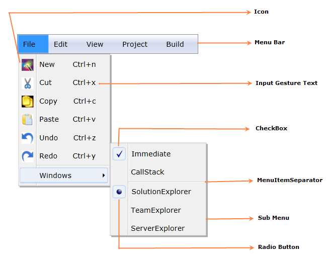

::: {style="DISPLAY: none"}
{#d2h_url_template}{#d2h_package_url style="WIDTH: 0px; DISPLAY: none; HEIGHT: 0px"}
:::

::: {.d2h_secondary_topic style="PADDING-BOTTOM: 10pt; MARGIN: 0pt; PADDING-LEFT: 0pt; PADDING-RIGHT: 0pt; PADDING-TOP: 0pt"}
#### Structure of the MenuAdv Control {#structure-of-the-menuadv-control style="tab-stops: 0pt"}

 

[{border="0"}]{style="COLOR: red"}

Figure 707: MenuAdv Control Structure

 

[]{#related-topics}
:::
