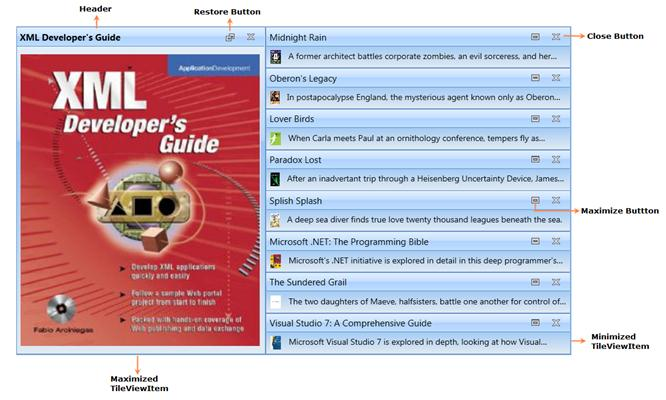

::: {style="DISPLAY: none"}
{#d2h_url_template}{#d2h_package_url style="WIDTH: 0px; DISPLAY: none; HEIGHT: 0px"}
:::

::: {.d2h_secondary_topic style="PADDING-BOTTOM: 10pt; MARGIN: 0pt; PADDING-LEFT: 0pt; PADDING-RIGHT: 0pt; PADDING-TOP: 0pt"}
#### Structure of the TileViewControl {#structure-of-the-tileviewcontrol style="tab-stops: 0pt"}

 

{border="0"}

Figure 1057: Structure of TileViewControl

[]{#related-topics}
:::
