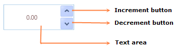

::: {style="DISPLAY: none"}
{#d2h_url_template}{#d2h_package_url style="WIDTH: 0px; DISPLAY: none; HEIGHT: 0px"}
:::

::::: {#nsbanner .d2h_main_nsbanner style="BORDER-BOTTOM: #999999 1px solid; POSITION: relative; PADDING-BOTTOM: 0px; BACKGROUND-COLOR: transparent; PADDING-LEFT: 0px; PADDING-RIGHT: 0px; DISPLAY: none; BORDER-TOP: #999999 1px solid; PADDING-TOP: 0px; LEFT: 0px"}
:::: {#TitleRow .d2h_main_titlerow style="PADDING-BOTTOM: 4px; BACKGROUND-COLOR: transparent; PADDING-LEFT: 22px; WIDTH: 100%; PADDING-RIGHT: 10px; DISPLAY: none; PADDING-TOP: 4px"}
::: {#ienav .d2h_main_ienav style="DISPLAY: none"}
{#D2HPrevious .D2HPreviousEnabled}  {#D2HNext .D2HNextEnabled}
:::
::::
:::::

:::: {#nstext .d2h_main_nstext style="PADDING-BOTTOM: 10px; BACKGROUND-COLOR: transparent; PADDING-LEFT: 22px; PADDING-RIGHT: 10px; HEIGHT: 100%; OVERFLOW: auto; PADDING-TOP: 5px" hasuserbackground="true" valign="bottom"}
::: {#d2h_breadcrumbs .d2h_breadcrumbs}
[Essential Studio User Guide Documentation](ms-xhelp:///?Id=12457748-09e3-4d74-a240-8e049cedf030){.d2h_breadcrumbsNormal}[ \> ]{.d2h_breadcrumbsLinkSeparator}[User Interface Edition](ms-xhelp:///?Id=c29296b7-531c-413b-a0ec-488ca1f7f669){.d2h_breadcrumbsNormal}[ \> ]{.d2h_breadcrumbsLinkSeparator}[Essential WPF](ms-xhelp:///?Id=7f4f82c5-151c-4262-94d0-75c4626c77bc){.d2h_breadcrumbsNormal}[ \> ]{.d2h_breadcrumbsLinkSeparator}[Essential Tools]{.d2h_breadcrumbsContentsOnly}[ \> ]{.d2h_breadcrumbsLinkSeparator}[Tools WPF Controls](ms-xhelp:///?Id=2ea58a12-9426-4a63-96b4-89eb80232c2c){.d2h_breadcrumbsNormal}[ \> ]{.d2h_breadcrumbsLinkSeparator}[UpDown Control](ms-xhelp:///?Id=b7d3cd53-0015-4806-823a-de2c17400db2){.d2h_breadcrumbsNormal}
:::

### Structure of the UpDown Control {#structure-of-the-updown-control style="tab-stops: 0pt"}

{border="0"}[]{style="COLOR: #c00000"}

Figure 1150: Structure of the UpDown Control

The following are the elements of the UpDown control:

[·      ]{style="FONT-FAMILY: Symbol"}Text area - It is the area in which the numeric values are displayed. You can edit the value of the UpDown control if the AllowEdit property is set to true.

[·      ]{style="FONT-FAMILY: Symbol"}Increment button - It is a repeat button, which can be clicked to increment the current value of the UpDown control.

[·      ]{style="FONT-FAMILY: Symbol"}Decrement button - It is a repeat button, which can be clicked to decrement the current value of the UpDown control.

Sample Link

To access a sample:

Navigate to **Start** -\> **All** **Programs** -\> **Syncfusion** -\> **Essential Studio** -\> **Dashboard**.

Click the **WPF** drop-down list, and then select **Run Locally Installed Samples**.

In the sample browser, expand the **Editor Controls** treeview item, and then select **Up-DownText Box Demo**.

 

[]{#related-topics}
::::
