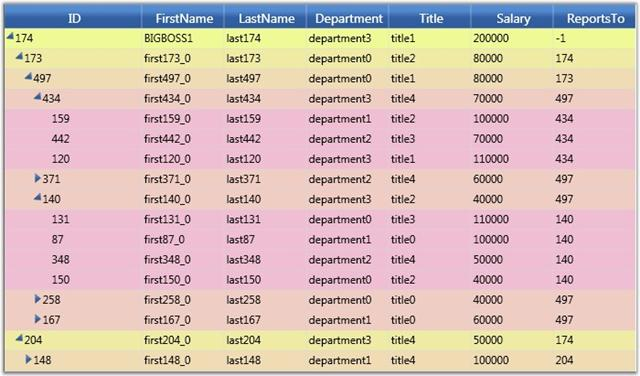

::: {style="DISPLAY: none"}
{#d2h_url_template}{#d2h_package_url style="WIDTH: 0px; DISPLAY: none; HEIGHT: 0px"}
:::

::: {.d2h_secondary_topic style="PADDING-BOTTOM: 10pt; MARGIN: 0pt; PADDING-LEFT: 0pt; PADDING-RIGHT: 0pt; PADDING-TOP: 0pt"}
#### Style Object {#style-object style="tab-stops: 0pt"}

In addition to the GridTreeControl.VisualStyle property, there is a GridTreeControl.LevelStyles collection that enables you to specify a GridStyleInfo object to customize the appearance of all the cells at a particular level.

 

The following code example illustrates how to apply LevelStyles to the Grid Tree.

 

+-------------------------------------------------------------------------------------------------------------------------------------------------------------------------------------------------+
| [\[C#\]]{style="FONT-FAMILY: 'Courier New'; COLOR: black"}                                                                                                                                      |
|                                                                                                                                                                                                 |
| **[]{style="FONT-FAMILY: 'Courier New'; COLOR: green"}**                                                                                                                                        |
|                                                                                                                                                                                                 |
| [// Set some miscellaneous level colors so they are easily seen (just set up to 6 levels\...).]{style="FONT-FAMILY: 'Courier New'; COLOR: green"}                                               |
|                                                                                                                                                                                                 |
| [byte]{style="FONT-FAMILY: 'Courier New'; COLOR: blue"}[ k = 150;]{style="FONT-FAMILY: 'Courier New'"}                                                                                          |
|                                                                                                                                                                                                 |
| [byte]{style="FONT-FAMILY: 'Courier New'; COLOR: blue"}[ k1 = 250;]{style="FONT-FAMILY: 'Courier New'"}                                                                                         |
|                                                                                                                                                                                                 |
| [for]{style="FONT-FAMILY: 'Courier New'; COLOR: blue"}[ ([int]{style="COLOR: blue"} i = -1; i \< 7; ++i)]{style="FONT-FAMILY: 'Courier New'"}                                                   |
|                                                                                                                                                                                                 |
| [{]{style="FONT-FAMILY: 'Courier New'"}                                                                                                                                                         |
|                                                                                                                                                                                                 |
| [      [GridStyleInfo]{style="COLOR: #2b91af"} style = [new]{style="COLOR: blue"} [GridStyleInfo]{style="COLOR: #2b91af"}();]{style="FONT-FAMILY: 'Courier New'"}                               |
|                                                                                                                                                                                                 |
| [      style.Background = [new]{style="COLOR: blue"} [SolidColorBrush]{style="COLOR: #2b91af"}([Color]{style="COLOR: #2b91af"}.FromArgb(255, 239, k1, k));]{style="FONT-FAMILY: 'Courier New'"} |
|                                                                                                                                                                                                 |
| [      gridTreeControl1.LevelStyles.Add(style);]{style="FONT-FAMILY: 'Courier New'"}                                                                                                            |
|                                                                                                                                                                                                 |
| [      k += 15;]{style="FONT-FAMILY: 'Courier New'"}                                                                                                                                            |
|                                                                                                                                                                                                 |
| [      k1 -= 15;]{style="FONT-FAMILY: 'Courier New'"}                                                                                                                                           |
|                                                                                                                                                                                                 |
| [}]{style="FONT-FAMILY: 'Courier New'"}                                                                                                                                                         |
+-------------------------------------------------------------------------------------------------------------------------------------------------------------------------------------------------+

 

The following screen shot shows the back color set on a level-by-level basis, with the header cells styles set by using the VisualStyle property.

 

{border="0"}

Figure 259: Level Styles

 

Grid cell background is customized on a level-by-level basis.

 

[]{#related-topics}
:::
