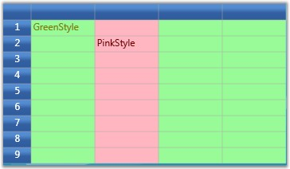
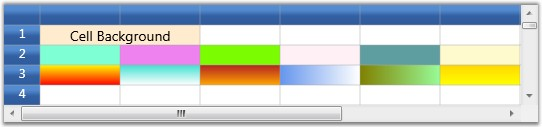
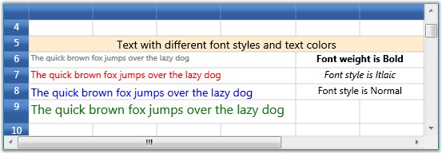
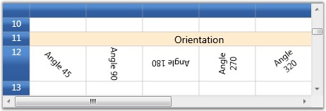
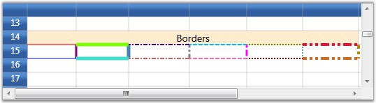
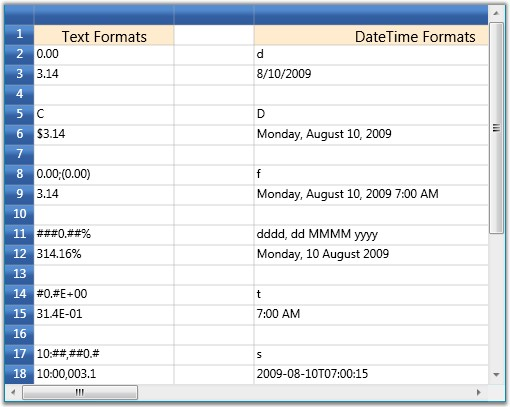

::: {style="DISPLAY: none"}
{#d2h_url_template}{#d2h_package_url style="WIDTH: 0px; DISPLAY: none; HEIGHT: 0px"}
:::

::::::: {.d2h_secondary_topic style="PADDING-BOTTOM: 10pt; MARGIN: 0pt; PADDING-LEFT: 0pt; PADDING-RIGHT: 0pt; PADDING-TOP: 0pt"}
##### Style Properties {#style-properties style="tab-stops: 0pt"}

[]{style="FONT-FAMILY: 'Trebuchet MS','sans-serif'; COLOR: #15428b; FONT-SIZE: 9pt"} 

Property settings for individual/groups of cells are stored in a GridStyleInfo property. The style allows you to set properties such as background, cell value, and cell type for a particular cell.

 

Essential Grid for WPF holds two different style caches that depend upon how the cell style is being used:

[]{style="FONT-FAMILY: 'Trebuchet MS','sans-serif'; COLOR: #15428b; FONT-SIZE: 9pt"} 

[·      ]{style="FONT-FAMILY: Symbol"}Volatile style-cache-Is maintained for styles populated through calls made to the QueryCellInfo (the virtual grid event that provides the cell values to the grid on demand) event. This volatile style-cache uses weak references to interact with the .NET Framework\'s Garbage collection to ensure optimal memory use. These styles remain cached as long as they are not garbage collected by the framework.

[·      ]{style="FONT-FAMILY: Symbol"}Render style-cache-Is maintained for styles needed to draw the grid and are disposed of as soon as the cell scrolls out of view.\
\

The combination of these two caches makes Essential Grid for WPF highly efficient. This section elaborates on important style properties.

**[]{style="FONT-FAMILY: 'Trebuchet MS','sans-serif'; COLOR: #15428b"}** 

Base Styles

**[]{style="FONT-FAMILY: 'Trebuchet MS','sans-serif'; COLOR: #15428b; FONT-SIZE: 9pt"}** 

Base Styles, otherwise named as Parent Styles, define the style information for individual cell groups such that all the cells belonging to a group will share the same Base style. On changing the common base style, the dependent cells styles also get updated automatically.

 

The following code snippet illustrates the effect of various Base styles:

[]{style="FONT-FAMILY: 'Trebuchet MS','sans-serif'; COLOR: #15428b; FONT-SIZE: 9pt"} 

+------------------------------------------------------------------------------------------------------------------------------------------------------------------------------------------------------------------------------+
| **[\[C#\]]{style="FONT-FAMILY: 'Courier New'; COLOR: black"}**                                                                                                                                                               |
|                                                                                                                                                                                                                              |
| []{style="FONT-FAMILY: 'Courier New'; FONT-SIZE: 9pt"}                                                                                                                                                                       |
|                                                                                                                                                                                                                              |
| [//Defines the base styles named PinkStyle and GreenStyle.]{style="FONT-FAMILY: 'Courier New'; COLOR: green; FONT-SIZE: 9pt"}                                                                                                |
|                                                                                                                                                                                                                              |
| [GridBaseStyle]{style="FONT-FAMILY: 'Courier New'; COLOR: #2b91af; FONT-SIZE: 9pt"}[ baseStyle1 = [new]{style="COLOR: blue"} [GridBaseStyle]{style="COLOR: #2b91af"}();]{style="FONT-FAMILY: 'Courier New'; FONT-SIZE: 9pt"} |
|                                                                                                                                                                                                                              |
| [baseStyle1.Name = [\"PinkStyle\"]{style="COLOR: #a31515"};]{style="FONT-FAMILY: 'Courier New'; FONT-SIZE: 9pt"}                                                                                                             |
|                                                                                                                                                                                                                              |
| [baseStyle1.StyleInfo.Background = [Brushes]{style="COLOR: #2b91af"}.LightPink;]{style="FONT-FAMILY: 'Courier New'; FONT-SIZE: 9pt"}                                                                                         |
|                                                                                                                                                                                                                              |
| [baseStyle1.StyleInfo.Foreground = [Brushes]{style="COLOR: #2b91af"}.Maroon;]{style="FONT-FAMILY: 'Courier New'; FONT-SIZE: 9pt"}                                                                                            |
|                                                                                                                                                                                                                              |
| []{style="FONT-FAMILY: 'Courier New'; FONT-SIZE: 9pt"}                                                                                                                                                                       |
|                                                                                                                                                                                                                              |
| [GridBaseStyle]{style="FONT-FAMILY: 'Courier New'; COLOR: #2b91af; FONT-SIZE: 9pt"}[ baseStyle2 = [new]{style="COLOR: blue"} [GridBaseStyle]{style="COLOR: #2b91af"}();]{style="FONT-FAMILY: 'Courier New'; FONT-SIZE: 9pt"} |
|                                                                                                                                                                                                                              |
| [baseStyle2.Name = [\"GreenStyle\"]{style="COLOR: #a31515"};]{style="FONT-FAMILY: 'Courier New'; FONT-SIZE: 9pt"}                                                                                                            |
|                                                                                                                                                                                                                              |
| [baseStyle2.StyleInfo.Background = [Brushes]{style="COLOR: #2b91af"}.PaleGreen;]{style="FONT-FAMILY: 'Courier New'; FONT-SIZE: 9pt"}                                                                                         |
|                                                                                                                                                                                                                              |
| [baseStyle2.StyleInfo.Foreground = [Brushes]{style="COLOR: #2b91af"}.Olive;]{style="FONT-FAMILY: 'Courier New'; FONT-SIZE: 9pt"}                                                                                             |
|                                                                                                                                                                                                                              |
| []{style="FONT-FAMILY: 'Courier New'; FONT-SIZE: 9pt"}                                                                                                                                                                       |
|                                                                                                                                                                                                                              |
| [//Add the above styles to the grid base styles collection.]{style="FONT-FAMILY: 'Courier New'; COLOR: green; FONT-SIZE: 9pt"}                                                                                               |
|                                                                                                                                                                                                                              |
| [grid.Model.BaseStylesMap.Add(baseStyle1);]{style="FONT-FAMILY: 'Courier New'; FONT-SIZE: 9pt"}                                                                                                                              |
|                                                                                                                                                                                                                              |
| [grid.Model.BaseStylesMap.Add(baseStyle2);]{style="FONT-FAMILY: 'Courier New'; FONT-SIZE: 9pt"}                                                                                                                              |
|                                                                                                                                                                                                                              |
| []{style="FONT-FAMILY: 'Courier New'; FONT-SIZE: 9pt"}                                                                                                                                                                       |
|                                                                                                                                                                                                                              |
| [//Applying base styles.]{style="FONT-FAMILY: 'Courier New'; COLOR: green; FONT-SIZE: 9pt"}                                                                                                                                  |
|                                                                                                                                                                                                                              |
| [for]{style="FONT-FAMILY: 'Courier New'; COLOR: blue; FONT-SIZE: 9pt"}[ ([int]{style="COLOR: blue"} i = 1; i \<= grid.Model.RowCount; i++)]{style="FONT-FAMILY: 'Courier New'; FONT-SIZE: 9pt"}                              |
|                                                                                                                                                                                                                              |
| [{]{style="FONT-FAMILY: 'Courier New'; FONT-SIZE: 9pt"}                                                                                                                                                                      |
|                                                                                                                                                                                                                              |
| [   [for]{style="COLOR: blue"} ([int]{style="COLOR: blue"} j = 1; j \<= grid.Model.ColumnCount; j++)]{style="FONT-FAMILY: 'Courier New'; FONT-SIZE: 9pt"}                                                                    |
|                                                                                                                                                                                                                              |
| [   {]{style="FONT-FAMILY: 'Courier New'; FONT-SIZE: 9pt"}                                                                                                                                                                   |
|                                                                                                                                                                                                                              |
| [        [if]{style="COLOR: blue"}(j ==2)]{style="FONT-FAMILY: 'Courier New'; FONT-SIZE: 9pt"}                                                                                                                               |
|                                                                                                                                                                                                                              |
| [           grid.Model\[i, j\].BaseStyle = [\"PinkStyle\"]{style="COLOR: #a31515"};]{style="FONT-FAMILY: 'Courier New'; FONT-SIZE: 9pt"}                                                                                     |
|                                                                                                                                                                                                                              |
| [        [else]{style="COLOR: blue"}]{style="FONT-FAMILY: 'Courier New'; FONT-SIZE: 9pt"}                                                                                                                                    |
|                                                                                                                                                                                                                              |
| [           grid.Model\[i,j\].BaseStyle = [\"GreenStyle\"]{style="COLOR: #a31515"};]{style="FONT-FAMILY: 'Courier New'; FONT-SIZE: 9pt"}                                                                                     |
|                                                                                                                                                                                                                              |
| [   }]{style="FONT-FAMILY: 'Courier New'; FONT-SIZE: 9pt"}                                                                                                                                                                   |
|                                                                                                                                                                                                                              |
| [}]{style="FONT-FAMILY: 'Courier New'; FONT-SIZE: 9pt"}                                                                                                                                                                      |
+------------------------------------------------------------------------------------------------------------------------------------------------------------------------------------------------------------------------------+

[]{style="FONT-FAMILY: 'Trebuchet MS','sans-serif'; COLOR: #15428b; FONT-SIZE: 9pt"} 

Output

**[]{style="FONT-FAMILY: 'Trebuchet MS','sans-serif'; COLOR: #15428b; FONT-SIZE: 9pt"}** 

The code above displays the following output:

[]{style="FONT-FAMILY: 'Trebuchet MS','sans-serif'; COLOR: #15428b; FONT-SIZE: 9pt"} 

{border="0"}

[]{style="FONT-FAMILY: 'Trebuchet MS','sans-serif'; COLOR: #15428b; FONT-SIZE: 9pt"} 

Figure 39: Base Style

[]{style="FONT-FAMILY: 'Trebuchet MS','sans-serif'; COLOR: #15428b; FONT-SIZE: 9pt"} 

Background

**[]{style="FONT-FAMILY: 'Trebuchet MS','sans-serif'; COLOR: #15428b; FONT-SIZE: 9pt"}** 

The Background property specifies a background brush for the grid cell. The cell's background can be painted with either a solid brush or a gradient brush.

[]{style="FONT-FAMILY: 'Trebuchet MS','sans-serif'; COLOR: #15428b; FONT-SIZE: 9pt"} 

::: {style="BORDER-BOTTOM: windowtext 1pt solid; BORDER-LEFT: medium none; PADDING-BOTTOM: 1pt; MARGIN-TOP: 9pt; PADDING-LEFT: 0pt; PADDING-RIGHT: 0pt; MARGIN-BOTTOM: 9pt; BORDER-TOP: windowtext 1pt solid; BORDER-RIGHT: medium none; PADDING-TOP: 1pt"}
{border="0"}Note:
:::

[·      ]{style="FONT-FAMILY: Symbol"}Gradient-A gradient brush uses two colors. These colors merge to create a transition or fading effect.

[·      ]{style="FONT-FAMILY: Symbol"}Solid-A solid brush is equipped with only one color.

[]{style="FONT-FAMILY: 'Trebuchet MS','sans-serif'; COLOR: #15428b; FONT-SIZE: 9pt"} 

Setting Background Brush Type

**[]{style="FONT-FAMILY: 'Trebuchet MS','sans-serif'; COLOR: #15428b; FONT-SIZE: 9pt"}** 

+---------------------------------------------------------------------------------------------------------------------------------------------------------------------------------------------------------------------------------------------------------+
| **[\[C#\]]{style="FONT-FAMILY: 'Courier New'; COLOR: black"}**                                                                                                                                                                                          |
|                                                                                                                                                                                                                                                         |
| []{style="FONT-FAMILY: 'Courier New'; FONT-SIZE: 9pt"}                                                                                                                                                                                                  |
|                                                                                                                                                                                                                                                         |
| [this]{style="FONT-FAMILY: 'Courier New'; COLOR: blue; FONT-SIZE: 9pt"}[.grid.Model\[2, 1\].Background = Brushes.Aquamarine;]{style="FONT-FAMILY: 'Courier New'; FONT-SIZE: 9pt"}                                                                       |
|                                                                                                                                                                                                                                                         |
| [this]{style="FONT-FAMILY: 'Courier New'; COLOR: blue; FONT-SIZE: 9pt"}[.grid.Model\[2, 2\].Background = Brushes.Violet ;]{style="FONT-FAMILY: 'Courier New'; FONT-SIZE: 9pt"}                                                                          |
|                                                                                                                                                                                                                                                         |
| [this]{style="FONT-FAMILY: 'Courier New'; COLOR: blue; FONT-SIZE: 9pt"}[.grid.Model\[2, 3\].Background = Brushes.LawnGreen;]{style="FONT-FAMILY: 'Courier New'; FONT-SIZE: 9pt"}                                                                        |
|                                                                                                                                                                                                                                                         |
| [this]{style="FONT-FAMILY: 'Courier New'; COLOR: blue; FONT-SIZE: 9pt"}[.grid.Model\[2, 4\].Background = Brushes.LavenderBlush  ;]{style="FONT-FAMILY: 'Courier New'; FONT-SIZE: 9pt"}                                                                  |
|                                                                                                                                                                                                                                                         |
| [this]{style="FONT-FAMILY: 'Courier New'; COLOR: blue; FONT-SIZE: 9pt"}[.grid.Model\[2, 5\].Background = Brushes.CadetBlue ;]{style="FONT-FAMILY: 'Courier New'; FONT-SIZE: 9pt"}                                                                       |
|                                                                                                                                                                                                                                                         |
| [this]{style="FONT-FAMILY: 'Courier New'; COLOR: blue; FONT-SIZE: 9pt"}[.grid.Model\[2, 6\].Background = Brushes.LemonChiffon;]{style="FONT-FAMILY: 'Courier New'; FONT-SIZE: 9pt"}                                                                     |
|                                                                                                                                                                                                                                                         |
| [this]{style="FONT-FAMILY: 'Courier New'; COLOR: blue; FONT-SIZE: 9pt"}[.grid.Model\[3, 1\].Background = GetLinerBrush();]{style="FONT-FAMILY: 'Courier New'; FONT-SIZE: 9pt"}                                                                          |
|                                                                                                                                                                                                                                                         |
| [this]{style="FONT-FAMILY: 'Courier New'; COLOR: blue; FONT-SIZE: 9pt"}[.grid.Model\[3, 2\].Background = [new]{style="COLOR: blue"} LinearGradientBrush(Colors.Turquoise, Colors.White, 90.0);]{style="FONT-FAMILY: 'Courier New'; FONT-SIZE: 9pt"}     |
|                                                                                                                                                                                                                                                         |
| [this]{style="FONT-FAMILY: 'Courier New'; COLOR: blue; FONT-SIZE: 9pt"}[.grid.Model\[3, 3\].Background = [new]{style="COLOR: blue"} LinearGradientBrush(Colors.Firebrick, Colors.Orange, 90.0);]{style="FONT-FAMILY: 'Courier New'; FONT-SIZE: 9pt"}    |
|                                                                                                                                                                                                                                                         |
| [this]{style="FONT-FAMILY: 'Courier New'; COLOR: blue; FONT-SIZE: 9pt"}[.grid.Model\[3, 4\].Background = [new]{style="COLOR: blue"} LinearGradientBrush(Colors.CornflowerBlue, Colors.White, 0.0);]{style="FONT-FAMILY: 'Courier New'; FONT-SIZE: 9pt"} |
|                                                                                                                                                                                                                                                         |
| [this]{style="FONT-FAMILY: 'Courier New'; COLOR: blue; FONT-SIZE: 9pt"}[.grid.Model\[3, 5\].Background = [new]{style="COLOR: blue"} LinearGradientBrush(Colors.Olive, Colors.PaleGreen, 0.0);]{style="FONT-FAMILY: 'Courier New'; FONT-SIZE: 9pt"}      |
|                                                                                                                                                                                                                                                         |
| [this]{style="FONT-FAMILY: 'Courier New'; COLOR: blue; FONT-SIZE: 9pt"}[.grid.Model\[3, 6\].Background = [new]{style="COLOR: blue"} LinearGradientBrush(Colors.Gold, Colors.Yellow, 90.0);]{style="FONT-FAMILY: 'Courier New'; FONT-SIZE: 9pt"}         |
+---------------------------------------------------------------------------------------------------------------------------------------------------------------------------------------------------------------------------------------------------------+

[]{style="FONT-FAMILY: 'Trebuchet MS','sans-serif'; COLOR: #15428b; FONT-SIZE: 9pt"} 

Output

**[]{style="FONT-FAMILY: 'Trebuchet MS','sans-serif'; COLOR: #15428b; FONT-SIZE: 9pt"}** 

The following output is generated using the code above.

[]{style="FONT-FAMILY: 'Trebuchet MS','sans-serif'; COLOR: #15428b; FONT-SIZE: 9pt"} 

{border="0"}

[]{style="FONT-FAMILY: 'Trebuchet MS','sans-serif'; COLOR: #15428b; FONT-SIZE: 9pt"} 

Figure 40: Cell Background

***[]{style="FONT-FAMILY: 'Trebuchet MS','sans-serif'; COLOR: #15428b; FONT-SIZE: 9pt"}*** 

Visual properties

**[]{style="FONT-FAMILY: 'Trebuchet MS','sans-serif'; COLOR: #15428b; FONT-SIZE: 9pt"}** 

The visual aspects of the cell text can be controlled by the following properties:

[]{style="FONT-FAMILY: 'Trebuchet MS','sans-serif'; COLOR: #15428b; FONT-SIZE: 9pt"} 

::: {align="center"}
  --------------- -------------------------------------------------------
  Property Name   Description
  Text            Holds the text to be displayed in the cell
  Foreground      Specifies text color
  Font            Controls the font properties for the text in the cell
  Orientation     Determines the angle of rotation of the text
  --------------- -------------------------------------------------------
:::

[]{style="FONT-FAMILY: 'Trebuchet MS','sans-serif'; COLOR: #15428b; FONT-SIZE: 9pt"} 

1.   Setting Text, Foreground and Font Properties

[]{style="FONT-FAMILY: 'Trebuchet MS','sans-serif'; COLOR: #15428b; FONT-SIZE: 9pt"} 

+------------------------------------------------------------------------------------------------------------------------------------------------------------------------------------------------------------------------------------+
| **[\[C#\]]{style="FONT-FAMILY: 'Courier New'; COLOR: black"}**                                                                                                                                                                     |
|                                                                                                                                                                                                                                    |
| []{style="FONT-FAMILY: 'Courier New'; FONT-SIZE: 9pt"}                                                                                                                                                                             |
|                                                                                                                                                                                                                                    |
| [//Setting text, foreground and fonts]{style="FONT-FAMILY: 'Courier New'; COLOR: green; FONT-SIZE: 9pt"}                                                                                                                           |
|                                                                                                                                                                                                                                    |
| [this]{style="FONT-FAMILY: 'Courier New'; COLOR: blue; FONT-SIZE: 9pt"}[.grid.Model\[6, 1\].Font.FontSize = 10;]{style="FONT-FAMILY: 'Courier New'; FONT-SIZE: 9pt"}                                                               |
|                                                                                                                                                                                                                                    |
| [this]{style="FONT-FAMILY: 'Courier New'; COLOR: blue; FONT-SIZE: 9pt"}[.grid.Model\[6, 1\].Text = [\"The quick brown fox jumps over the lazy dog\"]{style="COLOR: #a31515"};]{style="FONT-FAMILY: 'Courier New'; FONT-SIZE: 9pt"} |
|                                                                                                                                                                                                                                    |
| [this]{style="FONT-FAMILY: 'Courier New'; COLOR: blue; FONT-SIZE: 9pt"}[.grid.Model\[6, 1\].Foreground = Brushes.Gray;]{style="FONT-FAMILY: 'Courier New'; FONT-SIZE: 9pt"}                                                        |
|                                                                                                                                                                                                                                    |
| []{style="FONT-FAMILY: 'Courier New'; FONT-SIZE: 9pt"}                                                                                                                                                                             |
|                                                                                                                                                                                                                                    |
| [this]{style="FONT-FAMILY: 'Courier New'; COLOR: blue; FONT-SIZE: 9pt"}[.grid.Model\[7, 1\].Font.FontSize = 12;]{style="FONT-FAMILY: 'Courier New'; FONT-SIZE: 9pt"}                                                               |
|                                                                                                                                                                                                                                    |
| [this]{style="FONT-FAMILY: 'Courier New'; COLOR: blue; FONT-SIZE: 9pt"}[.grid.Model\[7, 1\].Text = [\"The quick brown fox jumps over the lazy dog\"]{style="COLOR: #a31515"};]{style="FONT-FAMILY: 'Courier New'; FONT-SIZE: 9pt"} |
|                                                                                                                                                                                                                                    |
| [this]{style="FONT-FAMILY: 'Courier New'; COLOR: blue; FONT-SIZE: 9pt"}[.grid.Model\[7, 1\].Foreground = Brushes.Red;]{style="FONT-FAMILY: 'Courier New'; FONT-SIZE: 9pt"}                                                         |
|                                                                                                                                                                                                                                    |
| []{style="FONT-FAMILY: 'Courier New'; FONT-SIZE: 9pt"}                                                                                                                                                                             |
|                                                                                                                                                                                                                                    |
| [this]{style="FONT-FAMILY: 'Courier New'; COLOR: blue; FONT-SIZE: 9pt"}[.grid.Model\[8, 1\].Font.FontSize = 14;]{style="FONT-FAMILY: 'Courier New'; FONT-SIZE: 9pt"}                                                               |
|                                                                                                                                                                                                                                    |
| [this]{style="FONT-FAMILY: 'Courier New'; COLOR: blue; FONT-SIZE: 9pt"}[.grid.Model\[8, 1\].Text = [\"The quick brown fox jumps over the lazy dog\"]{style="COLOR: #a31515"};]{style="FONT-FAMILY: 'Courier New'; FONT-SIZE: 9pt"} |
|                                                                                                                                                                                                                                    |
| [this]{style="FONT-FAMILY: 'Courier New'; COLOR: blue; FONT-SIZE: 9pt"}[.grid.Model\[8, 1\].Foreground = Brushes.Blue;]{style="FONT-FAMILY: 'Courier New'; FONT-SIZE: 9pt"}                                                        |
|                                                                                                                                                                                                                                    |
| []{style="FONT-FAMILY: 'Courier New'; FONT-SIZE: 9pt"}                                                                                                                                                                             |
|                                                                                                                                                                                                                                    |
| [this]{style="FONT-FAMILY: 'Courier New'; COLOR: blue; FONT-SIZE: 9pt"}[.grid.Model\[9, 1\].Font.FontSize = 16;]{style="FONT-FAMILY: 'Courier New'; FONT-SIZE: 9pt"}                                                               |
|                                                                                                                                                                                                                                    |
| [this]{style="FONT-FAMILY: 'Courier New'; COLOR: blue; FONT-SIZE: 9pt"}[.grid.RowHeights\[9\] = 30d;]{style="FONT-FAMILY: 'Courier New'; FONT-SIZE: 9pt"}                                                                          |
|                                                                                                                                                                                                                                    |
| [this]{style="FONT-FAMILY: 'Courier New'; COLOR: blue; FONT-SIZE: 9pt"}[.grid.Model\[9, 1\].Text = [\"The quick brown fox jumps over the lazy dog\"]{style="COLOR: #a31515"};]{style="FONT-FAMILY: 'Courier New'; FONT-SIZE: 9pt"} |
|                                                                                                                                                                                                                                    |
| [this]{style="FONT-FAMILY: 'Courier New'; COLOR: blue; FONT-SIZE: 9pt"}[.grid.Model\[9, 1\].Foreground = Brushes.Green;]{style="FONT-FAMILY: 'Courier New'; FONT-SIZE: 9pt"}                                                       |
|                                                                                                                                                                                                                                    |
| []{style="FONT-FAMILY: 'Courier New'; FONT-SIZE: 9pt"}                                                                                                                                                                             |
|                                                                                                                                                                                                                                    |
| [//Setting font weights]{style="FONT-FAMILY: 'Courier New'; COLOR: green; FONT-SIZE: 9pt"}                                                                                                                                         |
|                                                                                                                                                                                                                                    |
| [this]{style="FONT-FAMILY: 'Courier New'; COLOR: blue; FONT-SIZE: 9pt"}[.grid.Model\[6, 5\].Font.FontWeight = FontWeights.Bold;]{style="FONT-FAMILY: 'Courier New'; FONT-SIZE: 9pt"}                                               |
|                                                                                                                                                                                                                                    |
| [this]{style="FONT-FAMILY: 'Courier New'; COLOR: blue; FONT-SIZE: 9pt"}[.grid.Model\[6, 5\].HorizontalAlignment = HorizontalAlignment.Center;]{style="FONT-FAMILY: 'Courier New'; FONT-SIZE: 9pt"}                                 |
|                                                                                                                                                                                                                                    |
| [this]{style="FONT-FAMILY: 'Courier New'; COLOR: blue; FONT-SIZE: 9pt"}[.grid.Model\[6, 5\].CellValue = [\"Font weight is Bold\"]{style="COLOR: #a31515"};]{style="FONT-FAMILY: 'Courier New'; FONT-SIZE: 9pt"}                    |
|                                                                                                                                                                                                                                    |
| []{style="FONT-FAMILY: 'Courier New'; FONT-SIZE: 9pt"}                                                                                                                                                                             |
|                                                                                                                                                                                                                                    |
| [this]{style="FONT-FAMILY: 'Courier New'; COLOR: blue; FONT-SIZE: 9pt"}[.grid.Model\[7, 5\].Font.FontStyle  = FontStyles.Italic;]{style="FONT-FAMILY: 'Courier New'; FONT-SIZE: 9pt"}                                              |
|                                                                                                                                                                                                                                    |
| [this]{style="FONT-FAMILY: 'Courier New'; COLOR: blue; FONT-SIZE: 9pt"}[.grid.Model\[7, 5\].HorizontalAlignment = HorizontalAlignment.Center;]{style="FONT-FAMILY: 'Courier New'; FONT-SIZE: 9pt"}                                 |
|                                                                                                                                                                                                                                    |
| [this]{style="FONT-FAMILY: 'Courier New'; COLOR: blue; FONT-SIZE: 9pt"}[.grid.Model\[7, 5\].CellValue = [\"Font style is Itlaic\"]{style="COLOR: #a31515"};]{style="FONT-FAMILY: 'Courier New'; FONT-SIZE: 9pt"}                   |
|                                                                                                                                                                                                                                    |
| []{style="FONT-FAMILY: 'Courier New'; FONT-SIZE: 9pt"}                                                                                                                                                                             |
|                                                                                                                                                                                                                                    |
| [this]{style="FONT-FAMILY: 'Courier New'; COLOR: blue; FONT-SIZE: 9pt"}[.grid.Model\[8, 5\].Font.FontStyle = FontStyles.Normal;]{style="FONT-FAMILY: 'Courier New'; FONT-SIZE: 9pt"}                                               |
|                                                                                                                                                                                                                                    |
| [this]{style="FONT-FAMILY: 'Courier New'; COLOR: blue; FONT-SIZE: 9pt"}[.grid.Model\[8, 5\].HorizontalAlignment = HorizontalAlignment.Center;]{style="FONT-FAMILY: 'Courier New'; FONT-SIZE: 9pt"}                                 |
|                                                                                                                                                                                                                                    |
| [this]{style="FONT-FAMILY: 'Courier New'; COLOR: blue; FONT-SIZE: 9pt"}[.grid.Model\[8, 5\].CellValue = [\"Font style is Normal\"]{style="COLOR: #a31515"};]{style="FONT-FAMILY: 'Courier New'; FONT-SIZE: 9pt"}                   |
+------------------------------------------------------------------------------------------------------------------------------------------------------------------------------------------------------------------------------------+

[]{style="FONT-FAMILY: 'Trebuchet MS','sans-serif'; COLOR: #15428b; FONT-SIZE: 9pt"} 

Output

**[]{style="FONT-FAMILY: 'Trebuchet MS','sans-serif'; COLOR: #15428b; FONT-SIZE: 9pt"}** 

The following output is generated using the code above.

[]{style="FONT-FAMILY: 'Trebuchet MS','sans-serif'; COLOR: #15428b; FONT-SIZE: 9pt"} 

{border="0"}

***[]{style="FONT-FAMILY: 'Trebuchet MS','sans-serif'; COLOR: #15428b; FONT-SIZE: 9pt"}*** 

Figure 41: Font, Foreground and Text Properties

[]{style="FONT-FAMILY: 'Trebuchet MS','sans-serif'; COLOR: #15428b; FONT-SIZE: 9pt"} 

2.   Setting Cell Orientation

**[]{style="FONT-FAMILY: 'Trebuchet MS','sans-serif'; COLOR: #15428b; FONT-SIZE: 9pt"}** 

+--------------------------------------------------------------------------------------------------------------------------------------------------------------------------------------------------------+
| **[\[C#\]]{style="FONT-FAMILY: 'Courier New'; COLOR: black"}**                                                                                                                                         |
|                                                                                                                                                                                                        |
| []{style="FONT-FAMILY: 'Courier New'; FONT-SIZE: 9pt"}                                                                                                                                                 |
|                                                                                                                                                                                                        |
| [this]{style="FONT-FAMILY: 'Courier New'; COLOR: blue; FONT-SIZE: 9pt"}[.grid.Model\[12, 1\].Font.Orientation = 45;]{style="FONT-FAMILY: 'Courier New'; FONT-SIZE: 9pt"}                               |
|                                                                                                                                                                                                        |
| [this]{style="FONT-FAMILY: 'Courier New'; COLOR: blue; FONT-SIZE: 9pt"}[.grid.Model\[12, 1\].CellValue = [\"Angle 45\"]{style="COLOR: #a31515"};]{style="FONT-FAMILY: 'Courier New'; FONT-SIZE: 9pt"}  |
|                                                                                                                                                                                                        |
| [this]{style="FONT-FAMILY: 'Courier New'; COLOR: blue; FONT-SIZE: 9pt"}[.grid.Model\[12, 1\].HorizontalAlignment = HorizontalAlignment.Center;]{style="FONT-FAMILY: 'Courier New'; FONT-SIZE: 9pt"}    |
|                                                                                                                                                                                                        |
| [this]{style="FONT-FAMILY: 'Courier New'; COLOR: blue; FONT-SIZE: 9pt"}[.grid.Model\[12, 1\].VerticalAlignment = VerticalAlignment.Center;]{style="FONT-FAMILY: 'Courier New'; FONT-SIZE: 9pt"}        |
|                                                                                                                                                                                                        |
| [this]{style="FONT-FAMILY: 'Courier New'; COLOR: blue; FONT-SIZE: 9pt"}[.grid.Model\[12, 2\].Font.Orientation = 90;]{style="FONT-FAMILY: 'Courier New'; FONT-SIZE: 9pt"}                               |
|                                                                                                                                                                                                        |
| [this]{style="FONT-FAMILY: 'Courier New'; COLOR: blue; FONT-SIZE: 9pt"}[.grid.Model\[12, 2\].CellValue = [\"Angle 90\"]{style="COLOR: #a31515"};]{style="FONT-FAMILY: 'Courier New'; FONT-SIZE: 9pt"}  |
|                                                                                                                                                                                                        |
| [this]{style="FONT-FAMILY: 'Courier New'; COLOR: blue; FONT-SIZE: 9pt"}[.grid.Model\[12, 2\].HorizontalAlignment = HorizontalAlignment.Center;]{style="FONT-FAMILY: 'Courier New'; FONT-SIZE: 9pt"}    |
|                                                                                                                                                                                                        |
| [this]{style="FONT-FAMILY: 'Courier New'; COLOR: blue; FONT-SIZE: 9pt"}[.grid.Model\[12, 2\].VerticalAlignment = VerticalAlignment.Center;]{style="FONT-FAMILY: 'Courier New'; FONT-SIZE: 9pt"}        |
|                                                                                                                                                                                                        |
| [this]{style="FONT-FAMILY: 'Courier New'; COLOR: blue; FONT-SIZE: 9pt"}[.grid.Model\[12, 3\].Font.Orientation = 180;]{style="FONT-FAMILY: 'Courier New'; FONT-SIZE: 9pt"}                              |
|                                                                                                                                                                                                        |
| [this]{style="FONT-FAMILY: 'Courier New'; COLOR: blue; FONT-SIZE: 9pt"}[.grid.Model\[12, 3\].CellValue = [\"Angle 180\"]{style="COLOR: #a31515"};]{style="FONT-FAMILY: 'Courier New'; FONT-SIZE: 9pt"} |
|                                                                                                                                                                                                        |
| [this]{style="FONT-FAMILY: 'Courier New'; COLOR: blue; FONT-SIZE: 9pt"}[.grid.Model\[12, 3\].HorizontalAlignment = HorizontalAlignment.Center;]{style="FONT-FAMILY: 'Courier New'; FONT-SIZE: 9pt"}    |
|                                                                                                                                                                                                        |
| [this]{style="FONT-FAMILY: 'Courier New'; COLOR: blue; FONT-SIZE: 9pt"}[.grid.Model\[12, 3\].VerticalAlignment = VerticalAlignment.Center;]{style="FONT-FAMILY: 'Courier New'; FONT-SIZE: 9pt"}        |
|                                                                                                                                                                                                        |
| [this]{style="FONT-FAMILY: 'Courier New'; COLOR: blue; FONT-SIZE: 9pt"}[.grid.Model\[12, 4\].Font.Orientation = 270;]{style="FONT-FAMILY: 'Courier New'; FONT-SIZE: 9pt"}                              |
|                                                                                                                                                                                                        |
| [this]{style="FONT-FAMILY: 'Courier New'; COLOR: blue; FONT-SIZE: 9pt"}[.grid.Model\[12, 4\].CellValue = [\"Angle 270\"]{style="COLOR: #a31515"};]{style="FONT-FAMILY: 'Courier New'; FONT-SIZE: 9pt"} |
|                                                                                                                                                                                                        |
| [this]{style="FONT-FAMILY: 'Courier New'; COLOR: blue; FONT-SIZE: 9pt"}[.grid.Model\[12, 4\].HorizontalAlignment = HorizontalAlignment.Center;]{style="FONT-FAMILY: 'Courier New'; FONT-SIZE: 9pt"}    |
|                                                                                                                                                                                                        |
| [this]{style="FONT-FAMILY: 'Courier New'; COLOR: blue; FONT-SIZE: 9pt"}[.grid.Model\[12, 4\].VerticalAlignment = VerticalAlignment.Center;]{style="FONT-FAMILY: 'Courier New'; FONT-SIZE: 9pt"}        |
|                                                                                                                                                                                                        |
| [this]{style="FONT-FAMILY: 'Courier New'; COLOR: blue; FONT-SIZE: 9pt"}[.grid.Model\[12, 5\].Font.Orientation = 320;]{style="FONT-FAMILY: 'Courier New'; FONT-SIZE: 9pt"}                              |
|                                                                                                                                                                                                        |
| [this]{style="FONT-FAMILY: 'Courier New'; COLOR: blue; FONT-SIZE: 9pt"}[.grid.Model\[12, 5\].CellValue = [\"Angle 320\"]{style="COLOR: #a31515"};]{style="FONT-FAMILY: 'Courier New'; FONT-SIZE: 9pt"} |
|                                                                                                                                                                                                        |
| [this]{style="FONT-FAMILY: 'Courier New'; COLOR: blue; FONT-SIZE: 9pt"}[.grid.Model\[12, 5\].HorizontalAlignment = HorizontalAlignment.Center;]{style="FONT-FAMILY: 'Courier New'; FONT-SIZE: 9pt"}    |
|                                                                                                                                                                                                        |
| [this]{style="FONT-FAMILY: 'Courier New'; COLOR: blue; FONT-SIZE: 9pt"}[.grid.Model\[12, 5\].VerticalAlignment = VerticalAlignment.Center;]{style="FONT-FAMILY: 'Courier New'; FONT-SIZE: 9pt"}        |
|                                                                                                                                                                                                        |
| [this]{style="FONT-FAMILY: 'Courier New'; COLOR: blue; FONT-SIZE: 9pt"}[.grid.Model.RowHeights\[12\] = 50;]{style="FONT-FAMILY: 'Courier New'; FONT-SIZE: 9pt"}                                        |
+--------------------------------------------------------------------------------------------------------------------------------------------------------------------------------------------------------+

[]{style="FONT-FAMILY: 'Trebuchet MS','sans-serif'; COLOR: #15428b; FONT-SIZE: 9pt"} 

Output

**[]{style="FONT-FAMILY: 'Trebuchet MS','sans-serif'; COLOR: #15428b; FONT-SIZE: 9pt"}** 

The following output is generated using the code above.

[]{style="FONT-FAMILY: 'Trebuchet MS','sans-serif'; COLOR: #15428b; FONT-SIZE: 9pt"} 

{border="0"}

***[]{style="FONT-FAMILY: 'Trebuchet MS','sans-serif'; COLOR: #15428b; FONT-SIZE: 9pt"}*** 

Figure 42: Cell Orientation

[]{style="FONT-FAMILY: 'Trebuchet MS','sans-serif'; COLOR: #15428b; FONT-SIZE: 9pt"} 

Borders

[]{style="FONT-FAMILY: 'Trebuchet MS','sans-serif'; COLOR: #15428b; FONT-SIZE: 9pt"} 

Cell borders can be customized to have different color, thickness and style. It is possible to have different border styles for top, bottom, left and right borders for the same cell.

[]{style="FONT-FAMILY: 'Trebuchet MS','sans-serif'; COLOR: #15428b; FONT-SIZE: 9pt"} 

Setting Borders

**[]{style="FONT-FAMILY: 'Trebuchet MS','sans-serif'; COLOR: #15428b; FONT-SIZE: 9pt"}** 

+-----------------------------------------------------------------------------------------------------------------------------------------------------------------------------------------------------------------------------+
| **[\[C#\]]{style="FONT-FAMILY: 'Courier New'; COLOR: black"}**                                                                                                                                                              |
|                                                                                                                                                                                                                             |
| []{style="FONT-FAMILY: 'Courier New'; FONT-SIZE: 9pt"}                                                                                                                                                                      |
|                                                                                                                                                                                                                             |
| [this]{style="FONT-FAMILY: 'Courier New'; COLOR: blue; FONT-SIZE: 9pt"}[.grid.Model\[15, 1\].Borders.Bottom = [new]{style="COLOR: blue"} Pen(Brushes.Blue, 1);]{style="FONT-FAMILY: 'Courier New'; FONT-SIZE: 9pt"}         |
|                                                                                                                                                                                                                             |
| [this]{style="FONT-FAMILY: 'Courier New'; COLOR: blue; FONT-SIZE: 9pt"}[.grid.Model\[15, 1\].Borders.Top = [new]{style="COLOR: blue"} Pen(Brushes.Red, 1);]{style="FONT-FAMILY: 'Courier New'; FONT-SIZE: 9pt"}             |
|                                                                                                                                                                                                                             |
| [this]{style="FONT-FAMILY: 'Courier New'; COLOR: blue; FONT-SIZE: 9pt"}[.grid.Model\[15, 1\].Borders.Right = [new]{style="COLOR: blue"} Pen(Brushes.Purple,3);]{style="FONT-FAMILY: 'Courier New'; FONT-SIZE: 9pt"}         |
|                                                                                                                                                                                                                             |
| [this]{style="FONT-FAMILY: 'Courier New'; COLOR: blue; FONT-SIZE: 9pt"}[.grid.Model\[15, 1\].Borders.Left = [new]{style="COLOR: blue"} Pen(Brushes.RoyalBlue,1);]{style="FONT-FAMILY: 'Courier New'; FONT-SIZE: 9pt"}       |
|                                                                                                                                                                                                                             |
| []{style="FONT-FAMILY: 'Courier New'; FONT-SIZE: 9pt"}                                                                                                                                                                      |
|                                                                                                                                                                                                                             |
| [this]{style="FONT-FAMILY: 'Courier New'; COLOR: blue; FONT-SIZE: 9pt"}[.grid.Model\[15, 2\].Borders.Bottom = [new]{style="COLOR: blue"} Pen(Brushes.Turquoise, 1);]{style="FONT-FAMILY: 'Courier New'; FONT-SIZE: 9pt"}    |
|                                                                                                                                                                                                                             |
| [this]{style="FONT-FAMILY: 'Courier New'; COLOR: blue; FONT-SIZE: 9pt"}[.grid.Model\[15, 2\].Borders.Bottom.Thickness = 5;]{style="FONT-FAMILY: 'Courier New'; FONT-SIZE: 9pt"}                                             |
|                                                                                                                                                                                                                             |
| [this]{style="FONT-FAMILY: 'Courier New'; COLOR: blue; FONT-SIZE: 9pt"}[.grid.Model\[15, 2\].Borders.Top = [new]{style="COLOR: blue"} Pen(Brushes.LawnGreen, 1);]{style="FONT-FAMILY: 'Courier New'; FONT-SIZE: 9pt"}       |
|                                                                                                                                                                                                                             |
| [this]{style="FONT-FAMILY: 'Courier New'; COLOR: blue; FONT-SIZE: 9pt"}[.grid.Model\[15, 2\].Borders.Top.DashCap = PenLineCap.Round;]{style="FONT-FAMILY: 'Courier New'; FONT-SIZE: 9pt"}                                   |
|                                                                                                                                                                                                                             |
| [this]{style="FONT-FAMILY: 'Courier New'; COLOR: blue; FONT-SIZE: 9pt"}[.grid.Model\[15, 2\].Borders.Top.Thickness = 5;]{style="FONT-FAMILY: 'Courier New'; FONT-SIZE: 9pt"}                                                |
|                                                                                                                                                                                                                             |
| [this]{style="FONT-FAMILY: 'Courier New'; COLOR: blue; FONT-SIZE: 9pt"}[.grid.Model\[15, 2\].Borders.Right = [new]{style="COLOR: blue"} Pen(Brushes.SteelBlue, 3);]{style="FONT-FAMILY: 'Courier New'; FONT-SIZE: 9pt"}     |
|                                                                                                                                                                                                                             |
| [this]{style="FONT-FAMILY: 'Courier New'; COLOR: blue; FONT-SIZE: 9pt"}[.grid.Model\[15, 2\].Borders.Right.Thickness = 5;]{style="FONT-FAMILY: 'Courier New'; FONT-SIZE: 9pt"}                                              |
|                                                                                                                                                                                                                             |
| []{style="FONT-FAMILY: 'Courier New'; FONT-SIZE: 9pt"}                                                                                                                                                                      |
|                                                                                                                                                                                                                             |
| [this]{style="FONT-FAMILY: 'Courier New'; COLOR: blue; FONT-SIZE: 9pt"}[.grid.Model\[15, 3\].Borders.Bottom = [new]{style="COLOR: blue"} Pen(Brushes.IndianRed, 2);]{style="FONT-FAMILY: 'Courier New'; FONT-SIZE: 9pt"}    |
|                                                                                                                                                                                                                             |
| [this]{style="FONT-FAMILY: 'Courier New'; COLOR: blue; FONT-SIZE: 9pt"}[.grid.Model\[15, 3\].Borders.Bottom.DashStyle = DashStyles.DashDot;]{style="FONT-FAMILY: 'Courier New'; FONT-SIZE: 9pt"}                            |
|                                                                                                                                                                                                                             |
| [this]{style="FONT-FAMILY: 'Courier New'; COLOR: blue; FONT-SIZE: 9pt"}[.grid.Model\[15, 3\].Borders.Top = [new]{style="COLOR: blue"} Pen(Brushes.Indigo, 2);]{style="FONT-FAMILY: 'Courier New'; FONT-SIZE: 9pt"}          |
|                                                                                                                                                                                                                             |
| [this]{style="FONT-FAMILY: 'Courier New'; COLOR: blue; FONT-SIZE: 9pt"}[.grid.Model\[15, 3\].Borders.Top.DashStyle = DashStyles.DashDot;]{style="FONT-FAMILY: 'Courier New'; FONT-SIZE: 9pt"}                               |
|                                                                                                                                                                                                                             |
| [this]{style="FONT-FAMILY: 'Courier New'; COLOR: blue; FONT-SIZE: 9pt"}[.grid.Model\[15, 3\].Borders.Right = [new]{style="COLOR: blue"} Pen(Brushes.Gray, 3);]{style="FONT-FAMILY: 'Courier New'; FONT-SIZE: 9pt"}          |
|                                                                                                                                                                                                                             |
| [this]{style="FONT-FAMILY: 'Courier New'; COLOR: blue; FONT-SIZE: 9pt"}[.grid.Model\[15, 3\].Borders.Right.DashStyle = DashStyles.DashDot;]{style="FONT-FAMILY: 'Courier New'; FONT-SIZE: 9pt"}                             |
|                                                                                                                                                                                                                             |
| []{style="FONT-FAMILY: 'Courier New'; FONT-SIZE: 9pt"}                                                                                                                                                                      |
|                                                                                                                                                                                                                             |
| [this]{style="FONT-FAMILY: 'Courier New'; COLOR: blue; FONT-SIZE: 9pt"}[.grid.Model\[15, 4\].Borders.Bottom = [new]{style="COLOR: blue"} Pen(Brushes.HotPink, 2);]{style="FONT-FAMILY: 'Courier New'; FONT-SIZE: 9pt"}      |
|                                                                                                                                                                                                                             |
| [this]{style="FONT-FAMILY: 'Courier New'; COLOR: blue; FONT-SIZE: 9pt"}[.grid.Model\[15, 4\].Borders.Top = [new]{style="COLOR: blue"} Pen(Brushes.DeepSkyBlue, 2);]{style="FONT-FAMILY: 'Courier New'; FONT-SIZE: 9pt"}     |
|                                                                                                                                                                                                                             |
| [this]{style="FONT-FAMILY: 'Courier New'; COLOR: blue; FONT-SIZE: 9pt"}[.grid.Model\[15, 4\].Borders.Right = [new]{style="COLOR: blue"} Pen(Brushes.Magenta, 3);]{style="FONT-FAMILY: 'Courier New'; FONT-SIZE: 9pt"}       |
|                                                                                                                                                                                                                             |
| [this]{style="FONT-FAMILY: 'Courier New'; COLOR: blue; FONT-SIZE: 9pt"}[.grid.Model\[15, 4\].Borders.Bottom.DashStyle = DashStyles.Dash;]{style="FONT-FAMILY: 'Courier New'; FONT-SIZE: 9pt"}                               |
|                                                                                                                                                                                                                             |
| [this]{style="FONT-FAMILY: 'Courier New'; COLOR: blue; FONT-SIZE: 9pt"}[.grid.Model\[15, 4\].Borders.Top.DashStyle = DashStyles.Dash;]{style="FONT-FAMILY: 'Courier New'; FONT-SIZE: 9pt"}                                  |
|                                                                                                                                                                                                                             |
| [this]{style="FONT-FAMILY: 'Courier New'; COLOR: blue; FONT-SIZE: 9pt"}[.grid.Model\[15, 4\].Borders.Right.DashStyle = DashStyles.Dash;]{style="FONT-FAMILY: 'Courier New'; FONT-SIZE: 9pt"}                                |
|                                                                                                                                                                                                                             |
| []{style="FONT-FAMILY: 'Courier New'; FONT-SIZE: 9pt"}                                                                                                                                                                      |
|                                                                                                                                                                                                                             |
| [this]{style="FONT-FAMILY: 'Courier New'; COLOR: blue; FONT-SIZE: 9pt"}[.grid.Model\[15, 5\].Borders.Bottom = [new]{style="COLOR: blue"} Pen(Brushes.Maroon, 2);]{style="FONT-FAMILY: 'Courier New'; FONT-SIZE: 9pt"}       |
|                                                                                                                                                                                                                             |
| [this]{style="FONT-FAMILY: 'Courier New'; COLOR: blue; FONT-SIZE: 9pt"}[.grid.Model\[15, 5\].Borders.Top = [new]{style="COLOR: blue"} Pen(Brushes.Olive, 2);]{style="FONT-FAMILY: 'Courier New'; FONT-SIZE: 9pt"}           |
|                                                                                                                                                                                                                             |
| [this]{style="FONT-FAMILY: 'Courier New'; COLOR: blue; FONT-SIZE: 9pt"}[.grid.Model\[15, 5\].Borders.Right = [new]{style="COLOR: blue"} Pen(Brushes.CadetBlue, 2);]{style="FONT-FAMILY: 'Courier New'; FONT-SIZE: 9pt"}     |
|                                                                                                                                                                                                                             |
| [this]{style="FONT-FAMILY: 'Courier New'; COLOR: blue; FONT-SIZE: 9pt"}[.grid.Model\[15, 5\].Borders.Bottom.DashStyle = DashStyles.Dot;]{style="FONT-FAMILY: 'Courier New'; FONT-SIZE: 9pt"}                                |
|                                                                                                                                                                                                                             |
| [this]{style="FONT-FAMILY: 'Courier New'; COLOR: blue; FONT-SIZE: 9pt"}[.grid.Model\[15, 5\].Borders.Top.DashStyle = DashStyles.Dot;]{style="FONT-FAMILY: 'Courier New'; FONT-SIZE: 9pt"}                                   |
|                                                                                                                                                                                                                             |
| [this]{style="FONT-FAMILY: 'Courier New'; COLOR: blue; FONT-SIZE: 9pt"}[.grid.Model\[15, 5\].Borders.Right.DashStyle = DashStyles.Dot;]{style="FONT-FAMILY: 'Courier New'; FONT-SIZE: 9pt"}                                 |
|                                                                                                                                                                                                                             |
| []{style="FONT-FAMILY: 'Courier New'; FONT-SIZE: 9pt"}                                                                                                                                                                      |
|                                                                                                                                                                                                                             |
| [this]{style="FONT-FAMILY: 'Courier New'; COLOR: blue; FONT-SIZE: 9pt"}[.grid.Model\[15, 6\].Borders.Bottom = [new]{style="COLOR: blue"} Pen(Brushes.Chocolate, 4);]{style="FONT-FAMILY: 'Courier New'; FONT-SIZE: 9pt"}    |
|                                                                                                                                                                                                                             |
| [this]{style="FONT-FAMILY: 'Courier New'; COLOR: blue; FONT-SIZE: 9pt"}[.grid.Model\[15, 6\].Borders.Top = [new]{style="COLOR: blue"} Pen(Brushes.Crimson, 4);]{style="FONT-FAMILY: 'Courier New'; FONT-SIZE: 9pt"}         |
|                                                                                                                                                                                                                             |
| [this]{style="FONT-FAMILY: 'Courier New'; COLOR: blue; FONT-SIZE: 9pt"}[.grid.Model\[15, 6\].Borders.Right = [new]{style="COLOR: blue"} Pen(Brushes.DarkGoldenrod, 4);]{style="FONT-FAMILY: 'Courier New'; FONT-SIZE: 9pt"} |
|                                                                                                                                                                                                                             |
| [this]{style="FONT-FAMILY: 'Courier New'; COLOR: blue; FONT-SIZE: 9pt"}[.grid.Model\[15, 6\].Borders.Bottom.DashStyle = DashStyles.DashDotDot;]{style="FONT-FAMILY: 'Courier New'; FONT-SIZE: 9pt"}                         |
|                                                                                                                                                                                                                             |
| [this]{style="FONT-FAMILY: 'Courier New'; COLOR: blue; FONT-SIZE: 9pt"}[.grid.Model\[15, 6\].Borders.Top.DashStyle = DashStyles.DashDotDot;]{style="FONT-FAMILY: 'Courier New'; FONT-SIZE: 9pt"}                            |
|                                                                                                                                                                                                                             |
| [this]{style="FONT-FAMILY: 'Courier New'; COLOR: blue; FONT-SIZE: 9pt"}[.grid.Model\[15, 6\].Borders.Right.DashStyle = DashStyles.DashDotDot;]{style="FONT-FAMILY: 'Courier New'; FONT-SIZE: 9pt"}                          |
+-----------------------------------------------------------------------------------------------------------------------------------------------------------------------------------------------------------------------------+

[]{style="FONT-FAMILY: 'Trebuchet MS','sans-serif'; COLOR: #15428b; FONT-SIZE: 9pt"} 

Output

**[]{style="FONT-FAMILY: 'Trebuchet MS','sans-serif'; COLOR: #15428b; FONT-SIZE: 9pt"}** 

The following output is generated using the code above.

[]{style="FONT-FAMILY: 'Trebuchet MS','sans-serif'; COLOR: #15428b; FONT-SIZE: 9pt"} 

{border="0"}

***[]{style="FONT-FAMILY: 'Trebuchet MS','sans-serif'; COLOR: #15428b; FONT-SIZE: 9pt"}*** 

Figure 43: Setting Borders

[]{style="FONT-FAMILY: 'Trebuchet MS','sans-serif'; COLOR: #15428b; FONT-SIZE: 9pt"} 

Data Formats

[]{style="FONT-FAMILY: 'Trebuchet MS','sans-serif'; COLOR: #15428b; FONT-SIZE: 9pt"} 

Essential Grid allows the user to specify the format string for Text and DateTime cell values. The following table lists the various format strings supported.

[]{style="FONT-FAMILY: 'Trebuchet MS','sans-serif'; COLOR: #15428b; FONT-SIZE: 9pt"} 

::: {align="center"}
  -------------- -----------------------------------
  Text Formats   Example with Cell Value = Math.PI
  0.00           3.14
  C              \$3.14
  0.00;(0.00)    3.14
  ###0.##%       314.16%
  #0.#E+00       3L4E-01
  10:##,##0.#    10.00,003.1
  -------------- -----------------------------------
:::

[]{style="FONT-FAMILY: 'Times New Roman','serif'; FONT-SIZE: 12pt"} 

::: {align="center"}
  ---------- ----------------------------------------
  DateTime   Example with Cell Value = DateTime.Now
  d          8/10/2009
  D          Monday, August 10, 2009
  f          Monday, August 10, 2009 7.00 AM
  dddd       Monday, 10 August 2009
  t          7.00 AM
  s          2009-08-10T07:00:15
  ---------- ----------------------------------------
:::

[]{style="FONT-FAMILY: 'Times New Roman','serif'; FONT-SIZE: 12pt"} 

3.   Setting text format

[]{style="FONT-FAMILY: 'Times New Roman','serif'; FONT-SIZE: 12pt"} 

+--------------------------------------------------------------------------------------------------------------------------------------------------------------------------------------------------------------------------------+
| **[\[C#\]]{style="FONT-FAMILY: 'Courier New'; COLOR: black"}**                                                                                                                                                                 |
|                                                                                                                                                                                                                                |
| []{style="FONT-FAMILY: 'Courier New'"}                                                                                                                                                                                         |
|                                                                                                                                                                                                                                |
| [//Setting Text formats            ]{style="FONT-FAMILY: 'Courier New'; COLOR: green"}                                                                                                                                         |
|                                                                                                                                                                                                                                |
| [int]{style="FONT-FAMILY: 'Courier New'; COLOR: blue"}[ rowIndex = 3;]{style="FONT-FAMILY: 'Courier New'"}                                                                                                                     |
|                                                                                                                                                                                                                                |
| [int]{style="FONT-FAMILY: 'Courier New'; COLOR: blue"}[ colIndex = 1;]{style="FONT-FAMILY: 'Courier New'"}                                                                                                                     |
|                                                                                                                                                                                                                                |
| [GridModel model =  [this]{style="COLOR: blue"}.grid.Model; ]{style="FONT-FAMILY: 'Courier New'"}                                                                                                                              |
|                                                                                                                                                                                                                                |
| [foreach]{style="FONT-FAMILY: 'Courier New'; COLOR: blue"}[ ([string]{style="COLOR: blue"} format [in]{style="COLOR: blue"} [new]{style="COLOR: blue"} [string]{style="COLOR: blue"}\[\] ]{style="FONT-FAMILY: 'Courier New'"} |
|                                                                                                                                                                                                                                |
| [      {]{style="FONT-FAMILY: 'Courier New'"}                                                                                                                                                                                  |
|                                                                                                                                                                                                                                |
| []{style="FONT-FAMILY: 'Courier New'"}                                                                                                                                                                                         |
|                                                                                                                                                                                                                                |
| [            [\"0.00\"]{style="COLOR: #a31515"},]{style="FONT-FAMILY: 'Courier New'"}                                                                                                                                          |
|                                                                                                                                                                                                                                |
| [            [\"C\"]{style="COLOR: #a31515"},]{style="FONT-FAMILY: 'Courier New'"}                                                                                                                                             |
|                                                                                                                                                                                                                                |
| [            [\"0.00;(0.00)\"]{style="COLOR: #a31515"},]{style="FONT-FAMILY: 'Courier New'"}                                                                                                                                   |
|                                                                                                                                                                                                                                |
| [            [\"###0.##%\"]{style="COLOR: #a31515"},]{style="FONT-FAMILY: 'Courier New'"}                                                                                                                                      |
|                                                                                                                                                                                                                                |
| [            [\"#0.#E+00\"]{style="COLOR: #a31515"},]{style="FONT-FAMILY: 'Courier New'"}                                                                                                                                      |
|                                                                                                                                                                                                                                |
| [            [\"10:##,##0.#\"]{style="COLOR: #a31515"}]{style="FONT-FAMILY: 'Courier New'"}                                                                                                                                    |
|                                                                                                                                                                                                                                |
| [      })]{style="FONT-FAMILY: 'Courier New'"}                                                                                                                                                                                 |
|                                                                                                                                                                                                                                |
| [{]{style="FONT-FAMILY: 'Courier New'"}                                                                                                                                                                                        |
|                                                                                                                                                                                                                                |
| [    model\[rowIndex - 1, colIndex\].Text = format;]{style="FONT-FAMILY: 'Courier New'"}                                                                                                                                       |
|                                                                                                                                                                                                                                |
| [    model\[rowIndex  , colIndex\].Format = format;]{style="FONT-FAMILY: 'Courier New'"}                                                                                                                                       |
|                                                                                                                                                                                                                                |
| [    model\[rowIndex , colIndex\].CellValue = Math.PI;]{style="FONT-FAMILY: 'Courier New'"}                                                                                                                                    |
|                                                                                                                                                                                                                                |
| [    model\[rowIndex , colIndex\].CellValueType = [typeof]{style="COLOR: blue"}([double]{style="COLOR: blue"});]{style="FONT-FAMILY: 'Courier New'"}                                                                           |
|                                                                                                                                                                                                                                |
| [    rowIndex += 3;]{style="FONT-FAMILY: 'Courier New'"}                                                                                                                                                                       |
|                                                                                                                                                                                                                                |
| [}]{style="FONT-FAMILY: 'Courier New'"}                                                                                                                                                                                        |
+--------------------------------------------------------------------------------------------------------------------------------------------------------------------------------------------------------------------------------+

[]{style="FONT-FAMILY: 'Trebuchet MS','sans-serif'; COLOR: #15428b; FONT-SIZE: 9pt"} 

4.   Setting DateTime format

**[]{style="FONT-FAMILY: 'Trebuchet MS','sans-serif'; COLOR: #15428b; FONT-SIZE: 9pt"}** 

+----------------------------------------------------------------------------------------------------------------------------------------------------------------------------------------------------------------------------------------------------------------+
| **[\[C#\]]{style="FONT-FAMILY: 'Courier New'; COLOR: black"}**                                                                                                                                                                                                 |
|                                                                                                                                                                                                                                                                |
| []{style="FONT-FAMILY: 'Courier New'; FONT-SIZE: 9pt"}                                                                                                                                                                                                         |
|                                                                                                                                                                                                                                                                |
| [//Setting DateTime formats            ]{style="FONT-FAMILY: 'Courier New'; COLOR: green; FONT-SIZE: 9pt"}                                                                                                                                                     |
|                                                                                                                                                                                                                                                                |
| [rowIndex = 2;]{style="FONT-FAMILY: 'Courier New'; FONT-SIZE: 9pt"}                                                                                                                                                                                            |
|                                                                                                                                                                                                                                                                |
| [colIndex = 3;]{style="FONT-FAMILY: 'Courier New'; FONT-SIZE: 9pt"}                                                                                                                                                                                            |
|                                                                                                                                                                                                                                                                |
| [           ]{style="FONT-FAMILY: 'Courier New'; FONT-SIZE: 9pt"}                                                                                                                                                                                              |
|                                                                                                                                                                                                                                                                |
| [foreach]{style="FONT-FAMILY: 'Courier New'; COLOR: blue; FONT-SIZE: 9pt"}[ ([string]{style="COLOR: blue"} format [in]{style="COLOR: blue"} [new]{style="COLOR: blue"} [string]{style="COLOR: blue"}\[\] ]{style="FONT-FAMILY: 'Courier New'; FONT-SIZE: 9pt"} |
|                                                                                                                                                                                                                                                                |
| [    {]{style="FONT-FAMILY: 'Courier New'; FONT-SIZE: 9pt"}                                                                                                                                                                                                    |
|                                                                                                                                                                                                                                                                |
| []{style="FONT-FAMILY: 'Courier New'; FONT-SIZE: 9pt"}                                                                                                                                                                                                         |
|                                                                                                                                                                                                                                                                |
| [        [\"d\"]{style="COLOR: #a31515"},]{style="FONT-FAMILY: 'Courier New'; FONT-SIZE: 9pt"}                                                                                                                                                                 |
|                                                                                                                                                                                                                                                                |
| [        [\"D\"]{style="COLOR: #a31515"},]{style="FONT-FAMILY: 'Courier New'; FONT-SIZE: 9pt"}                                                                                                                                                                 |
|                                                                                                                                                                                                                                                                |
| [        [\"f\"]{style="COLOR: #a31515"},]{style="FONT-FAMILY: 'Courier New'; FONT-SIZE: 9pt"}                                                                                                                                                                 |
|                                                                                                                                                                                                                                                                |
| [        [\"dddd, dd MMMM yyyy\"]{style="COLOR: #a31515"},]{style="FONT-FAMILY: 'Courier New'; FONT-SIZE: 9pt"}                                                                                                                                                |
|                                                                                                                                                                                                                                                                |
| [        [\"t\"]{style="COLOR: #a31515"},]{style="FONT-FAMILY: 'Courier New'; FONT-SIZE: 9pt"}                                                                                                                                                                 |
|                                                                                                                                                                                                                                                                |
| [        [\"s\"]{style="COLOR: #a31515"}]{style="FONT-FAMILY: 'Courier New'; FONT-SIZE: 9pt"}                                                                                                                                                                  |
|                                                                                                                                                                                                                                                                |
| [    })]{style="FONT-FAMILY: 'Courier New'; FONT-SIZE: 9pt"}                                                                                                                                                                                                   |
|                                                                                                                                                                                                                                                                |
| [{]{style="FONT-FAMILY: 'Courier New'; FONT-SIZE: 9pt"}                                                                                                                                                                                                        |
|                                                                                                                                                                                                                                                                |
| [    model\[rowIndex - 1, colIndex\].Text = format;]{style="FONT-FAMILY: 'Courier New'; FONT-SIZE: 9pt"}                                                                                                                                                       |
|                                                                                                                                                                                                                                                                |
| [    grid.Model.ColumnWidths\[colIndex\] = 150d;]{style="FONT-FAMILY: 'Courier New'; FONT-SIZE: 9pt"}                                                                                                                                                          |
|                                                                                                                                                                                                                                                                |
| [    model\[rowIndex, colIndex\].Format = format;]{style="FONT-FAMILY: 'Courier New'; FONT-SIZE: 9pt"}                                                                                                                                                         |
|                                                                                                                                                                                                                                                                |
| [    model\[rowIndex, colIndex\].CellValue = DateTime.Now;]{style="FONT-FAMILY: 'Courier New'; FONT-SIZE: 9pt"}                                                                                                                                                |
|                                                                                                                                                                                                                                                                |
| [    model\[rowIndex, colIndex\].CellValueType = [typeof]{style="COLOR: blue"}(DateTime);]{style="FONT-FAMILY: 'Courier New'; FONT-SIZE: 9pt"}                                                                                                                 |
|                                                                                                                                                                                                                                                                |
| [    rowIndex += 3;]{style="FONT-FAMILY: 'Courier New'; FONT-SIZE: 9pt"}                                                                                                                                                                                       |
|                                                                                                                                                                                                                                                                |
| [}]{style="FONT-FAMILY: 'Courier New'; FONT-SIZE: 9pt"}                                                                                                                                                                                                        |
+----------------------------------------------------------------------------------------------------------------------------------------------------------------------------------------------------------------------------------------------------------------+

[]{style="FONT-FAMILY: 'Trebuchet MS','sans-serif'; COLOR: #15428b; FONT-SIZE: 9pt"} 

Output

[]{style="FONT-FAMILY: 'Trebuchet MS','sans-serif'; COLOR: #15428b; FONT-SIZE: 9pt"} 

The following output is generated using the code above.

[]{style="FONT-FAMILY: 'Trebuchet MS','sans-serif'; COLOR: #15428b; FONT-SIZE: 9pt"} 

{border="0"}

[]{style="FONT-FAMILY: 'Trebuchet MS','sans-serif'; COLOR: #15428b; FONT-SIZE: 9pt"} 

Figure 44: Date Format

[]{#p185} 

[]{#related-topics}
:::::::
