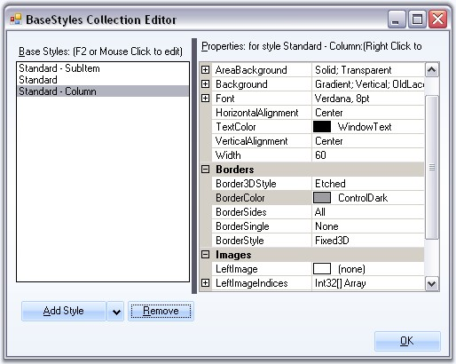

::: {style="DISPLAY: none"}
{#d2h_url_template}{#d2h_package_url style="WIDTH: 0px; DISPLAY: none; HEIGHT: 0px"}
:::

:::::: {.d2h_secondary_topic style="PADDING-BOTTOM: 10pt; MARGIN: 0pt; PADDING-LEFT: 0pt; PADDING-RIGHT: 0pt; PADDING-TOP: 0pt"}
#### Styles Architecture {#styles-architecture style="MARGIN-LEFT: 18pt; tab-stops: 18.0pt"}

[]{style="COLOR: #15428b"} 

[]{#p1043}The tree control employs an extensive Styles Architecture, that let users specify node styles globally, specifically for a class of nodes. This is possible by using a style information instance for each class of nodes, represented by a **MultiColumnTreeView.TreeNodeAdvStyleInfo**. Users will notice that for some of these classes of nodes, the style needs to be declared with a name at the tree level and stored in the tree\'s BaseStyles hatch table.

 

As illustrated below, implicit style inheritance is enforced by the framework while explicit style inheritance can be setup by the programmer. For all styles, explicit inheritance precedes implicit inheritance.

 

**Implicit Style Inheritance**

 

When a style is not set in a style info object, it inherits the style from the previous level and so on until it reaches the default global style on top of the hierarchy. This is called implicit style inheritance and is illustrated below.

[]{style="COLOR: #15428b"} 

[·      ]{style="FONT-FAMILY: Symbol; COLOR: black"}**Node Specific Style**: At the bottom of the hierarchy is the node specific style which lets users specify a style directly on a TreeNodeAdv. Refer Node specific Style[.]{style="COLOR: black"}

[·      ]{style="FONT-FAMILY: Symbol; COLOR: black"}**Node\'s Child Style**: Each node also exposes a **ChildStyle** property where you can specify the style for the immediate children of that node. Refer[ ]{style="COLOR: black"}Child Style[ ]{style="COLOR: black"}for setting style of children nodes[.]{style="COLOR: black"}

[·      ]{style="FONT-FAMILY: Symbol"}**Node Level Styles**: The framework also lets you specify a style for all nodes at a particular level in the tree hierarchy, the top-most level being 1. Refer Node Level Style[ ]{style="COLOR: black"}for setting node level style settings.

[·      ]{style="FONT-FAMILY: Symbol"}**Standard Style or Global Style**: A standard, global style is exposed by the MultiColumnTreeViewAdv control to be applied on all the nodes in the tree. Refer Standard Style for setting style in a Tree level.

[·      ]{style="FONT-FAMILY: Symbol"}**Column Style** : This lets you specify the styles for the columns.

[·      ]{style="FONT-FAMILY: Symbol"}**SubItem Style** : This lets you specify the styles for the Sub Items of the nodes.

[]{style="COLOR: #15428b"} 

**Explicit Style Inheritance**

 

Any StyleInfo instance can also inherit explicitly from a specific named StyleInfo object. This can be done using the BaseStyle property of the TreeNodeAdvStyleInfo type. As noted previously, such named styles should be available in the tree control\'s BaseStyles Collection Editor. You can also add custom styles using this editor.

[]{style="COLOR: #15428b"} 

::: {align="center"}
  ------------------------------ ----------------------------------------
  MultiColumnTreeView Property   Description
  BaseStyle                      Indicates the base style of the nodes.
  ------------------------------ ----------------------------------------
:::

 

StandardStyle is the default style for the nodes. It can be edited using **MultiColumnTreeView.StandardStyle** property. It can also be edited through BaseStyles Collection Editor dialog.

     

The TreeViewAdv control provides the below default styles which can be edited through BaseStyles Collection Editor also. In BaseStyle Collection Editor, StandardColumnStyle represents Standard - Column, StandardStyle represents Standard Styles and StandardSubItemStyle represents Standard - SubItem. User can customize these styles and apply to specific nodes through Nodes Collection Editor.

[]{style="COLOR: #15428b"} 

::: {align="center"}
  ------------------------------ -----------------------------------------------------------------
  MultiColumnTreeView Property   Description
  StandardColumnStyle            Indicates the default styles that all the columns will inherit.
  StandardStyle                  Indicates the styles that all the nodes inherit from.
  StandardSubItemStyle           Indicates the style that all the subitems will inherit from.
  ------------------------------ -----------------------------------------------------------------
:::

[]{style="COLOR: #15428b"} 

{border="0"}

[]{style="COLOR: #15428b"} 

Figure 1195: Default Base Styles

[]{style="COLOR: #15428b"} 

User can also add their own styles using this BaseStyles Collection Editor. The styles which can be added by the users are as follows.

[]{style="COLOR: #15428b"} 

::: {align="center"}
  ------------------ -----------------------------------------------------------------
  BaseStyles         Description
  BaseStyle          Indicates the base style of the nodes.
  NodeLevelStyle     Indicates the style specific to a node.
  ColumnStyle        Indicates the default styles that all the columns will inherit.
  NodeSubItemStyle   Indicates the style that all the subitems will inherit from.
  ------------------ -----------------------------------------------------------------
:::

 

 

 

 

More:

[ ]{#related-topics}

[{border="0" align="absMiddle"}Standard Style](ms-xhelp:///?Id=b8def246-8d06-4c0e-8773-7f97ff281300){style="TEXT-DECORATION: none"}

[{border="0" align="absMiddle"}Node Specific Style](ms-xhelp:///?Id=2ddce844-2f29-4f6e-a040-e5e510e45a7d){style="TEXT-DECORATION: none"}

[{border="0" align="absMiddle"}Node Level Style](ms-xhelp:///?Id=e710871b-844b-4da3-87b8-99f9137d6b30){style="TEXT-DECORATION: none"}

[{border="0" align="absMiddle"}Column Styles](ms-xhelp:///?Id=c70b8bf2-6cc6-4c03-a5e7-6af740b63b89){style="TEXT-DECORATION: none"}

[{border="0" align="absMiddle"}SubItem Styles](ms-xhelp:///?Id=c7e88011-91ca-4c77-97fc-1f3612698230){style="TEXT-DECORATION: none"}
::::::
