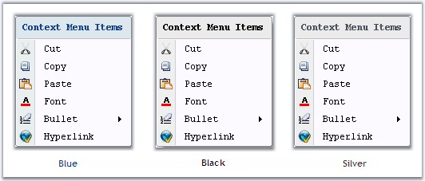
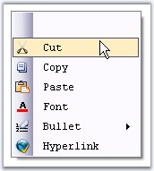

::: {style="DISPLAY: none"}
{#d2h_url_template}{#d2h_package_url style="WIDTH: 0px; DISPLAY: none; HEIGHT: 0px"}
:::

:::: {.d2h_secondary_topic style="PADDING-BOTTOM: 10pt; MARGIN: 0pt; PADDING-LEFT: 0pt; PADDING-RIGHT: 0pt; PADDING-TOP: 0pt"}
##### Style Settings {#style-settings style="tab-stops: 0pt"}

[]{style="COLOR: #15428b"} 

Office12ToolStripRenderer Class

 

Using the **Office12ToolStripRenderer Class**, the appearance of the ContextMenuStripEx can be changed.

 

Use the below code snippet for implementing this feature.

[]{style="COLOR: #15428b"} 

+------------------------------------------------------------------------------------------------------------------------------------------------------------------------------------------------------+
| **[\[C#\]]{style="FONT-FAMILY: 'Courier New'; COLOR: black"}**                                                                                                                                       |
|                                                                                                                                                                                                      |
| []{style="FONT-FAMILY: 'Courier New'; COLOR: black"}                                                                                                                                                 |
|                                                                                                                                                                                                      |
| [private]{style="FONT-FAMILY: 'Courier New'; COLOR: blue"}[ Syncfusion.Windows.Forms.Tools.[Office12ColorTable]{style="COLOR: teal"} ct;]{style="FONT-FAMILY: 'Courier New'"}                        |
|                                                                                                                                                                                                      |
| [private]{style="FONT-FAMILY: 'Courier New'; COLOR: blue"}[ Syncfusion.Windows.Forms.Tools.[Office12ToolStripRenderer]{style="COLOR: teal"} m_Office12Renderer;]{style="FONT-FAMILY: 'Courier New'"} |
|                                                                                                                                                                                                      |
| [ct =[new]{style="COLOR: blue"} Syncfusion.Windows.Forms.Tools.[Office12ColorTable]{style="COLOR: teal"}();]{style="FONT-FAMILY: 'Courier New'"}                                                     |
|                                                                                                                                                                                                      |
| [ct.UseSystemColors = [false]{style="COLOR: blue"};]{style="FONT-FAMILY: 'Courier New'"}                                                                                                             |
|                                                                                                                                                                                                      |
| [m_Office12Renderer = [new]{style="COLOR: blue"} Syncfusion.Windows.Forms.Tools.[Office12ToolStripRenderer]{style="COLOR: teal"}(ct);]{style="FONT-FAMILY: 'Courier New'"}                           |
+------------------------------------------------------------------------------------------------------------------------------------------------------------------------------------------------------+

[]{#p1182}[]{style="COLOR: #15428b"} 

+-------------------------------------------------------------------------------------------------------------------------------------------------------------------------------------------------------------------------------+
| **[\[VB.NET\]]{style="FONT-FAMILY: 'Courier New'; COLOR: black"}**                                                                                                                                                            |
|                                                                                                                                                                                                                               |
| []{style="COLOR: black"}                                                                                                                                                                                                      |
|                                                                                                                                                                                                                               |
| [Private]{style="FONT-FAMILY: 'Courier New'; COLOR: blue"}[ ct [As]{style="COLOR: blue"} Syncfusion.Windows.Forms.Tools.[Office12ColorTable]{style="COLOR: teal"}]{style="FONT-FAMILY: 'Courier New'"}                        |
|                                                                                                                                                                                                                               |
| [Private]{style="FONT-FAMILY: 'Courier New'; COLOR: blue"}[ m_Office12Renderer [As]{style="COLOR: blue"} Syncfusion.Windows.Forms.Tools.[Office12ToolStripRenderer]{style="COLOR: teal"}]{style="FONT-FAMILY: 'Courier New'"} |
|                                                                                                                                                                                                                               |
| [ct = [New]{style="COLOR: blue"} Syncfusion.Windows.Forms.Tools.[Office12ColorTable]{style="COLOR: teal"} ]{style="FONT-FAMILY: 'Courier New'"}                                                                               |
|                                                                                                                                                                                                                               |
| [ct.UseSystemColors = [False]{style="COLOR: blue"} ]{style="FONT-FAMILY: 'Courier New'"}                                                                                                                                      |
|                                                                                                                                                                                                                               |
| [m_Office12Renderer = [New]{style="COLOR: blue"} Syncfusion.Windows.Forms.Tools.[Office12ToolStripRenderer]{style="COLOR: teal"}(ct)]{style="FONT-FAMILY: 'Courier New'"}[]{style="FONT-FAMILY: 'Courier New'"}               |
+-------------------------------------------------------------------------------------------------------------------------------------------------------------------------------------------------------------------------------+

[]{style="COLOR: #15428b"} 

In the form load event, add one of the below code to change the appearance.

[]{style="COLOR: #15428b"} 

+-----------------------------------------------------------------------------------------------------------------------------------------------------------------------------------------------------------------------------------------------------------------------------------+
| **[\[C#\]]{style="FONT-FAMILY: 'Courier New'; COLOR: black"}**                                                                                                                                                                                                                    |
|                                                                                                                                                                                                                                                                                   |
| []{style="FONT-FAMILY: 'Courier New'; COLOR: black"}                                                                                                                                                                                                                              |
|                                                                                                                                                                                                                                                                                   |
| [//Sets Office Black Color]{style="FONT-FAMILY: 'Courier New'; COLOR: green"}                                                                                                                                                                                                     |
|                                                                                                                                                                                                                                                                                   |
| [this]{style="FONT-FAMILY: 'Courier New'; COLOR: blue"}[.contextMenuStripEx1.Renderer = [new]{style="COLOR: blue"} [Office12ToolStripRenderer]{style="COLOR: teal"}([new]{style="COLOR: blue"} [OfficeBlack]{style="COLOR: teal"} ());]{style="FONT-FAMILY: 'Courier New'"}       |
|                                                                                                                                                                                                                                                                                   |
| [//Sets Office Blue Color]{style="FONT-FAMILY: 'Courier New'; COLOR: green"}                                                                                                                                                                                                      |
|                                                                                                                                                                                                                                                                                   |
| [this]{style="FONT-FAMILY: 'Courier New'; COLOR: blue"}[.contextMenuStripEx1.Renderer = [new]{style="COLOR: blue"} [Office12ToolStripRenderer]{style="COLOR: teal"}([new]{style="COLOR: blue"} [OfficeBlue]{style="COLOR: teal"} ());]{style="FONT-FAMILY: 'Courier New'"}        |
|                                                                                                                                                                                                                                                                                   |
| [//Sets Office Silver Color]{style="FONT-FAMILY: 'Courier New'; COLOR: green"}                                                                                                                                                                                                    |
|                                                                                                                                                                                                                                                                                   |
| [this]{style="FONT-FAMILY: 'Courier New'; COLOR: blue"}[.contextMenuStripEx1.Renderer = [new]{style="COLOR: blue"} [Office12ToolStripRenderer]{style="COLOR: teal"}([new]{style="COLOR: blue"} [Office12ColorTable]{style="COLOR: teal"}());]{style="FONT-FAMILY: 'Courier New'"} |
+-----------------------------------------------------------------------------------------------------------------------------------------------------------------------------------------------------------------------------------------------------------------------------------+

[]{style="COLOR: #15428b"} 

+--------------------------------------------------------------------------------------------------------------------------------------------------------------------------------------------------------------------------------------------------------------------------------+
| **[\[VB.NET\]]{style="FONT-FAMILY: 'Courier New'; COLOR: black"}**                                                                                                                                                                                                             |
|                                                                                                                                                                                                                                                                                |
| []{style="COLOR: black"}                                                                                                                                                                                                                                                       |
|                                                                                                                                                                                                                                                                                |
| [\'Sets Office Black Color]{style="FONT-FAMILY: 'Courier New'; COLOR: green"}                                                                                                                                                                                                  |
|                                                                                                                                                                                                                                                                                |
| [Me]{style="FONT-FAMILY: 'Courier New'; COLOR: blue"}[.contextMenuStripEx1.Renderer = [New]{style="COLOR: blue"} [Office12ToolStripRenderer]{style="COLOR: teal"}([New]{style="COLOR: blue"} [OfficeBlack]{style="COLOR: teal"}) ]{style="FONT-FAMILY: 'Courier New'"}         |
|                                                                                                                                                                                                                                                                                |
| [\'Sets Office Blue Color]{style="FONT-FAMILY: 'Courier New'; COLOR: green"}                                                                                                                                                                                                   |
|                                                                                                                                                                                                                                                                                |
| [Me]{style="FONT-FAMILY: 'Courier New'; COLOR: blue"}[.contextMenuStripEx1.Renderer = [New]{style="COLOR: blue"} [Office12ToolStripRenderer]{style="COLOR: teal"}([New]{style="COLOR: blue"} [OfficeBlue]{style="COLOR: teal"})]{style="FONT-FAMILY: 'Courier New'"}           |
|                                                                                                                                                                                                                                                                                |
| [\'Sets Office Silver Color]{style="FONT-FAMILY: 'Courier New'; COLOR: green"}                                                                                                                                                                                                 |
|                                                                                                                                                                                                                                                                                |
| [Me]{style="FONT-FAMILY: 'Courier New'; COLOR: blue"}[.contextMenuStripEx1.Renderer = [New]{style="COLOR: blue"} [Office12ToolStripRenderer]{style="COLOR: teal"}([New]{style="COLOR: blue"} [Office12ColorTable]{style="COLOR: teal"}())]{style="FONT-FAMILY: 'Courier New'"} |
+--------------------------------------------------------------------------------------------------------------------------------------------------------------------------------------------------------------------------------------------------------------------------------+

[]{style="COLOR: #15428b"} 

{border="0"}

[]{style="COLOR: #15428b"} 

***[]{style="COLOR: #15428b"}*** 

Figure 1424: OfficeColor applied for Context Menu

**[]{style="COLOR: #15428b"}** 

Rendering Mode

**[]{style="COLOR: #15428b"}** 

Rendering mode of the ContextMenuStripEx can be controlled using the below property.

[]{style="COLOR: #15428b"} 

::: {align="center"}
+-----------------------------------+-------------------------------------------------------------------------------------------+
| Property                          | Description                                                                               |
+-----------------------------------+-------------------------------------------------------------------------------------------+
| RenderMode                        | Represents the painting style applied to the control. The different styles supported are, |
|                                   |                                                                                           |
|                                   |                                                                                           |
|                                   |                                                                                           |
|                                   | [·      ]{style="FONT-FAMILY: Symbol"}Professional,                                       |
|                                   |                                                                                           |
|                                   | [·      ]{style="FONT-FAMILY: Symbol"}System and                                          |
|                                   |                                                                                           |
|                                   | [·      ]{style="FONT-FAMILY: Symbol"}ManagerRenderMode.                                  |
+-----------------------------------+-------------------------------------------------------------------------------------------+
:::

[]{style="COLOR: #15428b"} 

+----------------------------------------------------------------------------------------------------------------------------------------------------------------------------------------------------------------------------------------------------+
| **[\[C#\]]{style="FONT-FAMILY: 'Courier New'; COLOR: black"}**                                                                                                                                                                                     |
|                                                                                                                                                                                                                                                    |
| []{style="FONT-FAMILY: 'Courier New'; COLOR: black"}                                                                                                                                                                                               |
|                                                                                                                                                                                                                                                    |
| [this]{style="FONT-FAMILY: 'Courier New'; COLOR: blue"}[.contextMenuStripEx1.RenderMode = System.Windows.Forms.[ToolStripRenderMode]{style="COLOR: teal"}.Professional;]{style="FONT-FAMILY: 'Courier New'"}[]{style="FONT-FAMILY: 'Courier New'"} |
+----------------------------------------------------------------------------------------------------------------------------------------------------------------------------------------------------------------------------------------------------+

[]{#p1183}[]{style="COLOR: #15428b"} 

+-------------------------------------------------------------------------------------------------------------------------------------------------------------------------------------------------------------------------------------------------+
| **[\[VB.NET\]]{style="FONT-FAMILY: 'Courier New'; COLOR: black"}**                                                                                                                                                                              |
|                                                                                                                                                                                                                                                 |
| []{style="COLOR: black"}                                                                                                                                                                                                                        |
|                                                                                                                                                                                                                                                 |
| [Me]{style="FONT-FAMILY: 'Courier New'; COLOR: blue"}[.contextMenuStripEx1.RenderMode = System.Windows.Forms.[ToolStripRenderMode]{style="COLOR: teal"}.Professional]{style="FONT-FAMILY: 'Courier New'"}[]{style="FONT-FAMILY: 'Courier New'"} |
+-------------------------------------------------------------------------------------------------------------------------------------------------------------------------------------------------------------------------------------------------+

[]{style="COLOR: #15428b"} 

{border="0"}

[]{style="COLOR: #15428b"} 

Figure 1425: RenderMode = \"Professional\"

 

 

 

 

[]{#related-topics}
::::
