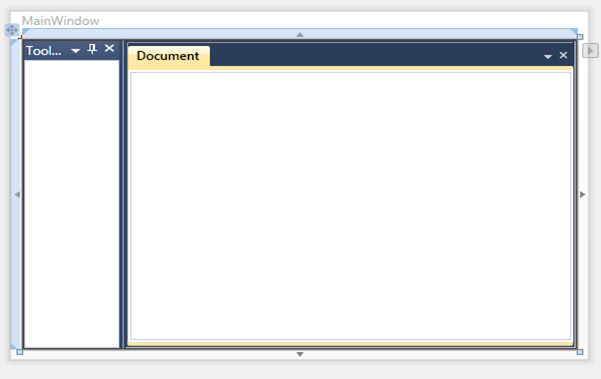

::: {style="DISPLAY: none"}
{#d2h_url_template}{#d2h_package_url style="WIDTH: 0px; DISPLAY: none; HEIGHT: 0px"}
:::

::: {.d2h_secondary_topic style="PADDING-BOTTOM: 10pt; MARGIN: 0pt; PADDING-LEFT: 0pt; PADDING-RIGHT: 0pt; PADDING-TOP: 0pt"}
#### Styling the Docking Manager {#styling-the-docking-manager style="tab-stops: 0pt"}

Styling can be applied to the Docking Manager control. This control supports the following styles:

 

1.   Office2007Blue

2.   Office2007Black

3.   Office2007Silver

4.   Office2010Blue

5.   Office2010Black

6.   Office2010Silver

7.   Blend

8.   VS2010

9.   Metro

10.  Transparent

 

These styles can be applied to the Docking Manager through XAML and C#. The *VisualStyle* property of SkinStorage class is used to set the visual styles for the child window of the Docking Manager. The following code examples illustrate how to apply VS2010 style to the Docking Manager control.

 

+-------------------------------------------------------------------------------------------------------------------------------------------------------------------------------------------------------------------------------------------------------------------------------------------------------------------------------------------------------------------------------------------------------------------------------------------------------------------------------------------------------------------------------------+
| **[\[XAML\]]{style="FONT-FAMILY: 'Courier New'"}**                                                                                                                                                                                                                                                                                                                                                                                                                                                                                  |
|                                                                                                                                                                                                                                                                                                                                                                                                                                                                                                                                     |
| []{style="FONT-FAMILY: 'Courier New'"}                                                                                                                                                                                                                                                                                                                                                                                                                                                                                              |
|                                                                                                                                                                                                                                                                                                                                                                                                                                                                                                                                     |
| [  ]{style="FONT-FAMILY: 'Courier New'; COLOR: #a31515"}[\<]{style="FONT-FAMILY: 'Courier New'; COLOR: blue"}[syncfusion]{style="FONT-FAMILY: 'Courier New'; COLOR: #a31515"}[:]{style="FONT-FAMILY: 'Courier New'; COLOR: blue"}[DockingManager]{style="FONT-FAMILY: 'Courier New'; COLOR: #a31515"}[ UseDocumentContainer]{style="FONT-FAMILY: 'Courier New'; COLOR: red"}[=\"True\"]{style="FONT-FAMILY: 'Courier New'; COLOR: blue"}[                                         ]{style="FONT-FAMILY: 'Courier New'; COLOR: red"} |
|                                                                                                                                                                                                                                                                                                                                                                                                                                                                                                                                     |
| [                             syncfusion]{style="FONT-FAMILY: 'Courier New'; COLOR: red"}[:]{style="FONT-FAMILY: 'Courier New'; COLOR: blue"}[SkinStorage.VisualStyle]{style="FONT-FAMILY: 'Courier New'; COLOR: red"}[=\"VS2010\"\>]{style="FONT-FAMILY: 'Courier New'; COLOR: blue"}[]{style="FONT-FAMILY: 'Courier New'; COLOR: red"}                                                                                                                                                                                            |
|                                                                                                                                                                                                                                                                                                                                                                                                                                                                                                                                     |
| [            ]{style="FONT-FAMILY: 'Courier New'; COLOR: #a31515"}[\<]{style="FONT-FAMILY: 'Courier New'; COLOR: blue"}[ContentControl]{style="FONT-FAMILY: 'Courier New'; COLOR: #a31515"}[ syncfusion]{style="FONT-FAMILY: 'Courier New'; COLOR: red"}[:]{style="FONT-FAMILY: 'Courier New'; COLOR: blue"}[DockingManager.Header]{style="FONT-FAMILY: 'Courier New'; COLOR: red"}[=\"ToolBox\"]{style="FONT-FAMILY: 'Courier New'; COLOR: blue"}[ ]{style="FONT-FAMILY: 'Courier New'; COLOR: red"}                               |
|                                                                                                                                                                                                                                                                                                                                                                                                                                                                                                                                     |
| [                            syncfusion]{style="FONT-FAMILY: 'Courier New'; COLOR: red"}[:]{style="FONT-FAMILY: 'Courier New'; COLOR: blue"}[DockingManager.SideInDockedMode]{style="FONT-FAMILY: 'Courier New'; COLOR: red"}[=\"Left\"/\>]{style="FONT-FAMILY: 'Courier New'; COLOR: blue"}[]{style="FONT-FAMILY: 'Courier New'"}                                                                                                                                                                                                  |
|                                                                                                                                                                                                                                                                                                                                                                                                                                                                                                                                     |
| [            ]{style="FONT-FAMILY: 'Courier New'; COLOR: #a31515"}[\<]{style="FONT-FAMILY: 'Courier New'; COLOR: blue"}[ContentControl]{style="FONT-FAMILY: 'Courier New'; COLOR: #a31515"}[ syncfusion]{style="FONT-FAMILY: 'Courier New'; COLOR: red"}[:]{style="FONT-FAMILY: 'Courier New'; COLOR: blue"}[DockingManager.Header]{style="FONT-FAMILY: 'Courier New'; COLOR: red"}[=\"Document\"]{style="FONT-FAMILY: 'Courier New'; COLOR: blue"}[ ]{style="FONT-FAMILY: 'Courier New'; COLOR: red"}                              |
|                                                                                                                                                                                                                                                                                                                                                                                                                                                                                                                                     |
| [                            syncfusion]{style="FONT-FAMILY: 'Courier New'; COLOR: red"}[:]{style="FONT-FAMILY: 'Courier New'; COLOR: blue"}[DockingManager.State]{style="FONT-FAMILY: 'Courier New'; COLOR: red"}[=\"Document\" /\>]{style="FONT-FAMILY: 'Courier New'; COLOR: blue"}[]{style="FONT-FAMILY: 'Courier New'"}                                                                                                                                                                                                        |
|                                                                                                                                                                                                                                                                                                                                                                                                                                                                                                                                     |
| [  ]{style="FONT-FAMILY: 'Courier New'; COLOR: #a31515"}[\</]{style="FONT-FAMILY: 'Courier New'; COLOR: blue"}[syncfusion]{style="FONT-FAMILY: 'Courier New'; COLOR: #a31515"}[:]{style="FONT-FAMILY: 'Courier New'; COLOR: blue"}[DockingManager]{style="FONT-FAMILY: 'Courier New'; COLOR: #a31515"}[\>]{style="FONT-FAMILY: 'Courier New'; COLOR: blue"}                                                                                                                                                                         |
+-------------------------------------------------------------------------------------------------------------------------------------------------------------------------------------------------------------------------------------------------------------------------------------------------------------------------------------------------------------------------------------------------------------------------------------------------------------------------------------------------------------------------------------+

 

+------------------------------------------------------------------------------------------------------------------------------------------------------------------------------------------------------------------+
| **[\[C#\]]{style="FONT-FAMILY: 'Courier New'"}**                                                                                                                                                                 |
|                                                                                                                                                                                                                  |
| [            DockingManager]{style="FONT-FAMILY: 'Courier New'; COLOR: #2b91af"}[ dockingManager1 = [new]{style="COLOR: blue"} [DockingManager]{style="COLOR: #2b91af"}(); ]{style="FONT-FAMILY: 'Courier New'"} |
|                                                                                                                                                                                                                  |
| [            dockingManager1.UseDocumentContainer = [true]{style="COLOR: blue"};]{style="FONT-FAMILY: 'Courier New'"}                                                                                            |
|                                                                                                                                                                                                                  |
| []{style="FONT-FAMILY: 'Courier New'"}                                                                                                                                                                           |
|                                                                                                                                                                                                                  |
| [            [ContentControl]{style="COLOR: #2b91af"} ctrl1 = [new]{style="COLOR: blue"} [ContentControl]{style="COLOR: #2b91af"}();]{style="FONT-FAMILY: 'Courier New'"}                                        |
|                                                                                                                                                                                                                  |
| [            [DockingManager]{style="COLOR: #2b91af"}.SetHeader(ctrl1, [\"Tool box\"]{style="COLOR: #a31515"});]{style="FONT-FAMILY: 'Courier New'"}                                                             |
|                                                                                                                                                                                                                  |
| [            [DockingManager]{style="COLOR: #2b91af"}.SetSideInDockedMode(ctrl1, [DockSide]{style="COLOR: #2b91af"}.Left);]{style="FONT-FAMILY: 'Courier New'"}                                                  |
|                                                                                                                                                                                                                  |
| [            dockingManager1.Children.Add(ctrl1);]{style="FONT-FAMILY: 'Courier New'"}                                                                                                                           |
|                                                                                                                                                                                                                  |
| []{style="FONT-FAMILY: 'Courier New'"}                                                                                                                                                                           |
|                                                                                                                                                                                                                  |
| [            [ContentControl]{style="COLOR: #2b91af"} ctrl3 = [new]{style="COLOR: blue"} [ContentControl]{style="COLOR: #2b91af"}();]{style="FONT-FAMILY: 'Courier New'"}                                        |
|                                                                                                                                                                                                                  |
| [            [DockingManager]{style="COLOR: #2b91af"}.SetHeader(ctrl3, [\"Document\"]{style="COLOR: #a31515"});]{style="FONT-FAMILY: 'Courier New'"}                                                             |
|                                                                                                                                                                                                                  |
| [            [DockingManager]{style="COLOR: #2b91af"}.SetState(ctrl3, [DockState]{style="COLOR: #2b91af"}.Document);]{style="FONT-FAMILY: 'Courier New'"}                                                        |
|                                                                                                                                                                                                                  |
| [            dockingManager1.Children.Add(ctrl3);]{style="FONT-FAMILY: 'Courier New'"}                                                                                                                           |
|                                                                                                                                                                                                                  |
| []{style="FONT-FAMILY: 'Courier New'"}                                                                                                                                                                           |
|                                                                                                                                                                                                                  |
| [            [SkinStorage]{style="COLOR: #2b91af"}.SetVisualStyle(dockingManager1, [\"VS2010\"]{style="COLOR: #a31515"});]{style="FONT-FAMILY: 'Courier New'"}                                                   |
|                                                                                                                                                                                                                  |
| []{style="FONT-FAMILY: 'Courier New'"}                                                                                                                                                                           |
+------------------------------------------------------------------------------------------------------------------------------------------------------------------------------------------------------------------+

 

Implementing the above code will generate the following control.

{border="0"}

Figure 307: Docking Manager with VS2010 style

 

[]{#related-topics}
:::
