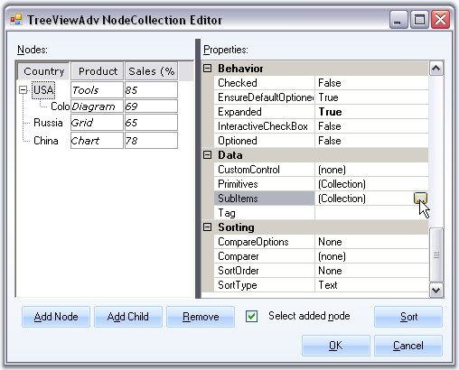
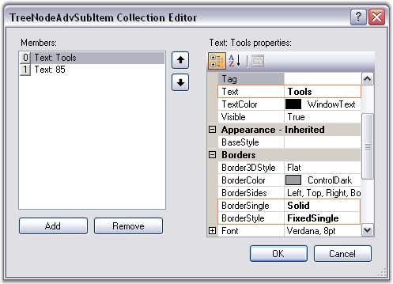
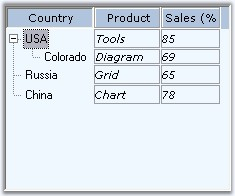

::: {style="DISPLAY: none"}
{#d2h_url_template}{#d2h_package_url style="WIDTH: 0px; DISPLAY: none; HEIGHT: 0px"}
:::

:::: {.d2h_secondary_topic style="PADDING-BOTTOM: 10pt; MARGIN: 0pt; PADDING-LEFT: 0pt; PADDING-RIGHT: 0pt; PADDING-TOP: 0pt"}
##### SubItems {#subitems style="MARGIN-LEFT: 18pt; tab-stops: 18.0pt"}

[]{style="COLOR: #15428b"} 

Adding SubItems

**[]{style="COLOR: #15428b"}** 

You can add SubItems for the nodes using the SubItems Collection available in Nodes Collection Editor.

[]{style="COLOR: #15428b"} 

{border="0"}

[]{style="COLOR: #15428b"} 

Figure 1179: Accessing the SubItems Collection Dialog Box

**[]{style="COLOR: #15428b"}** 

{border="0"}

**[]{style="COLOR: #15428b"}** 

Figure 1180: Setting the text, BorderSingle and BorderStyle Property for the SubItem

**[]{style="COLOR: #15428b"}** 

Properties for Customizing the SubItems

[]{style="COLOR: #15428b"} 

The below properties lets you customize the subitems using the SubItems Collection dialog.

[]{style="COLOR: #15428b"} 

::: {align="center"}
+-----------------------------------+--------------------------------------------------------------------------------------------+
| TreeNodeAdvSubItem Property       | Description                                                                                |
+-----------------------------------+--------------------------------------------------------------------------------------------+
| Alignment                         | Sets the alignment of the SubItem text.                                                    |
+-----------------------------------+--------------------------------------------------------------------------------------------+
| Background                        | Sets the background for the subitem.                                                       |
+-----------------------------------+--------------------------------------------------------------------------------------------+
| LineAlignment                     | Sets the vertical alignment of the subitem text.                                           |
+-----------------------------------+--------------------------------------------------------------------------------------------+
| Text                              | Sets the text for the SubItem.                                                             |
+-----------------------------------+--------------------------------------------------------------------------------------------+
| TextColor                         | Sets the color for the SubItem text.                                                       |
+-----------------------------------+--------------------------------------------------------------------------------------------+
| Visible                           | Sets the visibility of the subitem.                                                        |
+-----------------------------------+--------------------------------------------------------------------------------------------+
| BaseStyle                         | Specifies the BaseStyle that it should inherit from.                                       |
+-----------------------------------+--------------------------------------------------------------------------------------------+
| Border3DStyle                     | Specifies the 3D style for the border.                                                     |
+-----------------------------------+--------------------------------------------------------------------------------------------+
| BorderColor                       | Sets the border color.                                                                     |
+-----------------------------------+--------------------------------------------------------------------------------------------+
| BorderSides                       | Specifies the sides which should have borders.                                             |
+-----------------------------------+--------------------------------------------------------------------------------------------+
| BorderSingle                      | Specifies the 2D style for the border when BorderStyle is set to FixedSingle. Options are, |
|                                   |                                                                                            |
|                                   |                                                                                            |
|                                   |                                                                                            |
|                                   | [·      ]{style="FONT-FAMILY: Symbol"}Dotted,                                              |
|                                   |                                                                                            |
|                                   | [·      ]{style="FONT-FAMILY: Symbol"}Dashed,                                              |
|                                   |                                                                                            |
|                                   | [·      ]{style="FONT-FAMILY: Symbol"}Solid,                                               |
|                                   |                                                                                            |
|                                   | [·      ]{style="FONT-FAMILY: Symbol"}Inset and                                            |
|                                   |                                                                                            |
|                                   | [·      ]{style="FONT-FAMILY: Symbol"}Outset.                                              |
+-----------------------------------+--------------------------------------------------------------------------------------------+
| BorderStyle                       | Sets the border style, either FixedSingle or Fixed 3D                                      |
+-----------------------------------+--------------------------------------------------------------------------------------------+
:::

**[]{style="COLOR: #15428b"}** 

The below image displays subitems with similar settings in the property grid above.

**[]{style="COLOR: #15428b"}** 

{border="0"}

**[]{style="COLOR: #15428b"}** 

Figure 1181: SubItems with Italic Style; Solid, FixedSingle Border Style

**[]{style="COLOR: #15428b"}** 

StyleSettings for all the sub Items can be specified using **TreeNodeAdvSubItemStyleInfo** class. It is a default base style which can be accessed in the BaseStyles Collection Editor. See [[SubItem Styles]{style="COLOR: windowtext; TEXT-DECORATION: none; text-underline: none"}](../../../../../../../../Documents%20and%20Settings/sylviap/Desktop/Tools%20-%20Part%202.docx#_SubItem_Styles).

[]{style="COLOR: #15428b"} 

See Also

[]{style="COLOR: #15428b"} 

[[Column Styles]{.UGHyperlink}](../../../../../../../../Documents%20and%20Settings/sylviap/Desktop/Tools%20-%20Part%202.docx#_Column_Styles)[, ]{.UGHyperlink}[[MultiColumnTreeView Appearance]{.UGHyperlink}](../../../../../../../../Documents%20and%20Settings/sylviap/Desktop/Tools%20-%20Part%202.docx#_MultiColumnTreeView_Appearance)[]{.UGHyperlink}

 

 

 

 

[]{#related-topics}
::::
