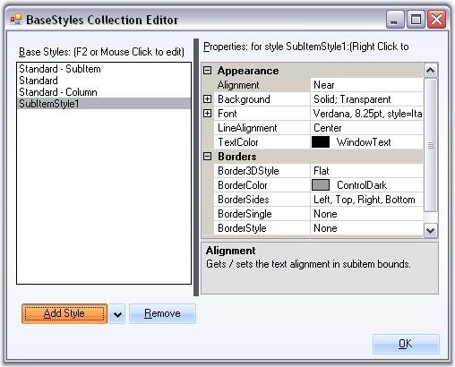

::: {style="DISPLAY: none"}
{#d2h_url_template}{#d2h_package_url style="WIDTH: 0px; DISPLAY: none; HEIGHT: 0px"}
:::

:::: {.d2h_secondary_topic style="PADDING-BOTTOM: 10pt; MARGIN: 0pt; PADDING-LEFT: 0pt; PADDING-RIGHT: 0pt; PADDING-TOP: 0pt"}
##### SubItem Styles {#subitem-styles style="MARGIN-LEFT: 18pt; tab-stops: 18.0pt"}

[]{style="COLOR: #15428b"} 

Standard - SubItem style in the BaseStyles Collection Editor will be applied by default to all the subitems, that are added to the tree nodes. User can also edit the default style settings.

 

**Properties**

 

The below properties lets you customize the subitems using the Styles editor.

[]{style="COLOR: #15428b"} 

::: {align="center"}
+--------------------------------------+--------------------------------------------------------------------------------------------+
| TreeNodeAdvSubItemStyleInfo Property | Description                                                                                |
+--------------------------------------+--------------------------------------------------------------------------------------------+
| Alignment                            | Sets the alignment of the SubItem text.                                                    |
+--------------------------------------+--------------------------------------------------------------------------------------------+
| Background                           | Sets the background for the subitem.                                                       |
+--------------------------------------+--------------------------------------------------------------------------------------------+
| LineAlignment                        | Sets the vertical alignment of the subitem text.                                           |
+--------------------------------------+--------------------------------------------------------------------------------------------+
| TextColor                            | Sets the color for the SubItem text.                                                       |
+--------------------------------------+--------------------------------------------------------------------------------------------+
| BaseStyle                            | Specifies the BaseStyle that it should inherit from.                                       |
+--------------------------------------+--------------------------------------------------------------------------------------------+
| Border3DStyle                        | Specifies the 3D style for the border.                                                     |
+--------------------------------------+--------------------------------------------------------------------------------------------+
| BorderColor                          | Sets the border color.                                                                     |
+--------------------------------------+--------------------------------------------------------------------------------------------+
| BorderSides                          | Specifies the sides which should have borders.                                             |
+--------------------------------------+--------------------------------------------------------------------------------------------+
| BorderSingle                         | Specifies the 2D style for the border when BorderStyle is set to FixedSingle. Options are, |
|                                      |                                                                                            |
|                                      |                                                                                            |
|                                      |                                                                                            |
|                                      | [·      ]{style="FONT-FAMILY: Symbol"}Dotted,                                              |
|                                      |                                                                                            |
|                                      | [·      ]{style="FONT-FAMILY: Symbol"}Dashed,                                              |
|                                      |                                                                                            |
|                                      | [·      ]{style="FONT-FAMILY: Symbol"}Solid,                                               |
|                                      |                                                                                            |
|                                      | [·      ]{style="FONT-FAMILY: Symbol"}Inset and                                            |
|                                      |                                                                                            |
|                                      | [·      ]{style="FONT-FAMILY: Symbol"}Outset.                                              |
+--------------------------------------+--------------------------------------------------------------------------------------------+
| BorderStyle                          | Sets the border style, either FixedSingle or Fixed 3D                                      |
+--------------------------------------+--------------------------------------------------------------------------------------------+
:::

[]{style="COLOR: #15428b"} 

User can add and define a SubItem style using the BaseStyles Collection Editor as follows.

[]{style="COLOR: #15428b"} 

{border="0"}

[]{style="COLOR: #15428b"} 

Figure 1204: SubItem Style added to the Styles Editor

**[]{style="COLOR: #15428b"}** 

See Also

[]{style="COLOR: #15428b"} 

[[Adding Multiple Columns and SubItems]{.UGHyperlink}](../../../../../../../../Documents%20and%20Settings/sylviap/Desktop/Tools%20-%20Part%202.docx#_Adding_Multiple_Columns)[]{.UGHyperlink}

 

[]{#related-topics}
::::
