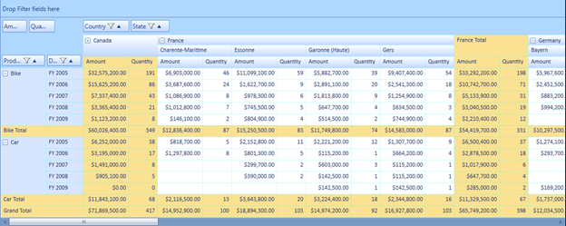
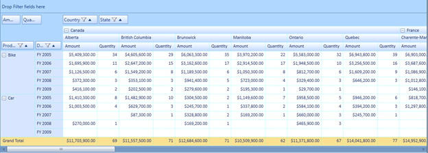

::: {style="DISPLAY: none"}
{#d2h_url_template}{#d2h_package_url style="WIDTH: 0px; DISPLAY: none; HEIGHT: 0px"}
:::

::::: {#nsbanner .d2h_main_nsbanner style="BORDER-BOTTOM: #999999 1px solid; POSITION: relative; PADDING-BOTTOM: 0px; BACKGROUND-COLOR: transparent; PADDING-LEFT: 0px; PADDING-RIGHT: 0px; DISPLAY: none; BORDER-TOP: #999999 1px solid; PADDING-TOP: 0px; LEFT: 0px"}
:::: {#TitleRow .d2h_main_titlerow style="PADDING-BOTTOM: 4px; BACKGROUND-COLOR: transparent; PADDING-LEFT: 22px; WIDTH: 100%; PADDING-RIGHT: 10px; DISPLAY: none; PADDING-TOP: 4px"}
::: {#ienav .d2h_main_ienav style="DISPLAY: none"}
{#D2HPrevious .D2HPreviousEnabled}  {#D2HNext .D2HNextEnabled}
:::
::::
:::::

:::::: {#nstext .d2h_main_nstext style="PADDING-BOTTOM: 10px; BACKGROUND-COLOR: transparent; PADDING-LEFT: 22px; PADDING-RIGHT: 10px; HEIGHT: 100%; OVERFLOW: auto; PADDING-TOP: 5px" hasuserbackground="true" valign="bottom"}
::: {#d2h_breadcrumbs .d2h_breadcrumbs}
[Essential Studio User Guide Documentation](ms-xhelp:///?Id=12457748-09e3-4d74-a240-8e049cedf030){.d2h_breadcrumbsNormal}[ \> ]{.d2h_breadcrumbsLinkSeparator}[User Interface Edition](ms-xhelp:///?Id=c29296b7-531c-413b-a0ec-488ca1f7f669){.d2h_breadcrumbsNormal}[ \> ]{.d2h_breadcrumbsLinkSeparator}[Essential Windows](ms-xhelp:///?Id=e60759d8-47a4-4570-9d7a-16a68d63f2ea){.d2h_breadcrumbsNormal}[ \> ]{.d2h_breadcrumbsLinkSeparator}[Essential Pivot Grid]{.d2h_breadcrumbsContentsOnly}[ \> ]{.d2h_breadcrumbsLinkSeparator}[Concepts and Features](ms-xhelp:///?Id=4ac202a5-4d9d-4bd8-8592-31692c415d53){.d2h_breadcrumbsNormal}
:::

## Subtotal Hiding {#subtotal-hiding style="tab-stops: 0pt"}

The subtotal hiding feature is used to show or hide the subtotals in the PivotGrid.[ I]{style="COLOR: gray"}n the case of larger data table, this feature enables the user to have an abstract view of the data by hiding subtotals using the *ShowSubTotals* property.

 

Use Case Scenarios

When the user has more computational fields with subtotals in each group of their PivotGrid, the user might find it difficult to view all the data. In that case, the user can hide the subtotals and make it visible when required.

The following screen shots shows the PivotGrid with shown and hidden sub totals.

 

{border="0"}

Figure 14: PivotGrid with Subtotals

 

{border="0"}

Figure 15: PivotGrid with Subtotals Hidden

 

Properties

Table 10: Property Table

::: {align="center"}
  --------------- ------------------------------- ----------- -----------------
  Property        Description                     Data Type   Reference links
  ShowSubTotals   Shows or hides the sub totals   Boolean     \-
  --------------- ------------------------------- ----------- -----------------
:::

[]{style="FONT-FAMILY: 'Calibri','sans-serif'; COLOR: black"} 

Methods

Table 11: Method Table

::: {align="center"}
  Method               Description                                                                                                                                                                 Parameters   Return Type   Reference links
  -------------------- --------------------------------------------------------------------------------------------------------------------------------------------------------------------------- ------------ ------------- -----------------
  SubTotalsRendering   Handles rendering of cells(showing or hiding the cells) by calculating the cell range values in the Pivot Engine based on the ShowSubTotals property value in the control   \-           Void          \-
:::

[]{style="COLOR: #c00000"} 

Sample Link

Follow the steps given below to view a sample of this feature:

1.   Select Start \> Programs \> Syncfusion \> Essential Studio x.x.x.x -\> Dashboard.

2.   Click **Run Samples** under UI edition.

3.   Select **PivotGrid.**

4.   Navigate to **Selection** \> **Cell Selection Demo.**

More:

[ ]{#related-topics}

[{border="0" align="absMiddle"}Showing or Hiding Subtotals in PivotGrid](ms-xhelp:///?Id=e6dcc960-ce60-4359-b325-2adca329c838){style="TEXT-DECORATION: none"}
::::::
