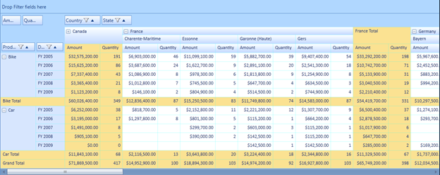
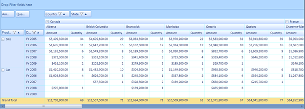

::: {style="DISPLAY: none"}
{#d2h_url_template}{#d2h_package_url style="WIDTH: 0px; DISPLAY: none; HEIGHT: 0px"}
:::

::::: {#nsbanner .d2h_main_nsbanner style="BORDER-BOTTOM: #999999 1px solid; POSITION: relative; PADDING-BOTTOM: 0px; BACKGROUND-COLOR: transparent; PADDING-LEFT: 0px; PADDING-RIGHT: 0px; DISPLAY: none; BORDER-TOP: #999999 1px solid; PADDING-TOP: 0px; LEFT: 0px"}
:::: {#TitleRow .d2h_main_titlerow style="PADDING-BOTTOM: 4px; BACKGROUND-COLOR: transparent; PADDING-LEFT: 22px; WIDTH: 100%; PADDING-RIGHT: 10px; DISPLAY: none; PADDING-TOP: 4px"}
::: {#ienav .d2h_main_ienav style="DISPLAY: none"}
{#D2HPrevious .D2HPreviousEnabled}  {#D2HNext .D2HNextEnabled}
:::
::::
:::::

:::::: {#nstext .d2h_main_nstext style="PADDING-BOTTOM: 10px; BACKGROUND-COLOR: transparent; PADDING-LEFT: 22px; PADDING-RIGHT: 10px; HEIGHT: 100%; OVERFLOW: auto; PADDING-TOP: 5px" hasuserbackground="true" valign="bottom"}
::: {#d2h_breadcrumbs .d2h_breadcrumbs}
[Essential Studio User Guide Documentation](ms-xhelp:///?Id=12457748-09e3-4d74-a240-8e049cedf030){.d2h_breadcrumbsNormal}[ \> ]{.d2h_breadcrumbsLinkSeparator}[Business Intelligence Edition](ms-xhelp:///?Id=fdf33dd8-62b2-47b9-ad7b-fc50e590bca5){.d2h_breadcrumbsNormal}[ \> ]{.d2h_breadcrumbsLinkSeparator}[Essential BI Silverlight](ms-xhelp:///?Id=c006b39c-6aa2-4637-b7de-3e7b6cb3f9f9){.d2h_breadcrumbsNormal}[ \> ]{.d2h_breadcrumbsLinkSeparator}[Essential Pivot Grid]{.d2h_breadcrumbsContentsOnly}[ \> ]{.d2h_breadcrumbsLinkSeparator}[Features](ms-xhelp:///?Id=9d7968f1-d52c-4e79-a6ae-fb01305e9f98){.d2h_breadcrumbsNormal}
:::

## Subtotal Hiding {#subtotal-hiding style="tab-stops: 0pt"}

The subtotal hiding feature is used to show or hide the subtotals in the PivotGrid. This feature enables the user to have an abstract view of the data, in the case of larger data table by hiding subtotals using the ShowSubTotals property

Use Case Scenarios

When the user has more computational fields with subtotals shown below each group in their PivotGrid, the user might find it difficult to view all the data. In that case, the user can hide the subtotals and make it visible when required

The following screen shots, shows the PivotGrid with the subtotals shown and hidden:

{border="0"}

Figure 25 PivotGrid with Subtotals

{border="0"}

Figure 26 PivotGrid with Subtotals Hidden

 

Properties

Table 5: Property Table

::: {align="center"}
  ----------------------------------------- --------------------------------------------------------- --------------------------------------- ------------------------------------ -------------------------------
  Property                                  Description                                               Type                                    Data Type                            Reference links
  ShowSubTotals[]{style="COLOR: #c00000"}   Shows or hides the subtotals []{style="COLOR: #c00000"}   Dependency []{style="COLOR: #c00000"}   Boolean []{style="COLOR: #c00000"}   \- []{style="COLOR: #c00000"}
  ----------------------------------------- --------------------------------------------------------- --------------------------------------- ------------------------------------ -------------------------------
:::

[]{style="FONT-FAMILY: 'Calibri','sans-serif'; COLOR: black"} 

Methods[]{style="COLOR: #4e84c4"}

Table 6: Method Table

::: {align="center"}
  Method                                         Description                                                                                                                                                                                           Parameters                      Type                                     Return Type                       Reference links
  ---------------------------------------------- ----------------------------------------------------------------------------------------------------------------------------------------------------------------------------------------------------- ------------------------------- ---------------------------------------- --------------------------------- -------------------------------
  SubTotalsRendering[]{style="COLOR: #c00000"}   Handles rendering of cells(showing or hiding the cells) by calculating the cell range values in the Pivot Engine based on the ShowSubTotals property value in the control[]{style="COLOR: #c00000"}   \- []{style="COLOR: #c00000"}   Server Side []{style="COLOR: #c00000"}   Void []{style="COLOR: #c00000"}   \- []{style="COLOR: #c00000"}
:::

[]{style="FONT-FAMILY: 'Calibri','sans-serif'; COLOR: black"} 

Sample Link[]{style="COLOR: #4e84c4"}

Follow the steps given below to view a sample of the sub total hiding feature:

1.   Select Start -\> Programs -\> Syncfusion -\> Essential Studio x.x.xx -\> Dashboard.

2.   Click Run Samples for SL under BI edition.

3.   Select PivotGrid.

4.   Navigate to Appearance \> Appearance Demo

[]{style="COLOR: #c00000"} 

Adding Subtotal Hiding to an Application []{style="COLOR: #4e84c4"}

The user can show or hide the PivotGrid subtotals using the ShowSubTotals property.  To show sub totals, set this property to true. To hide subtotals, set this property to false.  By default the value of the ShowSubTotals property's value is set to true.

The following code snippet shows how to set values for the ShowSubTotals property:

To show subtotals:

+-------------------------------------------------------------------------------------------------------------------------------------------------------+
| **[\[C#\]]{style="FONT-FAMILY: 'Courier New'"}**                                                                                                      |
|                                                                                                                                                       |
| []{style="FONT-FAMILY: 'Courier New'; COLOR: blue"}                                                                                                   |
|                                                                                                                                                       |
| [this]{style="FONT-FAMILY: 'Courier New'; COLOR: blue"}[.pivotGrid1.ShowSubTotals = [true]{style="COLOR: blue"};]{style="FONT-FAMILY: 'Courier New'"} |
|                                                                                                                                                       |
| []{style="FONT-FAMILY: 'Courier New'; FONT-SIZE: 9.5pt"}                                                                                              |
+-------------------------------------------------------------------------------------------------------------------------------------------------------+

 

To hide subtotals:

+--------------------------------------------------------------------------------------------------------------------------------------------------------+
| **[\[C#\]]{style="FONT-FAMILY: 'Courier New'"}**                                                                                                       |
|                                                                                                                                                        |
| []{style="FONT-FAMILY: 'Courier New'; COLOR: blue"}                                                                                                    |
|                                                                                                                                                        |
| [this]{style="FONT-FAMILY: 'Courier New'; COLOR: blue"}[.pivotGrid1.ShowSubTotals = [false]{style="COLOR: blue"};]{style="FONT-FAMILY: 'Courier New'"} |
|                                                                                                                                                        |
| []{style="FONT-FAMILY: 'Courier New'; FONT-SIZE: 9.5pt"}                                                                                               |
+--------------------------------------------------------------------------------------------------------------------------------------------------------+

[]{#related-topics}
::::::
