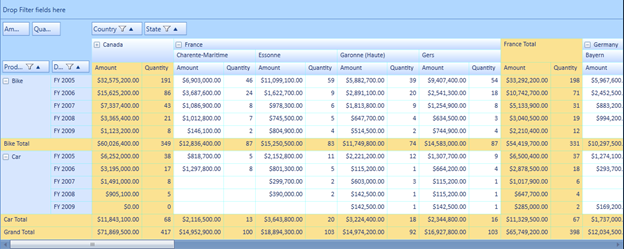
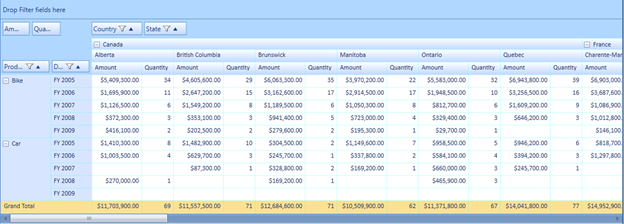

::: {style="DISPLAY: none"}
{#d2h_url_template} {#d2h_package_url style="WIDTH: 0px; DISPLAY: none; HEIGHT: 0px"}
:::

::::: {.d2h_secondary_topic style="PADDING-BOTTOM: 10pt; MARGIN: 0pt; PADDING-LEFT: 0pt; PADDING-RIGHT: 0pt; PADDING-TOP: 0pt"}
#### Subtotal Hiding {#subtotal-hiding style="tab-stops: 0pt"}

The subtotal hiding feature is used to show or hide the subtotals in the PivotGrid.[]{style="COLOR: gray"}This feature enables the user to have an abstract view of the data, in the case of larger data table by hiding subtotals using the *ShowSubTotals* property

Use Case Scenarios

When the user has more computational fields with subtotals shown below each group in their PivotGrid, the user might find it difficult to view all the data. In that case, the user can hide the subtotals and make it visible when required

The following screen shots, shows the PivotGrid with the sub totals shown and hidden:

 

{border="0"}

Figure 34 PivotGrid with Subtotals

 

{border="0"}

Figure 35 PivotGrid with Subtotals Hidden

 

Properties

Table 8: Property Table

::: {align="center"}
  --------------- ------------------------------- ------------ ----------- -----------------
  Property        Description                     Type         Data Type   Reference links
  ShowSubTotals   Shows or hides the sub totals   Dependency   Boolean     \-
  --------------- ------------------------------- ------------ ----------- -----------------
:::

[]{style="FONT-FAMILY: 'Calibri','sans-serif'; COLOR: black"} 

Methods

Table 9: Method Table

::: {align="center"}
  Method               Description                                                                                                                                                                 Parameters   Type          Return Type   Reference links
  -------------------- --------------------------------------------------------------------------------------------------------------------------------------------------------------------------- ------------ ------------- ------------- -----------------
  SubTotalsRendering   Handles rendering of cells(showing or hiding the cells) by calculating the cell range values in the Pivot Engine based on the ShowSubTotals property value in the control   \-           Server Side   Void          \-
:::

[]{style="COLOR: #c00000"} 

Sample Link

Follow the steps given below to view a sample of this feature:

1.   Select Start -\> Programs -\> Syncfusion -\> Essential Studio x.x.xx -\> Dashboard

2.   Click **Run Samples** for WPF under BI edition

3.   Select **PivotGrid**

4.   Navigate to **Product Showcase** [à]{style="FONT-FAMILY: Wingdings"} **Pivot Grid Demo**

 

Adding Subtotal Hiding to an Application

The user can show or hide the PivotGrid subtotals using the ShowSubTotals property.  To show sub totals, set this property to true. To hide subtotals, set this property to false.  By default the value of the ShowSubTotals property's values is set to true.

The following code snippet shows how to set values for the ShowSubTotals property:

To show subtotals:

+--------------------------------------------------------------------------------------------------------------------------------------------------------+
| **[\[C#\]]{style="FONT-FAMILY: 'Courier New'"}**                                                                                                       |
|                                                                                                                                                        |
| []{style="FONT-FAMILY: 'Courier New'; COLOR: blue"}                                                                                                    |
|                                                                                                                                                        |
| [this]{style="FONT-FAMILY: 'Courier New'; COLOR: blue"} [.pivotGrid1.ShowSubTotals = [true]{style="COLOR: blue"};]{style="FONT-FAMILY: 'Courier New'"} |
|                                                                                                                                                        |
| []{style="FONT-FAMILY: 'Courier New'; FONT-SIZE: 9.5pt"}                                                                                               |
+--------------------------------------------------------------------------------------------------------------------------------------------------------+

 

+-----------------------------------------------------------------------------------------------------------------------------------------------------+
| **[\[VB\]]{style="FONT-FAMILY: 'Courier New'"}**                                                                                                    |
|                                                                                                                                                     |
| **[]{style="FONT-FAMILY: 'Courier New'"}**                                                                                                          |
|                                                                                                                                                     |
| [Me]{style="FONT-FAMILY: 'Courier New'; COLOR: blue"} [.pivotGrid1.ShowSubTotals = [True]{style="COLOR: blue"}]{style="FONT-FAMILY: 'Courier New'"} |
|                                                                                                                                                     |
| []{style="FONT-FAMILY: 'Courier New'; FONT-SIZE: 9.5pt"}                                                                                            |
+-----------------------------------------------------------------------------------------------------------------------------------------------------+

 

To hide subtotals:

+---------------------------------------------------------------------------------------------------------------------------------------------------------+
| **[\[C#\]]{style="FONT-FAMILY: 'Courier New'"}**                                                                                                        |
|                                                                                                                                                         |
| []{style="FONT-FAMILY: 'Courier New'; COLOR: blue"}                                                                                                     |
|                                                                                                                                                         |
| [this]{style="FONT-FAMILY: 'Courier New'; COLOR: blue"} [.pivotGrid1.ShowSubTotals = [false]{style="COLOR: blue"};]{style="FONT-FAMILY: 'Courier New'"} |
|                                                                                                                                                         |
| []{style="FONT-FAMILY: 'Courier New'"}                                                                                                                  |
+---------------------------------------------------------------------------------------------------------------------------------------------------------+

[]{style="FONT-FAMILY: 'Courier New'"} 

+---------------------------------------------------------------------------------------------------------------------------------------------------------------------------------------------+
| **[\[VB\]]{style="FONT-FAMILY: 'Courier New'"}**                                                                                                                                            |
|                                                                                                                                                                                             |
| **[]{style="FONT-FAMILY: 'Courier New'"}**                                                                                                                                                  |
|                                                                                                                                                                                             |
| [Me]{style="FONT-FAMILY: 'Courier New'; COLOR: blue"} [.pivotGrid1.ShowSubTotals = [False]{style="COLOR: blue"}]{style="FONT-FAMILY: 'Courier New'"} []{style="FONT-FAMILY: 'Courier New'"} |
|                                                                                                                                                                                             |
| []{style="FONT-FAMILY: 'Courier New'"}                                                                                                                                                      |
+---------------------------------------------------------------------------------------------------------------------------------------------------------------------------------------------+

[]{#related-topics}
:::::
