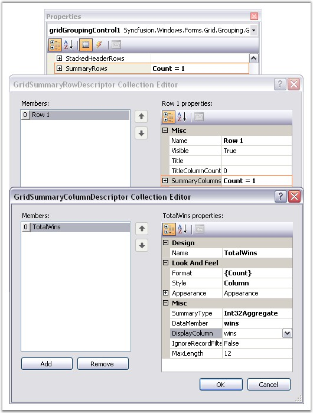
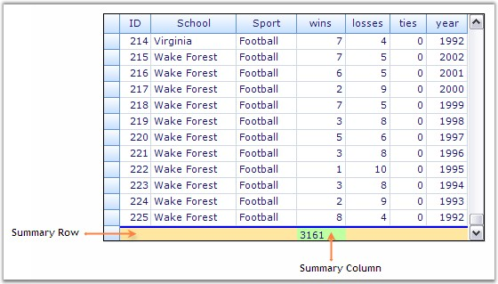
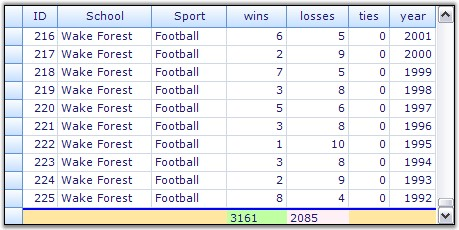
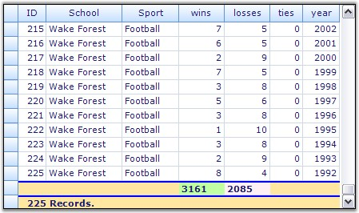
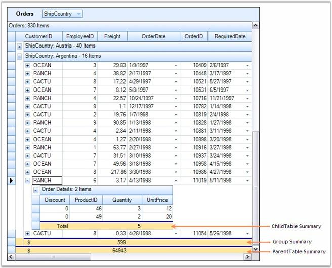
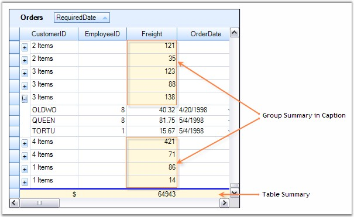
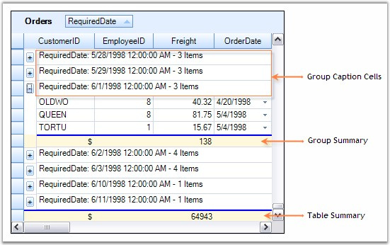
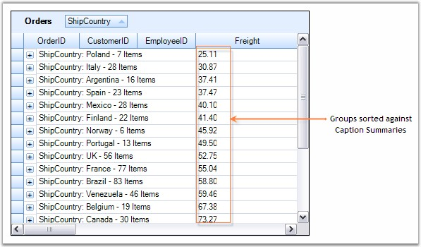

::: {style="DISPLAY: none"}
{#d2h_url_template}{#d2h_package_url style="WIDTH: 0px; DISPLAY: none; HEIGHT: 0px"}
:::

:::::::: {.d2h_secondary_topic style="PADDING-BOTTOM: 10pt; MARGIN: 0pt; PADDING-LEFT: 0pt; PADDING-RIGHT: 0pt; PADDING-TOP: 0pt"}
##### Summaries {#summaries style="tab-stops: 0pt"}

[]{style="FONT-FAMILY: 'Trebuchet MS','sans-serif'; COLOR: #15428b; FONT-SIZE: 9pt"} 

Grid Grouping control allows you to display summaries for each group. Summaries lets you derive additional information from your data like averages, maximums, summations, count, and so on.

 

For instance, you can get number of records or maximum value, and so on. They display the calculation results in separate display rows. The calculation of summary values is very fast with only O(log2 n) operations (n being the number of records in the table), because of the highly optimized balanced tree structures used in the grouping engine.

 

The grouping grid provides the following built-in summary types.

[]{style="FONT-SIZE: 8pt"} 

[·      ]{style="FONT-FAMILY: Symbol"}Int32Aggregate, DoubleAggregate (Count, Min, Max, Sum)

[·      ]{style="FONT-FAMILY: Symbol"}StringAggregate (MaxLength, Count)

[·      ]{style="FONT-FAMILY: Symbol"}Count

[·      ]{style="FONT-FAMILY: Symbol"}DistinctCount (Count, Values array)

[·      ]{style="FONT-FAMILY: Symbol"}Vector (Values)

[·      ]{style="FONT-FAMILY: Symbol"}DoubleVector (statistical methods: Median, Min, Max, 25% Quartile, 75% Quartile)

[·      ]{style="FONT-FAMILY: Symbol"}Custom (Custom Summaries)

**[]{style="FONT-SIZE: 8pt"}** 

The engine supports summaries that operate on vectors such as Distinct Count, Median, 25% and 75% Quartile. Users may also easily add custom summaries.

[]{style="FONT-FAMILY: 'Verdana','sans-serif'; FONT-SIZE: 8pt"} 

**SummaryRows Collection**

**[]{style="FONT-FAMILY: 'Verdana','sans-serif'; FONT-SIZE: 8pt"}** 

The **TableDescriptor.SummaryRows** manages a collection of summary rows for the grid table. This collection implements an abstracted view to summaries which lets users define where to display the summary in the grid. Behind the scenes, the GridEngine adds many more hidden summaries to the Summaries collection. Examples for such hidden summaries are: maximum width for contents of a cell, filter bar choices, and display entries of a ForeignKeyKeyWords relation. You can have summaries for the individual columns (**SummaryColumns**) which can then be combined into a single Summary Row for display.

[]{style="FONT-FAMILY: 'Verdana','sans-serif'; FONT-SIZE: 8pt"} 

It is the SummaryDescriptorCollection that manages the summaries for a given table containing one entry for each summary. Each SummaryDescriptor in this collection has a MappingName that identifies a FieldDescriptor for which summaries should be calculated for, and a SummaryType property that defines the type of calculations to be performed. Possible options for SummaryType are: Count, BooleanAggregate, ByteAggregate, CharAggregate, DistinctCount, DoubleAggregate, Int32Aggregate, MaxLength, StringAggregate, Vector, DoubleVector, and Custom. By default, a SummaryDescriptor ignores the records that do not satisfy a filter criteria. This behavior can be changed with the IgnoreRecordFilterCriteria flag.

[]{style="FONT-FAMILY: 'Segoe UI','sans-serif'"} 

Summaries Through Designer

 

Summaries can be set at design time itself through the property window of the grid grouping control. In the property window, the SummaryRows under the TableDescriptor node will let you manage the summaries for a grouping grid. Accessing the SummaryRows property will open the GridSummaryRowDescriptor collection editor. The editor contains a list of properties such as Title, SummaryColumn, Appearance, etc. that allows you to define the summaries for the desired columns and to control the appearance of these summaries.

[]{style="FONT-FAMILY: 'Trebuchet MS','sans-serif'; COLOR: #15428b; FONT-SIZE: 9pt"} 

{border="0"}

**[]{style="FONT-SIZE: 8pt"}** 

*[Figure ]{style="FONT-SIZE: 9pt"}[288]{style="FONT-SIZE: 9pt"}[: Property Settings to create a Summary for \"Wins\" Column]{style="FONT-SIZE: 9pt"}*

[]{style="FONT-SIZE: 8pt"} 

Through Code

[]{style="FONT-FAMILY: 'Verdana','sans-serif'; FONT-SIZE: 8pt"} 

[This example shows a grouping grid bound with a Statistics table whose columns are ID, School, Sport, wins, losses, ties and year. Follow the steps below to create a summary for wins column that displays the sum of wins\'s values.]{style="FONT-SIZE: 9pt"}

[]{style="FONT-FAMILY: 'Trebuchet MS','sans-serif'; COLOR: #15428b; FONT-SIZE: 9pt"} 

1.   Setup a SummaryColumn by instantiating GridSummaryColumnDescriptor specifying the SummaryType and format.

[]{style="FONT-FAMILY: 'Trebuchet MS','sans-serif'; COLOR: #15428b; FONT-SIZE: 9pt"} 

+-------------------------------------------------------------------------------------------------------------------------------------------------------------------------------------------------------------------+
| **[\[C#\]]{style="FONT-FAMILY: 'Courier New'; COLOR: black"}**                                                                                                                                                    |
|                                                                                                                                                                                                                   |
| []{style="FONT-FAMILY: 'Courier New'; COLOR: black"}                                                                                                                                                              |
|                                                                                                                                                                                                                   |
| [GridSummaryColumnDescriptor]{style="FONT-FAMILY: 'Courier New'; COLOR: #2b91af"}[ scd = [new]{style="COLOR: blue"} [GridSummaryColumnDescriptor]{style="COLOR: #2b91af"}();]{style="FONT-FAMILY: 'Courier New'"} |
|                                                                                                                                                                                                                   |
| [scd.Appearance.AnySummaryCell.Interior = [new]{style="COLOR: blue"} BrushInfo([Color]{style="COLOR: #2b91af"}.FromArgb(192, 255, 162));]{style="FONT-FAMILY: 'Courier New'"}                                     |
|                                                                                                                                                                                                                   |
| [scd.DataMember = [\"wins\"]{style="COLOR: #a31515"};]{style="FONT-FAMILY: 'Courier New'"}                                                                                                                        |
|                                                                                                                                                                                                                   |
| [scd.Format = [\"{Sum}\"]{style="COLOR: #a31515"};]{style="FONT-FAMILY: 'Courier New'"}                                                                                                                           |
|                                                                                                                                                                                                                   |
| [scd.Name = [\"TotalWins\"]{style="COLOR: #a31515"};]{style="FONT-FAMILY: 'Courier New'"}                                                                                                                         |
|                                                                                                                                                                                                                   |
| [scd.SummaryType = [SummaryType]{style="COLOR: #2b91af"}.Int32Aggregate;]{style="FONT-FAMILY: 'Courier New'"}                                                                                                     |
+-------------------------------------------------------------------------------------------------------------------------------------------------------------------------------------------------------------------+

[]{style="FONT-FAMILY: 'Trebuchet MS','sans-serif'; COLOR: #15428b; FONT-SIZE: 9pt"} 

+-------------------------------------------------------------------------------------------------------------------------------------------------------------------------------------------------------------------+
| **[\[VB.NET\]]{style="FONT-FAMILY: 'Courier New'; COLOR: black"}**                                                                                                                                                |
|                                                                                                                                                                                                                   |
| []{style="FONT-FAMILY: 'Courier New'; COLOR: black"}                                                                                                                                                              |
|                                                                                                                                                                                                                   |
| [Dim]{style="FONT-FAMILY: 'Courier New'; COLOR: blue"}[ scd [As]{style="COLOR: blue"} GridSummaryColumnDescriptor = [New]{style="COLOR: blue"} GridSummaryColumnDescriptor()]{style="FONT-FAMILY: 'Courier New'"} |
|                                                                                                                                                                                                                   |
| [scd.Appearance.AnySummaryCell.Interior = [New]{style="COLOR: blue"} BrushInfo(Color.FromArgb(192, 255, 162))]{style="FONT-FAMILY: 'Courier New'"}                                                                |
|                                                                                                                                                                                                                   |
| [scd.DataMember = [\"wins\"]{style="COLOR: #a31515"}]{style="FONT-FAMILY: 'Courier New'"}                                                                                                                         |
|                                                                                                                                                                                                                   |
| [scd.Format = [\"{Sum}\"]{style="COLOR: #a31515"}]{style="FONT-FAMILY: 'Courier New'"}                                                                                                                            |
|                                                                                                                                                                                                                   |
| [scd.Name = [\"TotalWins\"]{style="COLOR: #a31515"}]{style="FONT-FAMILY: 'Courier New'"}                                                                                                                          |
|                                                                                                                                                                                                                   |
| [scd.SummaryType = SummaryType.Int32Aggregate]{style="FONT-FAMILY: 'Courier New'"}                                                                                                                                |
+-------------------------------------------------------------------------------------------------------------------------------------------------------------------------------------------------------------------+

[]{style="FONT-FAMILY: 'Trebuchet MS','sans-serif'; COLOR: #15428b; FONT-SIZE: 9pt"} 

2.   Define a SummaryRow and add the SummaryColumn into it.

[]{style="FONT-SIZE: 8pt"} 

+-------------------------------------------------------------------------------------------------------------------------------------------------------------------------------------------------------------+
| **[\[C#\]]{style="FONT-FAMILY: 'Courier New'; COLOR: black"}**                                                                                                                                              |
|                                                                                                                                                                                                             |
| []{style="FONT-FAMILY: 'Courier New'; COLOR: black"}                                                                                                                                                        |
|                                                                                                                                                                                                             |
| [GridSummaryRowDescriptor]{style="FONT-FAMILY: 'Courier New'; COLOR: #2b91af"}[ srd = [new]{style="COLOR: blue"} [GridSummaryRowDescriptor]{style="COLOR: #2b91af"}();]{style="FONT-FAMILY: 'Courier New'"} |
|                                                                                                                                                                                                             |
| [srd.SummaryColumns.Add(scd);]{style="FONT-FAMILY: 'Courier New'"}                                                                                                                                          |
|                                                                                                                                                                                                             |
| [srd.Appearance.AnySummaryCell.Interior = [new]{style="COLOR: blue"} BrushInfo([Color]{style="COLOR: #2b91af"}.FromArgb(255, 231, 162));]{style="FONT-FAMILY: 'Courier New'"}                               |
+-------------------------------------------------------------------------------------------------------------------------------------------------------------------------------------------------------------+

[]{style="FONT-FAMILY: 'Trebuchet MS','sans-serif'; COLOR: #15428b; FONT-SIZE: 9pt"} 

+-------------------------------------------------------------------------------------------------------------------------------------------------------------------------------------------------------------------------------------------------------------------------------------------------------------------------------------------------------------------------------------------+
| **[\[VB.NET\]]{style="FONT-FAMILY: 'Courier New'; COLOR: black"}**                                                                                                                                                                                                                                                                                                                        |
|                                                                                                                                                                                                                                                                                                                                                                                           |
| []{style="FONT-FAMILY: 'Courier New'; COLOR: black"}                                                                                                                                                                                                                                                                                                                                      |
|                                                                                                                                                                                                                                                                                                                                                                                           |
| [Dim]{style="FONT-FAMILY: 'Courier New'; COLOR: blue"}[ srd ]{style="FONT-FAMILY: 'Courier New'; COLOR: black"}[As]{style="FONT-FAMILY: 'Courier New'; COLOR: blue"}[ GridSummaryRowDescriptor = ]{style="FONT-FAMILY: 'Courier New'; COLOR: black"}[New]{style="FONT-FAMILY: 'Courier New'; COLOR: blue"}[ GridSummaryRowDescriptor()]{style="FONT-FAMILY: 'Courier New'; COLOR: black"} |
|                                                                                                                                                                                                                                                                                                                                                                                           |
| [srd.SummaryColumns.Add(scd)]{style="FONT-FAMILY: 'Courier New'; COLOR: black"}                                                                                                                                                                                                                                                                                                           |
|                                                                                                                                                                                                                                                                                                                                                                                           |
| [srd.Appearance.AnySummaryCell.Interior = ]{style="FONT-FAMILY: 'Courier New'; COLOR: black"}[new]{style="FONT-FAMILY: 'Courier New'; COLOR: blue"}[ BrushInfo(Color.FromArgb(255, 231, 162))]{style="FONT-FAMILY: 'Courier New'; COLOR: black"}                                                                                                                                          |
+-------------------------------------------------------------------------------------------------------------------------------------------------------------------------------------------------------------------------------------------------------------------------------------------------------------------------------------------------------------------------------------------+

[]{style="FONT-FAMILY: 'Trebuchet MS','sans-serif'; COLOR: #15428b; FONT-SIZE: 9pt"} 

3.   Finally add the Summary Row into the grouping grid.

[]{style="FONT-SIZE: 8pt"} 

+------------------------------------------------------------------------------------------------------------------------------------------------------------------------+
| **[\[C#\]]{style="FONT-FAMILY: 'Courier New'; COLOR: black"}**                                                                                                         |
|                                                                                                                                                                        |
| []{style="FONT-FAMILY: 'Courier New'; COLOR: black"}                                                                                                                   |
|                                                                                                                                                                        |
| [this]{style="FONT-FAMILY: 'Courier New'; COLOR: blue"}[.gridGroupingControl1.TableDescriptor.SummaryRows.Add(srd);]{style="FONT-FAMILY: 'Courier New'; COLOR: black"} |
+------------------------------------------------------------------------------------------------------------------------------------------------------------------------+

[]{style="FONT-FAMILY: 'Trebuchet MS','sans-serif'; COLOR: #15428b; FONT-SIZE: 9pt"} 

+---------------------------------------------------------------------------------------------------------------------------------------------------------------------+
| **[\[VB.NET\]]{style="FONT-FAMILY: 'Courier New'; COLOR: black"}**                                                                                                  |
|                                                                                                                                                                     |
| []{style="FONT-FAMILY: 'Courier New'; COLOR: black"}                                                                                                                |
|                                                                                                                                                                     |
| [Me]{style="FONT-FAMILY: 'Courier New'; COLOR: blue"}[.gridGroupingControl1.TableDescriptor.SummaryRows.Add(srd)]{style="FONT-FAMILY: 'Courier New'; COLOR: black"} |
+---------------------------------------------------------------------------------------------------------------------------------------------------------------------+

[]{style="FONT-FAMILY: 'Trebuchet MS','sans-serif'; COLOR: #15428b; FONT-SIZE: 9pt"} 

4.   Run the sample. The grid will look like this.

[]{style="FONT-SIZE: 8pt"} 

{border="0"}

[]{style="FONT-FAMILY: 'Trebuchet MS','sans-serif'; COLOR: #15428b; FONT-SIZE: 9pt"} 

*[Figure ]{style="FONT-SIZE: 9pt"}[289]{style="FONT-SIZE: 9pt"}[: Summary created Through Code for \"Wins\" Column]{style="FONT-SIZE: 9pt"}*

[]{style="FONT-FAMILY: 'Trebuchet MS','sans-serif'; COLOR: #15428b; FONT-SIZE: 9pt"} 

::: {style="BORDER-BOTTOM: windowtext 1pt solid; BORDER-LEFT: medium none; PADDING-BOTTOM: 1pt; MARGIN-TOP: 9pt; PADDING-LEFT: 0pt; PADDING-RIGHT: 0pt; MARGIN-BOTTOM: 9pt; BORDER-TOP: windowtext 1pt solid; BORDER-RIGHT: medium none; PADDING-TOP: 1pt"}
{border="0"}Note: For more details, refer the following browser sample:

 

\<Install Location\>\\Syncfusion\\EssentialStudio\\\[Version Number\]\\Windows\\Grid.Grouping.Windows\\Samples\\2.0\\Calculate Summary\\Summary Tutorial
:::

 

[]{#p426} 

 

###### 4.3.4.3.3.1 Exploring Summaries {#exploring-summaries style="tab-stops: 0pt"}

[]{style="FONT-FAMILY: 'Trebuchet MS','sans-serif'; COLOR: #15428b; FONT-SIZE: 9pt"} 

In the previous chapter, we have learnt how to create simple summaries for a grid table. This chapter will explore the summaries into one more level to discuss the different forms of summaries. It is possible to have multiple summary rows for a single data table. We can define a summary for each group and also for each table when nested tables are used.

[]{style="FONT-FAMILY: 'Verdana','sans-serif'; FONT-SIZE: 8pt"} 

**Multicolumn Summaries**

 

A Summary Row can have any number of summary columns. To display summaries for more than one field, you must first create the summary columns for the desired fields. Then add those summary columns into a summary row. The code given below illustrates this.

[]{style="FONT-FAMILY: 'Segoe UI','sans-serif'; FONT-SIZE: 9pt"} 

+-----------------------------------------------------------------------------------------------------------------------------------------------------------------------------------------------------------------------------------------------------------------------------------------------------------------------------------------------------------------------------------------+
| **[\[C#\]]{style="FONT-FAMILY: 'Courier New'; COLOR: black"}**                                                                                                                                                                                                                                                                                                                          |
|                                                                                                                                                                                                                                                                                                                                                                                         |
| []{style="FONT-FAMILY: 'Courier New'; COLOR: black"}                                                                                                                                                                                                                                                                                                                                    |
|                                                                                                                                                                                                                                                                                                                                                                                         |
| [GridSummaryColumnDescriptor]{style="FONT-FAMILY: 'Courier New'; COLOR: #2b91af"}[ scd1 = [new]{style="COLOR: blue"} [GridSummaryColumnDescriptor]{style="COLOR: #2b91af"}([\"Wins\"]{style="COLOR: #a31515"}, [SummaryType]{style="COLOR: #2b91af"}.Int32Aggregate, [\"wins\"]{style="COLOR: #a31515"}, [\"{Sum}\"]{style="COLOR: #a31515"});]{style="FONT-FAMILY: 'Courier New'"}     |
|                                                                                                                                                                                                                                                                                                                                                                                         |
| [scd1.Appearance.AnySummaryCell.Interior = [new]{style="COLOR: blue"} BrushInfo([Color]{style="COLOR: #2b91af"}.FromArgb(192, 255, 162));]{style="FONT-FAMILY: 'Courier New'"}                                                                                                                                                                                                          |
|                                                                                                                                                                                                                                                                                                                                                                                         |
| []{style="FONT-FAMILY: 'Courier New'"}                                                                                                                                                                                                                                                                                                                                                  |
|                                                                                                                                                                                                                                                                                                                                                                                         |
| [GridSummaryColumnDescriptor]{style="FONT-FAMILY: 'Courier New'; COLOR: #2b91af"}[ scd2 = [new]{style="COLOR: blue"} [GridSummaryColumnDescriptor]{style="COLOR: #2b91af"}([\"Losses\"]{style="COLOR: #a31515"}, [SummaryType]{style="COLOR: #2b91af"}.Int32Aggregate, [\"losses\"]{style="COLOR: #a31515"}, [\"{Sum}\"]{style="COLOR: #a31515"});]{style="FONT-FAMILY: 'Courier New'"} |
|                                                                                                                                                                                                                                                                                                                                                                                         |
| [scd2.Appearance.AnySummaryCell.Interior = [new]{style="COLOR: blue"} BrushInfo([Color]{style="COLOR: #2b91af"}.LavenderBlush);]{style="FONT-FAMILY: 'Courier New'"}                                                                                                                                                                                                                    |
|                                                                                                                                                                                                                                                                                                                                                                                         |
| []{style="FONT-FAMILY: 'Courier New'"}                                                                                                                                                                                                                                                                                                                                                  |
|                                                                                                                                                                                                                                                                                                                                                                                         |
| [GridSummaryRowDescriptor]{style="FONT-FAMILY: 'Courier New'; COLOR: #2b91af"}[ srd = [new]{style="COLOR: blue"} [GridSummaryRowDescriptor]{style="COLOR: #2b91af"}();]{style="FONT-FAMILY: 'Courier New'"}                                                                                                                                                                             |
|                                                                                                                                                                                                                                                                                                                                                                                         |
| [srd.SummaryColumns.AddRange([new]{style="COLOR: blue"} [GridSummaryColumnDescriptor]{style="COLOR: #2b91af"}\[\] { scd1, scd2 });]{style="FONT-FAMILY: 'Courier New'"}                                                                                                                                                                                                                 |
|                                                                                                                                                                                                                                                                                                                                                                                         |
| [srd.Appearance.AnySummaryCell.Interior = [new]{style="COLOR: blue"} BrushInfo([Color]{style="COLOR: #2b91af"}.FromArgb(255, 231, 162));]{style="FONT-FAMILY: 'Courier New'"}                                                                                                                                                                                                           |
|                                                                                                                                                                                                                                                                                                                                                                                         |
| []{style="FONT-FAMILY: 'Courier New'"}                                                                                                                                                                                                                                                                                                                                                  |
|                                                                                                                                                                                                                                                                                                                                                                                         |
| [this]{style="FONT-FAMILY: 'Courier New'; COLOR: blue"}[.gridGroupingControl1.TableDescriptor.SummaryRows.Add(srd);]{style="FONT-FAMILY: 'Courier New'"}                                                                                                                                                                                                                                |
+-----------------------------------------------------------------------------------------------------------------------------------------------------------------------------------------------------------------------------------------------------------------------------------------------------------------------------------------------------------------------------------------+

[]{style="FONT-FAMILY: 'Trebuchet MS','sans-serif'; COLOR: #15428b; FONT-SIZE: 9pt"} 

+---------------------------------------------------------------------------------------------------------------------------------------------------------------------------------------------------------------------------------------------------------------------------------------------------------------------------------------------------------------+
| **[\[VB.NET\]]{style="FONT-FAMILY: 'Courier New'; COLOR: black"}**                                                                                                                                                                                                                                                                                            |
|                                                                                                                                                                                                                                                                                                                                                               |
| []{style="FONT-FAMILY: 'Courier New'; COLOR: black"}                                                                                                                                                                                                                                                                                                          |
|                                                                                                                                                                                                                                                                                                                                                               |
| [Dim]{style="FONT-FAMILY: 'Courier New'; COLOR: blue"}[ scd1 [As]{style="COLOR: blue"} GridSummaryColumnDescriptor = [New]{style="COLOR: blue"} GridSummaryColumnDescriptor([\"Wins\"]{style="COLOR: #a31515"}, SummaryType.Int32Aggregate, [\"wins\"]{style="COLOR: #a31515"}, [\"{Sum}\"]{style="COLOR: #a31515"})]{style="FONT-FAMILY: 'Courier New'"}     |
|                                                                                                                                                                                                                                                                                                                                                               |
| [scd1.Appearance.AnySummaryCell.Interior = [New]{style="COLOR: blue"} BrushInfo(Color.FromArgb(192, 255, 162))]{style="FONT-FAMILY: 'Courier New'"}                                                                                                                                                                                                           |
|                                                                                                                                                                                                                                                                                                                                                               |
| []{style="FONT-FAMILY: 'Courier New'"}                                                                                                                                                                                                                                                                                                                        |
|                                                                                                                                                                                                                                                                                                                                                               |
| [Dim]{style="FONT-FAMILY: 'Courier New'; COLOR: blue"}[ scd2 [As]{style="COLOR: blue"} GridSummaryColumnDescriptor = [New]{style="COLOR: blue"} GridSummaryColumnDescriptor([\"Losses\"]{style="COLOR: #a31515"}, SummaryType.Int32Aggregate, [\"losses\"]{style="COLOR: #a31515"}, [\"{Sum}\"]{style="COLOR: #a31515"})]{style="FONT-FAMILY: 'Courier New'"} |
|                                                                                                                                                                                                                                                                                                                                                               |
| [scd2.Appearance.AnySummaryCell.Interior = [New]{style="COLOR: blue"} BrushInfo(Color.LavenderBlush)]{style="FONT-FAMILY: 'Courier New'"}                                                                                                                                                                                                                     |
|                                                                                                                                                                                                                                                                                                                                                               |
| []{style="FONT-FAMILY: 'Courier New'"}                                                                                                                                                                                                                                                                                                                        |
|                                                                                                                                                                                                                                                                                                                                                               |
| [Dim]{style="FONT-FAMILY: 'Courier New'; COLOR: blue"}[ srd [As]{style="COLOR: blue"} GridSummaryRowDescriptor = [New]{style="COLOR: blue"} GridSummaryRowDescriptor()]{style="FONT-FAMILY: 'Courier New'"}                                                                                                                                                   |
|                                                                                                                                                                                                                                                                                                                                                               |
| [srd.SummaryColumns.AddRange([New]{style="COLOR: blue"} GridSummaryColumnDescriptor() {scd1, scd2})]{style="FONT-FAMILY: 'Courier New'"}                                                                                                                                                                                                                      |
|                                                                                                                                                                                                                                                                                                                                                               |
| [srd.Appearance.AnySummaryCell.Interior = [New]{style="COLOR: blue"} BrushInfo(Color.FromArgb(255, 231, 162))]{style="FONT-FAMILY: 'Courier New'"}                                                                                                                                                                                                            |
|                                                                                                                                                                                                                                                                                                                                                               |
| []{style="FONT-FAMILY: 'Courier New'"}                                                                                                                                                                                                                                                                                                                        |
|                                                                                                                                                                                                                                                                                                                                                               |
| [Me]{style="FONT-FAMILY: 'Courier New'; COLOR: blue"}[.gridGroupingControl1.TableDescriptor.SummaryRows.Add(srd)]{style="FONT-FAMILY: 'Courier New'"}                                                                                                                                                                                                         |
+---------------------------------------------------------------------------------------------------------------------------------------------------------------------------------------------------------------------------------------------------------------------------------------------------------------------------------------------------------------+

[]{style="FONT-FAMILY: 'Trebuchet MS','sans-serif'; COLOR: #15428b; FONT-SIZE: 9pt"} 

Here is a sample screenshot displaying the summaries for the columns **wins** and **losses**.

[]{style="FONT-FAMILY: 'Trebuchet MS','sans-serif'; COLOR: #15428b; FONT-SIZE: 9pt"} 

{border="0"}

[]{style="FONT-FAMILY: 'Trebuchet MS','sans-serif'; COLOR: #15428b; FONT-SIZE: 9pt"} 

*[Figure ]{style="FONT-SIZE: 9pt"}[290]{style="FONT-SIZE: 9pt"}[: Multi Column Summaries]{style="FONT-SIZE: 9pt"}*

[]{style="FONT-FAMILY: 'Trebuchet MS','sans-serif'; COLOR: #15428b; FONT-SIZE: 9pt"} 

Multi Row Summaries

 

[Grouping Grid allows you to have summaries for more than one row. It is achieved by defining a required number of summary row descriptors. Each of the summary rows can have its own format for calculating the summaries. Here is an example that shows how to add two different summary rows for a grid table.]{style="FONT-SIZE: 9pt"}

[]{style="FONT-FAMILY: 'Trebuchet MS','sans-serif'; COLOR: #15428b; FONT-SIZE: 9pt"} 

+-----------------------------------------------------------------------------------------------------------------------------------------------------------------------------------------------------------------------------------------------------------------------------------------------------------------------------------------------------------------------------------------+
| **[\[C#\]]{style="FONT-FAMILY: 'Courier New'; COLOR: black"}**                                                                                                                                                                                                                                                                                                                          |
|                                                                                                                                                                                                                                                                                                                                                                                         |
| []{style="FONT-FAMILY: 'Courier New'; COLOR: black"}                                                                                                                                                                                                                                                                                                                                    |
|                                                                                                                                                                                                                                                                                                                                                                                         |
| [GridSummaryColumnDescriptor]{style="FONT-FAMILY: 'Courier New'; COLOR: #2b91af"}[ scd1 = [new]{style="COLOR: blue"} [GridSummaryColumnDescriptor]{style="COLOR: #2b91af"}([\"Wins\"]{style="COLOR: #a31515"}, [SummaryType]{style="COLOR: #2b91af"}.Int32Aggregate, [\"wins\"]{style="COLOR: #a31515"}, [\"{Sum}\"]{style="COLOR: #a31515"});]{style="FONT-FAMILY: 'Courier New'"}     |
|                                                                                                                                                                                                                                                                                                                                                                                         |
| [scd1.Appearance.AnySummaryCell.Interior = [new]{style="COLOR: blue"} BrushInfo([Color]{style="COLOR: #2b91af"}.FromArgb(192, 255, 162));]{style="FONT-FAMILY: 'Courier New'"}                                                                                                                                                                                                          |
|                                                                                                                                                                                                                                                                                                                                                                                         |
| []{style="FONT-FAMILY: 'Courier New'"}                                                                                                                                                                                                                                                                                                                                                  |
|                                                                                                                                                                                                                                                                                                                                                                                         |
| [GridSummaryColumnDescriptor]{style="FONT-FAMILY: 'Courier New'; COLOR: #2b91af"}[ scd2 = [new]{style="COLOR: blue"} [GridSummaryColumnDescriptor]{style="COLOR: #2b91af"}([\"Losses\"]{style="COLOR: #a31515"}, [SummaryType]{style="COLOR: #2b91af"}.Int32Aggregate, [\"losses\"]{style="COLOR: #a31515"}, [\"{Sum}\"]{style="COLOR: #a31515"});]{style="FONT-FAMILY: 'Courier New'"} |
|                                                                                                                                                                                                                                                                                                                                                                                         |
| [scd2.Appearance.AnySummaryCell.Interior = [new]{style="COLOR: blue"} BrushInfo([Color]{style="COLOR: #2b91af"}.LavenderBlush);]{style="FONT-FAMILY: 'Courier New'"}                                                                                                                                                                                                                    |
|                                                                                                                                                                                                                                                                                                                                                                                         |
| []{style="FONT-FAMILY: 'Courier New'"}                                                                                                                                                                                                                                                                                                                                                  |
|                                                                                                                                                                                                                                                                                                                                                                                         |
| [GridSummaryRowDescriptor]{style="FONT-FAMILY: 'Courier New'; COLOR: #2b91af"}[ srd = [new]{style="COLOR: blue"} [GridSummaryRowDescriptor]{style="COLOR: #2b91af"}();]{style="FONT-FAMILY: 'Courier New'"}                                                                                                                                                                             |
|                                                                                                                                                                                                                                                                                                                                                                                         |
| [srd.SummaryColumns.AddRange([new]{style="COLOR: blue"} [GridSummaryColumnDescriptor]{style="COLOR: #2b91af"}\[\] { scd1, scd2 });]{style="FONT-FAMILY: 'Courier New'"}                                                                                                                                                                                                                 |
|                                                                                                                                                                                                                                                                                                                                                                                         |
| [srd.Appearance.AnySummaryCell.Interior = [new]{style="COLOR: blue"} BrushInfo([Color]{style="COLOR: #2b91af"}.FromArgb(255, 231, 162));]{style="FONT-FAMILY: 'Courier New'"}                                                                                                                                                                                                           |
|                                                                                                                                                                                                                                                                                                                                                                                         |
| []{style="FONT-FAMILY: 'Courier New'"}                                                                                                                                                                                                                                                                                                                                                  |
|                                                                                                                                                                                                                                                                                                                                                                                         |
| [GridSummaryColumnDescriptor]{style="FONT-FAMILY: 'Courier New'; COLOR: #2b91af"}[ scd3 = [new]{style="COLOR: blue"} [GridSummaryColumnDescriptor]{style="COLOR: #2b91af"}([\"Total\"]{style="COLOR: #a31515"}, [SummaryType]{style="COLOR: #2b91af"}.Count, [\"{Count} Records.\"]{style="COLOR: #a31515"});]{style="FONT-FAMILY: 'Courier New'"}                                      |
|                                                                                                                                                                                                                                                                                                                                                                                         |
| [GridSummaryRowDescriptor]{style="FONT-FAMILY: 'Courier New'; COLOR: #2b91af"}[ srd = [new]{style="COLOR: blue"} [GridSummaryRowDescriptor]{style="COLOR: #2b91af"}([\"Row2\"]{style="COLOR: #a31515"}, scd3);]{style="FONT-FAMILY: 'Courier New'"}                                                                                                                                     |
|                                                                                                                                                                                                                                                                                                                                                                                         |
| [srd2.Appearance.AnySummaryCell.Interior = [new]{style="COLOR: blue"} BrushInfo([Color]{style="COLOR: #2b91af"}.FromArgb(255, 231, 162));]{style="FONT-FAMILY: 'Courier New'"}                                                                                                                                                                                                          |
|                                                                                                                                                                                                                                                                                                                                                                                         |
| []{style="FONT-FAMILY: 'Courier New'"}                                                                                                                                                                                                                                                                                                                                                  |
|                                                                                                                                                                                                                                                                                                                                                                                         |
| [this]{style="FONT-FAMILY: 'Courier New'; COLOR: blue"}[.gridGroupingControl1.TableDescriptor.SummaryRows.AddRange([new]{style="COLOR: blue"} [GridSummaryRowDescriptor]{style="COLOR: #2b91af"}\[\] { srd1, srd2 });]{style="FONT-FAMILY: 'Courier New'"}                                                                                                                              |
+-----------------------------------------------------------------------------------------------------------------------------------------------------------------------------------------------------------------------------------------------------------------------------------------------------------------------------------------------------------------------------------------+

[]{style="FONT-FAMILY: 'Trebuchet MS','sans-serif'; COLOR: #15428b; FONT-SIZE: 9pt"} 

+---------------------------------------------------------------------------------------------------------------------------------------------------------------------------------------------------------------------------------------------------------------------------------------------------------------------------------------------------------------+
| **[\[VB.NET\]]{style="FONT-FAMILY: 'Courier New'; COLOR: black"}**                                                                                                                                                                                                                                                                                            |
|                                                                                                                                                                                                                                                                                                                                                               |
| []{style="FONT-FAMILY: 'Courier New'; COLOR: black"}                                                                                                                                                                                                                                                                                                          |
|                                                                                                                                                                                                                                                                                                                                                               |
| [Dim]{style="FONT-FAMILY: 'Courier New'; COLOR: blue"}[ scd1 [As]{style="COLOR: blue"} GridSummaryColumnDescriptor = [New]{style="COLOR: blue"} GridSummaryColumnDescriptor([\"Wins\"]{style="COLOR: #a31515"}, SummaryType.Int32Aggregate, [\"wins\"]{style="COLOR: #a31515"}, [\"{Sum}\"]{style="COLOR: #a31515"})]{style="FONT-FAMILY: 'Courier New'"}     |
|                                                                                                                                                                                                                                                                                                                                                               |
| [scd1.Appearance.AnySummaryCell.Interior = [New]{style="COLOR: blue"} BrushInfo(Color.FromArgb(192, 255, 162))]{style="FONT-FAMILY: 'Courier New'"}                                                                                                                                                                                                           |
|                                                                                                                                                                                                                                                                                                                                                               |
| []{style="FONT-FAMILY: 'Courier New'"}                                                                                                                                                                                                                                                                                                                        |
|                                                                                                                                                                                                                                                                                                                                                               |
| [Dim]{style="FONT-FAMILY: 'Courier New'; COLOR: blue"}[ scd2 [As]{style="COLOR: blue"} GridSummaryColumnDescriptor = [New]{style="COLOR: blue"} GridSummaryColumnDescriptor([\"Losses\"]{style="COLOR: #a31515"}, SummaryType.Int32Aggregate, [\"losses\"]{style="COLOR: #a31515"}, [\"{Sum}\"]{style="COLOR: #a31515"})]{style="FONT-FAMILY: 'Courier New'"} |
|                                                                                                                                                                                                                                                                                                                                                               |
| [scd2.Appearance.AnySummaryCell.Interior = [New]{style="COLOR: blue"} BrushInfo(Color.LavenderBlush)]{style="FONT-FAMILY: 'Courier New'"}                                                                                                                                                                                                                     |
|                                                                                                                                                                                                                                                                                                                                                               |
| []{style="FONT-FAMILY: 'Courier New'"}                                                                                                                                                                                                                                                                                                                        |
|                                                                                                                                                                                                                                                                                                                                                               |
| [Dim]{style="FONT-FAMILY: 'Courier New'; COLOR: blue"}[ srd1 [As]{style="COLOR: blue"} GridSummaryRowDescriptor = [New]{style="COLOR: blue"} GridSummaryRowDescriptor()]{style="FONT-FAMILY: 'Courier New'"}                                                                                                                                                  |
|                                                                                                                                                                                                                                                                                                                                                               |
| [srd1.SummaryColumns.AddRange([New]{style="COLOR: blue"} GridSummaryColumnDescriptor() {scd1, scd2})]{style="FONT-FAMILY: 'Courier New'"}                                                                                                                                                                                                                     |
|                                                                                                                                                                                                                                                                                                                                                               |
| [srd1.Appearance.AnySummaryCell.Interior = [New]{style="COLOR: blue"} BrushInfo(Color.FromArgb(255, 231, 162))]{style="FONT-FAMILY: 'Courier New'"}                                                                                                                                                                                                           |
|                                                                                                                                                                                                                                                                                                                                                               |
| []{style="FONT-FAMILY: 'Courier New'"}                                                                                                                                                                                                                                                                                                                        |
|                                                                                                                                                                                                                                                                                                                                                               |
| [Dim]{style="FONT-FAMILY: 'Courier New'; COLOR: blue"}[ scd3 [As]{style="COLOR: blue"} GridSummaryColumnDescriptor = [New]{style="COLOR: blue"} GridSummaryColumnDescriptor([\"Total\"]{style="COLOR: #a31515"}, SummaryType.Count, [\"{Count} Records.\"]{style="COLOR: #a31515"})]{style="FONT-FAMILY: 'Courier New'"}                                      |
|                                                                                                                                                                                                                                                                                                                                                               |
| [Dim]{style="FONT-FAMILY: 'Courier New'; COLOR: blue"}[ srd2 [As]{style="COLOR: blue"} GridSummaryRowDescriptor = [New]{style="COLOR: blue"} GridSummaryRowDescriptor([\"Row2\"]{style="COLOR: #a31515"}, scd3)]{style="FONT-FAMILY: 'Courier New'"}                                                                                                          |
|                                                                                                                                                                                                                                                                                                                                                               |
| [srd2.Appearance.AnySummaryCell.Interior = [New]{style="COLOR: blue"} BrushInfo(Color.FromArgb(255, 231, 162))]{style="FONT-FAMILY: 'Courier New'"}                                                                                                                                                                                                           |
|                                                                                                                                                                                                                                                                                                                                                               |
| []{style="FONT-FAMILY: 'Courier New'"}                                                                                                                                                                                                                                                                                                                        |
|                                                                                                                                                                                                                                                                                                                                                               |
| [Me]{style="FONT-FAMILY: 'Courier New'; COLOR: blue"}[.gridGroupingControl1.TableDescriptor.SummaryRows.AddRange([New]{style="COLOR: blue"} GridSummaryRowDescriptor() {srd1, srd2})]{style="FONT-FAMILY: 'Courier New'"}                                                                                                                                     |
+---------------------------------------------------------------------------------------------------------------------------------------------------------------------------------------------------------------------------------------------------------------------------------------------------------------------------------------------------------------+

[]{style="FONT-FAMILY: 'Trebuchet MS','sans-serif'; COLOR: #15428b; FONT-SIZE: 9pt"} 

Given below is a sample screenshot.

[]{style="FONT-FAMILY: 'Trebuchet MS','sans-serif'; COLOR: #15428b; FONT-SIZE: 9pt"} 

{border="0"}

***[]{style="FONT-FAMILY: 'Trebuchet MS','sans-serif'; COLOR: #15428b; FONT-SIZE: 9pt"}*** 

*[Figure ]{style="FONT-SIZE: 9pt"}[291]{style="FONT-SIZE: 9pt"}[: Multi Row Summaries]{style="FONT-SIZE: 9pt"}*

 

Summaries for Nested Tables and Groups

 

Say your datasource has two tables nested, Orders and Order Details, with summaries for the parent table. The summaries that are set for the top level table are sufficient enough for the groups. You need to define summary rows only for the child tables. It can be achieved by creating summaries through the ChildTableDescriptor. The following code illustrates this process.

[]{style="FONT-SIZE: 8pt"} 

+-----------------------------------------------------------------------------------------------------------------------------------------------------------------------------------------------------------------------------------------------------------------------------------------------------------------------------------------------------------------------------------------+
| **[\[C#\]]{style="FONT-FAMILY: 'Courier New'; COLOR: black"}**                                                                                                                                                                                                                                                                                                                          |
|                                                                                                                                                                                                                                                                                                                                                                                         |
| []{style="FONT-FAMILY: 'Courier New'; COLOR: black"}                                                                                                                                                                                                                                                                                                                                    |
|                                                                                                                                                                                                                                                                                                                                                                                         |
| [// Adding Summaries for the Parent Table(Orders).]{style="FONT-FAMILY: 'Courier New'; COLOR: green"}                                                                                                                                                                                                                                                                                   |
|                                                                                                                                                                                                                                                                                                                                                                                         |
| [GridSummaryColumnDescriptor]{style="FONT-FAMILY: 'Courier New'; COLOR: #2b91af"}[ scd = [new]{style="COLOR: blue"} [GridSummaryColumnDescriptor]{style="COLOR: #2b91af"}([\"Sum\"]{style="COLOR: #a31515"}, [SummaryType]{style="COLOR: #2b91af"}.DoubleAggregate, [\"Freight\"]{style="COLOR: #a31515"}, [\"{Sum:#}\"]{style="COLOR: #a31515"});]{style="FONT-FAMILY: 'Courier New'"} |
|                                                                                                                                                                                                                                                                                                                                                                                         |
| [GridSummaryRowDescriptor]{style="FONT-FAMILY: 'Courier New'; COLOR: #2b91af"}[ srd = [new]{style="COLOR: blue"} [GridSummaryRowDescriptor]{style="COLOR: #2b91af"}([\"Sum\"]{style="COLOR: #a31515"}, [\"\$\"]{style="COLOR: #a31515"}, scd);]{style="FONT-FAMILY: 'Courier New'"}                                                                                                     |
|                                                                                                                                                                                                                                                                                                                                                                                         |
| [srd.Appearance.AnyCell.HorizontalAlignment = [GridHorizontalAlignment]{style="COLOR: #2b91af"}.Right;]{style="FONT-FAMILY: 'Courier New'"}                                                                                                                                                                                                                                             |
|                                                                                                                                                                                                                                                                                                                                                                                         |
| [srd.Appearance.AnyCell.BackColor = [Color]{style="COLOR: #2b91af"}.FromArgb(255, 231, 162);]{style="FONT-FAMILY: 'Courier New'"}                                                                                                                                                                                                                                                       |
|                                                                                                                                                                                                                                                                                                                                                                                         |
| [this]{style="FONT-FAMILY: 'Courier New'; COLOR: blue"}[.gridGroupingControl1.TableDescriptor.SummaryRows.Add(srd);]{style="FONT-FAMILY: 'Courier New'"}                                                                                                                                                                                                                                |
|                                                                                                                                                                                                                                                                                                                                                                                         |
| []{style="FONT-FAMILY: 'Courier New'"}                                                                                                                                                                                                                                                                                                                                                  |
|                                                                                                                                                                                                                                                                                                                                                                                         |
| [// Adding Summaries for the Child Table(Order Details).]{style="FONT-FAMILY: 'Courier New'; COLOR: green"}                                                                                                                                                                                                                                                                             |
|                                                                                                                                                                                                                                                                                                                                                                                         |
| [scd = [new]{style="COLOR: blue"} [GridSummaryColumnDescriptor]{style="COLOR: #2b91af"}([\"Sum\"]{style="COLOR: #a31515"}, [SummaryType]{style="COLOR: #2b91af"}.Int32Aggregate, [\"Quantity\"]{style="COLOR: #a31515"}, [\"{Sum:#}\"]{style="COLOR: #a31515"});]{style="FONT-FAMILY: 'Courier New'"}                                                                                   |
|                                                                                                                                                                                                                                                                                                                                                                                         |
| [srd = [new]{style="COLOR: blue"} [GridSummaryRowDescriptor]{style="COLOR: #2b91af"}([\"Sum\"]{style="COLOR: #a31515"}, [\"Total\"]{style="COLOR: #a31515"}, scd);]{style="FONT-FAMILY: 'Courier New'"}                                                                                                                                                                                 |
|                                                                                                                                                                                                                                                                                                                                                                                         |
| [srd.Appearance.AnyCell.HorizontalAlignment = [GridHorizontalAlignment]{style="COLOR: #2b91af"}.Right;]{style="FONT-FAMILY: 'Courier New'"}                                                                                                                                                                                                                                             |
|                                                                                                                                                                                                                                                                                                                                                                                         |
| [srd.Appearance.AnyCell.BackColor = [Color]{style="COLOR: #2b91af"}.FromArgb(255, 231, 162);]{style="FONT-FAMILY: 'Courier New'"}                                                                                                                                                                                                                                                       |
|                                                                                                                                                                                                                                                                                                                                                                                         |
| [this]{style="FONT-FAMILY: 'Courier New'; COLOR: blue"}[.gridGroupingControl1.GetTableDescriptor([\"Order Details\"]{style="COLOR: #a31515"}).SummaryRows.Add(srd);]{style="FONT-FAMILY: 'Courier New'"}                                                                                                                                                                                |
+-----------------------------------------------------------------------------------------------------------------------------------------------------------------------------------------------------------------------------------------------------------------------------------------------------------------------------------------------------------------------------------------+

[]{style="FONT-FAMILY: 'Trebuchet MS','sans-serif'; COLOR: #15428b; FONT-SIZE: 9pt"} 

+---------------------------------------------------------------------------------------------------------------------------------------------------------------------------------------------------------------------------------------------------------------------------------------------------------------------------------------------------------------+
| **[\[VB.NET\]]{style="FONT-FAMILY: 'Courier New'; COLOR: black"}**                                                                                                                                                                                                                                                                                            |
|                                                                                                                                                                                                                                                                                                                                                               |
| []{style="FONT-FAMILY: 'Courier New'; COLOR: black"}                                                                                                                                                                                                                                                                                                          |
|                                                                                                                                                                                                                                                                                                                                                               |
| [\' Adding Summaries for the Parent Table(Orders).]{style="FONT-FAMILY: 'Courier New'; COLOR: green"}                                                                                                                                                                                                                                                         |
|                                                                                                                                                                                                                                                                                                                                                               |
| [Dim]{style="FONT-FAMILY: 'Courier New'; COLOR: blue"}[ scd [As]{style="COLOR: blue"} GridSummaryColumnDescriptor = [New]{style="COLOR: blue"} GridSummaryColumnDescriptor([\"Sum\"]{style="COLOR: #a31515"}, SummaryType.DoubleAggregate, [\"Freight\"]{style="COLOR: #a31515"}, [\"{Sum:#}\"]{style="COLOR: #a31515"})]{style="FONT-FAMILY: 'Courier New'"} |
|                                                                                                                                                                                                                                                                                                                                                               |
| [Dim]{style="FONT-FAMILY: 'Courier New'; COLOR: blue"}[ srd [As]{style="COLOR: blue"} GridSummaryRowDescriptor = [New]{style="COLOR: blue"} GridSummaryRowDescriptor([\"Sum\"]{style="COLOR: #a31515"}, [\"\$\"]{style="COLOR: #a31515"}, scd)]{style="FONT-FAMILY: 'Courier New'"}                                                                           |
|                                                                                                                                                                                                                                                                                                                                                               |
| [srd.Appearance.AnyCell.HorizontalAlignment = GridHorizontalAlignment.Right]{style="FONT-FAMILY: 'Courier New'"}                                                                                                                                                                                                                                              |
|                                                                                                                                                                                                                                                                                                                                                               |
| [srd.Appearance.AnyCell.BackColor = Color.FromArgb(255, 231, 162)]{style="FONT-FAMILY: 'Courier New'"}                                                                                                                                                                                                                                                        |
|                                                                                                                                                                                                                                                                                                                                                               |
| [Me]{style="FONT-FAMILY: 'Courier New'; COLOR: blue"}[.gridGroupingControl1.TableDescriptor.SummaryRows.Add(srd)]{style="FONT-FAMILY: 'Courier New'"}                                                                                                                                                                                                         |
|                                                                                                                                                                                                                                                                                                                                                               |
| []{style="FONT-FAMILY: 'Courier New'"}                                                                                                                                                                                                                                                                                                                        |
|                                                                                                                                                                                                                                                                                                                                                               |
| [\' Adding Summaries for the Child Table(Order Details).]{style="FONT-FAMILY: 'Courier New'; COLOR: green"}                                                                                                                                                                                                                                                   |
|                                                                                                                                                                                                                                                                                                                                                               |
| [scd = [New]{style="COLOR: blue"} GridSummaryColumnDescriptor([\"Sum\"]{style="COLOR: #a31515"}, SummaryType.Int32Aggregate, [\"Quantity\"]{style="COLOR: #a31515"}, [\"{Sum:#}\"]{style="COLOR: #a31515"})]{style="FONT-FAMILY: 'Courier New'"}                                                                                                              |
|                                                                                                                                                                                                                                                                                                                                                               |
| [srd = [New]{style="COLOR: blue"} GridSummaryRowDescriptor([\"Sum\"]{style="COLOR: #a31515"}, [\"Total\"]{style="COLOR: #a31515"}, scd)]{style="FONT-FAMILY: 'Courier New'"}                                                                                                                                                                                  |
|                                                                                                                                                                                                                                                                                                                                                               |
| [srd.Appearance.AnyCell.HorizontalAlignment = GridHorizontalAlignment.Right]{style="FONT-FAMILY: 'Courier New'"}                                                                                                                                                                                                                                              |
|                                                                                                                                                                                                                                                                                                                                                               |
| [srd.Appearance.AnyCell.BackColor = Color.FromArgb(255, 231, 162)]{style="FONT-FAMILY: 'Courier New'"}                                                                                                                                                                                                                                                        |
|                                                                                                                                                                                                                                                                                                                                                               |
| [Me]{style="FONT-FAMILY: 'Courier New'; COLOR: blue"}[.gridGroupingControl1.GetTableDescriptor([\"Order Details\"]{style="COLOR: #a31515"}).SummaryRows.Add(srd)]{style="FONT-FAMILY: 'Courier New'"}                                                                                                                                                         |
+---------------------------------------------------------------------------------------------------------------------------------------------------------------------------------------------------------------------------------------------------------------------------------------------------------------------------------------------------------------+

[]{style="FONT-FAMILY: 'Trebuchet MS','sans-serif'; COLOR: #15428b; FONT-SIZE: 9pt"} 

Here is a sample screen shot.

[]{style="FONT-SIZE: 8pt"} 

{border="0"}

***[]{style="FONT-FAMILY: 'Trebuchet MS','sans-serif'; COLOR: #15428b; FONT-SIZE: 9pt"}*** 

*[Figure ]{style="FONT-SIZE: 9pt"}[292]{style="FONT-SIZE: 9pt"}[: Summaries for Nested Tables and Groups]{style="FONT-SIZE: 9pt"}*

[]{style="FONT-FAMILY: 'Trebuchet MS','sans-serif'; COLOR: #15428b; FONT-SIZE: 9pt"} 

::: {style="BORDER-BOTTOM: windowtext 1pt solid; BORDER-LEFT: medium none; PADDING-BOTTOM: 1pt; MARGIN-TOP: 9pt; PADDING-LEFT: 0pt; PADDING-RIGHT: 0pt; MARGIN-BOTTOM: 9pt; BORDER-TOP: windowtext 1pt solid; BORDER-RIGHT: medium none; PADDING-TOP: 1pt"}
{border="0"}Note: For more details, refer the following browser sample:

\<Install Location\>\\Syncfusion\\EssentialStudio\\\[Version Number\]\\Windows\\Grid.Grouping.Windows\\Samples\\2.0\\Calculate Summary\\Nested-Table and Group Summary Demo
:::

 

[]{#p427} 

 

###### 4.3.4.3.3.2 Summary In Caption {#summary-in-caption style="tab-stops: 0pt"}

[]{style="FONT-FAMILY: 'Trebuchet MS','sans-serif'; COLOR: #15428b; FONT-SIZE: 9pt"} 

Grid Grouping control provides built-in options to display group summaries for the columns in GroupCaptions instead of creating distinct rows for summaries. It can be easily achieved with few property settings. The below table describes these properties which can be accessed through the **GroupOptions**.

[]{style="FONT-FAMILY: 'Trebuchet MS','sans-serif'; COLOR: #15428b; FONT-SIZE: 9pt"} 

::: {align="center"}
  ------------------------- ---------------------------------------------------------------------------------------------------------------------------
  Property Name             Description
  ShowCaptionSummaryCells   Decides whether GroupCaptionCells are allowed to display summaries for the columns.
  ShowSummaries             Indicates whether summaries are visible.
  CaptionSummaryRow         Lets you specify a summary row that should be displayed in the caption cells when ShowCaptionSummaryCells is set to true.
  CaptionText               Lets you control the caption text to be displayed.
  ------------------------- ---------------------------------------------------------------------------------------------------------------------------
:::

[]{style="FONT-FAMILY: 'Trebuchet MS','sans-serif'; COLOR: #15428b; FONT-SIZE: 9pt"} 

Steps to create Caption Summaries

[]{style="FONT-FAMILY: 'Trebuchet MS','sans-serif'; COLOR: #15428b; FONT-SIZE: 9pt"} 

1.   First, define a summary for the grid table. Then group the table against a data column.

[]{style="FONT-FAMILY: 'Trebuchet MS','sans-serif'; COLOR: #15428b; FONT-SIZE: 9pt"} 

+-----------------------------------------------------------------------------------------------------------------------------------------------------------------------------------------------------------------------------------------------------------------------------------------------------------------------------------------------------------------------------------------+
| **[\[C#\]]{style="FONT-FAMILY: 'Courier New'; COLOR: black"}**                                                                                                                                                                                                                                                                                                                          |
|                                                                                                                                                                                                                                                                                                                                                                                         |
| []{style="FONT-FAMILY: 'Courier New'; COLOR: black"}                                                                                                                                                                                                                                                                                                                                    |
|                                                                                                                                                                                                                                                                                                                                                                                         |
| [// Adding Summaries.]{style="FONT-FAMILY: 'Courier New'; COLOR: green"}                                                                                                                                                                                                                                                                                                                |
|                                                                                                                                                                                                                                                                                                                                                                                         |
| [GridSummaryColumnDescriptor]{style="FONT-FAMILY: 'Courier New'; COLOR: #2b91af"}[ scd = [new]{style="COLOR: blue"} [GridSummaryColumnDescriptor]{style="COLOR: #2b91af"}([\"Sum\"]{style="COLOR: #a31515"}, [SummaryType]{style="COLOR: #2b91af"}.DoubleAggregate, [\"Freight\"]{style="COLOR: #a31515"}, [\"{Sum:#}\"]{style="COLOR: #a31515"});]{style="FONT-FAMILY: 'Courier New'"} |
|                                                                                                                                                                                                                                                                                                                                                                                         |
| [GridSummaryRowDescriptor]{style="FONT-FAMILY: 'Courier New'; COLOR: #2b91af"}[ srd = [new]{style="COLOR: blue"} [GridSummaryRowDescriptor]{style="COLOR: #2b91af"}([\"Sum\"]{style="COLOR: #a31515"}, [\"\$\"]{style="COLOR: #a31515"}, scd);]{style="FONT-FAMILY: 'Courier New'"}                                                                                                     |
|                                                                                                                                                                                                                                                                                                                                                                                         |
| [srd.Appearance.AnyCell.HorizontalAlignment = [GridHorizontalAlignment]{style="COLOR: #2b91af"}.Right;]{style="FONT-FAMILY: 'Courier New'"}                                                                                                                                                                                                                                             |
|                                                                                                                                                                                                                                                                                                                                                                                         |
| [srd.Appearance.AnyCell.BackColor = [Color]{style="COLOR: #2b91af"}.Cornsilk;]{style="FONT-FAMILY: 'Courier New'"}                                                                                                                                                                                                                                                                      |
|                                                                                                                                                                                                                                                                                                                                                                                         |
| [this]{style="FONT-FAMILY: 'Courier New'; COLOR: blue"}[.gridGroupingControl1.GetTableDescriptor([\"Orders\"]{style="COLOR: #a31515"}).SummaryRows.Add(srd);]{style="FONT-FAMILY: 'Courier New'"}                                                                                                                                                                                       |
|                                                                                                                                                                                                                                                                                                                                                                                         |
| []{style="FONT-FAMILY: 'Courier New'"}                                                                                                                                                                                                                                                                                                                                                  |
|                                                                                                                                                                                                                                                                                                                                                                                         |
| [this]{style="FONT-FAMILY: 'Courier New'; COLOR: blue"}[.gridGroupingControl1.ShowGroupDropArea = [true]{style="COLOR: blue"};]{style="FONT-FAMILY: 'Courier New'"}                                                                                                                                                                                                                     |
|                                                                                                                                                                                                                                                                                                                                                                                         |
| [this]{style="FONT-FAMILY: 'Courier New'; COLOR: blue"}[.gridGroupingControl1.TableDescriptor.GroupedColumns.Add([\"RequiredDate\"]{style="COLOR: #a31515"});]{style="FONT-FAMILY: 'Courier New'"}                                                                                                                                                                                      |
+-----------------------------------------------------------------------------------------------------------------------------------------------------------------------------------------------------------------------------------------------------------------------------------------------------------------------------------------------------------------------------------------+

[]{style="FONT-FAMILY: 'Trebuchet MS','sans-serif'; COLOR: #15428b; FONT-SIZE: 9pt"} 

+---------------------------------------------------------------------------------------------------------------------------------------------------------------------------------------------------------------------------------------------------------------------------------------------------------------------------------------------------------------+
| **[\[VB.NET\]]{style="FONT-FAMILY: 'Courier New'; COLOR: black"}**                                                                                                                                                                                                                                                                                            |
|                                                                                                                                                                                                                                                                                                                                                               |
| []{style="FONT-FAMILY: 'Courier New'; COLOR: black"}                                                                                                                                                                                                                                                                                                          |
|                                                                                                                                                                                                                                                                                                                                                               |
| [\' Adding Summaries.]{style="FONT-FAMILY: 'Courier New'; COLOR: green"}                                                                                                                                                                                                                                                                                      |
|                                                                                                                                                                                                                                                                                                                                                               |
| [Dim]{style="FONT-FAMILY: 'Courier New'; COLOR: blue"}[ scd [As]{style="COLOR: blue"} GridSummaryColumnDescriptor = [New]{style="COLOR: blue"} GridSummaryColumnDescriptor([\"Sum\"]{style="COLOR: #a31515"}, SummaryType.DoubleAggregate, [\"Freight\"]{style="COLOR: #a31515"}, [\"{Sum:#}\"]{style="COLOR: #a31515"})]{style="FONT-FAMILY: 'Courier New'"} |
|                                                                                                                                                                                                                                                                                                                                                               |
| [Dim]{style="FONT-FAMILY: 'Courier New'; COLOR: blue"}[ srd [As]{style="COLOR: blue"} GridSummaryRowDescriptor = [New]{style="COLOR: blue"} GridSummaryRowDescriptor([\"Sum\"]{style="COLOR: #a31515"}, [\"\$\"]{style="COLOR: #a31515"}, scd)]{style="FONT-FAMILY: 'Courier New'"}                                                                           |
|                                                                                                                                                                                                                                                                                                                                                               |
| [srd.Appearance.AnyCell.HorizontalAlignment = GridHorizontalAlignment.Right]{style="FONT-FAMILY: 'Courier New'"}                                                                                                                                                                                                                                              |
|                                                                                                                                                                                                                                                                                                                                                               |
| [srd.Appearance.AnyCell.BackColor = Color.Cornsilk]{style="FONT-FAMILY: 'Courier New'"}                                                                                                                                                                                                                                                                       |
|                                                                                                                                                                                                                                                                                                                                                               |
| [Me]{style="FONT-FAMILY: 'Courier New'; COLOR: blue"}[.gridGroupingControl1.GetTableDescriptor([\"Orders\"]{style="COLOR: #a31515"}).SummaryRows.Add(srd)]{style="FONT-FAMILY: 'Courier New'"}                                                                                                                                                                |
|                                                                                                                                                                                                                                                                                                                                                               |
| []{style="FONT-FAMILY: 'Courier New'"}                                                                                                                                                                                                                                                                                                                        |
|                                                                                                                                                                                                                                                                                                                                                               |
| [Me]{style="FONT-FAMILY: 'Courier New'; COLOR: blue"}[.gridGroupingControl1.ShowGroupDropArea = [True]{style="COLOR: blue"}]{style="FONT-FAMILY: 'Courier New'"}                                                                                                                                                                                              |
|                                                                                                                                                                                                                                                                                                                                                               |
| [Me]{style="FONT-FAMILY: 'Courier New'; COLOR: blue"}[.gridGroupingControl1.TableDescriptor.GroupedColumns.Add([\"RequiredDate\"]{style="COLOR: #a31515"})]{style="FONT-FAMILY: 'Courier New'"}                                                                                                                                                               |
+---------------------------------------------------------------------------------------------------------------------------------------------------------------------------------------------------------------------------------------------------------------------------------------------------------------------------------------------------------------+

[]{style="FONT-FAMILY: 'Trebuchet MS','sans-serif'; COLOR: #15428b; FONT-SIZE: 9pt"} 

2.   Enable Caption Summaries by setting **ShowCaptionSummaryCells** to **True** and by **turning off** the **ShowSummaries** property which will disable the creation of additional summary rows.

[]{style="FONT-FAMILY: 'Trebuchet MS','sans-serif'; COLOR: #15428b; FONT-SIZE: 9pt"} 

+---------------------------------------------------------------------------------------------------------------------------------------------------------------------------------------------+
| **[\[C#\]]{style="FONT-FAMILY: 'Courier New'; COLOR: black"}**                                                                                                                              |
|                                                                                                                                                                                             |
| []{style="FONT-FAMILY: 'Courier New'; COLOR: black"}                                                                                                                                        |
|                                                                                                                                                                                             |
| [// Creating summaries in caption.]{style="FONT-FAMILY: 'Courier New'; COLOR: green"}                                                                                                       |
|                                                                                                                                                                                             |
| [this]{style="FONT-FAMILY: 'Courier New'; COLOR: blue"}[.gridGroupingControl1.ChildGroupOptions.ShowCaptionSummaryCells = [true]{style="COLOR: blue"};]{style="FONT-FAMILY: 'Courier New'"} |
|                                                                                                                                                                                             |
| [this]{style="FONT-FAMILY: 'Courier New'; COLOR: blue"}[.gridGroupingControl1.ChildGroupOptions.ShowSummaries = [false]{style="COLOR: blue"};]{style="FONT-FAMILY: 'Courier New'"}          |
+---------------------------------------------------------------------------------------------------------------------------------------------------------------------------------------------+

[]{style="FONT-FAMILY: 'Trebuchet MS','sans-serif'; COLOR: #15428b; FONT-SIZE: 9pt"} 

+------------------------------------------------------------------------------------------------------------------------------------------------------------------------------------------+
| **[\[VB.NET\]]{style="FONT-FAMILY: 'Courier New'; COLOR: black"}**                                                                                                                       |
|                                                                                                                                                                                          |
| []{style="FONT-FAMILY: 'Courier New'; COLOR: black"}                                                                                                                                     |
|                                                                                                                                                                                          |
| [\' Creating summaries in caption.]{style="FONT-FAMILY: 'Courier New'; COLOR: green"}                                                                                                    |
|                                                                                                                                                                                          |
| [Me]{style="FONT-FAMILY: 'Courier New'; COLOR: blue"}[.gridGroupingControl1.ChildGroupOptions.ShowCaptionSummaryCells = [True]{style="COLOR: blue"}]{style="FONT-FAMILY: 'Courier New'"} |
|                                                                                                                                                                                          |
| [Me]{style="FONT-FAMILY: 'Courier New'; COLOR: blue"}[.gridGroupingControl1.ChildGroupOptions.ShowSummaries = [False]{style="COLOR: blue"}]{style="FONT-FAMILY: 'Courier New'"}          |
+------------------------------------------------------------------------------------------------------------------------------------------------------------------------------------------+

[]{style="FONT-FAMILY: 'Trebuchet MS','sans-serif'; COLOR: #15428b; FONT-SIZE: 9pt"} 

3.   Once caption summaries are enabled, your next step is to specify a summary to be displayed in the Caption Rows. This is done by assigning the summary name to the **CaptionSummaryRow** property. Optionally you can customize the caption text in the way you need.

[]{style="FONT-FAMILY: 'Trebuchet MS','sans-serif'; COLOR: #15428b; FONT-SIZE: 9pt"} 

+-------------------------------------------------------------------------------------------------------------------------------------------------------------------------------------------------------+
| **[\[C#\]]{style="FONT-FAMILY: 'Courier New'; COLOR: black"}**                                                                                                                                        |
|                                                                                                                                                                                                       |
| []{style="FONT-FAMILY: 'Courier New'; COLOR: black"}                                                                                                                                                  |
|                                                                                                                                                                                                       |
| [this]{style="FONT-FAMILY: 'Courier New'; COLOR: blue"}[.gridGroupingControl1.ChildGroupOptions.CaptionSummaryRow = [\"Sum\"]{style="COLOR: #a31515"};]{style="FONT-FAMILY: 'Courier New'"}           |
|                                                                                                                                                                                                       |
| [this]{style="FONT-FAMILY: 'Courier New'; COLOR: blue"}[.gridGroupingControl1.ChildGroupOptions.CaptionText = [\"{RecordCount} Items\"]{style="COLOR: #a31515"};]{style="FONT-FAMILY: 'Courier New'"} |
+-------------------------------------------------------------------------------------------------------------------------------------------------------------------------------------------------------+

[]{style="FONT-FAMILY: 'Trebuchet MS','sans-serif'; COLOR: #15428b; FONT-SIZE: 9pt"} 

+----------------------------------------------------------------------------------------------------------------------------------------------------------------------------------------------------+
| **[\[VB.NET\]]{style="FONT-FAMILY: 'Courier New'; COLOR: black"}**                                                                                                                                 |
|                                                                                                                                                                                                    |
| []{style="FONT-FAMILY: 'Courier New'; COLOR: black"}                                                                                                                                               |
|                                                                                                                                                                                                    |
| [Me]{style="FONT-FAMILY: 'Courier New'; COLOR: blue"}[.gridGroupingControl1.ChildGroupOptions.CaptionSummaryRow = [\"Sum\"]{style="COLOR: #a31515"}]{style="FONT-FAMILY: 'Courier New'"}           |
|                                                                                                                                                                                                    |
| [Me]{style="FONT-FAMILY: 'Courier New'; COLOR: blue"}[.gridGroupingControl1.ChildGroupOptions.CaptionText = [\"{RecordCount} Items\"]{style="COLOR: #a31515"}]{style="FONT-FAMILY: 'Courier New'"} |
+----------------------------------------------------------------------------------------------------------------------------------------------------------------------------------------------------+

[]{style="FONT-FAMILY: 'Trebuchet MS','sans-serif'; COLOR: #15428b; FONT-SIZE: 9pt"} 

4.   Finally, format the caption rows to improve the look and feel.

[]{style="FONT-FAMILY: 'Trebuchet MS','sans-serif'; COLOR: #15428b; FONT-SIZE: 9pt"} 

+-----------------------------------------------------------------------------------------------------------------------------------------------------------------------------------------------------------------------------------------------------------------------------------+
| **[\[C#\]]{style="FONT-FAMILY: 'Courier New'; COLOR: black"}**                                                                                                                                                                                                                    |
|                                                                                                                                                                                                                                                                                   |
| []{style="FONT-FAMILY: 'Courier New'; COLOR: black"}                                                                                                                                                                                                                              |
|                                                                                                                                                                                                                                                                                   |
| [// Providing a good look and enabling Caption Summary Cells as Record Field Cells.]{style="FONT-FAMILY: 'Courier New'; COLOR: green"}                                                                                                                                            |
|                                                                                                                                                                                                                                                                                   |
| [this]{style="FONT-FAMILY: 'Courier New'; COLOR: blue"}[.gridGroupingControl1.Appearance.GroupCaptionCell.BackColor = [this]{style="COLOR: blue"}.gridGroupingControl1.Appearance.RecordFieldCell.BackColor;]{style="FONT-FAMILY: 'Courier New'"}                                 |
|                                                                                                                                                                                                                                                                                   |
| [this]{style="FONT-FAMILY: 'Courier New'; COLOR: blue"}[.gridGroupingControl1.Appearance.GroupCaptionCell.Borders.Top = [new]{style="COLOR: blue"} [GridBorder]{style="COLOR: #2b91af"}([GridBorderStyle]{style="COLOR: #2b91af"}.Standard);]{style="FONT-FAMILY: 'Courier New'"} |
|                                                                                                                                                                                                                                                                                   |
| [this]{style="FONT-FAMILY: 'Courier New'; COLOR: blue"}[.gridGroupingControl1.Appearance.GroupCaptionCell.CellType = [\"Static\"]{style="COLOR: #a31515"};]{style="FONT-FAMILY: 'Courier New'"}                                                                                   |
+-----------------------------------------------------------------------------------------------------------------------------------------------------------------------------------------------------------------------------------------------------------------------------------+

[]{style="FONT-FAMILY: 'Trebuchet MS','sans-serif'; COLOR: #15428b; FONT-SIZE: 9pt"} 

+----------------------------------------------------------------------------------------------------------------------------------------------------------------------------------------------------------------------------------------------+
| **[\[VB.NET\]]{style="FONT-FAMILY: 'Courier New'; COLOR: black"}**                                                                                                                                                                           |
|                                                                                                                                                                                                                                              |
| []{style="FONT-FAMILY: 'Courier New'; COLOR: black"}                                                                                                                                                                                         |
|                                                                                                                                                                                                                                              |
| [\' Providing a good look and enabling Caption Summary Cells as Record Field Cells.]{style="FONT-FAMILY: 'Courier New'; COLOR: green"}                                                                                                       |
|                                                                                                                                                                                                                                              |
| [Me]{style="FONT-FAMILY: 'Courier New'; COLOR: blue"}[.gridGroupingControl1.Appearance.GroupCaptionCell.BackColor = [Me]{style="COLOR: blue"}.gridGroupingControl1.Appearance.RecordFieldCell.BackColor]{style="FONT-FAMILY: 'Courier New'"} |
|                                                                                                                                                                                                                                              |
| [Me]{style="FONT-FAMILY: 'Courier New'; COLOR: blue"}[.gridGroupingControl1.Appearance.GroupCaptionCell.Borders.Top = [New]{style="COLOR: blue"} GridBorder(GridBorderStyle.Standard)]{style="FONT-FAMILY: 'Courier New'"}                   |
|                                                                                                                                                                                                                                              |
| [Me]{style="FONT-FAMILY: 'Courier New'; COLOR: blue"}[.gridGroupingControl1.Appearance.GroupCaptionCell.CellType = [\"Static\"]{style="COLOR: #a31515"}]{style="FONT-FAMILY: 'Courier New'"}                                                 |
+----------------------------------------------------------------------------------------------------------------------------------------------------------------------------------------------------------------------------------------------+

[]{style="FONT-FAMILY: 'Trebuchet MS','sans-serif'; COLOR: #15428b; FONT-SIZE: 9pt"} 

5.   When you run the sample, your grid will look similar to this.

**[]{style="COLOR: #4a5c8c; FONT-SIZE: 9pt"}** 

{border="0"}

**[]{style="FONT-SIZE: 8pt"}** 

*[Figure ]{style="FONT-SIZE: 9pt"}[293]{style="FONT-SIZE: 9pt"}[: Grouping Grid With Caption Summaries]{style="FONT-SIZE: 9pt"}*

[]{style="FONT-FAMILY: 'Trebuchet MS','sans-serif'; COLOR: #15428b; FONT-SIZE: 9pt"} 

Here is another screenshot that shows the grouping grid with Caption Summaries disabled.

[]{style="FONT-SIZE: 8pt"} 

{border="0"}

**[]{style="FONT-SIZE: 8pt"}** 

*[Figure ]{style="FONT-SIZE: 9pt"}[294]{style="FONT-SIZE: 9pt"}[: Grouping Grid Without Caption Summaries]{style="FONT-SIZE: 9pt"}*

**[]{style="FONT-SIZE: 8pt"}** 

::: {style="BORDER-BOTTOM: windowtext 1pt solid; BORDER-LEFT: medium none; PADDING-BOTTOM: 1pt; MARGIN-TOP: 9pt; PADDING-LEFT: 0pt; PADDING-RIGHT: 0pt; MARGIN-BOTTOM: 9pt; BORDER-TOP: windowtext 1pt solid; BORDER-RIGHT: medium none; PADDING-TOP: 1pt"}
 

[{border="0"}]{style="FONT-SIZE: 8pt"}Note: For more details, refer the following browser sample:

 

\<Install Location\>\\Syncfusion\\EssentialStudio\\\[Version Number\]\\Windows\\Grid.Grouping.Windows\\Samples\\2.0\\Calculate Summary\\Summary In Caption Demo
:::

 

[]{#p428} 

 

###### 4.3.4.3.3.3 Sort By Summary In Caption {#sort-by-summary-in-caption style="tab-stops: 0pt"}

[]{style="FONT-FAMILY: 'Trebuchet MS','sans-serif'; COLOR: #15428b; FONT-SIZE: 9pt"} 

This section illustrates how to sort the groups by the values of the summary. By default, when grouping is applied, it sorts the records by the values of the grouped column. When you want to change this default group order to make the grouping to sort the records by the values of group summaries, you have a couple of ways to achieve. You can use your own custom comparer to define the sort order. An alternate solution is to make use of the built-in method, that is specially designed to use in this scenario, named **SetGroupSummaryOrder**.

 

**SetGroupSummaryOrder Method**

 

This method itself will set up a custom comparer for sorting groups if the groups should be sorted in a different order than the category. It can be defined for a given column say **Col1** by passing the summary name, a property in the summary and optionally the sort direction as the parameters. It makes use of these parameters to retrieve the summary values and then pass these values to a custom comparer which sets up a sort order based on these summary values. When the grid is grouped against the column **Col1**, then the groups are sorted in the order specified by the custom comparer instead of sorting in the default order. Here is a sample usage of this method.

 

**Example**

**[]{style="FONT-FAMILY: 'Verdana','sans-serif'; COLOR: #4a5c8c; FONT-SIZE: 8pt"}** 

This example uses an Orders Table bound to a grouping grid. Summaries are created for the column **Freight**. The group caption cells are made to display the group summaries for the **Freight** column. Now, our goal is to sort the table against **ShipCountry** field with the data records get arranged based on the caption summaries i.e. the groups should get sorted against the summary values rather than the category.

 

Follow these steps to sort the groups by the summary values.

[]{style="FONT-FAMILY: 'Trebuchet MS','sans-serif'; COLOR: #15428b; FONT-SIZE: 9pt"} 

1.   Define a Summary Column Descriptor for the column **Freight** and add it into a SummaryRow of the Orders table.

[]{style="FONT-FAMILY: 'Trebuchet MS','sans-serif'; FONT-SIZE: 9pt"} 

+------------------------------------------------------------------------------------------------------------------------------------------------------------------------------------------------------------------------------------------------------------------------------------------------------------------------------------------------------------------------------------------------------------------------+
| **[\[C#\]]{style="FONT-FAMILY: 'Courier New'; COLOR: black"}**                                                                                                                                                                                                                                                                                                                                                         |
|                                                                                                                                                                                                                                                                                                                                                                                                                        |
| []{style="FONT-FAMILY: 'Courier New'; COLOR: black"}                                                                                                                                                                                                                                                                                                                                                                   |
|                                                                                                                                                                                                                                                                                                                                                                                                                        |
| [GridSummaryColumnDescriptor]{style="FONT-FAMILY: 'Courier New'; COLOR: #2b91af"}[ summaryColumn1 = [new]{style="COLOR: blue"} [GridSummaryColumnDescriptor]{style="COLOR: #2b91af"}([\"FreightAverage\"]{style="COLOR: #a31515"}, [SummaryType]{style="COLOR: #2b91af"}.DoubleAggregate, [\"Freight\"]{style="COLOR: #a31515"}, [\"{Average:###.00}\"]{style="COLOR: #a31515"});]{style="FONT-FAMILY: 'Courier New'"} |
|                                                                                                                                                                                                                                                                                                                                                                                                                        |
| [GridSummaryRowDescriptor]{style="FONT-FAMILY: 'Courier New'; COLOR: #2b91af"}[ summaryRow1 = [new]{style="COLOR: blue"} [GridSummaryRowDescriptor]{style="COLOR: #2b91af"}();]{style="FONT-FAMILY: 'Courier New'"}                                                                                                                                                                                                    |
|                                                                                                                                                                                                                                                                                                                                                                                                                        |
| [summaryRow1.Name = [\"Caption\"]{style="COLOR: #a31515"};]{style="FONT-FAMILY: 'Courier New'"}                                                                                                                                                                                                                                                                                                                        |
|                                                                                                                                                                                                                                                                                                                                                                                                                        |
| [summaryRow1.SummaryColumns.Add(summaryColumn1);]{style="FONT-FAMILY: 'Courier New'"}                                                                                                                                                                                                                                                                                                                                  |
|                                                                                                                                                                                                                                                                                                                                                                                                                        |
| [this]{style="FONT-FAMILY: 'Courier New'; COLOR: blue"}[.gridGroupingControl1.TableDescriptor.SummaryRows.Add(summaryRow1);]{style="FONT-FAMILY: 'Courier New'"}                                                                                                                                                                                                                                                       |
+------------------------------------------------------------------------------------------------------------------------------------------------------------------------------------------------------------------------------------------------------------------------------------------------------------------------------------------------------------------------------------------------------------------------+

[]{style="FONT-FAMILY: 'Trebuchet MS','sans-serif'; COLOR: #15428b; FONT-SIZE: 9pt"} 

+----------------------------------------------------------------------------------------------------------------------------------------------------------------------------------------------------------------------------------------------------------------------------------------------------------------------------------------------------------------+
| **[\[VB.NET\]]{style="FONT-FAMILY: 'Courier New'; COLOR: black"}**                                                                                                                                                                                                                                                                                             |
|                                                                                                                                                                                                                                                                                                                                                                |
| []{style="FONT-FAMILY: 'Courier New'; COLOR: black"}                                                                                                                                                                                                                                                                                                           |
|                                                                                                                                                                                                                                                                                                                                                                |
| [Dim]{style="FONT-FAMILY: 'Courier New'; COLOR: blue"}[ summaryColumn1 [As]{style="COLOR: blue"} [New]{style="COLOR: blue"} GridSummaryColumnDescriptor([\"FreightAverage\"]{style="COLOR: #a31515"}, SummaryType.DoubleAggregate, [\"Freight\"]{style="COLOR: #a31515"}, [\"{Average:###.00}\"]{style="COLOR: #a31515"})]{style="FONT-FAMILY: 'Courier New'"} |
|                                                                                                                                                                                                                                                                                                                                                                |
| [Dim]{style="FONT-FAMILY: 'Courier New'; COLOR: blue"}[ summaryRow1 [As]{style="COLOR: blue"} [New]{style="COLOR: blue"} GridSummaryRowDescriptor()]{style="FONT-FAMILY: 'Courier New'"}                                                                                                                                                                       |
|                                                                                                                                                                                                                                                                                                                                                                |
| [summaryRow1.Name = [\"Caption\"]{style="COLOR: #a31515"}]{style="FONT-FAMILY: 'Courier New'"}                                                                                                                                                                                                                                                                 |
|                                                                                                                                                                                                                                                                                                                                                                |
| [summaryRow1.SummaryColumns.Add(summaryColumn1)]{style="FONT-FAMILY: 'Courier New'"}                                                                                                                                                                                                                                                                           |
|                                                                                                                                                                                                                                                                                                                                                                |
| [Me]{style="FONT-FAMILY: 'Courier New'; COLOR: blue"}[.gridGroupingControl1.TableDescriptor.SummaryRows.Add(summaryRow1)]{style="FONT-FAMILY: 'Courier New'"}                                                                                                                                                                                                  |
+----------------------------------------------------------------------------------------------------------------------------------------------------------------------------------------------------------------------------------------------------------------------------------------------------------------------------------------------------------------+

[]{style="FONT-FAMILY: 'Trebuchet MS','sans-serif'; COLOR: #15428b; FONT-SIZE: 9pt"} 

2.   Trigger caption summaries by setting appropriate properties.

[]{style="FONT-FAMILY: 'Trebuchet MS','sans-serif'; FONT-SIZE: 9pt"} 

+-----------------------------------------------------------------------------------------------------------------------------------------------------------------------------------------------------------------+
| **[\[C#\]]{style="FONT-FAMILY: 'Courier New'; COLOR: black"}**                                                                                                                                                  |
|                                                                                                                                                                                                                 |
| []{style="FONT-FAMILY: 'Courier New'; COLOR: black"}                                                                                                                                                            |
|                                                                                                                                                                                                                 |
| [this]{style="FONT-FAMILY: 'Courier New'; COLOR: blue"}[.gridGroupingControl1.TableDescriptor.ChildGroupOptions.ShowCaptionSummaryCells = [true]{style="COLOR: blue"};]{style="FONT-FAMILY: 'Courier New'"}     |
|                                                                                                                                                                                                                 |
| [this]{style="FONT-FAMILY: 'Courier New'; COLOR: blue"}[.gridGroupingControl1.TableDescriptor.ChildGroupOptions.CaptionSummaryRow = [\"Caption\"]{style="COLOR: #a31515"};]{style="FONT-FAMILY: 'Courier New'"} |
|                                                                                                                                                                                                                 |
| [this]{style="FONT-FAMILY: 'Courier New'; COLOR: blue"}[.gridGroupingControl1.TableDescriptor.ChildGroupOptions.ShowSummaries = [false]{style="COLOR: blue"};]{style="FONT-FAMILY: 'Courier New'"}              |
+-----------------------------------------------------------------------------------------------------------------------------------------------------------------------------------------------------------------+

[]{style="FONT-FAMILY: 'Trebuchet MS','sans-serif'; COLOR: #15428b; FONT-SIZE: 9pt"} 

+--------------------------------------------------------------------------------------------------------------------------------------------------------------------------------------------------------------+
| **[\[VB.NET\]]{style="FONT-FAMILY: 'Courier New'; COLOR: black"}**                                                                                                                                           |
|                                                                                                                                                                                                              |
| []{style="FONT-FAMILY: 'Courier New'; COLOR: black"}                                                                                                                                                         |
|                                                                                                                                                                                                              |
| [Me]{style="FONT-FAMILY: 'Courier New'; COLOR: blue"}[.gridGroupingControl1.TableDescriptor.ChildGroupOptions.ShowCaptionSummaryCells = [True]{style="COLOR: blue"}]{style="FONT-FAMILY: 'Courier New'"}     |
|                                                                                                                                                                                                              |
| [Me]{style="FONT-FAMILY: 'Courier New'; COLOR: blue"}[.gridGroupingControl1.TableDescriptor.ChildGroupOptions.CaptionSummaryRow = [\"Caption\"]{style="COLOR: #a31515"}]{style="FONT-FAMILY: 'Courier New'"} |
|                                                                                                                                                                                                              |
| [Me]{style="FONT-FAMILY: 'Courier New'; COLOR: blue"}[.gridGroupingControl1.TableDescriptor.ChildGroupOptions.ShowSummaries = [False]{style="COLOR: blue"}]{style="FONT-FAMILY: 'Courier New'"}              |
+--------------------------------------------------------------------------------------------------------------------------------------------------------------------------------------------------------------+

[]{style="FONT-FAMILY: 'Trebuchet MS','sans-serif'; COLOR: #15428b; FONT-SIZE: 9pt"} 

3.   Create a SortColumnDescriptor for the field ShipCountry. Change the default group order by using the method SetGroupSummaryOrder with its parameters conveying the summary name and the property in the summary. Then group the grid against this column.

[]{style="FONT-FAMILY: 'Trebuchet MS','sans-serif'; FONT-SIZE: 9pt"} 

+----------------------------------------------------------------------------------------------------------------------------------------------------------------------------------------------------------------------------------------------+
| **[\[C#\]]{style="FONT-FAMILY: 'Courier New'; COLOR: black"}**                                                                                                                                                                               |
|                                                                                                                                                                                                                                              |
| []{style="FONT-FAMILY: 'Courier New'; COLOR: black"}                                                                                                                                                                                         |
|                                                                                                                                                                                                                                              |
| [// Specify group sort order behavior when adding SortColumnDescriptor to GroupedColumns]{style="FONT-FAMILY: 'Courier New'; COLOR: green"}                                                                                                  |
|                                                                                                                                                                                                                                              |
| [this]{style="FONT-FAMILY: 'Courier New'; COLOR: blue"}[.gridGroupingControl1.TableDescriptor.GroupedColumns.Clear();]{style="FONT-FAMILY: 'Courier New'"}                                                                                   |
|                                                                                                                                                                                                                                              |
| [SortColumnDescriptor]{style="FONT-FAMILY: 'Courier New'; COLOR: #2b91af"}[ gsd = [new]{style="COLOR: blue"} [SortColumnDescriptor]{style="COLOR: #2b91af"}([\"ShipCountry\"]{style="COLOR: #a31515"});]{style="FONT-FAMILY: 'Courier New'"} |
|                                                                                                                                                                                                                                              |
| []{style="FONT-FAMILY: 'Courier New'"}                                                                                                                                                                                                       |
|                                                                                                                                                                                                                                              |
| [// specify a summary name and the property (values will be determined using reflection)]{style="FONT-FAMILY: 'Courier New'; COLOR: green"}                                                                                                  |
|                                                                                                                                                                                                                                              |
| [gsd.SetGroupSummarySortOrder(summaryColumn1.GetSummaryDescriptorName(), [\"Average\"]{style="COLOR: #a31515"});]{style="FONT-FAMILY: 'Courier New'"}                                                                                        |
|                                                                                                                                                                                                                                              |
| []{style="FONT-FAMILY: 'Courier New'"}                                                                                                                                                                                                       |
|                                                                                                                                                                                                                                              |
| [this]{style="FONT-FAMILY: 'Courier New'; COLOR: blue"}[.gridGroupingControl1.TableDescriptor.GroupedColumns.Add(gsd);]{style="FONT-FAMILY: 'Courier New'"}                                                                                  |
+----------------------------------------------------------------------------------------------------------------------------------------------------------------------------------------------------------------------------------------------+

[]{style="FONT-FAMILY: 'Trebuchet MS','sans-serif'; COLOR: #15428b; FONT-SIZE: 9pt"} 

+-----------------------------------------------------------------------------------------------------------------------------------------------------------------------------------------------------------------------+
| **[\[VB.NET\]]{style="FONT-FAMILY: 'Courier New'; COLOR: black"}**                                                                                                                                                    |
|                                                                                                                                                                                                                       |
| []{style="FONT-FAMILY: 'Courier New'; COLOR: black"}                                                                                                                                                                  |
|                                                                                                                                                                                                                       |
| [\' Specify group sort order behavior when adding SortColumnDescriptor to GroupedColumns]{style="FONT-FAMILY: 'Courier New'; COLOR: green"}                                                                           |
|                                                                                                                                                                                                                       |
| [Me]{style="FONT-FAMILY: 'Courier New'; COLOR: blue"}[.gridGroupingControl1.TableDescriptor.GroupedColumns.Clear()]{style="FONT-FAMILY: 'Courier New'"}                                                               |
|                                                                                                                                                                                                                       |
| [Dim]{style="FONT-FAMILY: 'Courier New'; COLOR: blue"}[ gsd [As]{style="COLOR: blue"} [New]{style="COLOR: blue"} SortColumnDescriptor([\"ShipCountry\"]{style="COLOR: #a31515"})]{style="FONT-FAMILY: 'Courier New'"} |
|                                                                                                                                                                                                                       |
| []{style="FONT-FAMILY: 'Courier New'"}                                                                                                                                                                                |
|                                                                                                                                                                                                                       |
| [\'specify a summary name and the property (values will be determined using reflection)]{style="FONT-FAMILY: 'Courier New'; COLOR: green"}                                                                            |
|                                                                                                                                                                                                                       |
| [gsd.SetGroupSummarySortOrder(summaryColumn1.GetSummaryDescriptorName(), [\"Average\"]{style="COLOR: #a31515"})]{style="FONT-FAMILY: 'Courier New'"}                                                                  |
|                                                                                                                                                                                                                       |
| []{style="FONT-FAMILY: 'Courier New'"}                                                                                                                                                                                |
|                                                                                                                                                                                                                       |
| [Me]{style="FONT-FAMILY: 'Courier New'; COLOR: blue"}[.gridGroupingControl1.TableDescriptor.GroupedColumns.Add(gsd)]{style="FONT-FAMILY: 'Courier New'"}                                                              |
+-----------------------------------------------------------------------------------------------------------------------------------------------------------------------------------------------------------------------+

[]{style="FONT-FAMILY: 'Trebuchet MS','sans-serif'; COLOR: #15428b; FONT-SIZE: 9pt"} 

4.   When you run the sample, you will see the groups are sorted against the summary values of Freight. Here is a sample screen shot.

[]{style="FONT-FAMILY: 'Trebuchet MS','sans-serif'; FONT-SIZE: 9pt"} 

[{border="0"}]{style="FONT-FAMILY: 'Trebuchet MS','sans-serif'; FONT-SIZE: 9pt"}[]{style="FONT-FAMILY: 'Trebuchet MS','sans-serif'; FONT-SIZE: 9pt"}

[]{style="FONT-FAMILY: 'Trebuchet MS','sans-serif'; COLOR: #15428b; FONT-SIZE: 9pt"} 

*[Figure ]{style="FONT-SIZE: 9pt"}[295]{style="FONT-SIZE: 9pt"}[: Sorting Groups by Summary Values]{style="FONT-SIZE: 9pt"}*

[]{style="FONT-FAMILY: 'Trebuchet MS','sans-serif'; COLOR: #15428b; FONT-SIZE: 9pt"} 

::: {style="BORDER-BOTTOM: windowtext 1pt solid; BORDER-LEFT: medium none; PADDING-BOTTOM: 1pt; MARGIN-TOP: 9pt; PADDING-LEFT: 0pt; PADDING-RIGHT: 0pt; MARGIN-BOTTOM: 9pt; BORDER-TOP: windowtext 1pt solid; BORDER-RIGHT: medium none; PADDING-TOP: 1pt"}
{border="0"}Note: For more details, refer the following browser sample:

 

\<Install Location\>\\Syncfusion\\EssentialStudio\\\[Version Number\]\\Windows\\Grid.Grouping.Windows\\Samples\\2.0\\Calculate Summary\\Sort by Summary Demo
:::

 

[]{#p429} 

 

[]{#related-topics}
::::::::
