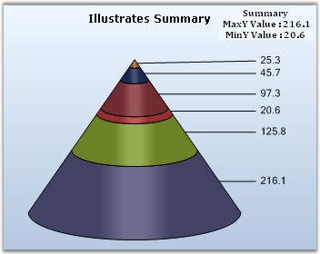

::: {style="DISPLAY: none"}
{#d2h_url_template}{#d2h_package_url style="WIDTH: 0px; DISPLAY: none; HEIGHT: 0px"}
:::

:::: {.d2h_secondary_topic style="PADDING-BOTTOM: 10pt; MARGIN: 0pt; PADDING-LEFT: 0pt; PADDING-RIGHT: 0pt; PADDING-TOP: 0pt"}
#### Summary {#summary style="tab-stops: 0pt"}

 

Provides access to summary information such as minimum/maximum values contained in this series at any given moment.

 

::: {align="center"}
+-------------------------------------+-----------------------------------------------------------------------------------------------------------------------------+
| Details                                                                                                                                                           |
+-------------------------------------+-----------------------------------------------------------------------------------------------------------------------------+
| **Possible Values**                 | [·      ]{style="FONT-FAMILY: Symbol"}MaxX - Returns the maximum X value.                                                   |
|                                     |                                                                                                                             |
|                                     | [·      ]{style="FONT-FAMILY: Symbol"}MaxY - Returns the minimum Y value.                                                   |
|                                     |                                                                                                                             |
|                                     | [·      ]{style="FONT-FAMILY: Symbol"}MinX - Returns the minimum X value.                                                   |
|                                     |                                                                                                                             |
|                                     | [·      ]{style="FONT-FAMILY: Symbol"}MinY - Returns the minimum Y value.                                                   |
|                                     |                                                                                                                             |
|                                     | [·      ]{style="FONT-FAMILY: Symbol"}ModelImpl - Returns the model implemented.                                            |
|                                     |                                                                                                                             |
|                                     | [·      ]{style="FONT-FAMILY: Symbol"}GetYPercentage - This method returns percentage value of series point in a Pie chart. |
+-------------------------------------+-----------------------------------------------------------------------------------------------------------------------------+
| **Default Value    **               | [·      ]{style="FONT-FAMILY: Symbol"}**MaxX**   - 0                                                                        |
|                                     |                                                                                                                             |
|                                     | [·      ]{style="FONT-FAMILY: Symbol"}**MaxY**   - 0                                                                        |
|                                     |                                                                                                                             |
|                                     | [·      ]{style="FONT-FAMILY: Symbol"}**MinY**    - 0                                                                       |
|                                     |                                                                                                                             |
|                                     | [·      ]{style="FONT-FAMILY: Symbol"}**MinX**    - 0                                                                       |
|                                     |                                                                                                                             |
|                                     | [·      ]{style="FONT-FAMILY: Symbol"}**ModelImpl** - Nil                                                                   |
+-------------------------------------+-----------------------------------------------------------------------------------------------------------------------------+
| **2D / 3D Limitations**             | No                                                                                                                          |
+-------------------------------------+-----------------------------------------------------------------------------------------------------------------------------+
| **Applies to Chart Element**        | Any Series                                                                                                                  |
+-------------------------------------+-----------------------------------------------------------------------------------------------------------------------------+
| **Applies to Chart Types**          | All chart types                                                                                                             |
+-------------------------------------+-----------------------------------------------------------------------------------------------------------------------------+
:::

 

Here is a sample code snippet using Radar chart.

 

+-------------------------------------------------------------------------------------------------------------------------------------------------------------------------------------------------------------------------------------------------------------------------+
| **[\[C#\]]{style="FONT-FAMILY: 'Courier New'; COLOR: black"}**                                                                                                                                                                                                          |
|                                                                                                                                                                                                                                                                         |
| **[]{style="FONT-FAMILY: 'Courier New'; COLOR: black"}**                                                                                                                                                                                                                |
|                                                                                                                                                                                                                                                                         |
| [string]{style="FONT-FAMILY: 'Courier New'; COLOR: blue"}[ str = [this]{style="COLOR: blue"}.chartControl1.Series\[0\].Summary.MaxY.ToString();]{style="FONT-FAMILY: 'Courier New'"}                                                                                    |
|                                                                                                                                                                                                                                                                         |
| [string]{style="FONT-FAMILY: 'Courier New'; COLOR: blue"}[ str1 = [this]{style="COLOR: blue"}.chartControl1.Series\[0\].Summary.MinY.ToString();]{style="FONT-FAMILY: 'Courier New'"}                                                                                   |
|                                                                                                                                                                                                                                                                         |
| [label1.Text = [\"Summary\"]{style="COLOR: maroon"} + [\"\\n\"]{style="COLOR: maroon"} + [\" MaxY Value : \"]{style="COLOR: maroon"} + str + [\"\\n\"]{style="COLOR: maroon"} + [\"MinY Value : \"]{style="COLOR: maroon"} + str1;]{style="FONT-FAMILY: 'Courier New'"} |
|                                                                                                                                                                                                                                                                         |
| []{style="FONT-FAMILY: 'Courier New'"}                                                                                                                                                                                                                                  |
|                                                                                                                                                                                                                                                                         |
| [//To get percentage value of series point in Pie chart]{style="FONT-FAMILY: 'Courier New'; COLOR: green"}                                                                                                                                                              |
|                                                                                                                                                                                                                                                                         |
| [this]{style="FONT-FAMILY: 'Courier New'; COLOR: blue"}[.chartControl1.Series\[0\].Summary.GetYPercentage(1);]{style="FONT-FAMILY: 'Courier New'"}                                                                                                                      |
|                                                                                                                                                                                                                                                                         |
| [this]{style="FONT-FAMILY: 'Courier New'; COLOR: blue"}[.chartControl1.Series\[0\].Summary.GetYPercentage(1, 0);]{style="FONT-FAMILY: 'Courier New'"}                                                                                                                   |
+-------------------------------------------------------------------------------------------------------------------------------------------------------------------------------------------------------------------------------------------------------------------------+

 

+-----------------------------------------------------------------------------------------------------------------------------------------------------------------------------------------------------------------------------------------------------------------------------------------------------------------------------------------------------------------------------------------------+
| **[\[VB.NET\]]{style="FONT-FAMILY: 'Courier New'; COLOR: black"}**                                                                                                                                                                                                                                                                                                                            |
|                                                                                                                                                                                                                                                                                                                                                                                               |
| **[]{style="FONT-FAMILY: 'Courier New'; COLOR: black"}**                                                                                                                                                                                                                                                                                                                                      |
|                                                                                                                                                                                                                                                                                                                                                                                               |
| [Dim]{style="FONT-FAMILY: 'Courier New'; COLOR: blue"}[ str ]{style="FONT-FAMILY: 'Courier New'; COLOR: black"}[As]{style="FONT-FAMILY: 'Courier New'; COLOR: blue"}[ String = ]{style="FONT-FAMILY: 'Courier New'; COLOR: black"}[Me]{style="FONT-FAMILY: 'Courier New'; COLOR: blue"}[.chartControl1.Series(0).Summary.MaxY.ToString() ]{style="FONT-FAMILY: 'Courier New'; COLOR: black"}  |
|                                                                                                                                                                                                                                                                                                                                                                                               |
| [Dim]{style="FONT-FAMILY: 'Courier New'; COLOR: blue"}[ str1 ]{style="FONT-FAMILY: 'Courier New'; COLOR: black"}[As]{style="FONT-FAMILY: 'Courier New'; COLOR: blue"}[ String = ]{style="FONT-FAMILY: 'Courier New'; COLOR: black"}[Me]{style="FONT-FAMILY: 'Courier New'; COLOR: blue"}[.chartControl1.Series(0).Summary.MinY.ToString() ]{style="FONT-FAMILY: 'Courier New'; COLOR: black"} |
|                                                                                                                                                                                                                                                                                                                                                                                               |
| [label1.Text = \"Summary\" + \"\" & Chr(10) & \"\" + \" MaxY Value : \" + str + \"\" & Chr(10) & \"\" + \"MinY Value : \" + str1]{style="FONT-FAMILY: 'Courier New'; COLOR: black"}                                                                                                                                                                                                           |
|                                                                                                                                                                                                                                                                                                                                                                                               |
| []{style="FONT-FAMILY: 'Courier New'; COLOR: black"}                                                                                                                                                                                                                                                                                                                                          |
|                                                                                                                                                                                                                                                                                                                                                                                               |
| [\'To get percentage value of series point in Pie chart]{style="FONT-FAMILY: 'Courier New'; COLOR: green"}                                                                                                                                                                                                                                                                                    |
|                                                                                                                                                                                                                                                                                                                                                                                               |
| [this]{style="FONT-FAMILY: 'Courier New'; COLOR: blue"}[.chartControl1.Series\[0\].Summary.GetYPercentage(1)]{style="FONT-FAMILY: 'Courier New'"}                                                                                                                                                                                                                                             |
|                                                                                                                                                                                                                                                                                                                                                                                               |
| [this]{style="FONT-FAMILY: 'Courier New'; COLOR: blue"}[.chartControl1.Series\[0\].Summary.GetYPercentage(1, 0)]{style="FONT-FAMILY: 'Courier New'"}                                                                                                                                                                                                                                          |
+-----------------------------------------------------------------------------------------------------------------------------------------------------------------------------------------------------------------------------------------------------------------------------------------------------------------------------------------------------------------------------------------------+

**[]{style="FONT-FAMILY: 'Courier New'; COLOR: black"}** 

{border="0"}

**[]{style="FONT-FAMILY: 'Courier New'; COLOR: black"}** 

Figure 213: Summary values displayed in Labels

**[]{style="FONT-FAMILY: 'Courier New'; COLOR: black"}** 

**See Also**

 

[Chart Types]{.UGHyperlink}, [How to find value]{.UGHyperlink}[, ]{style="COLOR: windowtext; TEXT-DECORATION: none; text-underline: none"}[maximum value and minimum value among the data points]{.UGHyperlink}[]{style="COLOR: black"}

 

[]{#p155} 

 

[]{#related-topics}
::::
