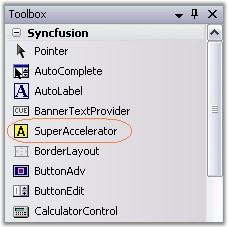
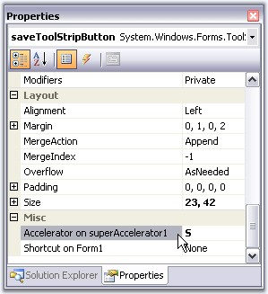
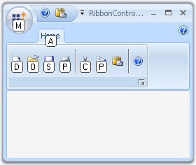

::: {style="DISPLAY: none"}
{#d2h_url_template}{#d2h_package_url style="WIDTH: 0px; DISPLAY: none; HEIGHT: 0px"}
:::

:::: {.d2h_secondary_topic style="PADDING-BOTTOM: 10pt; MARGIN: 0pt; PADDING-LEFT: 0pt; PADDING-RIGHT: 0pt; PADDING-TOP: 0pt"}
#### Super Accelerator {#super-accelerator style="tab-stops: 0pt"}

[]{style="COLOR: #15428b"} 

SuperAccelerator is a component that is used to accelerate the click event of items by using a Single key stroke without mouse hovering on it.

[]{style="COLOR: #15428b"} 

1.              Drag-and-drop the SuperAccelerator on your form.

[]{style="COLOR: #15428b"} 

{border="0"}

[]{style="COLOR: #15428b"} 

Figure 1454: SuperAccelerator in Toolbox

[]{style="COLOR: #15428b"} 

2.   When the SuperAccelerator component is added to a form, an extended property will be added to the properties of every item in the toolstrip or tabitem in the RibbonControlAdv.

[]{style="COLOR: #15428b"} 

{border="0"}

[]{style="COLOR: #15428b"} 

***[]{style="COLOR: #15428b"}*** 

Figure 1455: SuperAccelerator Extended Property on ToolStripButton Item

[]{style="COLOR: #15428b"} 

3.   In the appropriate item, use the Accelerator on SuperAccelerator property to set the string value.

[]{style="COLOR: #15428b"} 

{border="0"}

***[]{style="COLOR: #15428b"}*** 

Figure 1456: SuperAccelerator Illustrated

[]{style="COLOR: #15428b"} 

4.   To accelerate the item\'s click event at run time, Press the ALT key. All the specified accelerator strings will be displayed below the items.

[]{style="COLOR: #15428b"} 

5.   Press the string in the keyboard and the corresponding item\'s click event will be triggered. (Eg. If the accelerator string of Cut is X key, Press ALT key. Once all the accelerator strings are displayed, press X key the Cut item event will be triggered.)

[]{style="COLOR: #15428b"} 

::: {style="BORDER-BOTTOM: windowtext 1pt solid; BORDER-LEFT: medium none; PADDING-BOTTOM: 1pt; MARGIN: 9pt 0pt 9pt 18pt; PADDING-LEFT: 0pt; PADDING-RIGHT: 0pt; BORDER-TOP: windowtext 1pt solid; BORDER-RIGHT: medium none; PADDING-TOP: 1pt"}
 

{border="0"} Note: We can make the Accelerator feature to be active or inactive using SuperAccelerator.Active property.
:::

[]{style="COLOR: #15428b"} 

See Also

[]{style="COLOR: #15428b"} 

[ ]{style="COLOR: #15428b"}[[How to get or set an accelerator key programmatically]{.UGHyperlink}](../../../../../../../../Documents%20and%20Settings/sylviap/Desktop/Tools%20-%20Part%202.docx#_How_to_get_2)[?]{.UGHyperlink}[]{style="COLOR: black"}

 

 

 

 

More:

[ ]{#related-topics}

[{border="0" align="absMiddle"}Super Accelerator Appearance](ms-xhelp:///?Id=3599af5f-a225-47ab-bb12-7c29c69b880c){style="TEXT-DECORATION: none"}
::::
