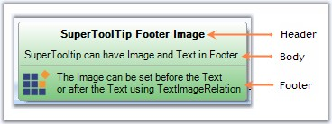
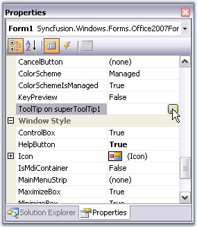
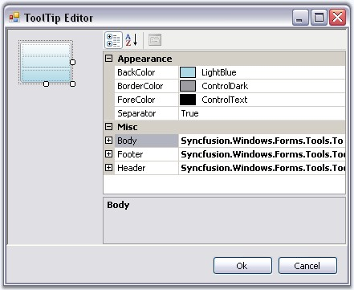

::: {style="DISPLAY: none"}
{#d2h_url_template}{#d2h_package_url style="WIDTH: 0px; DISPLAY: none; HEIGHT: 0px"}
:::

:::: {.d2h_secondary_topic style="PADDING-BOTTOM: 10pt; MARGIN: 0pt; PADDING-LEFT: 0pt; PADDING-RIGHT: 0pt; PADDING-TOP: 0pt"}
#### SuperToolTip {#supertooltip style="tab-stops: 0pt"}

[]{style="COLOR: #15428b"} 

In Office 2007, Microsoft has introduced a SuperToolTip control to display the tooltip. Essential Tools has also come up with a new control known as the SuperToolTip which, enables the user to give tooltip information.

[]{style="COLOR: #15428b"} 

{border="0"}

[]{style="COLOR: #15428b"} 

Figure 1444: SuperToolTip with Three ToolTip Item

[]{style="COLOR: #15428b"} 

[·      ]{style="FONT-FAMILY: Symbol"}**Header -** The Header is used to display text which is used as a header for the tooltip.

[·      ]{style="FONT-FAMILY: Symbol"}**Body -** This is the description part.

[·      ]{style="FONT-FAMILY: Symbol"}**Footer -** If additional information is needed, it can be entered in the footer part.

[]{style="COLOR: #15428b"} 

Creating SuperToolTip Through Designer

[]{style="COLOR: #15428b"} 

1.               Drag and drop the SuperToolTip on your form.

[]{style="COLOR: #15428b"} 

2.   When the SuperToolTip component is added to a form, an extended property will be added to the properties of every item in the toolstrip or tabitem in the RibbonControlAdv.

[]{style="COLOR: #15428b"} 

{border="0"}

[]{style="COLOR: #15428b"} 

Figure 1445: SuperToolTipExtended Property of a Form

**[]{style="COLOR: #15428b"}** 

::: {style="BORDER-BOTTOM: windowtext 1pt solid; BORDER-LEFT: medium none; PADDING-BOTTOM: 1pt; MARGIN: 9pt 0pt 9pt 18pt; PADDING-LEFT: 0pt; PADDING-RIGHT: 0pt; BORDER-TOP: windowtext 1pt solid; BORDER-RIGHT: medium none; PADDING-TOP: 1pt"}
{border="0"} Note:[ ]{style="COLOR: black; FONT-SIZE: 8pt"}You can also get or set a tooltip programmatically. It is discussed [here]{style="COLOR: black"}.
:::

[]{style="COLOR: #15428b"} 

3.   Clicking the ... ellipse button will show the ToolTip Editor Dialog Box. This editor lets you customize the ToolTip items.

[]{style="COLOR: #15428b"} 

[{border="0"}]{style="COLOR: #15428b"}[]{style="COLOR: #15428b"}

[]{style="COLOR: #15428b"} 

***[]{style="COLOR: #15428b"}*** 

Figure 1446: ToolTip Editor

[]{style="COLOR: #15428b"} 

Through Code

[]{style="COLOR: #15428b"} 

+-------------------------------------------------------------------------------------------------------------------------------------------------------------------------------------------------------------------------------------------+
| **[\[C#\]]{style="FONT-FAMILY: 'Courier New'; COLOR: black"}**                                                                                                                                                                            |
|                                                                                                                                                                                                                                           |
| []{style="COLOR: #15428b"}                                                                                                                                                                                                                |
|                                                                                                                                                                                                                                           |
| [using]{style="FONT-FAMILY: 'Courier New'; COLOR: blue"}[ Syncfusion.Windows.Forms.Tools;]{style="FONT-FAMILY: 'Courier New'"}                                                                                                            |
|                                                                                                                                                                                                                                           |
| []{style="FONT-FAMILY: 'Courier New'"}                                                                                                                                                                                                    |
|                                                                                                                                                                                                                                           |
| [private]{style="FONT-FAMILY: 'Courier New'; COLOR: blue"}[ [SuperToolTip]{style="COLOR: teal"} superToolTip1;]{style="FONT-FAMILY: 'Courier New'"}                                                                                       |
|                                                                                                                                                                                                                                           |
| [this]{style="FONT-FAMILY: 'Courier New'; COLOR: blue"}[.superToolTip1 = [new]{style="COLOR: blue"} Syncfusion.Windows.Forms.Tools.[SuperToolTip]{style="COLOR: teal"}([this]{style="COLOR: blue"});]{style="FONT-FAMILY: 'Courier New'"} |
|                                                                                                                                                                                                                                           |
| [//Adding ToolTip Header Item]{style="FONT-FAMILY: 'Courier New'; COLOR: green"}                                                                                                                                                          |
|                                                                                                                                                                                                                                           |
| [Syncfusion.Windows.Forms.Tools.[ToolTipInfo]{style="COLOR: teal"} toolTipInfo1 = [new]{style="COLOR: blue"} Syncfusion.Windows.Forms.Tools.[ToolTipInfo]{style="COLOR: teal"}();]{style="FONT-FAMILY: 'Courier New'"}                    |
|                                                                                                                                                                                                                                           |
| [toolTipInfo1.Header.Text = [\"Cut\"]{style="COLOR: maroon"};]{style="FONT-FAMILY: 'Courier New'"}                                                                                                                                        |
|                                                                                                                                                                                                                                           |
| [toolTipInfo1.Header.TextAlign = System.Drawing.[ContentAlignment]{style="COLOR: teal"}.TopCenter;]{style="FONT-FAMILY: 'Courier New'"}                                                                                                   |
|                                                                                                                                                                                                                                           |
| []{style="FONT-FAMILY: 'Courier New'"}                                                                                                                                                                                                    |
|                                                                                                                                                                                                                                           |
| [//Associating SuperToolTip for ToolStripTabItem]{style="FONT-FAMILY: 'Courier New'; COLOR: green"}                                                                                                                                       |
|                                                                                                                                                                                                                                           |
| [this]{style="FONT-FAMILY: 'Courier New'; COLOR: blue"}[.superToolTip1.SetToolTip([this]{style="COLOR: blue"}.toolStripTabItem1, toolTipInfo1);]{style="FONT-FAMILY: 'Courier New'"}[]{style="FONT-FAMILY: 'Courier New'"}                |
+-------------------------------------------------------------------------------------------------------------------------------------------------------------------------------------------------------------------------------------------+

[]{#p1195}[]{style="COLOR: #15428b"} 

+-------------------------------------------------------------------------------------------------------------------------------------------------------------------------------------------------------------------------+
| **[\[VB.NET\]]{style="FONT-FAMILY: 'Courier New'; COLOR: black"}**                                                                                                                                                      |
|                                                                                                                                                                                                                         |
| []{style="COLOR: #15428b"}                                                                                                                                                                                              |
|                                                                                                                                                                                                                         |
| [Imports]{style="FONT-FAMILY: 'Courier New'; COLOR: blue"}[ Syncfusion.Windows.Forms.Tools]{style="FONT-FAMILY: 'Courier New'"}                                                                                         |
|                                                                                                                                                                                                                         |
| []{style="FONT-FAMILY: 'Courier New'"}                                                                                                                                                                                  |
|                                                                                                                                                                                                                         |
| [Private]{style="FONT-FAMILY: 'Courier New'; COLOR: blue"}[ superToolTip1 [As]{style="COLOR: blue"} SuperToolTip]{style="FONT-FAMILY: 'Courier New'"}                                                                   |
|                                                                                                                                                                                                                         |
| [Me]{style="FONT-FAMILY: 'Courier New'; COLOR: blue"}[.superToolTip1 = [New]{style="COLOR: blue"} Syncfusion.Windows.Forms.Tools.SuperToolTip([Me]{style="COLOR: blue"}) ]{style="FONT-FAMILY: 'Courier New'"}          |
|                                                                                                                                                                                                                         |
| [\'Adding ToolTip Header ]{style="FONT-FAMILY: 'Courier New'; COLOR: green"}[Item]{style="FONT-FAMILY: 'Courier New'; COLOR: green"}[]{style="FONT-FAMILY: 'Courier New'; COLOR: green"}                                |
|                                                                                                                                                                                                                         |
| [Dim]{style="FONT-FAMILY: 'Courier New'; COLOR: blue"}[ toolTipInfo1 [As]{style="COLOR: blue"} [New]{style="COLOR: blue"} Syncfusion.Windows.Forms.Tools.ToolTipInfo()]{style="FONT-FAMILY: 'Courier New'"}             |
|                                                                                                                                                                                                                         |
| [toolTipInfo1.Header.Text = [\"Cut\"]{style="COLOR: maroon"} ]{style="FONT-FAMILY: 'Courier New'"}                                                                                                                      |
|                                                                                                                                                                                                                         |
| [toolTipInfo1.Header.TextAlign = System.Drawing.ContentAlignment.TopCenter]{style="FONT-FAMILY: 'Courier New'"}                                                                                                         |
|                                                                                                                                                                                                                         |
| []{style="FONT-FAMILY: 'Courier New'"}                                                                                                                                                                                  |
|                                                                                                                                                                                                                         |
| [//Associating SuperToolTip for ToolStripTabItem]{style="FONT-FAMILY: 'Courier New'; COLOR: green"}                                                                                                                     |
|                                                                                                                                                                                                                         |
| [Me]{style="FONT-FAMILY: 'Courier New'; COLOR: blue"}[.superToolTip1.SetToolTip([this]{style="COLOR: blue"}.toolStripTabItem1, toolTipInfo1)]{style="FONT-FAMILY: 'Courier New'"}[]{style="FONT-FAMILY: 'Courier New'"} |
+-------------------------------------------------------------------------------------------------------------------------------------------------------------------------------------------------------------------------+

[]{style="COLOR: #15428b"} 

 

 

 

 

More:

[ ]{#related-topics}

[{border="0" align="absMiddle"}Appearance Settings](ms-xhelp:///?Id=51b3f104-d3b8-4a66-85bd-288bfcacb08c){style="TEXT-DECORATION: none"}

[{border="0" align="absMiddle"}ToolTip Items Customization](ms-xhelp:///?Id=8203b27d-f7ea-4418-9446-712db8473e4b){style="TEXT-DECORATION: none"}

[{border="0" align="absMiddle"}SuperToolTip Events](ms-xhelp:///?Id=1a5655a0-d167-4fee-8eca-3e85917e17fe){style="TEXT-DECORATION: none"}

[{border="0" align="absMiddle"}Supporting SuperTooltip for .NET Controls Embedded in MFC Containers](ms-xhelp:///?Id=88de2462-2061-4245-92a4-4d8f60996838){style="TEXT-DECORATION: none"}
::::
