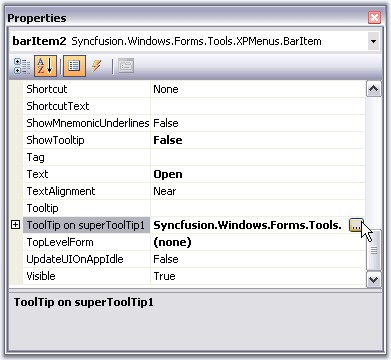
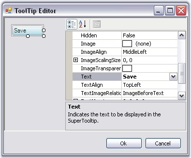
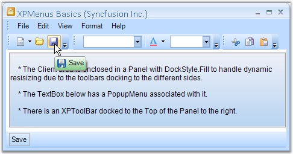

::: {style="DISPLAY: none"}
{#d2h_url_template}{#d2h_package_url style="WIDTH: 0px; DISPLAY: none; HEIGHT: 0px"}
:::

::: {.d2h_secondary_topic style="PADDING-BOTTOM: 10pt; MARGIN: 0pt; PADDING-LEFT: 0pt; PADDING-RIGHT: 0pt; PADDING-TOP: 0pt"}
##### SuperToolTip support {#supertooltip-support style="tab-stops: 0pt"}

[]{style="COLOR: #15428b"} 

The BarItems in XPMenus provides SuperToolTip support. Other than the usual tooltip, XPMenus now allows users to associate a SuperToolTip to the BarItems.

 

To associate a SuperTooltip to the BarItem (Menu Items), Drag and drop a SuperToolTip control on to the form in which the Menus are placed. Select the BarItem to which the SuperTooltip is to be added.

 

In the properties window, of the BarItem, we can see an extender property **ToolTip on superToolTip**. Click this to open the Tooltip Editor.

[]{style="COLOR: #15428b"} 

{border="0"}

[]{style="COLOR: #15428b"} 

Figure 827: Accessing ToolTip Editor using SuperTooltip property of a Bar Item

[]{style="COLOR: #15428b"} 

Customize the Tooltip using the Tooltip Editor.

[]{style="COLOR: #15428b"} 

{border="0"}

[]{style="COLOR: #15428b"} 

Figure 828: Setting ToolTip Text using ToolTipInfo.Body.Text Property

[]{style="COLOR: #15428b"} 

+-----------------------------------------------------------------------------------------------------------------------------------------------------------------------------+
| **[\[C#\]]{style="FONT-FAMILY: 'Courier New'; COLOR: black"}**                                                                                                              |
|                                                                                                                                                                             |
| **[]{style="FONT-FAMILY: 'Courier New'; COLOR: black"}**                                                                                                                    |
|                                                                                                                                                                             |
| [toolTipInfo1.Body.Text = [\"Save\"]{style="COLOR: maroon"};]{style="FONT-FAMILY: 'Courier New'"}                                                                           |
|                                                                                                                                                                             |
| [this]{style="FONT-FAMILY: 'Courier New'; COLOR: blue"}[.superToolTip1.SetToolTip([this]{style="COLOR: blue"}.barItem2, toolTipInfo1);]{style="FONT-FAMILY: 'Courier New'"} |
+-----------------------------------------------------------------------------------------------------------------------------------------------------------------------------+

[]{style="COLOR: #15428b"} 

+------------------------------------------------------------------------------------------------------------------------------------------------------------------------+
| **[\[VB.NET\]]{style="FONT-FAMILY: 'Courier New'; COLOR: black"}**                                                                                                     |
|                                                                                                                                                                        |
| **[]{style="FONT-FAMILY: 'Courier New'; COLOR: black"}**                                                                                                               |
|                                                                                                                                                                        |
| [toolTipInfo1.Body.Text = [\"Save\"]{style="COLOR: maroon"}]{style="FONT-FAMILY: 'Courier New'"}                                                                       |
|                                                                                                                                                                        |
| [Me]{style="FONT-FAMILY: 'Courier New'; COLOR: blue"}[.superToolTip1.SetToolTip([Me]{style="COLOR: blue"}.barItem2, toolTipInfo1)]{style="FONT-FAMILY: 'Courier New'"} |
+------------------------------------------------------------------------------------------------------------------------------------------------------------------------+

[]{style="COLOR: #15428b"} 

{border="0"}

[]{style="COLOR: #15428b"} 

Figure 829: BarItem displaying Tooltip

**[]{style="COLOR: #15428b"}** 

A sample illustrating the supertooltip feature is available in the below sample installation location.

 

..\\My Documents\\Syncfusion\\EssentialStudio\\***Version Number***\\Windows\\Tools.Windows\\Samples\\2.0\\Menus Package\\XPMenusSDI

[]{#related-topics}
:::
