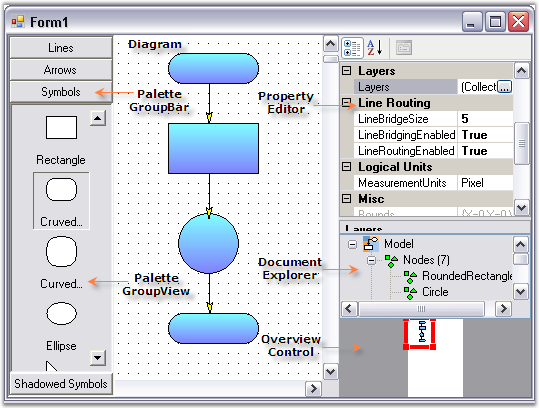

::: {style="DISPLAY: none"}
{#d2h_url_template}{#d2h_package_url style="WIDTH: 0px; DISPLAY: none; HEIGHT: 0px"}
:::

::::: {#nsbanner .d2h_main_nsbanner style="BORDER-BOTTOM: #999999 1px solid; POSITION: relative; PADDING-BOTTOM: 0px; BACKGROUND-COLOR: transparent; PADDING-LEFT: 0px; PADDING-RIGHT: 0px; DISPLAY: none; BORDER-TOP: #999999 1px solid; PADDING-TOP: 0px; LEFT: 0px"}
:::: {#TitleRow .d2h_main_titlerow style="PADDING-BOTTOM: 4px; BACKGROUND-COLOR: transparent; PADDING-LEFT: 22px; WIDTH: 100%; PADDING-RIGHT: 10px; DISPLAY: none; PADDING-TOP: 4px"}
::: {#ienav .d2h_main_ienav style="DISPLAY: none"}
{#D2HPrevious .D2HPreviousEnabled}  {#D2HNext .D2HNextEnabled}
:::
::::
:::::

:::: {#nstext .d2h_main_nstext style="PADDING-BOTTOM: 10px; BACKGROUND-COLOR: transparent; PADDING-LEFT: 22px; PADDING-RIGHT: 10px; HEIGHT: 100%; OVERFLOW: auto; PADDING-TOP: 5px" hasuserbackground="true" valign="bottom"}
::: {#d2h_breadcrumbs .d2h_breadcrumbs}
[Essential Studio User Guide Documentation](ms-xhelp:///?Id=12457748-09e3-4d74-a240-8e049cedf030){.d2h_breadcrumbsNormal}[ \> ]{.d2h_breadcrumbsLinkSeparator}[User Interface Edition](ms-xhelp:///?Id=c29296b7-531c-413b-a0ec-488ca1f7f669){.d2h_breadcrumbsNormal}[ \> ]{.d2h_breadcrumbsLinkSeparator}[Essential Windows](ms-xhelp:///?Id=e60759d8-47a4-4570-9d7a-16a68d63f2ea){.d2h_breadcrumbsNormal}[ \> ]{.d2h_breadcrumbsLinkSeparator}[Essential Diagram]{.d2h_breadcrumbsContentsOnly}[ \> ]{.d2h_breadcrumbsLinkSeparator}[Concepts And Features](ms-xhelp:///?Id=008cec4b-5177-4859-8616-c062751d8fb6){.d2h_breadcrumbsNormal}
:::

## Supported Controls  {#supported-controls style="tab-stops: 0pt"}

 

The controls supported by Essential Diagram are as follows.

 

 

The controls associated with the Diagram control are illustrated in the following image.

 

{border="0"}

 

Figure 38: Diagram With Supported Controls

 

[]{#p21} 

 

More:

[ ]{#related-topics}

[{border="0" align="absMiddle"}Overview Control](ms-xhelp:///?Id=26f34bbe-9ba6-411d-bba2-978916ee595f){style="TEXT-DECORATION: none"}

[{border="0" align="absMiddle"}Palette Groupbar And GroupView](ms-xhelp:///?Id=87a0c1d8-1339-4f1f-919b-4227f3b84b5f){style="TEXT-DECORATION: none"}

[{border="0" align="absMiddle"}Document Explorer](ms-xhelp:///?Id=8d1b7fd7-9c62-4446-8c67-60a1a45c27ea){style="TEXT-DECORATION: none"}

[{border="0" align="absMiddle"}Property Editor](ms-xhelp:///?Id=7f862c84-a9c3-412a-9a8c-64bcddd9c107){style="TEXT-DECORATION: none"}

[{border="0" align="absMiddle"}Diagram Grid](ms-xhelp:///?Id=70cb74fd-1eb4-4213-9743-4147de621aa9){style="TEXT-DECORATION: none"}
::::
