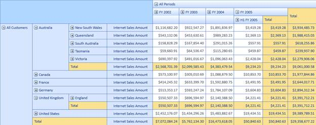

::: {style="DISPLAY: none"}
{#d2h_url_template}{#d2h_package_url style="WIDTH: 0px; DISPLAY: none; HEIGHT: 0px"}
:::

::::: {#nsbanner .d2h_main_nsbanner style="BORDER-BOTTOM: #999999 1px solid; POSITION: relative; PADDING-BOTTOM: 0px; BACKGROUND-COLOR: transparent; PADDING-LEFT: 0px; PADDING-RIGHT: 0px; DISPLAY: none; BORDER-TOP: #999999 1px solid; PADDING-TOP: 0px; LEFT: 0px"}
:::: {#TitleRow .d2h_main_titlerow style="PADDING-BOTTOM: 4px; BACKGROUND-COLOR: transparent; PADDING-LEFT: 22px; WIDTH: 100%; PADDING-RIGHT: 10px; DISPLAY: none; PADDING-TOP: 4px"}
::: {#ienav .d2h_main_ienav style="DISPLAY: none"}
{#D2HPrevious .D2HPreviousEnabled}  {#D2HNext .D2HNextEnabled}
:::
::::
:::::

::::: {#nstext .d2h_main_nstext style="PADDING-BOTTOM: 10px; BACKGROUND-COLOR: transparent; PADDING-LEFT: 22px; PADDING-RIGHT: 10px; HEIGHT: 100%; OVERFLOW: auto; PADDING-TOP: 5px" hasuserbackground="true" valign="bottom"}
::: {#d2h_breadcrumbs .d2h_breadcrumbs}
[Essential Studio User Guide Documentation](ms-xhelp:///?Id=12457748-09e3-4d74-a240-8e049cedf030){.d2h_breadcrumbsNormal}[ \> ]{.d2h_breadcrumbsLinkSeparator}[Business Intelligence Edition](ms-xhelp:///?Id=fdf33dd8-62b2-47b9-ad7b-fc50e590bca5){.d2h_breadcrumbsNormal}[ \> ]{.d2h_breadcrumbsLinkSeparator}[Essential BI Silverlight](ms-xhelp:///?Id=c006b39c-6aa2-4637-b7de-3e7b6cb3f9f9){.d2h_breadcrumbsNormal}[ \> ]{.d2h_breadcrumbsLinkSeparator}[Essential BI Grid]{.d2h_breadcrumbsContentsOnly}[ \> ]{.d2h_breadcrumbsLinkSeparator}[Concepts and Features](ms-xhelp:///?Id=6e49680f-da51-4b1f-9043-47e40b9c0684){.d2h_breadcrumbsNormal}
:::

## Support for \"All\" Level Type Member {#support-for-all-level-type-member style="tab-stops: 0pt"}

This feature enables you to display the "All" level type member across the rows and columns in the OlapGrid. This member behaves as parent to other members in its hierarchy by controlling their visibility through expander.

 

Properties

Table 9: Property Table

::: {align="center"}
  ------------------ ------------------------------------------------------------------------ -------- ----------- -----------------
  Property           Description                                                              Type     Data Type   Reference links
  ShowLevelTypeAll   Specifies whether members with level type as All has to be displayed.    Normal   Boolean     NA
  ------------------ ------------------------------------------------------------------------ -------- ----------- -----------------
:::

[]{style="FONT-FAMILY: 'Calibri','sans-serif'; COLOR: black"} 

Displaying \"All\" Level Type Member

To display the "All" level type member, set the *ShowLevelTypeAll* property to *true*. By default this is set to *false*.  

 

+-------------------------------------------------------------------------------------------------------------------------------------------------------------------------------------------------------------------------------------------------------------------------------+
| **[\[C#\]]{style="FONT-FAMILY: Consolas; FONT-SIZE: 9.5pt"}**                                                                                                                                                                                                                 |
|                                                                                                                                                                                                                                                                               |
| **[]{style="FONT-FAMILY: Consolas; FONT-SIZE: 9.5pt"}**                                                                                                                                                                                                                       |
|                                                                                                                                                                                                                                                                               |
| [OlapDataManager]{style="FONT-FAMILY: Consolas; COLOR: #2b91af; FONT-SIZE: 9.5pt"}[ DataManager = [new]{style="COLOR: blue"} [OlapDataManager]{style="COLOR: #2b91af"}() { ShowLevelTypeAll = [true]{style="COLOR: blue"}};]{style="FONT-FAMILY: Consolas; FONT-SIZE: 9.5pt"} |
|                                                                                                                                                                                                                                                                               |
|                                                                                                                                                                                                                                                                               |
+-------------------------------------------------------------------------------------------------------------------------------------------------------------------------------------------------------------------------------------------------------------------------------+

 

 

Add the following code need in the service file.

**[]{style="COLOR: #e36c0a"}** 

+------------------------------------------------------------------------------------------------------------------------------------------------------------------------------------------------------------------------------------------------------------------------------------------+
| **[\[C#\]]{style="FONT-FAMILY: Consolas; FONT-SIZE: 9.5pt"}**                                                                                                                                                                                                                            |
|                                                                                                                                                                                                                                                                                          |
| []{style="FONT-FAMILY: Consolas; FONT-SIZE: 9.5pt"}                                                                                                                                                                                                                                      |
|                                                                                                                                                                                                                                                                                          |
| [public]{style="FONT-FAMILY: Consolas; COLOR: blue; FONT-SIZE: 9.5pt"}[ [CellSet]{style="COLOR: #2b91af"} ExecuteOlapReportWithLevelTypeAll([OlapReport]{style="COLOR: #2b91af"} report, [bool]{style="COLOR: blue"} showLevelTypeAll)]{style="FONT-FAMILY: Consolas; FONT-SIZE: 9.5pt"} |
|                                                                                                                                                                                                                                                                                          |
| [        {]{style="FONT-FAMILY: Consolas; FONT-SIZE: 9.5pt"}                                                                                                                                                                                                                             |
|                                                                                                                                                                                                                                                                                          |
| [            [CellSet]{style="COLOR: #2b91af"} cellSet = \_dataManager.ExecuteOlapReportWithLevelTypeAll(report, showLevelTypeAll);]{style="FONT-FAMILY: Consolas; FONT-SIZE: 9.5pt"}                                                                                                    |
|                                                                                                                                                                                                                                                                                          |
| [            \_dataManager.DataProvider.CloseConnection();]{style="FONT-FAMILY: Consolas; FONT-SIZE: 9.5pt"}                                                                                                                                                                             |
|                                                                                                                                                                                                                                                                                          |
| [            [return]{style="COLOR: blue"} cellSet;]{style="FONT-FAMILY: Consolas; FONT-SIZE: 9.5pt"}                                                                                                                                                                                    |
|                                                                                                                                                                                                                                                                                          |
| [        }]{style="FONT-FAMILY: Consolas; FONT-SIZE: 9.5pt"}                                                                                                                                                                                                                             |
|                                                                                                                                                                                                                                                                                          |
|                                                                                                                                                                                                                                                                                          |
+------------------------------------------------------------------------------------------------------------------------------------------------------------------------------------------------------------------------------------------------------------------------------------------+

**[]{style="COLOR: #e36c0a"}** 

{border="0"}

Figure 15: Member with Level type "All" is displayed.

**[]{style="COLOR: #e36c0a"}** 

 

Sample Link

A demo of this feature is available in the following location:

 

**Windows XP:**

..\\Syncfusion\\EssentialStudio\\x.x.x.x\\BI\\Silverlight\\OlapGrid.SL\\ReportDefinition

 

**Windows 7/Vista:**

C:\\Users\\\<UserName\>\\AppData\\Local\\Syncfusion\\EssentialStudio\\x.x.x.x\\BI\\Silverlight\\OlapGrid.SL\\ReportDefinition[]{style="COLOR: #c00000"}

 

[]{#related-topics}
:::::
