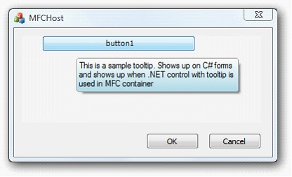

::: {style="DISPLAY: none"}
{#d2h_url_template}{#d2h_package_url style="WIDTH: 0px; DISPLAY: none; HEIGHT: 0px"}
:::

:::: {.d2h_secondary_topic style="PADDING-BOTTOM: 10pt; MARGIN: 0pt; PADDING-LEFT: 0pt; PADDING-RIGHT: 0pt; PADDING-TOP: 0pt"}
##### Supporting SuperTooltip for .NET Controls Embedded in MFC Containers {#supporting-supertooltip-for-.net-controls-embedded-in-mfc-containers style="tab-stops: 0pt"}

**[]{style="FONT-FAMILY: 'Calibri','sans-serif'"}** 

**SupperTooltip** can be displayed in the User Control embedded in the **MFC** Dialog.

::: {style="BORDER-BOTTOM: windowtext 1pt solid; BORDER-LEFT: medium none; PADDING-BOTTOM: 1pt; MARGIN: 9pt 0pt 9pt 18pt; PADDING-LEFT: 0pt; PADDING-RIGHT: 0pt; BORDER-TOP: windowtext 1pt solid; BORDER-RIGHT: medium none; PADDING-TOP: 1pt"}
{border="0"}Note: Support has been given in source level.
:::

[]{style="COLOR: #15428b"} 

{border="0"}

***[]{style="COLOR: #15428b"}*** 

Figure 1453: SuperToolTip Displayed in MFC Dialog

 

[]{#related-topics}
::::
