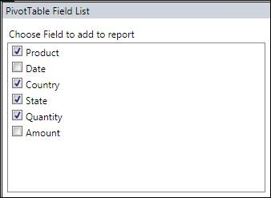
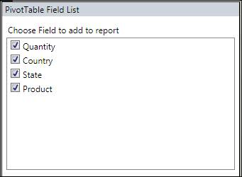

::: {style="DISPLAY: none"}
{#d2h_url_template} {#d2h_package_url style="WIDTH: 0px; DISPLAY: none; HEIGHT: 0px"}
:::

::::: {#nsbanner .d2h_main_nsbanner style="BORDER-BOTTOM: #999999 1px solid; POSITION: relative; PADDING-BOTTOM: 0px; BACKGROUND-COLOR: transparent; PADDING-LEFT: 0px; PADDING-RIGHT: 0px; DISPLAY: none; BORDER-TOP: #999999 1px solid; PADDING-TOP: 0px; LEFT: 0px"}
:::: {#TitleRow .d2h_main_titlerow style="PADDING-BOTTOM: 4px; BACKGROUND-COLOR: transparent; PADDING-LEFT: 22px; WIDTH: 100%; PADDING-RIGHT: 10px; DISPLAY: none; PADDING-TOP: 4px"}
::: {#ienav .d2h_main_ienav style="DISPLAY: none"}
{#D2HPrevious .D2HPreviousEnabled}  {#D2HNext .D2HNextEnabled}
:::
::::
:::::

::::: {#nstext .d2h_main_nstext style="PADDING-BOTTOM: 10px; BACKGROUND-COLOR: transparent; PADDING-LEFT: 22px; PADDING-RIGHT: 10px; HEIGHT: 100%; OVERFLOW: auto; PADDING-TOP: 5px" hasuserbackground="true" valign="bottom"}
::: {#d2h_breadcrumbs .d2h_breadcrumbs}
[Essential Studio User Guide Documentation](ms-xhelp:///?Id=12457748-09e3-4d74-a240-8e049cedf030){.d2h_breadcrumbsNormal} [ \> ]{.d2h_breadcrumbsLinkSeparator} [Business Intelligence Edition](ms-xhelp:///?Id=fdf33dd8-62b2-47b9-ad7b-fc50e590bca5){.d2h_breadcrumbsNormal} [ \> ]{.d2h_breadcrumbsLinkSeparator} [Essential BI WPF](ms-xhelp:///?Id=41e3d586-d922-4a01-8272-679fe4ae7343){.d2h_breadcrumbsNormal} [ \> ]{.d2h_breadcrumbsLinkSeparator} [Essential Pivot Grid]{.d2h_breadcrumbsContentsOnly} [ \> ]{.d2h_breadcrumbsLinkSeparator} [PivotSchemaDesigner for WPF](ms-xhelp:///?Id=4c3f8e9b-5c0d-4344-a6c2-9dae46a9b9a4){.d2h_breadcrumbsNormal} [ \> ]{.d2h_breadcrumbsLinkSeparator} [Features](ms-xhelp:///?Id=440b4c51-aba4-497a-a486-56dccca496e1){.d2h_breadcrumbsNormal}
:::

### Support to Hide Fields in PivotSchemaDesigner {#support-to-hide-fields-in-pivotschemadesigner style="tab-stops: 0pt"}

The user can customize the PivotTable field list in PivotSchemaDesigner. The user can hide the unnecessary fields from the PivotSchemaDesigner by using the ShowDisplayFieldsOnly property.

Use Case Scenarios

This feature enables the user to load required set of items in PivotSchemaDesigner.

The following screen shot shows a PivotSchemaDesigner control with all items and required items in a pivot table field list:

[]{style="COLOR: #c00000"} 

{border="0"}

Figure 52 Pivot Table Field List with ShowDisplayFieldsOnly Disabled

 

{border="0"}

Figure 53 Pivot Table Field List with ShowDisplayFieldsOnly Enabled

 

Properties

Table 12: Properties Table

::: {align="center"}
+-----------------------+---------------------------------------------------------------------------------------+-------------+-------------+-----------------+
| Property              | Description                                                                           | Type        | Data Type   | Reference links |
+-----------------------+---------------------------------------------------------------------------------------+-------------+-------------+-----------------+
| ShowDisplayFieldsOnly | Gets or sets the value incdicating to show only the fields that are used in PivotGrid | Dependency  | Boolean     | \-              |
|                       |                                                                                       |             |             |                 |
|                       |                                                                                       |             |             |                 |
+-----------------------+---------------------------------------------------------------------------------------+-------------+-------------+-----------------+
:::

[]{style="FONT-FAMILY: 'Calibri','sans-serif'; COLOR: black"} 

Sample Link

A sample is placed in the following location:

**SystemDrive\\Users\\\<user_name\>\\AppData\\Local\\Syncfusion\\EssentialStudio\\\<Version_number\>\\BI\\WPF\\PivotAnalysis.Wpf\\Product Showcase\\PivotGridDemo**

 

[]{#related-topics}
:::::
