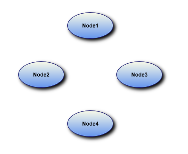

::: {style="DISPLAY: none"}
{#d2h_url_template}{#d2h_package_url style="WIDTH: 0px; DISPLAY: none; HEIGHT: 0px"}
:::

::: {.d2h_secondary_topic style="PADDING-BOTTOM: 10pt; MARGIN: 0pt; PADDING-LEFT: 0pt; PADDING-RIGHT: 0pt; PADDING-TOP: 0pt"}
#### Support to Print the Diagram Shapes with Effects {#support-to-print-the-diagram-shapes-with-effects style="tab-stops: 0pt"}

Essential Diagram for WPF provides support to print the diagram shapes**[ ]{style="FONT-SIZE: 16pt"}**with the applied effects. When effects are applied to the nodes, they cannot be printed properly, due to the framework limitation. This feature enables you to overcome this limitation.

 

Use Case Scenarios

When you want to print a diagram page, in which you have applied effects for the nodes, you can use this feature to achieve this.

 

Properties

*[Table ]{style="FONT-SIZE: 9pt"}[76]{style="FONT-SIZE: 9pt"}[: Property Table]{style="FONT-SIZE: 9pt"}*

  ---------------------------------------- --------------------------------------------------------- ----------------------------------------------- --------------- ------------------------------
  **Property**                             **Description**                                           **Type**                                        **Data Type**   **Reference links**
  CustomEffect[]{style="COLOR: #c00000"}   Gets or sets a value of the applied effect of the Node.   Dependency property[]{style="COLOR: #c00000"}   Effect          NA[]{style="COLOR: #c00000"}
  ---------------------------------------- --------------------------------------------------------- ----------------------------------------------- --------------- ------------------------------

[]{style="FONT-FAMILY: 'Calibri','sans-serif'; COLOR: black"} 

[]{style="COLOR: #c00000"} 

Printing the Diagram Shapes with Effects

You can print the diagram shapes with the applied effects using the *CustomEffect* property. The following code illustrates this:

 

+-------------------------------------------------------------------------------------------------------------------------------------------------------------------------------------------------------------------------------------------------------------------------------------------+
| **[\[C#\]]{style="FONT-FAMILY: 'Courier New'; COLOR: black"}**                                                                                                                                                                                                                            |
|                                                                                                                                                                                                                                                                                           |
| **[         ]{style="FONT-FAMILY: 'Courier New'; COLOR: black"}**[DropShadowEffect]{style="FONT-FAMILY: Consolas; COLOR: #2b91af; FONT-SIZE: 9.5pt"}[ effect = [new]{style="COLOR: blue"} [DropShadowEffect]{style="COLOR: #2b91af"}();]{style="FONT-FAMILY: Consolas; FONT-SIZE: 9.5pt"} |
|                                                                                                                                                                                                                                                                                           |
| [          effect.BlurRadius = 10;]{style="FONT-FAMILY: Consolas; FONT-SIZE: 9.5pt"}                                                                                                                                                                                                      |
|                                                                                                                                                                                                                                                                                           |
| []{style="FONT-FAMILY: 'Courier New'"}                                                                                                                                                                                                                                                    |
|                                                                                                                                                                                                                                                                                           |
| [           Node]{style="FONT-FAMILY: Consolas; COLOR: #2b91af; FONT-SIZE: 9.5pt"}[ node = [new]{style="COLOR: blue"} [Node]{style="COLOR: #2b91af"}();]{style="FONT-FAMILY: Consolas; FONT-SIZE: 9.5pt"}                                                                                 |
|                                                                                                                                                                                                                                                                                           |
| [           node.Shape = [Shapes]{style="COLOR: #2b91af"}.Ellipse;\                                                                                                                                                                                                                       |
|            node.CustomEffect = effect;]{style="FONT-FAMILY: Consolas; FONT-SIZE: 9.5pt"}                                                                                                                                                                                                  |
|                                                                                                                                                                                                                                                                                           |
| [           diagramModel.Nodes.Add(node);]{style="FONT-FAMILY: Consolas; FONT-SIZE: 9.5pt"}                                                                                                                                                                                               |
+-------------------------------------------------------------------------------------------------------------------------------------------------------------------------------------------------------------------------------------------------------------------------------------------+

 

+--------------------------------------------------------------------------------------------------------------------------------------------------------------+
| **[\[VB\]]{style="FONT-FAMILY: 'Courier New'; COLOR: black"}**[]{style="FONT-FAMILY: Consolas; FONT-SIZE: 9.5pt"}                                            |
|                                                                                                                                                              |
| [             [Dim]{style="COLOR: blue"} effect [As]{style="COLOR: blue"} [New]{style="COLOR: blue"} DropShadowEffect()]{style="FONT-FAMILY: 'Courier New'"} |
|                                                                                                                                                              |
| [              effect.BlurRadius = 10]{style="FONT-FAMILY: 'Courier New'"}                                                                                   |
|                                                                                                                                                              |
| []{style="FONT-FAMILY: 'Courier New'"}                                                                                                                       |
|                                                                                                                                                              |
| [               [Dim]{style="COLOR: blue"} node [As]{style="COLOR: blue"} [New]{style="COLOR: blue"} Node()]{style="FONT-FAMILY: 'Courier New'"}             |
|                                                                                                                                                              |
| [               node.Shape = Shapes.Ellipse]{style="FONT-FAMILY: 'Courier New'"}                                                                             |
|                                                                                                                                                              |
| [               node.CustomEffect = effect]{style="FONT-FAMILY: 'Courier New'"}                                                                              |
|                                                                                                                                                              |
| [               diagramModel.Nodes.Add(node)]{style="FONT-FAMILY: 'Courier New'"}                                                                            |
+--------------------------------------------------------------------------------------------------------------------------------------------------------------+

 

 

{border="0"}

*[Figure ]{style="FONT-SIZE: 9pt"}[166]{style="FONT-SIZE: 9pt"}[: Printed Nodes with Effects]{style="FONT-SIZE: 9pt"}*

[]{style="FONT-FAMILY: 'Trebuchet MS','sans-serif'; COLOR: #15428b; FONT-SIZE: 9pt"} 

[]{style="FONT-FAMILY: 'Trebuchet MS','sans-serif'; COLOR: #15428b; FONT-SIZE: 9pt"} 

[]{#related-topics}
:::
