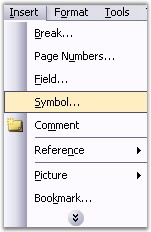
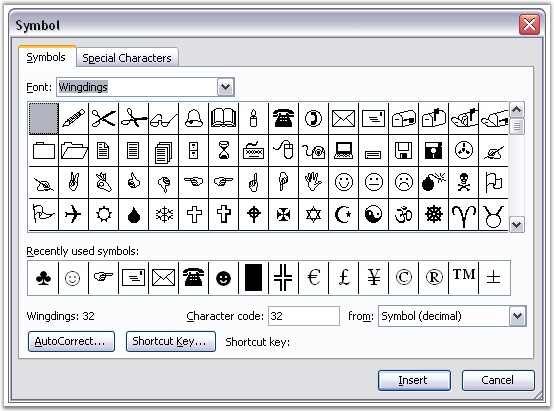

::: {style="DISPLAY: none"}
{#d2h_url_template}{#d2h_package_url style="WIDTH: 0px; DISPLAY: none; HEIGHT: 0px"}
:::

::::: {.d2h_secondary_topic style="PADDING-BOTTOM: 10pt; MARGIN: 0pt; PADDING-LEFT: 0pt; PADDING-RIGHT: 0pt; PADDING-TOP: 0pt"}
#### Symbol {#symbol style="tab-stops: 0pt"}

[]{#p61} 

**WSymbol** class represents a symbol in the Word document. To insert a symbol, open the **Insert** menu and click **Symbol** in Microsoft Word.

 

{border="0"}

Figure 66: Symbol Option in Insert Menu

 

 

 

{border="0"}

Figure 67: Symbol Dialog Box

 

 

You can use the **AppendSymbol** function of WParagraph to insert a symbol by using DocIO.

 

Also, you can use the **CharacterCode** property to set or get the symbol from the WSymbol class, and the **CharacterFormat** property to set or get the character formatting of the symbol.

 

**Class Hierarchy**

 

ParagraphItem

            \|

            WSymbol

 

**Public Constructor**

 

::: {align="center"}
  --------------------------------- ----------------------------------------------------
  Name                              Description
  WSymbol.WSymbol (IWordDocument)   Initializes a new instance of the WSymbol class.  
  --------------------------------- ----------------------------------------------------
:::

 

Public Properties

 

::: {align="center"}
  ----------------- ------------------------------------------
  Name              Description
  CharacterCode     Gets or sets symbol\'s character code.  
  CharacterFormat   Gets character format for the symbol.  
  EntityType        Gets the type of the entity.  
  FontName          Gets or sets symbol font name.  
  ----------------- ------------------------------------------
:::

 

The following example illustrates how to use the WSymbol class.

 

+--------------------------------------------------------------------------------------------------------------------------------------------------------------------------------+
| **[\[C#\]]{style="FONT-FAMILY: 'Courier New'; COLOR: black"}**                                                                                                                 |
|                                                                                                                                                                                |
| []{style="COLOR: black"}                                                                                                                                                       |
|                                                                                                                                                                                |
| [IWordDocument]{style="FONT-FAMILY: 'Courier New'; COLOR: teal"}[ doc = [new]{style="COLOR: blue"} [WordDocument]{style="COLOR: teal"}();]{style="FONT-FAMILY: 'Courier New'"} |
|                                                                                                                                                                                |
| [IWSection]{style="FONT-FAMILY: 'Courier New'; COLOR: teal"}[ section = doc.AddSection();]{style="FONT-FAMILY: 'Courier New'"}                                                 |
|                                                                                                                                                                                |
| []{style="FONT-FAMILY: 'Courier New'"}                                                                                                                                         |
|                                                                                                                                                                                |
| [IWParagraph]{style="FONT-FAMILY: 'Courier New'; COLOR: teal"}[ paragraph = section.AddParagraph();]{style="FONT-FAMILY: 'Courier New'"}                                       |
|                                                                                                                                                                                |
| [paragraph.AppendText([\"Testing symbols\"]{style="COLOR: maroon"});]{style="FONT-FAMILY: 'Courier New'"}                                                                      |
|                                                                                                                                                                                |
| [WSymbol]{style="FONT-FAMILY: 'Courier New'; COLOR: teal"}[ symbol = paragraph.AppendSymbol(140);]{style="FONT-FAMILY: 'Courier New'"}                                         |
|                                                                                                                                                                                |
| [symbol.FontName = [\"Wingdings\"]{style="COLOR: maroon"};]{style="FONT-FAMILY: 'Courier New'"}                                                                                |
|                                                                                                                                                                                |
| []{style="FONT-FAMILY: 'Courier New'"}                                                                                                                                         |
|                                                                                                                                                                                |
| [doc.Save([\"Symbol.doc\"]{style="COLOR: maroon"});]{style="FONT-FAMILY: 'Courier New'"}                                                                                       |
+--------------------------------------------------------------------------------------------------------------------------------------------------------------------------------+

 

+--------------------------------------------------------------------------------------------------------------------------------------------------------------------------------------+
| **[\[VB.NET\]]{style="FONT-FAMILY: 'Courier New'; COLOR: black"}**                                                                                                                   |
|                                                                                                                                                                                      |
| []{style="COLOR: black"}                                                                                                                                                             |
|                                                                                                                                                                                      |
| [Dim]{style="FONT-FAMILY: 'Courier New'; COLOR: blue"}[ doc [As]{style="COLOR: blue"} IWordDocument = [New]{style="COLOR: blue"} WordDocument()]{style="FONT-FAMILY: 'Courier New'"} |
|                                                                                                                                                                                      |
| [Dim]{style="FONT-FAMILY: 'Courier New'; COLOR: blue"}[ section [As]{style="COLOR: blue"} IWSection = doc.AddSection()]{style="FONT-FAMILY: 'Courier New'"}                          |
|                                                                                                                                                                                      |
| []{style="FONT-FAMILY: 'Courier New'"}                                                                                                                                               |
|                                                                                                                                                                                      |
| [Dim]{style="FONT-FAMILY: 'Courier New'; COLOR: blue"}[ paragraph [As]{style="COLOR: blue"} IWParagraph = section.AddParagraph()]{style="FONT-FAMILY: 'Courier New'"}                |
|                                                                                                                                                                                      |
| [paragraph.AppendText([\"Testing symbols\"]{style="COLOR: maroon"})]{style="FONT-FAMILY: 'Courier New'"}                                                                             |
|                                                                                                                                                                                      |
| [Dim]{style="FONT-FAMILY: 'Courier New'; COLOR: blue"}[ symbol [As]{style="COLOR: blue"} WSymbol = paragraph.AppendSymbol(140)]{style="FONT-FAMILY: 'Courier New'"}                  |
|                                                                                                                                                                                      |
| [symbol.FontName = [\"Wingdings\"]{style="COLOR: maroon"}]{style="FONT-FAMILY: 'Courier New'"}                                                                                       |
|                                                                                                                                                                                      |
| []{style="FONT-FAMILY: 'Courier New'; COLOR: maroon"}                                                                                                                                |
|                                                                                                                                                                                      |
| [doc.Save([\"Symbol.doc\"]{style="COLOR: maroon"})]{style="FONT-FAMILY: 'Courier New'"}                                                                                              |
+--------------------------------------------------------------------------------------------------------------------------------------------------------------------------------------+

[]{#related-topics}
:::::
