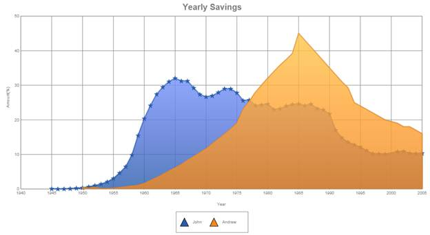

::: {style="DISPLAY: none"}
{#d2h_url_template}{#d2h_package_url style="WIDTH: 0px; DISPLAY: none; HEIGHT: 0px"}
:::

::::: {#nsbanner .d2h_main_nsbanner style="BORDER-BOTTOM: #999999 1px solid; POSITION: relative; PADDING-BOTTOM: 0px; BACKGROUND-COLOR: transparent; PADDING-LEFT: 0px; PADDING-RIGHT: 0px; DISPLAY: none; BORDER-TOP: #999999 1px solid; PADDING-TOP: 0px; LEFT: 0px"}
:::: {#TitleRow .d2h_main_titlerow style="PADDING-BOTTOM: 4px; BACKGROUND-COLOR: transparent; PADDING-LEFT: 22px; WIDTH: 100%; PADDING-RIGHT: 10px; DISPLAY: none; PADDING-TOP: 4px"}
::: {#ienav .d2h_main_ienav style="DISPLAY: none"}
{#D2HPrevious .D2HPreviousEnabled}  {#D2HNext .D2HNextEnabled}
:::
::::
:::::

::::: {#nstext .d2h_main_nstext style="PADDING-BOTTOM: 10px; BACKGROUND-COLOR: transparent; PADDING-LEFT: 22px; PADDING-RIGHT: 10px; HEIGHT: 100%; OVERFLOW: auto; PADDING-TOP: 5px" hasuserbackground="true" valign="bottom"}
::: {#d2h_breadcrumbs .d2h_breadcrumbs}
[Essential Studio User Guide Documentation](ms-xhelp:///?Id=12457748-09e3-4d74-a240-8e049cedf030){.d2h_breadcrumbsNormal}[ \> ]{.d2h_breadcrumbsLinkSeparator}[User Interface Edition](ms-xhelp:///?Id=c29296b7-531c-413b-a0ec-488ca1f7f669){.d2h_breadcrumbsNormal}[ \> ]{.d2h_breadcrumbsLinkSeparator}[Essential ASP.NET](ms-xhelp:///?Id=25c35330-c127-4dad-9a92-ed79dc7261a6){.d2h_breadcrumbsNormal}[ \> ]{.d2h_breadcrumbsLinkSeparator}[Essential Chart in HTML 5]{.d2h_breadcrumbsContentsOnly}[ \> ]{.d2h_breadcrumbsLinkSeparator}[Concepts and Features](ms-xhelp:///?Id=895ee437-1738-49ea-b2a5-247d41ce7a5b){.d2h_breadcrumbsNormal}[ \> ]{.d2h_breadcrumbsLinkSeparator}[Customization](ms-xhelp:///?Id=fdf60644-4a71-4166-a591-201de7057428){.d2h_breadcrumbsNormal}
:::

### Symbol Customization {#symbol-customization style="tab-stops: 0pt"}

 Symbols rendered in the series data points can be customized by using the following properties.

::: {align="center"}
+-----------------------+---------------------------------------------------------------------------------------------------------------------+---------------+--------------------+----------------------------------------------+
| Chart Legend Property | Description                                                                                                         | Property Type | Value it Accepts   | Dependencies                                 |
+-----------------------+---------------------------------------------------------------------------------------------------------------------+---------------+--------------------+----------------------------------------------+
| Visible               | Gets or sets if the symbol is visible or not.                                                                       | Bool          | True               | NA                                           |
|                       |                                                                                                                     |               |                    |                                              |
|                       |                                                                                                                     |               | False              |                                              |
+-----------------------+---------------------------------------------------------------------------------------------------------------------+---------------+--------------------+----------------------------------------------+
| Shape                 | Gets or sets the shape of the symbol.                                                                               | SymbolShape   | SymbolShape.Circle | Visible---Only applies if symbol is visible. |
|                       |                                                                                                                     |               |                    |                                              |
|                       |                                                                                                                     |               | SymbolShape.Cross  |                                              |
|                       |                                                                                                                     |               |                    |                                              |
|                       |                                                                                                                     |               | SymbolShape.Wedge  |                                              |
+-----------------------+---------------------------------------------------------------------------------------------------------------------+---------------+--------------------+----------------------------------------------+
| Size                  | Gets or sets the size of symbol.                                                                                    | Size          | SizeObject         | Visible---Only applies if symbol is visible. |
+-----------------------+---------------------------------------------------------------------------------------------------------------------+---------------+--------------------+----------------------------------------------+
| Style                 | Gets or sets the style of the symbol which includes the border, interior, line cap, line join, opacity, and shadow. | Style         | StyleObject        | Visible---Only applies if symbol is visible. |
+-----------------------+---------------------------------------------------------------------------------------------------------------------+---------------+--------------------+----------------------------------------------+
:::

 

 Symbols can be added to the series using the following code.

 

+-----------------------------------------------------------------------------------------------------------------------------------------------------------+
| **[\[C#\]]{style="FONT-FAMILY: 'Courier New'"}[      ]{style="FONT-FAMILY: Consolas; FONT-SIZE: 9.5pt"}[]{style="FONT-FAMILY: 'Courier New'"}**           |
|                                                                                                                                                           |
| [series.Symbol.Visible = [true]{style="COLOR: blue"};]{style="FONT-FAMILY: Consolas; FONT-SIZE: 9.5pt"}                                                   |
|                                                                                                                                                           |
| [series.Symbol.Size = [new]{style="COLOR: blue"} System.Drawing.[Size]{style="COLOR: #2b91af"}(10, 10);]{style="FONT-FAMILY: Consolas; FONT-SIZE: 9.5pt"} |
|                                                                                                                                                           |
| [series.Symbol.Shape = [SymbolShape]{style="COLOR: #2b91af"}.Star;]{style="FONT-FAMILY: Consolas; FONT-SIZE: 9.5pt"}                                      |
|                                                                                                                                                           |
| [       ]{style="FONT-FAMILY: Consolas; FONT-SIZE: 9.5pt"}                                                                                                |
|                                                                                                                                                           |
| []{style="FONT-FAMILY: Consolas; FONT-SIZE: 9.5pt"}                                                                                                       |
+-----------------------------------------------------------------------------------------------------------------------------------------------------------+

 

+-----------------------------------------------------------------------------------------------------------------------------------------------------------+
| **[\[VB\]]{style="FONT-FAMILY: 'Courier New'"}[      ]{style="FONT-FAMILY: Consolas; FONT-SIZE: 9.5pt"}[]{style="FONT-FAMILY: 'Courier New'"}**           |
|                                                                                                                                                           |
| [series.Symbol.Visible = [true]{style="COLOR: blue"};]{style="FONT-FAMILY: Consolas; FONT-SIZE: 9.5pt"}                                                   |
|                                                                                                                                                           |
| [series.Symbol.Size = [new]{style="COLOR: blue"} System.Drawing.[Size]{style="COLOR: #2b91af"}(10, 10);]{style="FONT-FAMILY: Consolas; FONT-SIZE: 9.5pt"} |
|                                                                                                                                                           |
| [series.Symbol.Shape = [SymbolShape]{style="COLOR: #2b91af"}.Star;]{style="FONT-FAMILY: Consolas; FONT-SIZE: 9.5pt"}                                      |
|                                                                                                                                                           |
| [       ]{style="FONT-FAMILY: Consolas; FONT-SIZE: 9.5pt"}                                                                                                |
|                                                                                                                                                           |
| []{style="FONT-FAMILY: Consolas; FONT-SIZE: 9.5pt"}                                                                                                       |
+-----------------------------------------------------------------------------------------------------------------------------------------------------------+

 

{border="0"}

Figure 20: Symbol Customization

[]{#related-topics}
:::::
