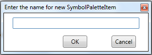
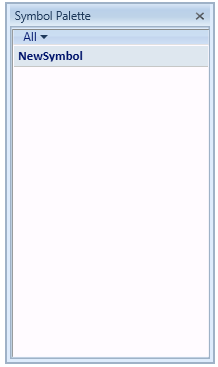
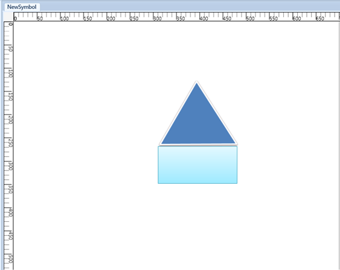
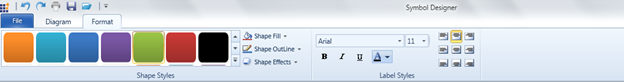
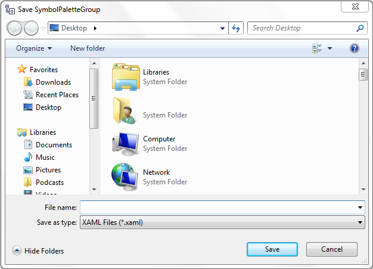
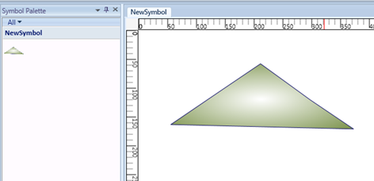
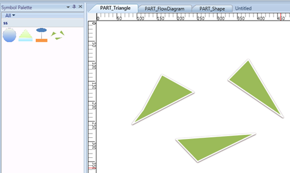
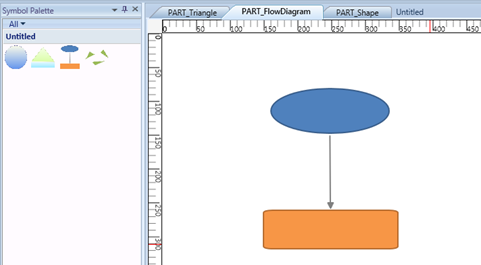
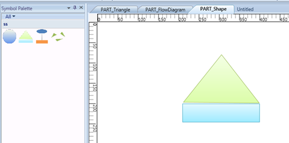

::: {style="DISPLAY: none"}
{#d2h_url_template}{#d2h_package_url style="WIDTH: 0px; DISPLAY: none; HEIGHT: 0px"}
:::

::::: {#nsbanner .d2h_main_nsbanner style="BORDER-BOTTOM: #999999 1px solid; POSITION: relative; PADDING-BOTTOM: 0px; BACKGROUND-COLOR: transparent; PADDING-LEFT: 0px; PADDING-RIGHT: 0px; DISPLAY: none; BORDER-TOP: #999999 1px solid; PADDING-TOP: 0px; LEFT: 0px"}
:::: {#TitleRow .d2h_main_titlerow style="PADDING-BOTTOM: 4px; BACKGROUND-COLOR: transparent; PADDING-LEFT: 22px; WIDTH: 100%; PADDING-RIGHT: 10px; DISPLAY: none; PADDING-TOP: 4px"}
::: {#ienav .d2h_main_ienav style="DISPLAY: none"}
{#D2HPrevious .D2HPreviousEnabled}  {#D2HNext .D2HNextEnabled}
:::
::::
:::::

:::: {#nstext .d2h_main_nstext style="PADDING-BOTTOM: 10px; BACKGROUND-COLOR: transparent; PADDING-LEFT: 22px; PADDING-RIGHT: 10px; HEIGHT: 100%; OVERFLOW: auto; PADDING-TOP: 5px" hasuserbackground="true" valign="bottom"}
::: {#d2h_breadcrumbs .d2h_breadcrumbs}
[Essential Studio User Guide Documentation](ms-xhelp:///?Id=12457748-09e3-4d74-a240-8e049cedf030){.d2h_breadcrumbsNormal}[ \> ]{.d2h_breadcrumbsLinkSeparator}[User Interface Edition](ms-xhelp:///?Id=c29296b7-531c-413b-a0ec-488ca1f7f669){.d2h_breadcrumbsNormal}[ \> ]{.d2h_breadcrumbsLinkSeparator}[Essential WPF](ms-xhelp:///?Id=7f4f82c5-151c-4262-94d0-75c4626c77bc){.d2h_breadcrumbsNormal}[ \> ]{.d2h_breadcrumbsLinkSeparator}[Essential Diagram]{.d2h_breadcrumbsContentsOnly}[ \> ]{.d2h_breadcrumbsLinkSeparator}[Concepts and Features](ms-xhelp:///?Id=8625d466-6e21-495a-b811-4ecee754da81){.d2h_breadcrumbsNormal}[ \> ]{.d2h_breadcrumbsLinkSeparator}[SymbolPalette](ms-xhelp:///?Id=20dbf28d-6928-4d19-a722-5f6779ab36c2){.d2h_breadcrumbsNormal}
:::

### Symbol Designer {#symbol-designer style="tab-stops: 0pt"}

[]{#p99}Symbol Designer application allows you to create new palettes with symbols, and also modify the existing palettes. You can use these palettes in your applications, and also in the Diagram Builder.

[]{style="COLOR: #15428b; FONT-SIZE: 9pt"} 

Software Path

[]{style="COLOR: #15428b"} 

**..\\..\\Syncfusion\\Essential Studio\\\<Version Number\>\\utilities\\Diagram WPF\\Symbol Designer**

(or)

 

**Start Menu \> All Programs \> Syncfusion \> Utilities \> Diagram \> WPF \> Symbol Designer**

[]{style="COLOR: #15428b"} 

Creating SymbolPaletteItem

[]{style="COLOR: #15428b"} 

To create your own custom symbols in the symbol designer, follow the procedure given below:

[]{style="COLOR: #15428b"} 

1.   Open the Symbol Designer tool which is available in the software path given above.

 

2.   If you want to create a new symbol, select **New** option in the **File** menu. Type a name for the palette as shown in the below sample and click **OK**.

[]{style="COLOR: #15428b"} 

[{border="0"}]{style="FONT-FAMILY: 'Calibri','sans-serif'; FONT-SIZE: 11pt"}

Figure 184[: ]{style="FONT-FAMILY: 'Calibri','sans-serif'; FONT-SIZE: 11pt"}New Symbol PaletteItem Dialog Box

[]{style="COLOR: #15428b"} 

3.   A new symbol palette is created with the given name after which, you can design your own symbol.[]{style="COLOR: #15428b"}

[{border="0"}]{style="FONT-FAMILY: 'Calibri','sans-serif'; FONT-SIZE: 11pt"}

Figure 185: Flow Diagram Symbol Palette[]{style="FONT-FAMILY: 'Calibri','sans-serif'; FONT-SIZE: 11pt"}

[]{style="COLOR: #15428b"} 

[]{style="COLOR: #15428b"} 

4.   Draw the desired shapes using drawing tool in the work area.[]{style="COLOR: #15428b"}

[{border="0"}]{style="FONT-FAMILY: 'Calibri','sans-serif'; FONT-SIZE: 11pt"}

Figure 186: Symbol[]{style="FONT-FAMILY: 'Calibri','sans-serif'; FONT-SIZE: 11pt"}

[]{style="COLOR: #15428b"} 

[]{style="COLOR: #15428b"} 

The Shape of the SymbolPaletteItem can be customized further using format tab in Symbol Designer:

[·      ]{style="FONT-FAMILY: Symbol"}Background

[·      ]{style="FONT-FAMILY: Symbol"}Outline

[·      ]{style="FONT-FAMILY: Symbol"}Dash array

[·      ]{style="FONT-FAMILY: Symbol"}Shadow

[·      ]{style="FONT-FAMILY: Symbol"}Softedges

[·      ]{style="FONT-FAMILY: Symbol"}Glow visual effect

 

 

 The node label can also be customized.

{border="0"}

Figure 187: Format tab

[]{style="COLOR: #15428b"} 

5.   After creating required symbols, we have to save this symbol into the symbol palette. Go to the **File** menu and click **Save**. A **Save SymbolPaletteGroup** dialog will appear as in the following screen shot.

[]{style="COLOR: #15428b"} 

{border="0"}

Figure 188: Save SymbolPalette Group Dialog[]{style="FONT-FAMILY: 'Calibri','sans-serif'; FONT-SIZE: 11pt"}

[]{style="COLOR: #15428b"} 

6.   Give a relevant file name for the palette and click **Save**. As the PaletteGroup is saved, preview of the symbol will be shown in Symbol Palette.

[]{style="FONT-FAMILY: 'Calibri','sans-serif'; FONT-SIZE: 11pt"} 

[]{style="COLOR: #15428b"} 

{border="0"}

Figure 189: Symbol Palette With New Symbol

**[]{style="COLOR: #15428b"}** 

7.   Repeat the steps 3 to 7 for creating more symbols.

[]{style="FONT-FAMILY: 'Calibri','sans-serif'; FONT-SIZE: 11pt"} 

[   ]{style="FONT-FAMILY: 'Calibri','sans-serif'; FONT-SIZE: 11pt"}

[{border="0"}]{style="FONT-FAMILY: 'Calibri','sans-serif'; FONT-SIZE: 11pt"}

[]{style="FONT-FAMILY: 'Calibri','sans-serif'; FONT-SIZE: 11pt"} 

[]{style="FONT-FAMILY: 'Calibri','sans-serif'; FONT-SIZE: 11pt"} 

[]{style="FONT-FAMILY: 'Calibri','sans-serif'; FONT-SIZE: 11pt"} 

[]{style="FONT-FAMILY: 'Calibri','sans-serif'; FONT-SIZE: 11pt"} 

[{border="0"} ]{style="FONT-FAMILY: 'Calibri','sans-serif'; FONT-SIZE: 11pt"}

[]{style="COLOR: #15428b"} 

[{border="0"}]{style="COLOR: #15428b"}

Figure 190: Different Symbols

[]{style="COLOR: #15428b"} 

[]{style="COLOR: #15428b"} 

8.   If you create symbols using more than one shape, you need to group all the shapes into a single symbol using the Group option in Symbol Designer.

9.   Finally, Save the NewSymbol Group. Now the above symbols will be available in the SymbolPaletteGroup. The saved SymbolPaletteGroup can be loaded back later.

 

[]{#related-topics}
::::
