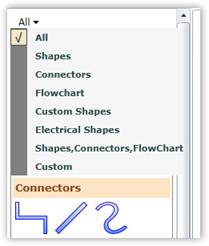
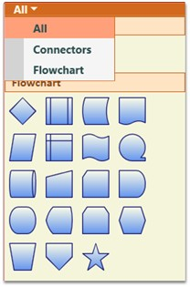

::: {style="DISPLAY: none"}
{#d2h_url_template}{#d2h_package_url style="WIDTH: 0px; DISPLAY: none; HEIGHT: 0px"}
:::

::::: {#nsbanner .d2h_main_nsbanner style="BORDER-BOTTOM: #999999 1px solid; POSITION: relative; PADDING-BOTTOM: 0px; BACKGROUND-COLOR: transparent; PADDING-LEFT: 0px; PADDING-RIGHT: 0px; DISPLAY: none; BORDER-TOP: #999999 1px solid; PADDING-TOP: 0px; LEFT: 0px"}
:::: {#TitleRow .d2h_main_titlerow style="PADDING-BOTTOM: 4px; BACKGROUND-COLOR: transparent; PADDING-LEFT: 22px; WIDTH: 100%; PADDING-RIGHT: 10px; DISPLAY: none; PADDING-TOP: 4px"}
::: {#ienav .d2h_main_ienav style="DISPLAY: none"}
{#D2HPrevious .D2HPreviousEnabled}  {#D2HNext .D2HNextEnabled}
:::
::::
:::::

::::: {#nstext .d2h_main_nstext style="PADDING-BOTTOM: 10px; BACKGROUND-COLOR: transparent; PADDING-LEFT: 22px; PADDING-RIGHT: 10px; HEIGHT: 100%; OVERFLOW: auto; PADDING-TOP: 5px" hasuserbackground="true" valign="bottom"}
::: {#d2h_breadcrumbs .d2h_breadcrumbs}
[Essential Studio User Guide Documentation](ms-xhelp:///?Id=12457748-09e3-4d74-a240-8e049cedf030){.d2h_breadcrumbsNormal}[ \> ]{.d2h_breadcrumbsLinkSeparator}[User Interface Edition](ms-xhelp:///?Id=c29296b7-531c-413b-a0ec-488ca1f7f669){.d2h_breadcrumbsNormal}[ \> ]{.d2h_breadcrumbsLinkSeparator}[Essential Silverlight](ms-xhelp:///?Id=66221bd1-ba2e-43c2-94a7-618f50e01d24){.d2h_breadcrumbsNormal}[ \> ]{.d2h_breadcrumbsLinkSeparator}[Essential Diagram]{.d2h_breadcrumbsContentsOnly}[ \> ]{.d2h_breadcrumbsLinkSeparator}[Concepts and Features](ms-xhelp:///?Id=d592a058-dcc0-44a4-994e-e7901da8db52){.d2h_breadcrumbsNormal}[ \> ]{.d2h_breadcrumbsLinkSeparator}[Symbol Palette](ms-xhelp:///?Id=1beb97d8-d59c-47be-ad18-730d53d299b4){.d2h_breadcrumbsNormal}
:::

### Symbol Filters {#symbol-filters style="tab-stops: 0pt"}

[]{style="FONT-FAMILY: 'Trebuchet MS','sans-serif'; COLOR: #15428b; FONT-SIZE: 9pt"} 

A Symbol Palette filter can be added to the Symbol Palette control, using the **SymbolFilters** property, so that only desired Symbol Palette groups get displayed. The **SetFilterIndexes** property is used to specify the index value of the filters for which the group is to be displayed. The filter names are specified integer values, with the first filter index starting from 0. Based on the filter indexes specified for that particular group, the visibility of the group is controlled. So the group gets displayed only when any of the specified filter names are selected.

 

The following lines of code can be used to specify the Symbol Palette filter of the Symbol Palette Group.

[]{style="FONT-FAMILY: 'Trebuchet MS','sans-serif'; COLOR: #15428b; FONT-SIZE: 9pt"} 

+-------------------------------------------------------------------------------------------------------------------------------------------------------------------------------------------------------------------+
| **[\[C#\]]{style="FONT-FAMILY: 'Courier New'; COLOR: black"}**                                                                                                                                                    |
|                                                                                                                                                                                                                   |
| []{style="FONT-FAMILY: 'Courier New'; COLOR: black"}                                                                                                                                                              |
|                                                                                                                                                                                                                   |
| [SymbolPaletteFilter]{style="FONT-FAMILY: 'Courier New'; COLOR: #2b91af"}[ sfilter = [new]{style="COLOR: blue"} [SymbolPaletteFilter]{style="COLOR: #2b91af"}();]{style="FONT-FAMILY: 'Courier New'"}             |
|                                                                                                                                                                                                                   |
| [            sfilter.Label = [\"Custom\"]{style="COLOR: #a31515"};]{style="FONT-FAMILY: 'Courier New'"}                                                                                                           |
|                                                                                                                                                                                                                   |
| [            diagramControl1.SymbolPalette.SymbolFilters.Add(sfilter);]{style="FONT-FAMILY: 'Courier New'"}                                                                                                       |
|                                                                                                                                                                                                                   |
| [            [//SymbolPaletteGroup creates a group and assigns a specific filter index.]{style="COLOR: green"}]{style="FONT-FAMILY: 'Courier New'"}                                                               |
|                                                                                                                                                                                                                   |
| [            [SymbolPaletteGroup]{style="COLOR: #2b91af"} s = [new]{style="COLOR: blue"} [SymbolPaletteGroup]{style="COLOR: #2b91af"}();]{style="FONT-FAMILY: 'Courier New'"}                                     |
|                                                                                                                                                                                                                   |
| [            s.HeaderName = [\"Custom\"]{style="COLOR: #a31515"};]{style="FONT-FAMILY: 'Courier New'"}                                                                                                            |
|                                                                                                                                                                                                                   |
| [            [SymbolPalette]{style="COLOR: #2b91af"}.SetFilterIndexes(s, [new]{style="COLOR: blue"} [List]{style="COLOR: #2b91af"}\<[int]{style="COLOR: blue"}\>() { 0,7 });]{style="FONT-FAMILY: 'Courier New'"} |
|                                                                                                                                                                                                                   |
| [            diagramControl1.SymbolPalette.SymbolGroups.Add(s);]{style="FONT-FAMILY: 'Courier New'"}                                                                                                              |
+-------------------------------------------------------------------------------------------------------------------------------------------------------------------------------------------------------------------+

[]{style="FONT-FAMILY: 'Trebuchet MS','sans-serif'; COLOR: #15428b; FONT-SIZE: 9pt"} 

+-----------------------------------------------------------------------------------------------------------------------------------------------------------------------------------------------------------+
| **[\[VB\]]{style="FONT-FAMILY: 'Courier New'; COLOR: black"}**                                                                                                                                            |
|                                                                                                                                                                                                           |
| []{style="FONT-FAMILY: 'Courier New'; COLOR: black"}                                                                                                                                                      |
|                                                                                                                                                                                                           |
| [Dim]{style="FONT-FAMILY: 'Courier New'; COLOR: blue"}[ sfilter [As]{style="COLOR: blue"} [New]{style="COLOR: blue"} [SymbolPaletteFilter]{style="COLOR: #2b91af"}()]{style="FONT-FAMILY: 'Courier New'"} |
|                                                                                                                                                                                                           |
| [    sfilter.Label = \"Custom\"]{style="FONT-FAMILY: 'Courier New'"}                                                                                                                                      |
|                                                                                                                                                                                                           |
| [    diagramControl1.SymbolPalette.SymbolFilters.Add(sfilter)]{style="FONT-FAMILY: 'Courier New'"}                                                                                                        |
|                                                                                                                                                                                                           |
| [    [\'SymbolPaletteGroup creates a group and assigns a specific filter index.]{style="COLOR: green"}]{style="FONT-FAMILY: 'Courier New'"}                                                               |
|                                                                                                                                                                                                           |
| [    [Dim]{style="COLOR: blue"} s [As]{style="COLOR: blue"} [New]{style="COLOR: blue"} [SymbolPaletteGroup]{style="COLOR: #2b91af"}()]{style="FONT-FAMILY: 'Courier New'"}                                |
|                                                                                                                                                                                                           |
| [            s.HeaderName = \"Custom\"]{style="FONT-FAMILY: 'Courier New'"}                                                                                                                               |
|                                                                                                                                                                                                           |
| [            SymbolPalette.SetFilterIndexes(s, [New]{style="COLOR: blue"} List(Of [Integer]{style="COLOR: blue"}) (New [Integer]{style="COLOR: blue"}() {0, 7}))]{style="FONT-FAMILY: 'Courier New'"}     |
|                                                                                                                                                                                                           |
| [            diagramControl1.SymbolPalette.SymbolGroups.Add(s)]{style="FONT-FAMILY: 'Courier New'"}[]{style="FONT-FAMILY: 'Courier New'"}                                                                 |
+-----------------------------------------------------------------------------------------------------------------------------------------------------------------------------------------------------------+

[]{style="FONT-FAMILY: 'Trebuchet MS','sans-serif'; COLOR: #15428b; FONT-SIZE: 9pt"} 

This adds a new empty group named \"Custom\" and creates a filter for it.

[]{style="FONT-FAMILY: 'Trebuchet MS','sans-serif'; COLOR: #15428b; FONT-SIZE: 9pt"} 

{border="0"}

Figure 150: Symbol Palette Filter**[]{style="FONT-STYLE: normal; FONT-FAMILY: 'Trebuchet MS','sans-serif'; COLOR: #15428b"}**

 

The SetFilterIndexes property specifies the index value for the group as 0,4, which implies that this group should be displayed when the filter index is 0 (\"All\") or 4 (\"Custom\").

 

[]{#p95} 

Remove SymbolPaletteFilters[]{style="FONT-SIZE: 11pt"}

[]{style="FONT-FAMILY: 'Trebuchet MS','sans-serif'; COLOR: #15428b; FONT-SIZE: 9pt"} 

Like SymbolPaletteGroups, the SymbolPaletteFilters are also indexed from 0. The index 0 refers to the filter All. The index 1 refers to the filter Shapes and so on. The following table lists the filters with their index numbers.

[]{style="FONT-FAMILY: 'Trebuchet MS','sans-serif'; COLOR: #15428b; FONT-SIZE: 9pt"} 

::: {align="center"}
  ------------------- -------
  Filter name         Index
  All                 0
  Shapes              1
  Connectors          2
  Flowchart           3
  Custom Shapes       4
  Electrical Shapes   5
  ------------------- -------
:::

[]{style="FONT-FAMILY: 'Trebuchet MS','sans-serif'; COLOR: #15428b; FONT-SIZE: 9pt"} 

a)   Removing filters and groups named Shapes, Custom Shapes and Electrical Shapes

**[]{style="FONT-FAMILY: 'Trebuchet MS','sans-serif'; COLOR: #15428b; FONT-SIZE: 9pt"}** 

Use the following code to remove the filters and groups named Shapes, Custom Shapes and Electrical Shapes:

[]{style="FONT-FAMILY: 'Trebuchet MS','sans-serif'; COLOR: #15428b; FONT-SIZE: 9pt"} 

+----------------------------------------------------------------------------------------------------------------------------------------------------------------------------------------------------+
| **[\[C#\]]{style="FONT-FAMILY: 'Courier New'; COLOR: black"}**                                                                                                                                     |
|                                                                                                                                                                                                    |
| []{style="FONT-FAMILY: 'Courier New'"}                                                                                                                                                             |
|                                                                                                                                                                                                    |
| [DiagramControl]{style="FONT-FAMILY: 'Courier New'; COLOR: #2b91af"}[ diagramControl = [new]{style="COLOR: blue"} [DiagramControl]{style="COLOR: #2b91af"}();]{style="FONT-FAMILY: 'Courier New'"} |
|                                                                                                                                                                                                    |
| [diagramControl.SymbolPalette.SymbolGroups.Remove(diagramControl.SymbolPalette.SymbolGroups\[4\]);]{style="FONT-FAMILY: 'Courier New'"}                                                            |
|                                                                                                                                                                                                    |
| [diagramControl.SymbolPalette.SymbolGroups.Remove(diagramControl.SymbolPalette.SymbolGroups\[3\]);]{style="FONT-FAMILY: 'Courier New'"}                                                            |
|                                                                                                                                                                                                    |
| [diagramControl.SymbolPalette.SymbolGroups.Remove(diagramControl.SymbolPalette.SymbolGroups\[0\]);]{style="FONT-FAMILY: 'Courier New'"}                                                            |
|                                                                                                                                                                                                    |
| []{style="FONT-FAMILY: 'Courier New'"}                                                                                                                                                             |
|                                                                                                                                                                                                    |
| [diagramControl.SymbolPalette.SymbolFilters.Remove(diagramControl.SymbolPalette.SymbolFilters\[5\]);]{style="FONT-FAMILY: 'Courier New'"}                                                          |
|                                                                                                                                                                                                    |
| [diagramControl.SymbolPalette.SymbolFilters.Remove(diagramControl.SymbolPalette.SymbolFilters\[4\]);]{style="FONT-FAMILY: 'Courier New'"}                                                          |
|                                                                                                                                                                                                    |
| [diagramControl.SymbolPalette.SymbolFilters.Remove(diagramControl.SymbolPalette.SymbolFilters\[1\]);]{style="FONT-FAMILY: 'Courier New'"}                                                          |
+----------------------------------------------------------------------------------------------------------------------------------------------------------------------------------------------------+

[]{style="FONT-FAMILY: 'Trebuchet MS','sans-serif'; COLOR: #15428b; FONT-SIZE: 9pt"} 

+-------------------------------------------------------------------------------------------------------------------------------------------------------------------------------------------------------------+
| **[\[VB\]]{style="FONT-FAMILY: 'Courier New'; COLOR: black"}**                                                                                                                                              |
|                                                                                                                                                                                                             |
| []{style="FONT-FAMILY: 'Courier New'"}                                                                                                                                                                      |
|                                                                                                                                                                                                             |
| [Dim]{style="FONT-FAMILY: 'Courier New'; COLOR: blue"}[ diagramControl [As]{style="COLOR: blue"} [New]{style="COLOR: blue"} [DiagramControl]{style="COLOR: #2b91af"}()]{style="FONT-FAMILY: 'Courier New'"} |
|                                                                                                                                                                                                             |
| [diagramControl.SymbolPalette.SymbolGroups.Remove(diagramControl.SymbolPalette.SymbolGroups(4))]{style="FONT-FAMILY: 'Courier New'"}                                                                        |
|                                                                                                                                                                                                             |
| [diagramControl.SymbolPalette.SymbolGroups.Remove(diagramControl.SymbolPalette.SymbolGroups(3))]{style="FONT-FAMILY: 'Courier New'"}                                                                        |
|                                                                                                                                                                                                             |
| [diagramControl.SymbolPalette.SymbolGroups.Remove(diagramControl.SymbolPalette.SymbolGroups(0))]{style="FONT-FAMILY: 'Courier New'"}                                                                        |
|                                                                                                                                                                                                             |
| []{style="FONT-FAMILY: 'Courier New'"}                                                                                                                                                                      |
|                                                                                                                                                                                                             |
| [diagramControl.SymbolPalette.SymbolFilters.Remove(diagramControl.SymbolPalette.SymbolFilters(5))]{style="FONT-FAMILY: 'Courier New'"}                                                                      |
|                                                                                                                                                                                                             |
| [diagramControl.SymbolPalette.SymbolFilters.Remove(diagramControl.SymbolPalette.SymbolFilters(4))]{style="FONT-FAMILY: 'Courier New'"}                                                                      |
|                                                                                                                                                                                                             |
| [diagramControl.SymbolPalette.SymbolFilters.Remove(diagramControl.SymbolPalette.SymbolFilters(1))]{style="FONT-FAMILY: 'Courier New'"}[]{style="FONT-FAMILY: 'Courier New'"}                                |
+-------------------------------------------------------------------------------------------------------------------------------------------------------------------------------------------------------------+

[]{style="FONT-FAMILY: 'Trebuchet MS','sans-serif'; COLOR: #15428b; FONT-SIZE: 9pt"} 

Run the application. The following output is displayed and the groups and filters are removed.

[]{style="FONT-FAMILY: 'Trebuchet MS','sans-serif'; COLOR: #15428b; FONT-SIZE: 9pt"} 

{border="0"}

Figure 151: Palette with Groups and Filters removed

 

[]{#related-topics}
:::::
