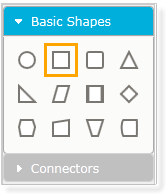
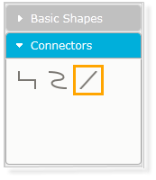

::: {style="DISPLAY: none"}
{#d2h_url_template}{#d2h_package_url style="WIDTH: 0px; DISPLAY: none; HEIGHT: 0px"}
:::

::::: {#nsbanner .d2h_main_nsbanner style="BORDER-BOTTOM: #999999 1px solid; POSITION: relative; PADDING-BOTTOM: 0px; BACKGROUND-COLOR: transparent; PADDING-LEFT: 0px; PADDING-RIGHT: 0px; DISPLAY: none; BORDER-TOP: #999999 1px solid; PADDING-TOP: 0px; LEFT: 0px"}
:::: {#TitleRow .d2h_main_titlerow style="PADDING-BOTTOM: 4px; BACKGROUND-COLOR: transparent; PADDING-LEFT: 22px; WIDTH: 100%; PADDING-RIGHT: 10px; DISPLAY: none; PADDING-TOP: 4px"}
::: {#ienav .d2h_main_ienav style="DISPLAY: none"}
{#D2HPrevious .D2HPreviousEnabled}  {#D2HNext .D2HNextEnabled}
:::
::::
:::::

:::: {#nstext .d2h_main_nstext style="PADDING-BOTTOM: 10px; BACKGROUND-COLOR: transparent; PADDING-LEFT: 22px; PADDING-RIGHT: 10px; HEIGHT: 100%; OVERFLOW: auto; PADDING-TOP: 5px" hasuserbackground="true" valign="bottom"}
::: {#d2h_breadcrumbs .d2h_breadcrumbs}
[Essential Studio User Guide Documentation](ms-xhelp:///?Id=12457748-09e3-4d74-a240-8e049cedf030){.d2h_breadcrumbsNormal}[ \> ]{.d2h_breadcrumbsLinkSeparator}[User Interface Edition](ms-xhelp:///?Id=c29296b7-531c-413b-a0ec-488ca1f7f669){.d2h_breadcrumbsNormal}[ \> ]{.d2h_breadcrumbsLinkSeparator}[Essential ASP.NET MVC](ms-xhelp:///?Id=4b14e7d1-65c4-4f67-b1aa-2c37709905a5){.d2h_breadcrumbsNormal}[ \> ]{.d2h_breadcrumbsLinkSeparator}[Essential Diagram]{.d2h_breadcrumbsContentsOnly}[ \> ]{.d2h_breadcrumbsLinkSeparator}[Concepts and Features](ms-xhelp:///?Id=04839cdf-94fc-4d24-9f6b-119fdbd7bbfb){.d2h_breadcrumbsNormal}
:::

## Symbol Palette[]{#p67} {#symbol-palette style="tab-stops: 0pt"}

The SymbolPalette control displays the node shapes, connector shapes, and allows you to drag the symbols and connectors onto the diagram.

Appearance and Structure

The following figures outline the basic appearance and structure of the symbol palette in Essential Diagram for MVC.

 

  {border="0"}

Figure 129: Symbol Palette Containing Basic Shapes for Nodes

*[]{style="COLOR: gray"}* 

*[]{style="COLOR: gray"}* 

{border="0"}

Figure 130: Symbol Palette Containing Basic Connectors  

 

Properties

  Property                 Description                                                                                 Type of the Property   Value it Accepts   Any Other Dependencies/ Sub-Properties Associated
  ------------------------ ------------------------------------------------------------------------------------------- ---------------------- ------------------ ---------------------------------------------------
  IsSymbolPaletteEnabled   This property is used to enable or disable the symbol palette. The default value is true.   Dependency Property    Boolean            No (This is not supported in SVG Mode)
  SymbolPaletteWidth       This property is used to change the width of the symbol palette.                            Dependency Property    Double             No (This is not supported in SVG Mode)

 

The symbol palette can be displayed by setting the **IsSymbolPaletteEnabled** property to **true**, which is the default setting.

The following code snippets illustrate the symbol palette properties.

More:

[ ]{#related-topics}

[{border="0" align="absMiddle"}Enabling the addition of a symbol palette in Diagram MVC](ms-xhelp:///?Id=caa43cfa-b1ad-4dec-8fa8-d9031c9b9e71){style="TEXT-DECORATION: none"}

[{border="0" align="absMiddle"}Adding the Symbol Palette Group and Items](ms-xhelp:///?Id=d35582c2-b0de-422c-8731-b778356bdce9){style="TEXT-DECORATION: none"}

[{border="0" align="absMiddle"}Adding Custom Shapes](ms-xhelp:///?Id=d6e8039b-a776-4b47-a892-94a30fc695ff){style="TEXT-DECORATION: none"}

[{border="0" align="absMiddle"}Symbol Palette Customization](ms-xhelp:///?Id=1140b4de-2ff1-47d7-9a92-56e94541e0bb){style="TEXT-DECORATION: none"}
::::
