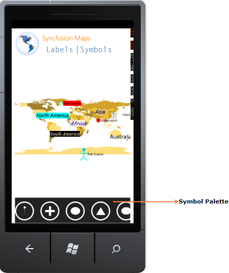

::: {style="DISPLAY: none"}
{#d2h_url_template}{#d2h_package_url style="WIDTH: 0px; DISPLAY: none; HEIGHT: 0px"}
:::

::::: {#nsbanner .d2h_main_nsbanner style="BORDER-BOTTOM: #999999 1px solid; POSITION: relative; PADDING-BOTTOM: 0px; BACKGROUND-COLOR: transparent; PADDING-LEFT: 0px; PADDING-RIGHT: 0px; DISPLAY: none; BORDER-TOP: #999999 1px solid; PADDING-TOP: 0px; LEFT: 0px"}
:::: {#TitleRow .d2h_main_titlerow style="PADDING-BOTTOM: 4px; BACKGROUND-COLOR: transparent; PADDING-LEFT: 22px; WIDTH: 100%; PADDING-RIGHT: 10px; DISPLAY: none; PADDING-TOP: 4px"}
::: {#ienav .d2h_main_ienav style="DISPLAY: none"}
{#D2HPrevious .D2HPreviousEnabled}  {#D2HNext .D2HNextEnabled}
:::
::::
:::::

:::::: {#nstext .d2h_main_nstext style="PADDING-BOTTOM: 10px; BACKGROUND-COLOR: transparent; PADDING-LEFT: 22px; PADDING-RIGHT: 10px; HEIGHT: 100%; OVERFLOW: auto; PADDING-TOP: 5px" hasuserbackground="true" valign="bottom"}
::: {#d2h_breadcrumbs .d2h_breadcrumbs}
[Essential Studio User Guide Documentation](ms-xhelp:///?Id=12457748-09e3-4d74-a240-8e049cedf030){.d2h_breadcrumbsNormal}[ \> ]{.d2h_breadcrumbsLinkSeparator}[User Interface Edition](ms-xhelp:///?Id=c29296b7-531c-413b-a0ec-488ca1f7f669){.d2h_breadcrumbsNormal}[ \> ]{.d2h_breadcrumbsLinkSeparator}[Essential Windows Phone](ms-xhelp:///?Id=5ea1999c-4eff-4775-b84e-407dc825f555){.d2h_breadcrumbsNormal}[ \> ]{.d2h_breadcrumbsLinkSeparator}[Essential Maps]{.d2h_breadcrumbsContentsOnly}[ \> ]{.d2h_breadcrumbsLinkSeparator}[Concepts and Features](ms-xhelp:///?Id=fe4335c8-1cb6-47a4-a6f3-e9bc318bba8d){.d2h_breadcrumbsNormal}[ \> ]{.d2h_breadcrumbsLinkSeparator}[Label and Symbol Support](ms-xhelp:///?Id=8cca4119-5a06-4428-9dd5-1eec536eaa4e){.d2h_breadcrumbsNormal}
:::

### Symbol Palette {#symbol-palette style="tab-stops: 0pt"}

Essential Maps provides Symbol Palette supports to add symbol to the maps. Symbol text cannot be added when you add through Symbol Palette.

{border="0"}

Figure 24: Symbol Palette

*[]{style="FONT-SIZE: 9pt"}* 

*[]{style="FONT-SIZE: 9pt"}* 

 

Properties Table

 

*[Table ]{style="FONT-SIZE: 9pt"}[11]{style="FONT-SIZE: 9pt"}[: SymbolPalette]{style="FONT-SIZE: 9pt"}*

::: {align="center"}
  -------------------- ------------------------------------------------------- --------------------- ---------------------------- ---------------------
  **Property**         **Description**                                         **Type**              **Data Type**                **Reference links**
  SymbolPaletteItems   Gets or sets the collection of the SymbolPaletteItem.   Dependency property   **ObservableCollection\***   NA
  -------------------- ------------------------------------------------------- --------------------- ---------------------------- ---------------------
:::

*[]{style="FONT-SIZE: 9pt"}* 

*\*  ObservableCollection will accept only SymbolPaletteItem. And All SymbolPaletteItem will be avaible in the collection.*

*[]{style="FONT-SIZE: 9pt"}* 

*[Table ]{style="FONT-SIZE: 9pt"}[12]{style="FONT-SIZE: 9pt"}[: SymbolPaletteItem]{style="FONT-SIZE: 9pt"}*

::: {align="center"}
  -------------- ----------------------------------------------------- --------------------- --------------- ---------------------
  **Property**   **Description**                                       **Type**              **Data Type**   **Reference links**
  PaletteItem    Gets or sets the content for the SymbolPaletteItem.   Dependency property   **Object**      NA
  -------------- ----------------------------------------------------- --------------------- --------------- ---------------------
:::

*[]{style="FONT-SIZE: 9pt"}* 

 

More:

[ ]{#related-topics}

[{border="0" align="absMiddle"}Enabling Symbol Palette](ms-xhelp:///?Id=ac55d15d-8177-46f4-8a90-a0726d419b2a){style="TEXT-DECORATION: none"}

[{border="0" align="absMiddle"}Disabling Symbol Palette](ms-xhelp:///?Id=ec5d1921-e3d7-4c82-92cb-e2d98d6d9a53){style="TEXT-DECORATION: none"}

[{border="0" align="absMiddle"}Adding symbol item to Symbol Palette](ms-xhelp:///?Id=6b62529c-7a63-44ad-a020-3938fccd613e){style="TEXT-DECORATION: none"}
::::::
