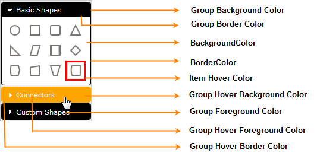

::: {style="DISPLAY: none"}
{#d2h_url_template}{#d2h_package_url style="WIDTH: 0px; DISPLAY: none; HEIGHT: 0px"}
:::

::::: {#nsbanner .d2h_main_nsbanner style="BORDER-BOTTOM: #999999 1px solid; POSITION: relative; PADDING-BOTTOM: 0px; BACKGROUND-COLOR: transparent; PADDING-LEFT: 0px; PADDING-RIGHT: 0px; DISPLAY: none; BORDER-TOP: #999999 1px solid; PADDING-TOP: 0px; LEFT: 0px"}
:::: {#TitleRow .d2h_main_titlerow style="PADDING-BOTTOM: 4px; BACKGROUND-COLOR: transparent; PADDING-LEFT: 22px; WIDTH: 100%; PADDING-RIGHT: 10px; DISPLAY: none; PADDING-TOP: 4px"}
::: {#ienav .d2h_main_ienav style="DISPLAY: none"}
{#D2HPrevious .D2HPreviousEnabled}  {#D2HNext .D2HNextEnabled}
:::
::::
:::::

:::: {#nstext .d2h_main_nstext style="PADDING-BOTTOM: 10px; BACKGROUND-COLOR: transparent; PADDING-LEFT: 22px; PADDING-RIGHT: 10px; HEIGHT: 100%; OVERFLOW: auto; PADDING-TOP: 5px" hasuserbackground="true" valign="bottom"}
::: {#d2h_breadcrumbs .d2h_breadcrumbs}
[Essential Studio User Guide Documentation](ms-xhelp:///?Id=12457748-09e3-4d74-a240-8e049cedf030){.d2h_breadcrumbsNormal}[ \> ]{.d2h_breadcrumbsLinkSeparator}[User Interface Edition](ms-xhelp:///?Id=c29296b7-531c-413b-a0ec-488ca1f7f669){.d2h_breadcrumbsNormal}[ \> ]{.d2h_breadcrumbsLinkSeparator}[Essential ASP.NET MVC](ms-xhelp:///?Id=4b14e7d1-65c4-4f67-b1aa-2c37709905a5){.d2h_breadcrumbsNormal}[ \> ]{.d2h_breadcrumbsLinkSeparator}[Essential Diagram]{.d2h_breadcrumbsContentsOnly}[ \> ]{.d2h_breadcrumbsLinkSeparator}[Concepts and Features](ms-xhelp:///?Id=04839cdf-94fc-4d24-9f6b-119fdbd7bbfb){.d2h_breadcrumbsNormal}[ \> ]{.d2h_breadcrumbsLinkSeparator}[Symbol Palette](ms-xhelp:///?Id=186ffc32-1736-4824-b89a-7f0ff3e22717){.d2h_breadcrumbsNormal}
:::

### [Symbol Palette Customization]{style="BACKGROUND: white"} {#symbol-palette-customization style="tab-stops: 0pt"}

[This feature allows you to customize the appearance of the symbol palette in the diagram page to suit any application. Several properties have been provided in the **SymbolPalette** class to enable this.]{style="BACKGROUND: white"}

 

Use Case Scenario

This feature allows users to[ change the following:]{style="BACKGROUND: white"}

[·      ]{style="FONT-FAMILY: Symbol"}[Border color of the palette]{style="BACKGROUND: white"}

[·      ]{style="FONT-FAMILY: Symbol"}[Background color of the palette from which you can pick the symbols]{style="BACKGROUND: white"}

[·      ]{style="FONT-FAMILY: Symbol"}[Selection color of a group name when the cursor hovers over it]{style="BACKGROUND: white"}

[·      ]{style="FONT-FAMILY: Symbol"}[Foreground color of a group]{style="BACKGROUND: white"}

[·      ]{style="FONT-FAMILY: Symbol"}[Item selector color, etc.]{style="BACKGROUND: white"}

 

Appearance and Structure

The following figure gives you an idea as to which parts of the symbol palette can be customized using this feature:

{border="0"}

Figure 134: Customized Symbol Palette

 

Where do I find the installed samples?

To view a sample:

1.   Open the Essential Diagram sample browser from the dashboard. (Refer to the Samples and Location chapter.)

2.   Navigate to **Getting Started** \> **SymbolPalette Customization Demo**.

 

Properties

+------------------------------------+----------------------------------------------------------------------------+---------------------+--------------------------------+----------------------------------------+
| Property                           | Description                                                                | Type of Property    | Value it Accepts               | Dependencies                           |
+------------------------------------+----------------------------------------------------------------------------+---------------------+--------------------------------+----------------------------------------+
| Background                         | Gets or sets the background color for the symbol palette.                  | Dependency property | String                         | No (This is not supported in SVG Mode) |
|                                    |                                                                            |                     |                                |                                        |
|                                    |                                                                            |                     |                                |                                        |
+------------------------------------+----------------------------------------------------------------------------+---------------------+--------------------------------+----------------------------------------+
| BorderColor                        | Gets or sets the border color for the symbol palette.                      | Dependency property | String                         | No (This is not supported in SVG Mode) |
|                                    |                                                                            |                     |                                |                                        |
|                                    |                                                                            |                     |                                |                                        |
+------------------------------------+----------------------------------------------------------------------------+---------------------+--------------------------------+----------------------------------------+
| SymbolPaletteGroupBackground       | Gets or sets the background color for the symbol palette group.            | Dependency property | String                         | No (This is not supported in SVG Mode) |
|                                    |                                                                            |                     |                                |                                        |
|                                    |                                                                            |                     |                                |                                        |
+------------------------------------+----------------------------------------------------------------------------+---------------------+--------------------------------+----------------------------------------+
| SymbolPaletteGroupForeground       | Gets or sets the foreground color for the symbol palette group.            | Dependency property | String[]{style="COLOR: black"} | No (This is not supported in SVG Mode) |
|                                    |                                                                            |                     |                                |                                        |
|                                    |                                                                            |                     |                                |                                        |
+------------------------------------+----------------------------------------------------------------------------+---------------------+--------------------------------+----------------------------------------+
| SymbolPaletteGroupBorderColor      | Gets or sets the border color for the symbol palette group.                | Dependency property | String[]{style="COLOR: black"} | No (This is not supported in SVG Mode) |
|                                    |                                                                            |                     |                                |                                        |
|                                    |                                                                            |                     |                                |                                        |
+------------------------------------+----------------------------------------------------------------------------+---------------------+--------------------------------+----------------------------------------+
| SymbolPaletteGroupHoverBackground  | Gets or sets the mouse-over background color for the symbol palette group. | Dependency property | String[]{style="COLOR: black"} | No (This is not supported in SVG Mode) |
|                                    |                                                                            |                     |                                |                                        |
|                                    |                                                                            |                     |                                |                                        |
+------------------------------------+----------------------------------------------------------------------------+---------------------+--------------------------------+----------------------------------------+
| SymbolPaletteGroupHoverForeground  | Gets or sets the mouse-over foreground color for the symbol palette group. | Dependency property | String[]{style="COLOR: black"} | No (This is not supported in SVG Mode) |
|                                    |                                                                            |                     |                                |                                        |
|                                    |                                                                            |                     |                                |                                        |
+------------------------------------+----------------------------------------------------------------------------+---------------------+--------------------------------+----------------------------------------+
| SymbolPaletteGroupHoverBorderColor | Gets or sets the mouse-over border color for the symbol palette group.     | Dependency property | String[]{style="COLOR: black"} | No (This is not supported in SVG Mode) |
|                                    |                                                                            |                     |                                |                                        |
|                                    |                                                                            |                     |                                |                                        |
+------------------------------------+----------------------------------------------------------------------------+---------------------+--------------------------------+----------------------------------------+
| ItemMouseOverBorderColor           | Gets or sets the mouse-over border color for the symbol palette item.      | Dependency property | String[]{style="COLOR: black"} | No (This is not supported in SVG Mode) |
|                                    |                                                                            |                     |                                |                                        |
|                                    |                                                                            |                     |                                |                                        |
+------------------------------------+----------------------------------------------------------------------------+---------------------+--------------------------------+----------------------------------------+

 

More:

[ ]{#related-topics}

[{border="0" align="absMiddle"}Enabling Symbol Palette Customization](ms-xhelp:///?Id=56a8d72b-5cf3-4487-84e8-ef1de5fdd3e8){style="TEXT-DECORATION: none"}
::::
